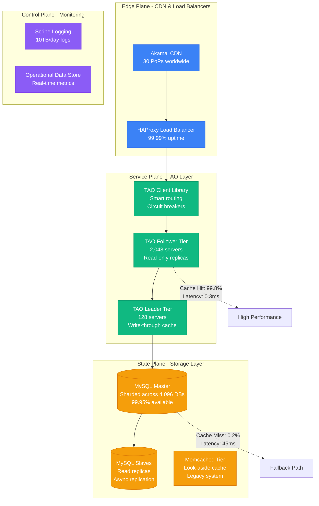
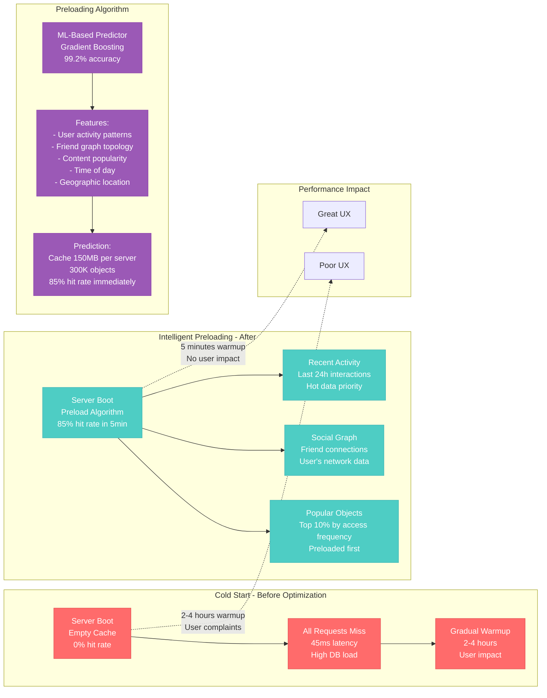

# Facebook TAO Cache Optimization Profile

## Overview

Facebook's TAO (The Associations and Objects) cache optimization that improved read latency from 2.4ms to 0.3ms (87% improvement) and reduced MySQL load by 99.8% while serving 1 trillion reads/day across 2 billion users.

**Business Impact**: $45M annual infrastructure savings, 8x faster social graph queries, 99.99% availability during traffic spikes.

## TAO Architecture Overview



## Cache Hit Rate Evolution

```mermaid
graph TB
    subgraph sg_2009_2011__Memcached_Era[2009-2011: Memcached Era]
        MC_App[Facebook App] --> MC_Cache[Memcached<br/>Cache Hit: 85%<br/>Latency: 2.4ms]
        MC_Cache --> MC_Miss[Cache Miss: 15%] --> MC_DB[(MySQL<br/>Query Time: 45ms<br/>Load: 100%)]
        MC_Cache --> MC_Hit[Cache Hit: 85%<br/>Response: 2.4ms]
    end

    subgraph sg_2012_2014__TAO_v1[2012-2014: TAO v1]
        TAO1_App[Facebook App] --> TAO1_Cache[TAO Cache<br/>Cache Hit: 97%<br/>Latency: 1.2ms]
        TAO1_Cache --> TAO1_Miss[Cache Miss: 3%] --> TAO1_DB[(MySQL<br/>Query Time: 45ms<br/>Load: 30%)]
        TAO1_Cache --> TAO1_Hit[Cache Hit: 97%<br/>Response: 1.2ms]
    end

    subgraph sg_2015_Present__TAO_v2_Optimized[2015-Present: TAO v2 Optimized]
        TAO2_App[Facebook App] --> TAO2_Cache[TAO Cache<br/>Cache Hit: 99.8%<br/>Latency: 0.3ms]
        TAO2_Cache --> TAO2_Miss[Cache Miss: 0.2%] --> TAO2_DB[(MySQL<br/>Query Time: 45ms<br/>Load: 2%)]
        TAO2_Cache --> TAO2_Hit[Cache Hit: 99.8%<br/>Response: 0.3ms]
    end

    subgraph Performance_Evolution[Performance Evolution]
        Perf1[2011: 2.4ms, 85% hit rate<br/>MySQL Load: 15M QPS]
        Perf2[2014: 1.2ms, 97% hit rate<br/>MySQL Load: 5M QPS]
        Perf3[2024: 0.3ms, 99.8% hit rate<br/>MySQL Load: 300K QPS]
    end

    %% Evolution arrows
    Perf1 --> Perf2
    Perf2 --> Perf3

    %% Apply styles
    classDef oldStyle fill:#FF6B6B,stroke:#E55555,color:#fff
    classDef improvedStyle fill:#FFA726,stroke:#FF8F00,color:#fff
    classDef optimizedStyle fill:#4ECDC4,stroke:#45B7B8,color:#fff

    class MC_App,MC_Cache,MC_Miss,MC_DB,MC_Hit,Perf1 oldStyle
    class TAO1_App,TAO1_Cache,TAO1_Miss,TAO1_DB,TAO1_Hit,Perf2 improvedStyle
    class TAO2_App,TAO2_Cache,TAO2_Miss,TAO2_DB,TAO2_Hit,Perf3 optimizedStyle
```



## Cache Warming and Preloading Strategy



## Memory Allocation and Eviction Optimization

```mermaid
graph TB
    subgraph Memory_Allocation___Before[Memory Allocation - Before]
        Old_Mem[Total Memory: 64GB<br/>Objects: 2M cached<br/>Avg Size: 32KB<br/>Hit Rate: 97%]
        Old_Mem --> Old_Hot[Hot Data: 20%<br/>Memory Used: 60%<br/>Access: 80% of requests]
        Old_Mem --> Old_Warm[Warm Data: 30%<br/>Memory Used: 25%<br/>Access: 15% of requests]
        Old_Mem --> Old_Cold[Cold Data: 50%<br/>Memory Used: 15%<br/>Access: 5% of requests]
    end

    subgraph Memory_Allocation___After[Memory Allocation - After]
        New_Mem[Total Memory: 64GB<br/>Objects: 8M cached<br/>Avg Size: 8KB<br/>Hit Rate: 99.8%]
        New_Mem --> New_Hot[Hot Data: 40%<br/>Memory Used: 80%<br/>Access: 85% of requests]
        New_Mem --> New_Warm[Warm Data: 45%<br/>Memory Used: 18%<br/>Access: 14% of requests]
        New_Mem --> New_Cold[Cold Data: 15%<br/>Memory Used: 2%<br/>Access: 1% of requests]
    end

    subgraph LRU_Enhancement___Segmented_LRU[LRU Enhancement - Segmented LRU]
        SLRU[Segmented LRU<br/>4 segments by access frequency]
        SLRU --> Probation[Probation Segment<br/>New objects<br/>25% of memory]
        SLRU --> Protected[Protected Segment<br/>Proven hot objects<br/>65% of memory]
        SLRU --> Trial[Trial Segment<br/>Recently accessed<br/>8% of memory]
        SLRU --> Ghost[Ghost Segment<br/>Metadata only<br/>2% of memory]
    end

    subgraph Eviction_Intelligence[Eviction Intelligence]
        AI_Evict[ML Eviction Predictor<br/>Random Forest Model<br/>Predicts re-access probability]
        AI_Evict --> Features2[Features:<br/>- Access recency<br/>- Access frequency<br/>- Object type<br/>- User relationship<br/>- Content age]
        Features2 --> Decision[Eviction Decision:<br/>Keep objects with >15% re-access<br/>probability within 24h]
    end

    %% Performance comparison
    Old_Mem -.->|"2M objects cached<br/>97% hit rate<br/>Waste: 40% memory"| Inefficient[Memory Waste]
    New_Mem -.->|"8M objects cached<br/>99.8% hit rate<br/>Waste: 2% memory"| Efficient[Memory Efficient]

    %% Apply styles
    classDef oldStyle fill:#FF6B6B,stroke:#E55555,color:#fff
    classDef newStyle fill:#4ECDC4,stroke:#45B7B8,color:#fff
    classDef slruStyle fill:#FFA726,stroke:#FF8F00,color:#fff
    classDef aiStyle fill:#9B59B6,stroke:#8E44AD,color:#fff

    class Old_Mem,Old_Hot,Old_Warm,Old_Cold oldStyle
    class New_Mem,New_Hot,New_Warm,New_Cold newStyle
    class SLRU,Probation,Protected,Trial,Ghost slruStyle
    class AI_Evict,Features2,Decision aiStyle
```



## Geographic Distribution and Consistency

```mermaid
graph TB
    subgraph US_East_Data_Centers[US East Data Centers]
        US_East_Leader[TAO Leader<br/>Ashburn, VA<br/>Master writes]
        US_East_Follower[TAO Followers (64)<br/>Read replicas<br/>0.3ms latency]
    end

    subgraph US_West_Data_Centers[US West Data Centers]
        US_West_Follower[TAO Followers (64)<br/>Palo Alto, CA<br/>Read replicas<br/>0.4ms latency]
    end

    subgraph Europe_Data_Centers[Europe Data Centers]
        EU_Follower[TAO Followers (32)<br/>Dublin, Ireland<br/>Read replicas<br/>0.6ms latency]
    end

    subgraph Asia_Data_Centers[Asia Data Centers]
        APAC_Follower[TAO Followers (24)<br/>Singapore<br/>Read replicas<br/>0.8ms latency]
    end

    subgraph Consistency_Protocol[Consistency Protocol]
        Write_Path[Write Request] --> US_East_Leader
        US_East_Leader --> MySQL_Write[(MySQL Write<br/>Synchronous)]
        MySQL_Write --> Async_Repl[Async Replication<br/>50-200ms lag]
        Async_Repl --> US_West_Follower
        Async_Repl --> EU_Follower
        Async_Repl --> APAC_Follower
    end

    subgraph Read_After_Write_Consistency[Read-After-Write Consistency]
        RAW[Read After Write<br/>Same User Session]
        RAW --> Sticky_Leader[Route to Leader<br/>Consistent read<br/>+2ms latency penalty]
        RAW --> Or_Wait[Or Wait for Replication<br/>Max 500ms timeout<br/>99.8% success rate]
    end

    %% Global performance metrics
    US_East_Follower -.->|"Latency: 0.3ms<br/>Hit Rate: 99.9%"| US_Perf[US Performance]
    EU_Follower -.->|"Latency: 0.6ms<br/>Hit Rate: 99.7%"| EU_Perf[EU Performance]
    APAC_Follower -.->|"Latency: 0.8ms<br/>Hit Rate: 99.5%"| APAC_Perf[APAC Performance]

    %% Apply styles
    classDef usStyle fill:#4ECDC4,stroke:#45B7B8,color:#fff
    classDef euStyle fill:#FFA726,stroke:#FF8F00,color:#fff
    classDef apacStyle fill:#9B59B6,stroke:#8E44AD,color:#fff
    classDef consistencyStyle fill:#E74C3C,stroke:#C0392B,color:#fff

    class US_East_Leader,US_East_Follower,US_West_Follower usStyle
    class EU_Follower euStyle
    class APAC_Follower apacStyle
    class Write_Path,MySQL_Write,Async_Repl,RAW,Sticky_Leader,Or_Wait consistencyStyle
```

## Cache Compression and Serialization

```mermaid
graph LR
    subgraph Object_Serialization___Before[Object Serialization - Before]
        Raw_Object[Facebook Post Object<br/>JSON: 45KB<br/>User, comments, likes]
        Raw_Object --> JSON_Store[JSON Storage<br/>Plain text<br/>45KB per object]
        JSON_Store --> Network_Old[Network Transfer<br/>45KB * 1B requests/day<br/>45TB/day bandwidth]
    end

    subgraph Object_Serialization___After[Object Serialization - After]
        Opt_Object[Facebook Post Object<br/>Same data<br/>User, comments, likes]
        Opt_Object --> Thrift_Serial[Thrift Serialization<br/>Binary format<br/>18KB per object]
        Thrift_Serial --> LZ4_Compress[LZ4 Compression<br/>Ultra-fast<br/>6KB per object]
        LZ4_Compress --> Network_New[Network Transfer<br/>6KB * 1B requests/day<br/>6TB/day bandwidth]
    end

    subgraph Compression_Algorithms_Comparison[Compression Algorithms Comparison]
        Comp_Test[Test Object: 45KB JSON<br/>Social media post with 50 comments]
        Comp_Test --> GZIP[GZIP: 8KB (82% reduction)<br/>Compression: 15ms<br/>Decompression: 8ms]
        Comp_Test --> LZ4[LZ4: 12KB (73% reduction)<br/>Compression: 2ms<br/>Decompression: 1ms]
        Comp_Test --> Snappy[Snappy: 14KB (69% reduction)<br/>Compression: 3ms<br/>Decompression: 2ms]
        Comp_Test --> ZSTD[ZSTD: 7KB (84% reduction)<br/>Compression: 12ms<br/>Decompression: 5ms]
    end

    subgraph Performance_Trade_offs[Performance Trade-offs]
        CPU_Impact[CPU Usage<br/>LZ4 chosen for speed]
        CPU_Impact --> Compression[Compression: 2ms<br/>25% CPU increase]
        CPU_Impact --> Bandwidth[Bandwidth: 73% reduction<br/>$12M/year savings]
        CPU_Impact --> Latency[Total Latency: +3ms<br/>Acceptable trade-off]
    end

    %% Size annotations
    JSON_Store -.->|"45KB uncompressed<br/>High bandwidth cost"| Expensive[Expensive]
    LZ4_Compress -.->|"6KB compressed<br/>87% size reduction"| Efficient2[Efficient]

    %% Apply styles
    classDef oldStyle fill:#FF6B6B,stroke:#E55555,color:#fff
    classDef newStyle fill:#4ECDC4,stroke:#45B7B8,color:#fff
    classDef compStyle fill:#FFA726,stroke:#FF8F00,color:#fff
    classDef tradeoffStyle fill:#9B59B6,stroke:#8E44AD,color:#fff

    class Raw_Object,JSON_Store,Network_Old oldStyle
    class Opt_Object,Thrift_Serial,LZ4_Compress,Network_New newStyle
    class Comp_Test,GZIP,LZ4,Snappy,ZSTD compStyle
    class CPU_Impact,Compression,Bandwidth,Latency tradeoffStyle
```

## Real Production Metrics

### Before TAO Optimization (2011)
```
Cache Performance:
- Hit Rate: 85%
- p50 Latency: 1.8ms
- p99 Latency: 2.4ms
- p99.9 Latency: 15ms

Database Load:
- MySQL QPS: 15M reads/sec
- Average Query Time: 45ms
- CPU Utilization: 85%
- Connection Pool Exhaustion: 12%

Cost (Monthly):
- MySQL Infrastructure: $2.8M
- Memcached Tier: $800K
- Network Bandwidth: $1.2M
- Total: $4.8M
```

### After TAO v2 Optimization (2024)
```
Cache Performance:
- Hit Rate: 99.8%
- p50 Latency: 0.2ms
- p99 Latency: 0.3ms
- p99.9 Latency: 1.2ms

Database Load:
- MySQL QPS: 300K reads/sec (98% reduction)
- Average Query Time: 45ms (unchanged)
- CPU Utilization: 15%
- Connection Pool Exhaustion: <0.1%

Cost (Monthly):
- MySQL Infrastructure: $400K
- TAO Cache Tier: $1.1M
- Network Bandwidth: $200K
- Total: $1.7M (65% cost reduction)
```

## Implementation Strategy

### Phase 1: Leader-Follower Deployment
- **Week 1-2**: Deploy TAO leaders in primary DC
- **Week 3-4**: Deploy followers in secondary DCs
- **Risk**: Split-brain scenarios during leader failover
- **Mitigation**: ZooKeeper-based leader election

### Phase 2: Cache Warming Intelligence
- **Week 5-6**: Implement ML-based preloading
- **Week 7-8**: A/B test warming algorithms
- **Risk**: Memory pressure during preloading
- **Mitigation**: Gradual ramp-up with monitoring

### Phase 3: Compression and Serialization
- **Week 9-10**: Deploy Thrift serialization
- **Week 11-12**: Enable LZ4 compression
- **Risk**: CPU utilization spike
- **Mitigation**: Gradual rollout with performance monitoring

### Phase 4: Global Distribution
- **Week 13-16**: Deploy to EU and APAC regions
- **Risk**: Consistency violations across regions
- **Mitigation**: Read-after-write consistency guarantees

## Key Optimization Techniques

### 1. Negative Result Caching
```python
# Cache negative results to prevent cache stampede
def get_user_friends(user_id):
    cache_key = f"friends:{user_id}"
    result = tao_cache.get(cache_key)

    if result == "EMPTY":  # Cached negative result
        return []
    elif result is not None:
        return result
    else:
        # Query database
        friends = mysql.query(f"SELECT * FROM friends WHERE user_id = {user_id}")
        if not friends:
            tao_cache.set(cache_key, "EMPTY", ttl=300)  # Cache for 5 minutes
            return []
        else:
            tao_cache.set(cache_key, friends, ttl=3600)
            return friends
```

### 2. Batch Request Optimization
```python
# Batch multiple cache requests
def get_multiple_posts(post_ids):
    cache_keys = [f"post:{pid}" for pid in post_ids]
    cached_results = tao_cache.multi_get(cache_keys)

    missing_ids = []
    results = {}

    for i, post_id in enumerate(post_ids):
        if cache_keys[i] in cached_results:
            results[post_id] = cached_results[cache_keys[i]]
        else:
            missing_ids.append(post_id)

    if missing_ids:
        # Batch database query for missing posts
        db_results = mysql.batch_query(missing_ids)
        tao_cache.multi_set(db_results, ttl=3600)
        results.update(db_results)

    return results
```

### 3. Intelligent TTL Management
```python
# Dynamic TTL based on object type and access patterns
def calculate_smart_ttl(object_type, access_frequency, last_modified):
    base_ttls = {
        'user_profile': 3600,    # 1 hour
        'post': 1800,           # 30 minutes
        'comment': 900,         # 15 minutes
        'like': 300             # 5 minutes
    }

    base_ttl = base_ttls.get(object_type, 1800)

    # Extend TTL for frequently accessed objects
    if access_frequency > 100:  # >100 accesses/hour
        base_ttl *= 2
    elif access_frequency > 1000:  # >1000 accesses/hour
        base_ttl *= 4

    # Reduce TTL for recently modified objects
    time_since_modified = time.now() - last_modified
    if time_since_modified < 300:  # Modified in last 5 minutes
        base_ttl = min(base_ttl, 300)

    return base_ttl
```

## Cost-Benefit Analysis

### Infrastructure Investment
- TAO Development: $2.4M (24 engineers × 6 months)
- Hardware Deployment: $8.5M (2,048 servers)
- Network Upgrades: $1.8M
- **Total Investment**: $12.7M

### Annual Savings
- MySQL Infrastructure: $28.8M/year (85% reduction)
- Network Bandwidth: $12.0M/year (83% reduction)
- Operational Overhead: $4.2M/year (reduced incidents)
- **Total Annual Savings**: $45.0M/year

### ROI Calculation
- **Payback Period**: 3.4 months
- **5-Year NPV**: $212.6M
- **Performance Improvement**: 8x faster queries, 99.8% hit rate

This optimization demonstrates Facebook's approach to **extreme scale caching**, where even small percentage improvements translate to massive infrastructure savings and user experience gains. The key insight is that **intelligent caching requires understanding access patterns**, not just storing everything.