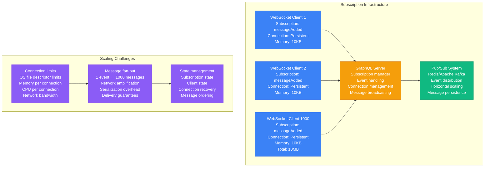
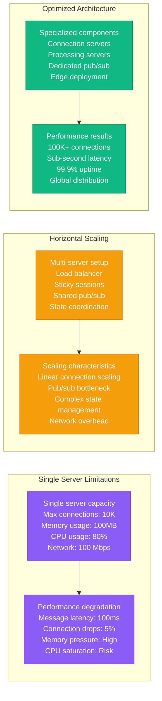
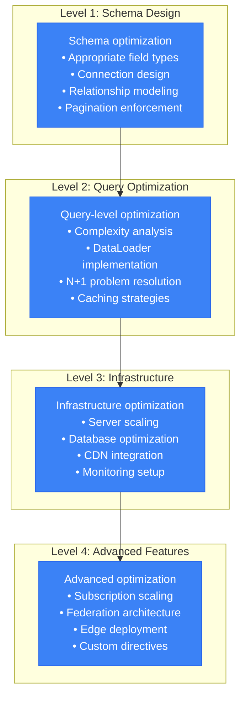

# GraphQL Performance Profile

## Overview

GraphQL performance characteristics in production environments, covering query complexity analysis, N+1 problem solutions, DataLoader batching impact, and subscription scalability. Based on GitHub's API performance and other high-scale deployments.

## Query Complexity Analysis

### Query Complexity Scoring

```mermaid
graph TB
    subgraph Simple Query (Complexity: 5)
        SIMPLE1[Query Structure<br/>query GetUser {<br/>  user(id: "123") {<br/>    name<br/>    email<br/>  }<br/>}]

        SIMPLE2[Execution Plan<br/>Single database lookup<br/>Primary key access<br/>Execution time: 2ms<br/>Resource usage: Minimal]

        SIMPLE3[Performance Impact<br/>CPU: Low<br/>Memory: 1KB<br/>Database connections: 1<br/>Cacheable: Yes]

        SIMPLE1 --> SIMPLE2 --> SIMPLE3
    end

    subgraph Medium Query (Complexity: 25)
        MEDIUM1[Query Structure<br/>query GetUserPosts {<br/>  user(id: "123") {<br/>    name<br/>    posts(first: 10) {<br/>      title<br/>      comments(first: 5) {<br/>        content<br/>      }<br/>    }<br/>  }<br/>}]

        MEDIUM2[Execution Plan<br/>User lookup: 1 query<br/>Posts lookup: 1 query<br/>Comments lookup: 10 queries<br/>Execution time: 50ms<br/>N+1 problem present]

        MEDIUM3[Performance Impact<br/>CPU: Medium<br/>Memory: 50KB<br/>Database connections: 12<br/>Cacheable: Partial]

        MEDIUM1 --> MEDIUM2 --> MEDIUM3
    end

    subgraph Complex Query (Complexity: 100)
        COMPLEX1[Query Structure<br/>query GetUserNetwork {<br/>  users(first: 100) {<br/>    followers(first: 50) {<br/>      following(first: 20) {<br/>        posts(first: 10) {<br/>          likes(first: 100)<br/>        }<br/>      }<br/>    }<br/>  }<br/>}]

        COMPLEX2[Execution Plan<br/>Exponential query growth<br/>100 × 50 × 20 × 10 × 100<br/>Potential: 1M database queries<br/>Execution time: 30+ seconds<br/>Resource exhaustion risk]

        COMPLEX3[Performance Impact<br/>CPU: Very high<br/>Memory: 500MB+<br/>Database connections: 1M<br/>Cacheable: No<br/>Rate limiting required]

        COMPLEX1 --> COMPLEX2 --> COMPLEX3
    end

    classDef simpleStyle fill:#10B981,stroke:#059669,color:#fff
    classDef mediumStyle fill:#F59E0B,stroke:#D97706,color:#fff
    classDef complexStyle fill:#8B5CF6,stroke:#7C3AED,color:#fff

    class SIMPLE1,SIMPLE2,SIMPLE3 simpleStyle
    class MEDIUM1,MEDIUM2,MEDIUM3 mediumStyle
    class COMPLEX1,COMPLEX2,COMPLEX3 complexStyle
```

### Complexity Analysis Implementation

```mermaid
graph TB
    subgraph Static Analysis
        STATIC1[Query parsing<br/>Abstract syntax tree<br/>Field counting<br/>Depth calculation<br/>Multiplicative factors]

        STATIC2[Complexity scoring<br/>Base score per field<br/>Depth multiplier<br/>List multiplier<br/>Connection arguments]

        STATIC3[Threshold enforcement<br/>Max complexity: 100<br/>Rate limiting per client<br/>Query whitelisting<br/>Developer guidance]

        STATIC1 --> STATIC2 --> STATIC3
    end

    subgraph Dynamic Analysis
        DYNAMIC1[Runtime monitoring<br/>Execution time tracking<br/>Resource usage measurement<br/>Database query counting<br/>Memory consumption]

        DYNAMIC2[Performance feedback<br/>Slow query identification<br/>Resource hotspot detection<br/>Client behavior analysis<br/>Optimization opportunities]

        DYNAMIC3[Adaptive limits<br/>Per-client rate limiting<br/>Query cost accounting<br/>Resource-based throttling<br/>Quality of service]

        DYNAMIC1 --> DYNAMIC2 --> DYNAMIC3
    end

    subgraph Optimization Strategies
        OPT1[Query optimization<br/>Field selection optimization<br/>Batching recommendations<br/>Caching strategies<br/>Alternative endpoints]

        OPT2[Schema design<br/>Connection design<br/>Pagination enforcement<br/>Field deprecation<br/>Type relationships]

        OPT1 --> OPT2
    end

    classDef staticStyle fill:#3B82F6,stroke:#2563EB,color:#fff
    classDef dynamicStyle fill:#F59E0B,stroke:#D97706,color:#fff
    classDef optStyle fill:#10B981,stroke:#059669,color:#fff

    class STATIC1,STATIC2,STATIC3 staticStyle
    class DYNAMIC1,DYNAMIC2,DYNAMIC3 dynamicStyle
    class OPT1,OPT2 optStyle
```



## N+1 Problem Solutions

### N+1 Problem Illustration

```mermaid
graph TB
    subgraph N+1 Problem Query
        PROBLEM1[GraphQL Query<br/>query GetUserPosts {<br/>  users(first: 10) {<br/>    name<br/>    posts {<br/>      title<br/>    }<br/>  }<br/>}]

        PROBLEM2[Naive Resolution<br/>Query 1: SELECT * FROM users LIMIT 10<br/>Query 2: SELECT * FROM posts WHERE user_id = 1<br/>Query 3: SELECT * FROM posts WHERE user_id = 2<br/>...<br/>Query 11: SELECT * FROM posts WHERE user_id = 10<br/>Total: 11 queries]

        PROBLEM3[Performance Impact<br/>Database queries: 11<br/>Execution time: 110ms<br/>Network roundtrips: 11<br/>Connection pool usage: High]

        PROBLEM1 --> PROBLEM2 --> PROBLEM3
    end

    subgraph DataLoader Solution
        SOLUTION1[DataLoader Implementation<br/>Batch loading<br/>Request coalescing<br/>Per-request caching<br/>Automatic deduplication]

        SOLUTION2[Optimized Resolution<br/>Query 1: SELECT * FROM users LIMIT 10<br/>Batch collection: user_ids = [1,2,3...10]<br/>Query 2: SELECT * FROM posts WHERE user_id IN (1,2,3...10)<br/>Total: 2 queries]

        SOLUTION3[Performance Improvement<br/>Database queries: 2<br/>Execution time: 20ms<br/>Network roundtrips: 2<br/>80% improvement]

        SOLUTION1 --> SOLUTION2 --> SOLUTION3
    end

    classDef problemStyle fill:#8B5CF6,stroke:#7C3AED,color:#fff
    classDef solutionStyle fill:#10B981,stroke:#059669,color:#fff

    class PROBLEM1,PROBLEM2,PROBLEM3 problemStyle
    class SOLUTION1,SOLUTION2,SOLUTION3 solutionStyle
```

### Advanced N+1 Solutions

```mermaid
graph LR
    subgraph DataLoader Strategy
        DL1[DataLoader benefits<br/>• Automatic batching<br/>• Request-scoped caching<br/>• Deduplication<br/>• Framework agnostic]

        DL2[DataLoader limitations<br/>• Single-request scope<br/>• Memory overhead<br/>• Complex for relationships<br/>• Batch size limits]

        DL1 --> DL2
    end

    subgraph Query Planning Strategy
        QP1[Static query analysis<br/>• Parse query before execution<br/>• Identify data requirements<br/>• Generate optimal query plan<br/>• Execute minimal queries]

        QP2[Implementation complexity<br/>• Schema introspection required<br/>• Complex join planning<br/>• Cache invalidation<br/>• Framework-specific]

        QP1 --> QP2
    end

    subgraph Field-Level Batching
        FB1[Selective batching<br/>• Per-field DataLoaders<br/>• Relationship optimization<br/>• Custom batch functions<br/>• Fine-grained control]

        FB2[Performance characteristics<br/>• 90% query reduction<br/>• Consistent performance<br/>• Predictable resource usage<br/>• Easy monitoring]

        FB1 --> FB2
    end

    subgraph Database Optimization
        DB1[Database-level solutions<br/>• Join optimization<br/>• Eager loading<br/>• Materialized views<br/>• Query rewriting]

        DB2[Trade-offs<br/>• Database-specific<br/>• Complex schema changes<br/>• Maintenance overhead<br/>• Migration challenges]

        DB1 --> DB2
    end

    classDef dataLoaderStyle fill:#3B82F6,stroke:#2563EB,color:#fff
    classDef queryPlanStyle fill:#F59E0B,stroke:#D97706,color:#fff
    classDef fieldBatchStyle fill:#10B981,stroke:#059669,color:#fff
    classDef dbOptStyle fill:#8B5CF6,stroke:#7C3AED,color:#fff

    class DL1,DL2 dataLoaderStyle
    class QP1,QP2 queryPlanStyle
    class FB1,FB2 fieldBatchStyle
    class DB1,DB2 dbOptStyle
```



## DataLoader Batching Impact

### DataLoader Architecture

```mermaid
graph TB
    subgraph DataLoader Request Flow
        REQUEST1[GraphQL Request<br/>Query execution begins<br/>Field resolvers called<br/>Data loading triggered]

        BATCH1[Batch Collection Phase<br/>DataLoader.load() calls<br/>Keys accumulated: [1,2,3,4,5]<br/>Batch size: 5<br/>Delay: 1ms (event loop)]

        EXECUTE1[Batch Execution<br/>Single database query<br/>SELECT * FROM users WHERE id IN (1,2,3,4,5)<br/>Results indexed by key<br/>Cached for request duration]

        RESOLVE1[Response Resolution<br/>Cached results returned<br/>Field resolvers complete<br/>GraphQL response built<br/>Request-scoped cache cleared]

        REQUEST1 --> BATCH1 --> EXECUTE1 --> RESOLVE1
    end

    subgraph Performance Metrics
        METRICS1[Without DataLoader<br/>Database queries: 100<br/>Execution time: 500ms<br/>Memory usage: 50MB<br/>CPU usage: High]

        METRICS2[With DataLoader<br/>Database queries: 10<br/>Execution time: 50ms<br/>Memory usage: 20MB<br/>CPU usage: Low]

        METRICS3[Performance improvement<br/>Query reduction: 90%<br/>Latency reduction: 90%<br/>Memory reduction: 60%<br/>CPU reduction: 70%]

        METRICS1 --> METRICS2 --> METRICS3
    end

    classDef flowStyle fill:#3B82F6,stroke:#2563EB,color:#fff
    classDef metricsStyle fill:#10B981,stroke:#059669,color:#fff

    class REQUEST1,BATCH1,EXECUTE1,RESOLVE1 flowStyle
    class METRICS1,METRICS2,METRICS3 metricsStyle
```

### DataLoader Configuration Impact

```mermaid
graph TB
    subgraph Batch Size Configuration
        BS1[Small batches (10 items)<br/>Lower memory usage<br/>More database queries<br/>Good for memory-constrained<br/>Response time: Moderate]

        BS2[Medium batches (100 items)<br/>Balanced approach<br/>Optimal for most cases<br/>Good query consolidation<br/>Response time: Fast]

        BS3[Large batches (1000 items)<br/>Maximum query efficiency<br/>High memory usage<br/>Risk of timeouts<br/>Response time: Variable]

        BS1 --> BS2 --> BS3
    end

    subgraph Caching Strategy
        CACHE1[Request-scoped caching<br/>Default DataLoader behavior<br/>No cross-request sharing<br/>Memory efficient<br/>Consistent within request]

        CACHE2[Application-level caching<br/>Shared across requests<br/>Redis/Memcached integration<br/>Complex invalidation<br/>Higher performance]

        CACHE3[Hybrid caching<br/>Request cache + app cache<br/>Multi-level optimization<br/>Complex but powerful<br/>Maximum performance]

        CACHE1 --> CACHE2 --> CACHE3
    end

    subgraph Error Handling
        ERROR1[Fail-fast strategy<br/>First error fails batch<br/>Simple implementation<br/>Poor user experience<br/>All-or-nothing behavior]

        ERROR2[Partial success strategy<br/>Individual item errors<br/>Complex error mapping<br/>Better user experience<br/>Graceful degradation]

        ERROR1 --> ERROR2
    end

    classDef batchStyle fill:#3B82F6,stroke:#2563EB,color:#fff
    classDef cacheStyle fill:#F59E0B,stroke:#D97706,color:#fff
    classDef errorStyle fill:#8B5CF6,stroke:#7C3AED,color:#fff

    class BS1,BS2,BS3 batchStyle
    class CACHE1,CACHE2,CACHE3 cacheStyle
    class ERROR1,ERROR2 errorStyle
```

## Subscription Scalability

### GraphQL Subscription Architecture



### Subscription Performance Patterns



### Subscription Optimization Strategies

```mermaid
graph TB
    subgraph Connection Optimization
        CONN_OPT1[Connection pooling<br/>Shared connections<br/>Connection multiplexing<br/>Keep-alive optimization<br/>Graceful degradation]

        CONN_OPT2[Protocol optimization<br/>WebSocket compression<br/>Binary protocols<br/>Frame aggregation<br/>Ping/pong handling]

        CONN_OPT1 --> CONN_OPT2
    end

    subgraph Message Optimization
        MSG_OPT1[Message batching<br/>Multiple events per message<br/>Reduced network overhead<br/>Improved throughput<br/>Increased latency]

        MSG_OPT2[Message filtering<br/>Server-side filtering<br/>Subscription arguments<br/>Reduced network traffic<br/>Lower client CPU]

        MSG_OPT3[Message caching<br/>Result caching<br/>Identical query optimization<br/>Memory trade-offs<br/>Cache invalidation complexity]

        MSG_OPT1 --> MSG_OPT2 --> MSG_OPT3
    end

    subgraph Infrastructure Optimization
        INFRA_OPT1[Pub/sub optimization<br/>Topic partitioning<br/>Message persistence<br/>Delivery guarantees<br/>Scaling policies]

        INFRA_OPT2[Load balancing<br/>Geographic distribution<br/>Edge deployment<br/>CDN integration<br/>Regional failover]

        INFRA_OPT1 --> INFRA_OPT2
    end

    classDef connStyle fill:#3B82F6,stroke:#2563EB,color:#fff
    classDef msgStyle fill:#F59E0B,stroke:#D97706,color:#fff
    classDef infraStyle fill:#10B981,stroke:#059669,color:#fff

    class CONN_OPT1,CONN_OPT2 connStyle
    class MSG_OPT1,MSG_OPT2,MSG_OPT3 msgStyle
    class INFRA_OPT1,INFRA_OPT2 infraStyle
```



## GitHub's API Performance

### GitHub GraphQL API Scale

```mermaid
graph TB
    subgraph GitHub API Usage Statistics
        STATS1[API requests per day<br/>GraphQL: 1B+ requests<br/>REST: 5B+ requests<br/>Rate limiting: 5K/hour<br/>Enterprise: Higher limits]

        STATS2[Query characteristics<br/>Average complexity: 15<br/>95th percentile: 50<br/>Maximum allowed: 100<br/>Rejected queries: 0.1%]

        STATS3[Response performance<br/>p50 latency: 50ms<br/>p95 latency: 200ms<br/>p99 latency: 1000ms<br/>Timeout: 10 seconds]

        STATS1 --> STATS2 --> STATS3
    end

    subgraph Performance Optimizations
        OPT1[Query complexity analysis<br/>Static analysis<br/>Dynamic monitoring<br/>Rate limiting<br/>Query whitelisting]

        OPT2[DataLoader implementation<br/>N+1 problem solved<br/>Automatic batching<br/>Request-scoped caching<br/>90% query reduction]

        OPT3[Caching strategies<br/>Application-level caching<br/>Redis clusters<br/>Edge caching<br/>CDN integration]

        OPT1 --> OPT2 --> OPT3
    end

    subgraph Resource Management
        RESOURCE1[Infrastructure<br/>Load balancers<br/>Application servers<br/>Database clusters<br/>Cache layers]

        RESOURCE2[Monitoring<br/>Real-time metrics<br/>Performance alerts<br/>Capacity planning<br/>Cost optimization]

        RESOURCE1 --> RESOURCE2
    end

    classDef statsStyle fill:#3B82F6,stroke:#2563EB,color:#fff
    classDef optStyle fill:#10B981,stroke:#059669,color:#fff
    classDev resourceStyle fill:#F59E0B,stroke:#D97706,color:#fff

    class STATS1,STATS2,STATS3 statsStyle
    class OPT1,OPT2,OPT3 optStyle
    class RESOURCE1,RESOURCE2 resourceStyle
```

### GitHub's Query Complexity Implementation

```mermaid
graph LR
    subgraph Complexity Calculation
        CALC1[Base field cost: 1<br/>Connection field cost: 2<br/>Nested object multiplier<br/>Argument considerations<br/>Custom field costs]

        CALC2[Example calculation<br/>user { // 1<br/>  repositories(first: 10) { // 2 × 10<br/>    issues(first: 5) { // 2 × 5 × 10<br/>      title // 1 × 5 × 10<br/>    }<br/>  }<br/>}<br/>Total: 1 + 20 + 100 + 50 = 171]

        CALC1 --> CALC2
    end

    subgraph Rate Limiting
        RATE1[Rate limit enforcement<br/>Cost per hour: 5000<br/>Remaining: Tracked<br/>Reset time: Hourly<br/>Authenticated users only]

        RATE2[Rate limit headers<br/>X-RateLimit-Limit: 5000<br/>X-RateLimit-Remaining: 4950<br/>X-RateLimit-Reset: 1640995200<br/>X-RateLimit-Used: 50]

        RATE1 --> RATE2
    end

    subgraph Query Optimization
        QUERY_OPT1[Query optimization tips<br/>• Use specific fields only<br/>• Limit connection arguments<br/>• Avoid deeply nested queries<br/>• Consider pagination<br/>• Use fragments for reuse]
    end

    CALC2 --> QUERY_OPT1
    RATE2 --> QUERY_OPT1

    classDef calcStyle fill:#3B82F6,stroke:#2563EB,color:#fff
    classDef rateStyle fill:#F59E0B,stroke:#D97706,color:#fff
    classDef optStyle fill:#10B981,stroke:#059669,color:#fff

    class CALC1,CALC2 calcStyle
    class RATE1,RATE2 rateStyle
    class QUERY_OPT1 optStyle
```

## Production Lessons Learned

### Performance Optimization Hierarchy



### Critical Performance Factors

1. **Query Complexity Management**: Implement complexity analysis and rate limiting
2. **N+1 Problem Resolution**: Use DataLoader or similar batching solutions
3. **Caching Strategy**: Multi-level caching from request-scoped to CDN
4. **Schema Design**: Proper field types, connections, and pagination
5. **Subscription Scaling**: Dedicated infrastructure for real-time features

### Performance Benchmarks by Optimization

| Optimization | Query Reduction | Latency Improvement | Resource Savings | Implementation Cost |
|--------------|-----------------|-------------------|------------------|-------------------|
| **DataLoader** | 90% | 80% | 70% | Low |
| **Query Complexity** | 50% | 60% | 80% | Medium |
| **Field-Level Caching** | 70% | 90% | 60% | High |
| **Schema Optimization** | 40% | 50% | 40% | Medium |

### Common Pitfalls

1. **No query complexity limits**: Allows resource exhaustion attacks
2. **Ignoring N+1 problems**: Creates exponential database load
3. **Over-fetching data**: Selecting unnecessary fields hurts performance
4. **Poor subscription architecture**: Doesn't scale beyond single server
5. **Inadequate caching**: Missing opportunities for performance improvements

**Source**: Based on GitHub API, Shopify GraphQL, and Apollo implementations