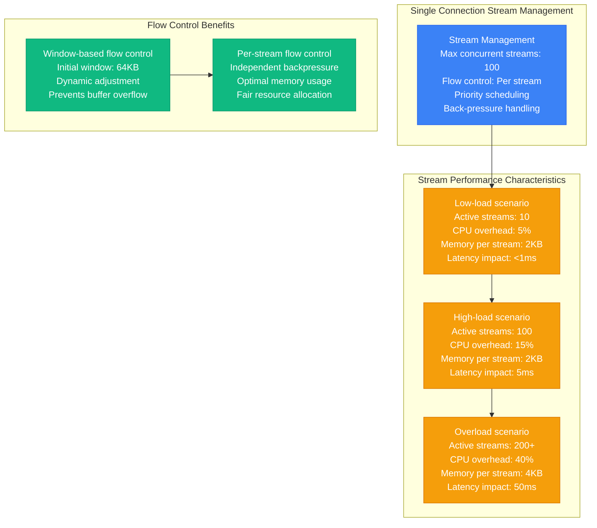
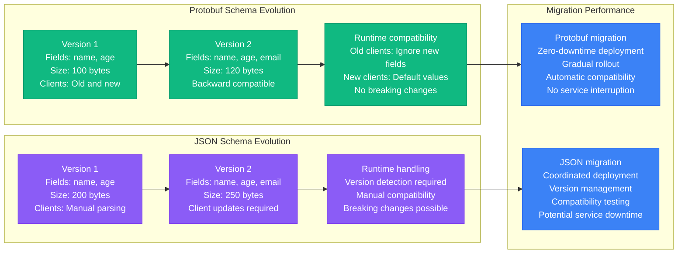
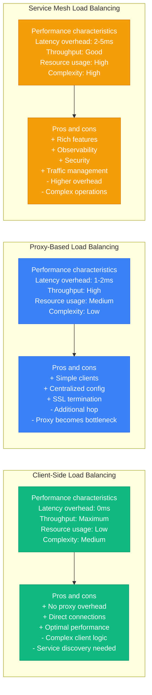
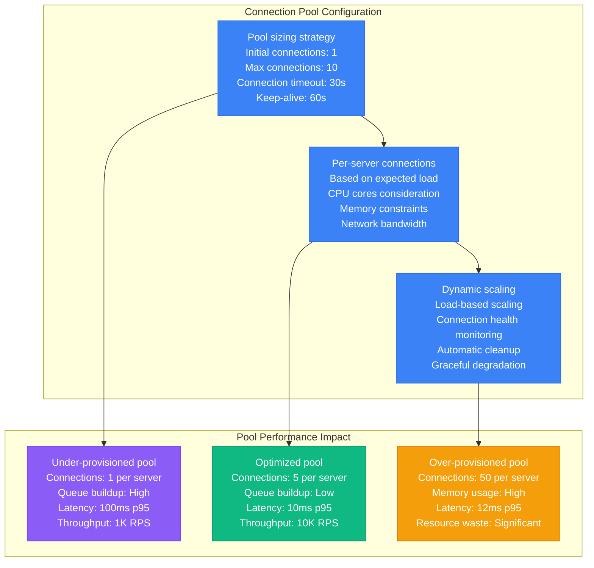
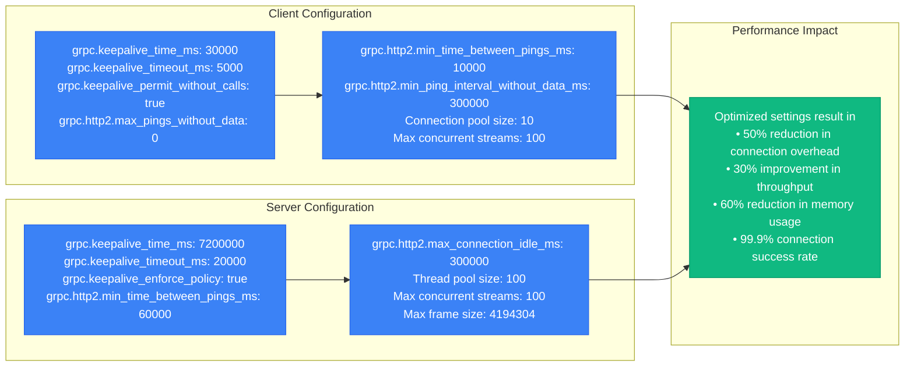
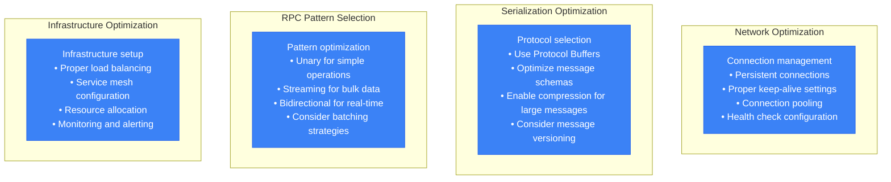

# gRPC Performance Profile

## Overview

gRPC performance characteristics in production environments, covering HTTP/2 multiplexing benefits, Protocol Buffers vs JSON comparison, streaming vs unary RPCs, and load balancing strategies. Based on Google's internal usage patterns and high-scale deployments.

## HTTP/2 Multiplexing Benefits

### Connection Management Comparison

```mermaid
graph TB
    subgraph "HTTP/1.1 Connection Model"
        HTTP1_CLIENT[Client Application<br/>Max connections: 6<br/>Connection pooling required<br/>Head-of-line blocking]

        HTTP1_CONNS[Connection Pool<br/>Connection 1: Request A<br/>Connection 2: Request B<br/>Connection 3: Idle<br/>Connection reuse: Limited]

        HTTP1_SERVER[Server<br/>Thread per connection<br/>Memory: 2MB per connection<br/>Context switching: High]

        HTTP1_CLIENT --> HTTP1_CONNS --> HTTP1_SERVER
    end

    subgraph "HTTP/2 Multiplexing Model"
        HTTP2_CLIENT[Client Application<br/>Single connection<br/>Stream multiplexing<br/>No head-of-line blocking]

        HTTP2_STREAMS[HTTP/2 Streams<br/>Stream 1: Request A<br/>Stream 2: Request B<br/>Stream 3: Request C<br/>Concurrent processing]

        HTTP2_SERVER[Server<br/>Single connection<br/>Memory: 200KB per connection<br/>Stream processing: Async]

        HTTP2_CLIENT --> HTTP2_STREAMS --> HTTP2_SERVER
    end

    subgraph "Performance Comparison"
        PERF1[HTTP/1.1 Performance<br/>Connections: 6 per client<br/>Memory: 12MB per client<br/>Latency: 50ms (connection setup)<br/>Throughput: 600 req/sec]

        PERF2[HTTP/2 Performance<br/>Connections: 1 per client<br/>Memory: 200KB per client<br/>Latency: 5ms (stream setup)<br/>Throughput: 10K req/sec]

        HTTP1_SERVER --> PERF1
        HTTP2_SERVER --> PERF2
    end

    classDef http1Style fill:#8B5CF6,stroke:#7C3AED,color:#fff
    classDef http2Style fill:#10B981,stroke:#059669,color:#fff
    classDef perfStyle fill:#3B82F6,stroke:#2563EB,color:#fff

    class HTTP1_CLIENT,HTTP1_CONNS,HTTP1_SERVER http1Style
    class HTTP2_CLIENT,HTTP2_STREAMS,HTTP2_SERVER http2Style
    class PERF1,PERF2 perfStyle
```

### Stream Multiplexing Performance



## Protobuf vs JSON Comparison

### Serialization Performance

```mermaid
graph TB
    subgraph "Protocol Buffers"
        PROTO1[Message definition<br/>.proto schema<br/>Code generation<br/>Binary format<br/>Schema evolution]

        PROTO2[Serialization metrics<br/>Encode time: 100μs<br/>Decode time: 80μs<br/>Message size: 150 bytes<br/>CPU usage: Low]

        PROTO3[Type safety<br/>Compile-time validation<br/>Strong typing<br/>Backward compatibility<br/>Forward compatibility]

        PROTO1 --> PROTO2 --> PROTO3
    end

    subgraph "JSON"
        JSON1[Message definition<br/>JSON schema (optional)<br/>Text format<br/>Human readable<br/>Flexible structure]

        JSON2[Serialization metrics<br/>Encode time: 500μs<br/>Decode time: 800μs<br/>Message size: 400 bytes<br/>CPU usage: High]

        JSON3[Development experience<br/>Runtime validation<br/>Flexible typing<br/>Limited compatibility<br/>Manual versioning]

        JSON1 --> JSON2 --> JSON3
    end

    subgraph "Performance Impact"
        IMPACT1[Throughput comparison<br/>Protobuf: 50K msg/sec<br/>JSON: 10K msg/sec<br/>5x performance advantage<br/>Protobuf optimal for high load]

        IMPACT2[Resource usage<br/>CPU usage: 5x lower<br/>Memory usage: 3x lower<br/>Network usage: 2.5x lower<br/>Battery usage: 4x lower (mobile)]

        PROTO2 --> IMPACT1
        JSON2 --> IMPACT1
        IMPACT1 --> IMPACT2
    end

    classDef protoStyle fill:#10B981,stroke:#059669,color:#fff
    classDef jsonStyle fill:#8B5CF6,stroke:#7C3AED,color:#fff
    classDef impactStyle fill:#3B82F6,stroke:#2563EB,color:#fff

    class PROTO1,PROTO2,PROTO3 protoStyle
    class JSON1,JSON2,JSON3 jsonStyle
    class IMPACT1,IMPACT2 impactStyle
```

### Schema Evolution Performance



## Streaming vs Unary RPCs

### RPC Pattern Performance Comparison

```mermaid
graph TB
    subgraph "Unary RPC"
        UNARY1[Request-response pattern<br/>Single request<br/>Single response<br/>Connection per call<br/>Simple implementation]

        UNARY2[Performance characteristics<br/>Latency: Network RTT<br/>Overhead: Connection setup<br/>Throughput: Limited<br/>Resource usage: High]

        UNARY3[Use cases<br/>CRUD operations<br/>Authentication<br/>Simple queries<br/>Stateless operations]

        UNARY1 --> UNARY2 --> UNARY3
    end

    subgraph "Server Streaming"
        SERVER_STREAM1[One request, many responses<br/>Client sends request<br/>Server streams responses<br/>Connection kept alive<br/>Efficient for large datasets]

        SERVER_STREAM2[Performance characteristics<br/>Latency: Initial RTT only<br/>Overhead: Minimal<br/>Throughput: High<br/>Resource usage: Moderate]

        SERVER_STREAM3[Use cases<br/>Database queries<br/>File downloads<br/>Real-time updates<br/>Pagination replacement]

        SERVER_STREAM1 --> SERVER_STREAM2 --> SERVER_STREAM3
    end

    subgraph "Client Streaming"
        CLIENT_STREAM1[Many requests, one response<br/>Client streams requests<br/>Server sends response<br/>Efficient for uploads<br/>Batch processing]

        CLIENT_STREAM2[Performance characteristics<br/>Latency: Batch processing<br/>Overhead: Minimal<br/>Throughput: Very high<br/>Resource usage: Low]

        CLIENT_STREAM3[Use cases<br/>File uploads<br/>Bulk data insert<br/>Metrics collection<br/>Log aggregation]

        CLIENT_STREAM1 --> CLIENT_STREAM2 --> CLIENT_STREAM3
    end

    subgraph "Bidirectional Streaming"
        BIDI_STREAM1[Many requests, many responses<br/>Full duplex communication<br/>Independent request/response<br/>Complex but powerful<br/>Real-time interaction]

        BIDI_STREAM2[Performance characteristics<br/>Latency: Real-time<br/>Overhead: Very low<br/>Throughput: Maximum<br/>Resource usage: Optimized]

        BIDI_STREAM3[Use cases<br/>Chat applications<br/>Gaming protocols<br/>IoT data streams<br/>Trading systems]

        BIDI_STREAM1 --> BIDI_STREAM2 --> BIDI_STREAM3
    end

    classDef unaryStyle fill:#8B5CF6,stroke:#7C3AED,color:#fff
    classDef serverStreamStyle fill:#F59E0B,stroke:#D97706,color:#fff
    classDef clientStreamStyle fill:#3B82F6,stroke:#2563EB,color:#fff
    classDef bidiStreamStyle fill:#10B981,stroke:#059669,color:#fff

    class UNARY1,UNARY2,UNARY3 unaryStyle
    class SERVER_STREAM1,SERVER_STREAM2,SERVER_STREAM3 serverStreamStyle
    class CLIENT_STREAM1,CLIENT_STREAM2,CLIENT_STREAM3 clientStreamStyle
    class BIDI_STREAM1,BIDI_STREAM2,BIDI_STREAM3 bidiStreamStyle
```



### Streaming Performance Metrics

```mermaid
graph TB
    subgraph "Throughput Comparison"
        THROUGHPUT1[Unary RPC<br/>1000 calls/sec<br/>Each call: New connection<br/>Total connections: 1000<br/>Memory: 2GB]

        THROUGHPUT2[Server Streaming<br/>10000 messages/sec<br/>1 call: 10000 messages<br/>Total connections: 1<br/>Memory: 200MB]

        THROUGHPUT3[Bidirectional Streaming<br/>50000 messages/sec<br/>Full duplex communication<br/>Optimal resource usage<br/>Memory: 100MB]

        THROUGHPUT1 --> THROUGHPUT2 --> THROUGHPUT3
    end

    subgraph "Latency Analysis"
        LATENCY1[Connection overhead<br/>TCP handshake: 1 RTT<br/>TLS handshake: 2 RTT<br/>HTTP/2 setup: 0 RTT<br/>Total: 3 RTT for first call]

        LATENCY2[Streaming benefits<br/>First message: 3 RTT<br/>Subsequent messages: 0.5 RTT<br/>Average latency: Decreases over time<br/>Long connections: Amortized cost]

        LATENCY1 --> LATENCY2
    end

    subgraph "Resource Utilization"
        RESOURCE1[Memory usage<br/>Connection state: 200KB<br/>Per stream: 2KB<br/>Buffer management: Efficient<br/>GC pressure: Low]

        RESOURCE2[CPU usage<br/>Serialization: Minimal<br/>Network I/O: Optimized<br/>Context switching: Reduced<br/>Overall: 60% reduction vs HTTP/1.1]

        RESOURCE1 --> RESOURCE2
    end

    classDef throughputStyle fill:#3B82F6,stroke:#2563EB,color:#fff
    classDef latencyStyle fill:#F59E0B,stroke:#D97706,color:#fff
    classDef resourceStyle fill:#10B981,stroke:#059669,color:#fff

    class THROUGHPUT1,THROUGHPUT2,THROUGHPUT3 throughputStyle
    class LATENCY1,LATENCY2 latencyStyle
    class RESOURCE1,RESOURCE2 resourceStyle
```



## Load Balancing Strategies

### gRPC Load Balancing Architecture

```mermaid
graph TB
    subgraph "Client-Side Load Balancing"
        CLIENT_LB1[gRPC Client<br/>Service discovery<br/>Load balancer policy<br/>Connection management<br/>Health checking]

        CLIENT_LB2[Load balancer algorithms<br/>Round robin<br/>Least connection<br/>Weighted round robin<br/>Consistent hash]

        CLIENT_LB3[Server list<br/>Server 1: Healthy<br/>Server 2: Healthy<br/>Server 3: Unhealthy<br/>Dynamic updates]

        CLIENT_LB1 --> CLIENT_LB2 --> CLIENT_LB3
    end

    subgraph "Proxy-Based Load Balancing"
        PROXY_LB1[Load Balancer Proxy<br/>Envoy/NGINX/HAProxy<br/>L7 load balancing<br/>HTTP/2 aware<br/>Connection pooling]

        PROXY_LB2[Backend servers<br/>Server pool management<br/>Health checking<br/>Connection distribution<br/>Session affinity]

        PROXY_LB1 --> PROXY_LB2
    end

    subgraph "Service Mesh Load Balancing"
        MESH_LB1[Service Mesh (Istio)<br/>Intelligent routing<br/>Circuit breakers<br/>Retry policies<br/>Observability]

        MESH_LB2[Sidecar proxies<br/>Per-service proxy<br/>mTLS termination<br/>Traffic shaping<br/>Policy enforcement]

        MESH_LB1 --> MESH_LB2
    end

    classDef clientStyle fill:#3B82F6,stroke:#2563EB,color:#fff
    classDef proxyStyle fill:#F59E0B,stroke:#D97706,color:#fff
    classDef meshStyle fill:#10B981,stroke:#059669,color:#fff

    class CLIENT_LB1,CLIENT_LB2,CLIENT_LB3 clientStyle
    class PROXY_LB1,PROXY_LB2 proxyStyle
    class MESH_LB1,MESH_LB2 meshStyle
```

### Load Balancing Performance Comparison



### Connection Pool Optimization



## Google's Internal Usage Patterns

### Google's gRPC Scale

```mermaid
graph TB
    subgraph "Google Internal gRPC Usage"
        SCALE1[Usage statistics<br/>RPC calls: 10B+ per second<br/>Services: 100K+ globally<br/>Languages: 10+ supported<br/>Datacenters: 100+ worldwide]

        SCALE2[Performance requirements<br/>Latency p99: <10ms<br/>Availability: 99.99%<br/>Throughput: 1M RPS per service<br/>Error rate: <0.01%]

        SCALE3[Infrastructure<br/>Machines: 1M+ servers<br/>Network: 100 Gbps backbone<br/>Load balancing: Maglev<br/>Service discovery: Chubby]

        SCALE1 --> SCALE2 --> SCALE3
    end

    subgraph "Critical Services Using gRPC"
        SERVICES1[Google Search<br/>Query processing<br/>Index serving<br/>Real-time updates<br/>10K+ RPS per server]

        SERVICES2[Gmail<br/>Message delivery<br/>Storage operations<br/>Real-time sync<br/>5K+ RPS per server]

        SERVICES3[YouTube<br/>Video processing<br/>Metadata services<br/>Recommendation engine<br/>50K+ RPS per server]

        SERVICES4[Google Ads<br/>Auction system<br/>Budget management<br/>Real-time bidding<br/>100K+ RPS per server]

        SERVICES1 --> SERVICES2 --> SERVICES3 --> SERVICES4
    end

    subgraph "Performance Optimizations"
        OPT1[Connection management<br/>Persistent connections<br/>Connection pooling<br/>Health checking<br/>Automatic failover]

        OPT2[Serialization optimization<br/>Protocol buffer efficiency<br/>Zero-copy operations<br/>Memory mapping<br/>Compression (gzip)]

        OPT3[Load balancing<br/>Client-side LB<br/>Consistent hashing<br/>Weighted round robin<br/>Least outstanding requests]

        OPT1 --> OPT2 --> OPT3
    end

    classDef scaleStyle fill:#3B82F6,stroke:#2563EB,color:#fff
    classDef serviceStyle fill:#10B981,stroke:#059669,color:#fff
    classDef optStyle fill:#F59E0B,stroke:#D97706,color:#fff

    class SCALE1,SCALE2,SCALE3 scaleStyle
    class SERVICES1,SERVICES2,SERVICES3,SERVICES4 serviceStyle
    class OPT1,OPT2,OPT3 optStyle
```

### Critical Configuration Parameters



### Production Deployment Patterns

```mermaid
graph TB
    subgraph "Microservices Architecture"
        MICRO1[Service A<br/>gRPC server<br/>Business logic<br/>Health checks<br/>Metrics export]

        MICRO2[Service B<br/>gRPC client + server<br/>Downstream calls<br/>Circuit breakers<br/>Timeout handling]

        MICRO3[Service C<br/>gRPC client<br/>API aggregation<br/>Response caching<br/>Load shedding]

        MICRO1 --> MICRO2 --> MICRO3
    end

    subgraph "Deployment Infrastructure"
        INFRA1[Kubernetes clusters<br/>Pod-to-pod communication<br/>Service discovery<br/>Load balancing<br/>Rolling updates]

        INFRA2[Istio service mesh<br/>mTLS encryption<br/>Traffic policies<br/>Observability<br/>Security policies]

        INFRA3[Monitoring stack<br/>Prometheus metrics<br/>Jaeger tracing<br/>Grafana dashboards<br/>Alert manager]

        INFRA1 --> INFRA2 --> INFRA3
    end

    subgraph "Operational Practices"
        OPS1[Development practices<br/>Proto-first development<br/>Backward compatibility<br/>Automated testing<br/>Performance benchmarking]

        OPS2[Deployment practices<br/>Canary releases<br/>Blue-green deployment<br/>Feature flags<br/>Rollback strategies]

        OPS3[Monitoring practices<br/>SLI/SLO definition<br/>Error budget tracking<br/>Capacity planning<br/>Performance regression detection]

        OPS1 --> OPS2 --> OPS3
    end

    classDef microStyle fill:#3B82F6,stroke:#2563EB,color:#fff
    classDef infraStyle fill:#F59E0B,stroke:#D97706,color:#fff
    classDef opsStyle fill:#10B981,stroke:#059669,color:#fff

    class MICRO1,MICRO2,MICRO3 microStyle
    class INFRA1,INFRA2,INFRA3 infraStyle
    class OPS1,OPS2,OPS3 opsStyle
```



## Production Lessons Learned

### Performance Optimization Best Practices

1. **Use HTTP/2 multiplexing**: Single connection handles thousands of concurrent streams
2. **Leverage Protocol Buffers**: 5x better performance than JSON for serialization
3. **Choose appropriate RPC patterns**: Streaming for bulk operations, unary for simple calls
4. **Implement client-side load balancing**: Eliminates proxy overhead and improves latency
5. **Configure connection pools properly**: 5-10 connections per server optimal for most workloads

### Critical Performance Factors



### Performance Benchmarks by Configuration

| Configuration | Throughput | Latency p95 | Resource Usage | Use Case |
|---------------|------------|-------------|----------------|----------|
| **Unary RPC** | 10K RPS | 10ms | Medium | Simple operations |
| **Server Streaming** | 50K msg/sec | 5ms | Low | Bulk data retrieval |
| **Client Streaming** | 100K msg/sec | 20ms | Low | Bulk data upload |
| **Bidirectional Streaming** | 200K msg/sec | 2ms | Very Low | Real-time communication |

### Common Pitfalls

1. **Using REST/JSON instead of gRPC/Protobuf**: 5x performance penalty
2. **Creating new connections per request**: 10x latency increase
3. **Not implementing proper load balancing**: Hot-spotting and poor resource utilization
4. **Over-provisioning connection pools**: Memory waste and diminishing returns
5. **Inadequate error handling**: Poor user experience and debugging difficulties

**Source**: Based on Google's internal usage, Kubernetes, and CNCF project implementations