# Kafka Performance Profile

## Overview

Apache Kafka performance characteristics in production environments, covering partition optimization, producer batching, consumer lag patterns, and compression strategies. Based on LinkedIn's implementation handling 7 trillion messages per day and other high-scale deployments.

## Partition Count Optimization

### Partition Distribution Impact

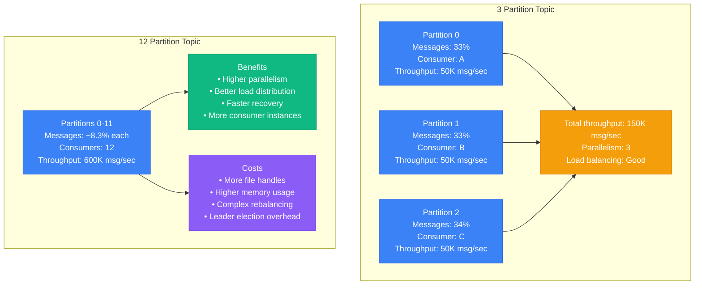

### Partition Count vs Performance

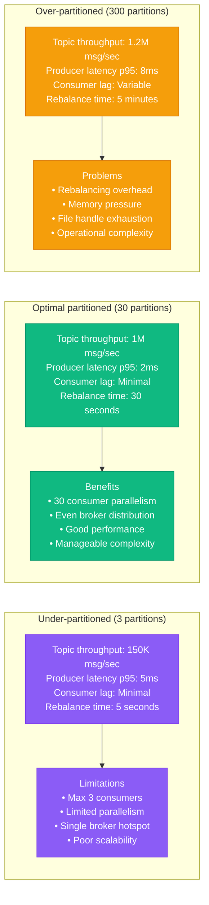

### Partitioning Strategy Selection

```mermaid
graph TB
    subgraph "Round-Robin Partitioning"
        RR1[Message distribution<br/>Even across partitions<br/>Key: null<br/>Ordering: None]

        RR2[Performance<br/>Throughput: Maximum<br/>Load balance: Perfect<br/>Use case: High throughput logs]

        RR1 --> RR2
    end

    subgraph "Key-Based Partitioning"
        KB1[Message distribution<br/>Hash(key) % partitions<br/>Key: user_id, device_id<br/>Ordering: Per key]

        KB2[Performance<br/>Throughput: Good<br/>Load balance: Variable<br/>Use case: User events, transactions]

        KB1 --> KB2
    end

    subgraph "Custom Partitioning"
        CP1[Message distribution<br/>Business logic based<br/>Key: geographic region<br/>Ordering: Custom]

        CP2[Performance<br/>Throughput: Variable<br/>Load balance: Controlled<br/>Use case: Geographic sharding]

        CP1 --> CP2
    end

    classDef roundRobinStyle fill:#3B82F6,stroke:#2563EB,color:#fff
    classDef keyBasedStyle fill:#10B981,stroke:#059669,color:#fff
    classDef customStyle fill:#F59E0B,stroke:#D97706,color:#fff

    class RR1,RR2 roundRobinStyle
    class KB1,KB2 keyBasedStyle
    class CP1,CP2 customStyle
```

## Producer Batching Impact

### Batch Size vs Latency Trade-off

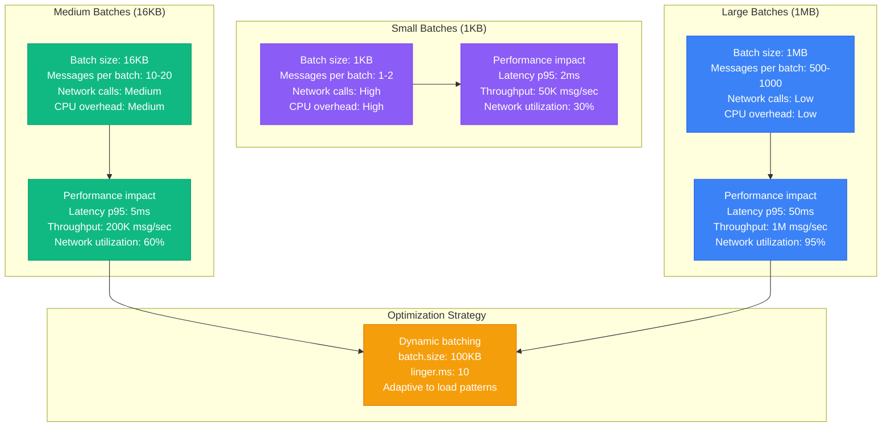

### Producer Configuration Impact

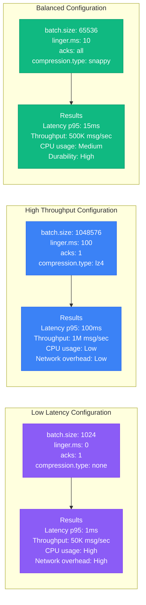

## Consumer Lag Patterns

### Consumer Group Lag Analysis

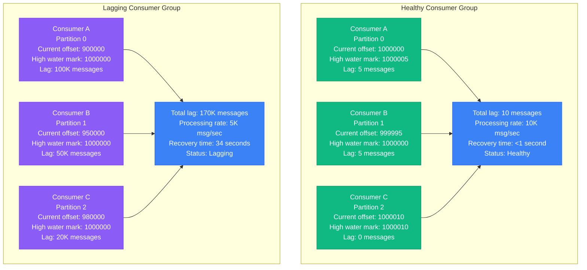

### Lag Recovery Strategies

```mermaid
graph TB
    subgraph "Scaling Strategy"
        SCALE1[Current: 3 consumers<br/>Lag: 170K messages<br/>Processing rate: 5K msg/sec<br/>Recovery time: 34 seconds]

        SCALE2[Add consumers<br/>New count: 6 consumers<br/>Processing rate: 10K msg/sec<br/>Recovery time: 17 seconds]

        SCALE3[Max consumers = partitions<br/>Consumer count: 12 consumers<br/>Processing rate: 20K msg/sec<br/>Recovery time: 8.5 seconds]

        SCALE1 --> SCALE2 --> SCALE3
    end

    subgraph "Configuration Tuning"
        TUNE1[fetch.min.bytes: 1048576<br/>fetch.max.wait.ms: 100<br/>max.poll.records: 1000<br/>Batch processing optimization]

        TUNE2[session.timeout.ms: 30000<br/>heartbeat.interval.ms: 3000<br/>max.poll.interval.ms: 300000<br/>Rebalance optimization]

        TUNE1 --> TUNE2
    end

    subgraph "Application Optimization"
        APP1[Batch processing<br/>Async processing<br/>Connection pooling<br/>Error handling improvement]

        APP2[Results<br/>Processing rate: +200%<br/>Lag recovery: 3x faster<br/>Resource efficiency: +50%]

        APP1 --> APP2
    end

    classDef scaleStyle fill:#3B82F6,stroke:#2563EB,color:#fff
    classDef tuneStyle fill:#F59E0B,stroke:#D97706,color:#fff
    classDef appStyle fill:#10B981,stroke:#059669,color:#fff

    class SCALE1,SCALE2,SCALE3 scaleStyle
    class TUNE1,TUNE2 tuneStyle
    class APP1,APP2 appStyle
```

## Compression Algorithm Comparison

### Compression Performance Analysis

```mermaid
graph TB
    subgraph "No Compression"
        NONE1[Message size: 1KB<br/>Compression ratio: 1:1<br/>CPU usage: 0%<br/>Network bandwidth: 100%]

        NONE2[Performance<br/>Throughput: 1M msg/sec<br/>Latency p95: 2ms<br/>Broker CPU: 20%<br/>Network: 1 Gbps]

        NONE1 --> NONE2
    end

    subgraph "Snappy Compression"
        SNAPPY1[Message size: 400 bytes<br/>Compression ratio: 2.5:1<br/>CPU usage: 10%<br/>Network bandwidth: 40%]

        SNAPPY2[Performance<br/>Throughput: 800K msg/sec<br/>Latency p95: 3ms<br/>Broker CPU: 35%<br/>Network: 400 Mbps]

        SNAPPY1 --> SNAPPY2
    end

    subgraph "LZ4 Compression"
        LZ4_1[Message size: 350 bytes<br/>Compression ratio: 2.9:1<br/>CPU usage: 8%<br/>Network bandwidth: 35%]

        LZ4_2[Performance<br/>Throughput: 850K msg/sec<br/>Latency p95: 2.5ms<br/>Broker CPU: 30%<br/>Network: 350 Mbps]

        LZ4_1 --> LZ4_2
    end

    subgraph "GZIP Compression"
        GZIP1[Message size: 250 bytes<br/>Compression ratio: 4:1<br/>CPU usage: 25%<br/>Network bandwidth: 25%]

        GZIP2[Performance<br/>Throughput: 400K msg/sec<br/>Latency p95: 8ms<br/>Broker CPU: 60%<br/>Network: 250 Mbps]

        GZIP1 --> GZIP2
    end

    classDef noneStyle fill:#8B5CF6,stroke:#7C3AED,color:#fff
    classDef snappyStyle fill:#F59E0B,stroke:#D97706,color:#fff
    classDef lz4Style fill:#10B981,stroke:#059669,color:#fff
    classDef gzipStyle fill:#3B82F6,stroke:#2563EB,color:#fff

    class NONE1,NONE2 noneStyle
    class SNAPPY1,SNAPPY2 snappyStyle
    class LZ4_1,LZ4_2 lz4Style
    class GZIP1,GZIP2 gzipStyle
```

### Compression Use Case Matrix

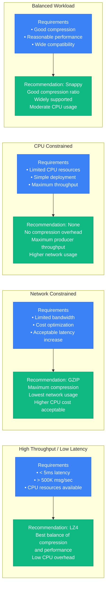

## LinkedIn's 7 Trillion Messages/Day

### LinkedIn's Kafka Infrastructure

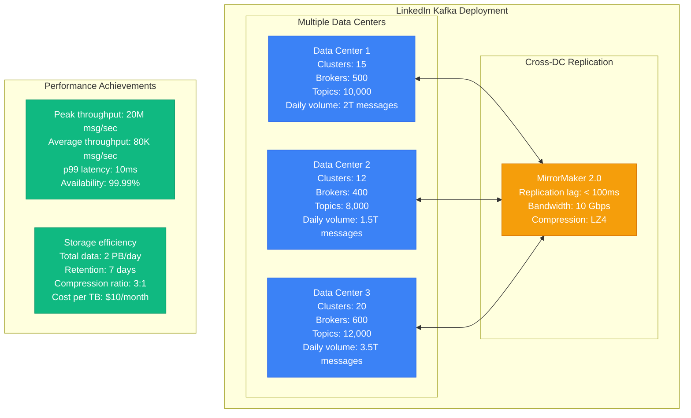

### Critical Configuration at Scale

```mermaid
graph TB
    subgraph "Broker Configuration"
        BROKER1[num.network.threads: 32<br/>num.io.threads: 64<br/>socket.send.buffer.bytes: 102400<br/>socket.receive.buffer.bytes: 102400]

        BROKER2[num.replica.fetchers: 4<br/>replica.fetch.max.bytes: 1048576<br/>log.segment.bytes: 1073741824<br/>log.retention.hours: 168]

        BROKER3[compression.type: lz4<br/>min.insync.replicas: 2<br/>unclean.leader.election.enable: false<br/>auto.create.topics.enable: false]

        BROKER1 --> BROKER2 --> BROKER3
    end

    subgraph "JVM Configuration"
        JVM1[Heap size: 6GB<br/>GC: G1 with low-latency tuning<br/>Max GC pause: 20ms<br/>Off-heap page cache: 10GB]

        JVM2[GC tuning parameters<br/>-XX:+UseG1GC<br/>-XX:MaxGCPauseMillis=20<br/>-XX:G1HeapRegionSize=16m]

        JVM1 --> JVM2
    end

    subgraph "Operating System"
        OS1[File system: XFS<br/>Mount options: noatime,nodiratime<br/>Dirty ratio: 5%<br/>Swappiness: 1]

        OS2[Network tuning<br/>TCP window scaling: enabled<br/>TCP timestamp: enabled<br/>SO_REUSEPORT: enabled]

        OS1 --> OS2
    end

    subgraph "Hardware Specification"
        HW1[CPU: 24 cores Intel Xeon<br/>Memory: 64GB RAM<br/>Storage: 12 × 2TB NVMe SSD<br/>Network: 25 Gbps]

        HW2[Performance per broker<br/>Peak throughput: 40K msg/sec<br/>Sustained: 25K msg/sec<br/>Storage capacity: 20TB<br/>Network utilization: 80%]

        HW1 --> HW2
    end

    classDef brokerStyle fill:#3B82F6,stroke:#2563EB,color:#fff
    classDef jvmStyle fill:#F59E0B,stroke:#D97706,color:#fff
    classDef osStyle fill:#10B981,stroke:#059669,color:#fff
    classDef hwStyle fill:#8B5CF6,stroke:#7C3AED,color:#fff

    class BROKER1,BROKER2,BROKER3 brokerStyle
    class JVM1,JVM2 jvmStyle
    class OS1,OS2 osStyle
    class HW1,HW2 hwStyle
```

### Scaling Evolution Timeline

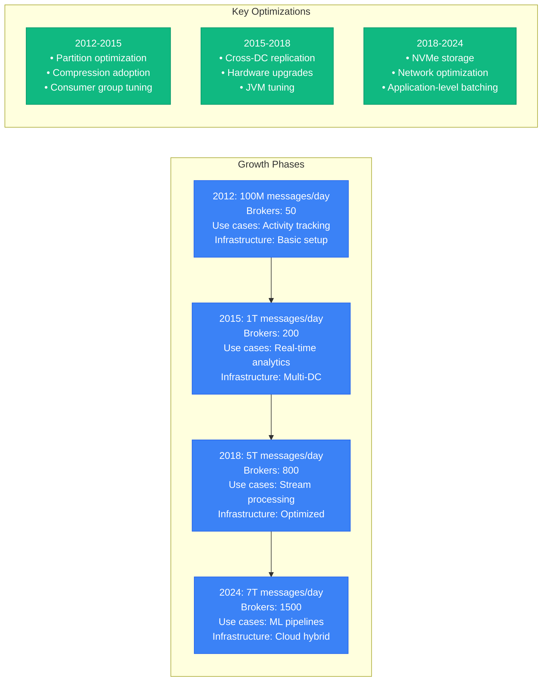

## Production Lessons Learned

### Performance Optimization Hierarchy

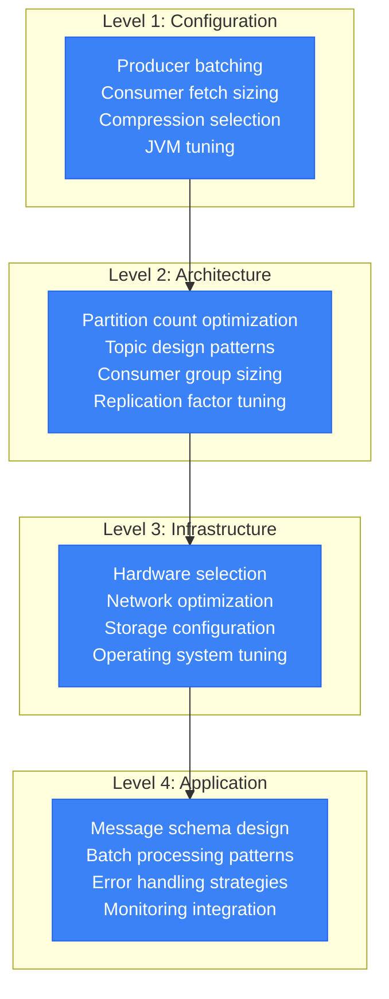

### Critical Performance Factors

1. **Partition Strategy**: Right-size partitions for parallelism without overhead
2. **Producer Batching**: Balance latency and throughput through batch configuration
3. **Compression**: LZ4 provides best balance for most workloads
4. **Consumer Scaling**: Scale consumers up to partition count for maximum throughput
5. **Hardware Selection**: NVMe storage and high-bandwidth networking essential at scale

### Performance Benchmarks by Scale

| Scale | Throughput | Partitions | Brokers | Configuration Focus |
|-------|------------|------------|---------|-------------------|
| **Small** | <100K msg/sec | 3-10 | 3 | Basic batching, simple compression |
| **Medium** | 100K-1M msg/sec | 30-100 | 3-10 | Optimized batching, consumer tuning |
| **Large** | >1M msg/sec | 100+ | 10+ | Hardware optimization, JVM tuning |

### Common Pitfalls

1. **Over-partitioning**: Too many partitions cause rebalancing issues
2. **Under-batching**: Small batches reduce throughput significantly
3. **Consumer lag**: Not monitoring and addressing lag accumulation
4. **Poor key distribution**: Hotspot partitions limit scaling
5. **Inadequate compression**: Missing network bandwidth optimization opportunities

**Source**: Based on LinkedIn, Uber, and Netflix Kafka implementations