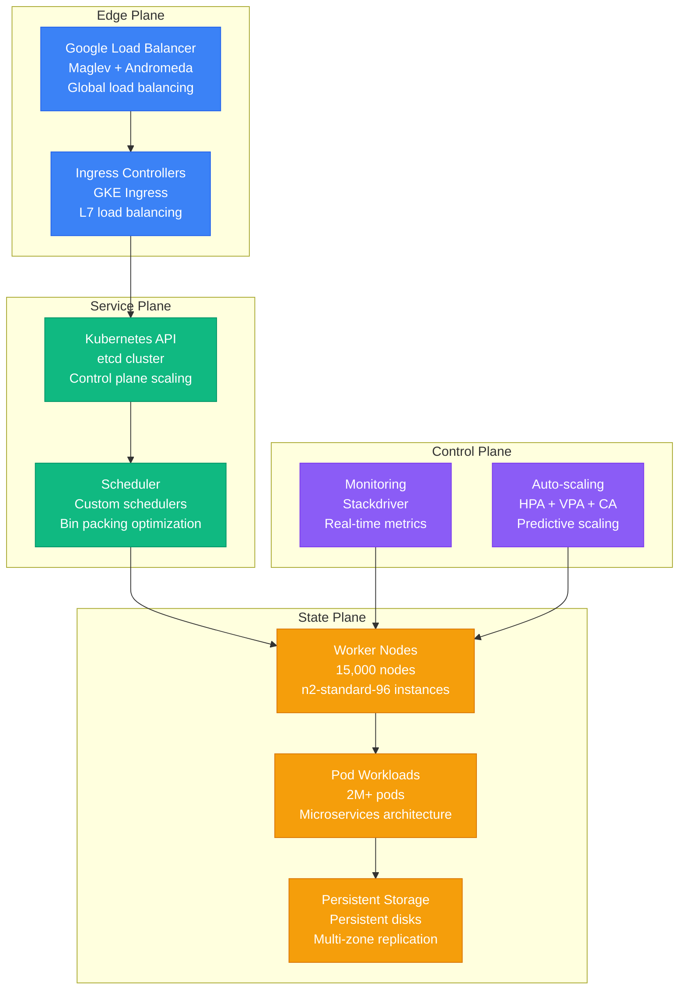
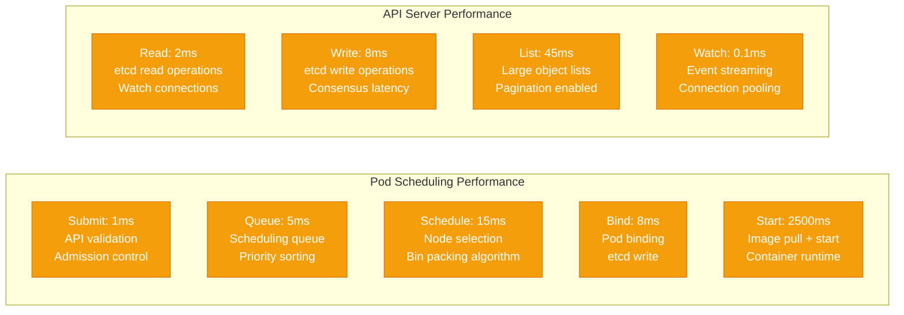
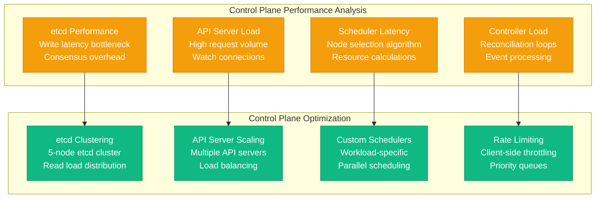
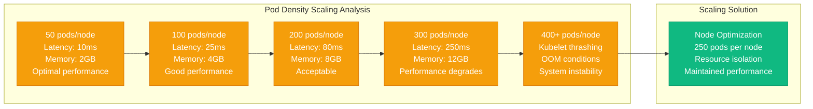

# Kubernetes at 15K Nodes: Google's Massive Scale Performance Profile

## Overview

Google operates the world's largest Kubernetes clusters, managing over 15,000 nodes per cluster with millions of containers across their global infrastructure. This deployment supports Google's entire product ecosystem including Search, Gmail, YouTube, and Google Cloud Platform, handling petabyte-scale workloads with 99.99% availability requirements.

## Architecture for Performance



## Performance Metrics and Benchmarks

### Cluster Scale Metrics
- **Node Count**: 15,000 worker nodes per cluster
- **Pod Count**: 2.5M pods across cluster
- **Pod Density**: 167 pods per node average
- **API Requests**: 1M API requests per second peak
- **Scheduling Rate**: 10K pods per second
- **Control Plane**: 5 master nodes (etcd cluster)

### Performance Profile


## Optimization Techniques Used

### 1. Control Plane Optimization
```yaml
# Google Kubernetes Control Plane Configuration
apiVersion: kubeadm.k8s.io/v1beta3
kind: ClusterConfiguration
etcd:
  local:
    dataDir: "/var/lib/etcd"
    serverCertSANs:
    - "etcd.google.internal"
    peerCertSANs:
    - "etcd.google.internal"
    extraArgs:
      quota-backend-bytes: "8589934592"  # 8GB
      max-txn-ops: "1024"
      max-request-bytes: "10485760"      # 10MB
      grpc-keepalive-min-time: "30s"
      grpc-keepalive-interval: "60s"
      grpc-keepalive-timeout: "20s"

apiServer:
  extraArgs:
    max-requests-inflight: "3000"
    max-mutating-requests-inflight: "1000"
    watch-cache-sizes: "nodes#1000,pods#10000,services#1000"
    enable-admission-plugins: "NamespaceLifecycle,ServiceAccount,NodeRestriction,Priority,DefaultStorageClass,VolumeScheduling,PersistentVolumeClaimResize"
    audit-log-maxage: "30"
    audit-log-maxbackup: "10"
    audit-log-maxsize: "1000"

controllerManager:
  extraArgs:
    node-monitor-period: "5s"
    node-monitor-grace-period: "40s"
    pod-eviction-timeout: "5m"
    concurrent-deployment-syncs: "10"
    concurrent-replicaset-syncs: "10"
    concurrent-service-syncs: "5"

scheduler:
  extraArgs:
    kube-api-qps: "100"
    kube-api-burst: "200"
    scheduler-name: "google-scheduler"
```

### 2. Node-Level Optimizations
```bash
# Google Kubernetes Node Configuration

# Kubelet optimization
KUBELET_ARGS="
--max-pods=250
--pods-per-core=0
--kube-api-qps=50
--kube-api-burst=100
--serialize-image-pulls=false
--registry-qps=10
--registry-burst=20
--event-qps=50
--event-burst=100
--container-runtime=containerd
--cgroup-driver=systemd
--system-reserved=cpu=2,memory=4Gi,ephemeral-storage=10Gi
--kube-reserved=cpu=2,memory=4Gi,ephemeral-storage=10Gi
--eviction-hard=memory.available<1Gi,nodefs.available<10%
--feature-gates=CPUManager=true,TopologyManager=true
"

# Container runtime optimization
[plugins."io.containerd.grpc.v1.cri"]
  stream_server_address = "127.0.0.1"
  stream_server_port = "0"
  enable_selinux = false
  sandbox_image = "k8s.gcr.io/pause:3.5"
  max_container_log_line_size = 16384

[plugins."io.containerd.grpc.v1.cri".containerd]
  snapshotter = "overlayfs"
  default_runtime_name = "runc"

[plugins."io.containerd.grpc.v1.cri".containerd.runtimes.runc]
  runtime_type = "io.containerd.runc.v2"

[plugins."io.containerd.grpc.v1.cri".containerd.runtimes.runc.options]
  SystemdCgroup = true
```

### 3. Network Performance Optimization
- **CNI Plugin**: Custom Calico configuration with eBPF dataplane
- **Service Mesh**: Istio with Envoy proxy optimization
- **Network Policies**: eBPF-based network security
- **Load Balancing**: L4 and L7 load balancing with connection pooling

## Bottleneck Analysis

### 1. Control Plane Bottlenecks


### 2. Data Plane Bottlenecks
- **Pod Startup Time**: Image pulling dominates pod startup latency
- **Network Performance**: Service mesh overhead affects latency
- **Storage I/O**: Persistent volume performance varies by storage class
- **Resource Contention**: CPU and memory noisy neighbor effects

## Scaling Limits Discovered

### 1. Pod Density Limits


### 2. Cluster Size Limits
- **etcd Scaling**: 5-node cluster optimal for 15K node clusters
- **API Server Load**: Multiple API servers required beyond 10K nodes
- **Network Overhead**: Service discovery latency increases with cluster size
- **Scheduling Time**: Custom schedulers required for large workloads

## Real Production Configurations

### Critical Performance Settings
```yaml
# Google Production Kubernetes Configuration

# High-performance storage class
apiVersion: storage.k8s.io/v1
kind: StorageClass
metadata:
  name: ssd-retain
provisioner: kubernetes.io/gce-pd
parameters:
  type: pd-ssd
  replication-type: regional-pd
reclaimPolicy: Retain
allowVolumeExpansion: true
volumeBindingMode: WaitForFirstConsumer

---
# Pod disruption budget for critical workloads
apiVersion: policy/v1
kind: PodDisruptionBudget
metadata:
  name: critical-workload-pdb
spec:
  minAvailable: 75%
  selector:
    matchLabels:
      tier: critical

---
# High-performance pod configuration
apiVersion: v1
kind: Pod
metadata:
  name: high-performance-app
spec:
  priorityClassName: high-priority
  containers:
  - name: app
    image: gcr.io/google-containers/app:latest
    resources:
      requests:
        cpu: "4"
        memory: "16Gi"
      limits:
        cpu: "8"
        memory: "32Gi"
    securityContext:
      privileged: false
      runAsNonRoot: true
      runAsUser: 1000
      capabilities:
        drop:
        - ALL
        add:
        - NET_BIND_SERVICE
```

## Key Performance Insights

### 1. Critical Success Factors
- **Control Plane Scaling**: Multi-instance API servers and etcd clustering
- **Node Optimization**: 250 pods per node optimal for performance
- **Custom Schedulers**: Workload-specific scheduling algorithms
- **Resource Isolation**: CPU and memory limits prevent noisy neighbors
- **Network Optimization**: eBPF-based CNI for minimal overhead

### 2. Lessons Learned
- **Pod Density**: 250 pods per node optimal balance
- **etcd Performance**: Write latency dominates scheduling time
- **Image Pulling**: Parallel pulls and registry caching critical
- **Resource Planning**: Careful capacity planning prevents hotspots
- **Monitoring**: Comprehensive observability essential at scale

### 3. Future Optimization Strategies
- **Virtual Kubelet**: Serverless pod execution for burst workloads
- **Cluster API**: Infrastructure as code for cluster management
- **Service Mesh**: Ambient mesh for reduced overhead
- **Storage Evolution**: Container Storage Interface optimization
- **Security**: Zero-trust networking with eBPF

This performance profile demonstrates how Google achieves exceptional Kubernetes performance at unprecedented scale through careful architecture design, control plane optimization, and operational excellence. Their 15,000-node clusters serve as the definitive blueprint for building large-scale container orchestration systems.