# Lambda Cold Starts: AWS Serverless Performance Optimization Profile

## Overview

AWS Lambda handles billions of function invocations daily across millions of functions globally. Cold start performance directly impacts user experience, with optimization efforts focusing on reducing initialization latency from seconds to milliseconds. This profile examines Lambda's internal architecture, performance characteristics, and optimization strategies for sub-100ms cold starts.

## Architecture for Performance


## Performance Metrics and Benchmarks

### Cold Start Performance by Runtime


### Performance Breakdown
- **Global Invocations**: 10+ billion per day
- **Average Cold Start**: 250ms across all runtimes
- **Provisioned Concurrency**: 50ms initialization
- **Warm Invocations**: 99.9% under 10ms
- **Memory Range**: 128MB - 10GB
- **Timeout Range**: 100ms - 15 minutes

## Optimization Techniques Used

### 1. Firecracker MicroVM Optimization
```yaml
# Firecracker Configuration for Lambda
vm_config:
  vcpu_count: 2
  mem_size_mib: 512
  ht_enabled: false
  cpu_template: T2

boot_source:
  kernel_image_path: "/opt/lambda/vmlinux"
  boot_args: "console=ttyS0 reboot=k panic=1 pci=off nomodules random.trust_cpu=on"

drives:
  - drive_id: "rootfs"
    path_on_host: "/opt/lambda/rootfs.ext4"
    is_root_device: true
    is_read_only: true

network_interfaces:
  - iface_id: "eth0"
    guest_mac: "AA:FC:00:00:00:01"
    host_dev_name: "tap0"

logger:
  log_path: "/tmp/firecracker.log"
  level: "Info"
  show_level: true
  show_log_origin: true
```

### 2. Runtime-Specific Optimizations

#### Node.js Optimization
```javascript
// Lambda Node.js Cold Start Optimization
const AWS = require('aws-sdk');

// Pre-initialize AWS SDK outside handler
const dynamodb = new AWS.DynamoDB.DocumentClient({
    region: process.env.AWS_REGION,
    maxRetries: 3,
    retryDelayOptions: {
        customBackoff: function(retryCount) {
            return Math.pow(2, retryCount) * 100;
        }
    }
});

// Pre-compile regex patterns
const emailRegex = /^[^\s@]+@[^\s@]+\.[^\s@]+$/;
const phoneRegex = /^\+?[\d\s-()]+$/;

// Connection pooling for external services
const https = require('https');
const agent = new https.Agent({
    keepAlive: true,
    maxSockets: 50,
    maxFreeSockets: 10,
    timeout: 60000,
    freeSocketTimeout: 30000
});

exports.handler = async (event) => {
    // Handler logic here
    const startTime = Date.now();

    try {
        // Your business logic
        const result = await processRequest(event);

        return {
            statusCode: 200,
            body: JSON.stringify(result)
        };
    } catch (error) {
        console.error('Error:', error);
        return {
            statusCode: 500,
            body: JSON.stringify({ error: 'Internal Server Error' })
        };
    } finally {
        console.log(`Execution time: ${Date.now() - startTime}ms`);
    }
};
```

#### Python Optimization
```python
# Lambda Python Cold Start Optimization
import json
import boto3
import os
from functools import lru_cache
import concurrent.futures

# Pre-initialize AWS clients outside handler
dynamodb = boto3.resource('dynamodb', region_name=os.environ['AWS_REGION'])
s3_client = boto3.client('s3', region_name=os.environ['AWS_REGION'])

# Pre-compile common patterns
import re
EMAIL_PATTERN = re.compile(r'^[^\s@]+@[^\s@]+\.[^\s@]+$')
PHONE_PATTERN = re.compile(r'^\+?[\d\s-()]+$')

# Connection pooling
import urllib3
http = urllib3.PoolManager(
    num_pools=10,
    maxsize=50,
    retries=urllib3.Retry(total=3, backoff_factor=0.1)
)

@lru_cache(maxsize=128)
def get_config_value(key):
    """Cached configuration retrieval"""
    return os.environ.get(key)

def lambda_handler(event, context):
    """Optimized Lambda handler"""
    import time
    start_time = time.time()

    try:
        # Your business logic here
        result = process_request(event)

        return {
            'statusCode': 200,
            'body': json.dumps(result)
        }
    except Exception as e:
        print(f"Error: {str(e)}")
        return {
            'statusCode': 500,
            'body': json.dumps({'error': 'Internal Server Error'})
        }
    finally:
        execution_time = (time.time() - start_time) * 1000
        print(f"Execution time: {execution_time:.2f}ms")
```

### 3. Provisioned Concurrency Configuration
```yaml
# Provisioned Concurrency for Critical Functions
Resources:
  CriticalFunction:
    Type: AWS::Lambda::Function
    Properties:
      FunctionName: critical-api-function
      Runtime: nodejs18.x
      Handler: index.handler
      Code:
        ZipFile: |
          exports.handler = async (event) => {
              return { statusCode: 200, body: 'Hello World' };
          };
      ReservedConcurrencyLimit: 1000

  ProvisionedConcurrencyConfig:
    Type: AWS::Lambda::ProvisionedConcurrencyConfig
    Properties:
      FunctionName: !Ref CriticalFunction
      ProvisionedConcurrencyConfiguration:
        ProvisionedConcurrency: 100
      Qualifier: !GetAtt CriticalFunction.Version
```

## Bottleneck Analysis

### 1. Cold Start Components


### 2. Memory and Package Size Impact
- **Memory Configuration**: Higher memory = more CPU = faster cold starts
- **Package Size**: Larger packages increase initialization time
- **Dependencies**: Heavy dependencies slow runtime initialization
- **Layers**: Shared layers reduce package size and cold start time

## Scaling Limits Discovered

### 1. Concurrency Scaling


### 2. Regional and Account Limits
- **Regional Concurrency**: 1,000 default, 100K+ with limits increase
- **Function-Level Limits**: 1,000 reserved concurrency per function
- **Account Limits**: Burst scaling limited by account quotas
- **VPC Functions**: Additional cold start overhead for VPC configuration

## Cost vs Performance Trade-offs

### 1. Provisioned Concurrency Costs

```mermaid
graph TB
    subgraph CostAnalysis[Provisioned Concurrency Cost Analysis]
        STANDARD[Standard Lambda<br/>$0.0000166667/GB-second<br/>High cold start latency]
        PROVISIONED[Provisioned Concurrency<br/>$0.0000041667/GB-second<br/>Always warm + execution cost]
        TOTAL_COST[Total Cost Comparison<br/>Break-even at 25% utilization<br/>Cost vs performance trade-off]
    end

    subgraph ROI[Performance ROI]
        LATENCY[Latency Improvement<br/>250ms → 50ms cold start<br/>80% reduction]
        UX[User Experience<br/>Improved response times<br/>Reduced abandonment]
        SLA[SLA Compliance<br/>Predictable performance<br/>99.9% under 100ms]
    end

    PROVISIONED --> LATENCY
    LATENCY --> UX
    UX --> SLA

    classDef costStyle fill:#F59E0B,stroke:#D97706,color:#fff
    classDef roiStyle fill:#10B981,stroke:#059669,color:#fff

    class STANDARD,PROVISIONED,TOTAL_COST costStyle
    class LATENCY,UX,SLA roiStyle
```


## Real Production Configurations

### Performance-Optimized Function
```yaml
# Production Lambda Function Configuration
AWSTemplateFormatVersion: '2010-09-09'
Transform: AWS::Serverless-2016-10-31

Resources:
  HighPerformanceFunction:
    Type: AWS::Serverless::Function
    Properties:
      FunctionName: high-performance-api
      Runtime: nodejs18.x
      Handler: index.handler
      CodeUri: src/
      MemorySize: 1024  # Higher memory for faster CPU
      Timeout: 30
      ReservedConcurrencyLimit: 500
      ProvisionedConcurrencyConfig:
        ProvisionedConcurrency: 50
      Environment:
        Variables:
          NODE_ENV: production
          AWS_NODEJS_CONNECTION_REUSE_ENABLED: 1
      Layers:
        - !Ref SharedDependenciesLayer
      VpcConfig:
        SecurityGroupIds:
          - !Ref LambdaSecurityGroup
        SubnetIds:
          - !Ref PrivateSubnet1
          - !Ref PrivateSubnet2
      Events:
        ApiEvent:
          Type: Api
          Properties:
            Path: /api/{proxy+}
            Method: ANY

  SharedDependenciesLayer:
    Type: AWS::Serverless::LayerVersion
    Properties:
      LayerName: shared-dependencies
      Description: Common dependencies for Lambda functions
      ContentUri: layers/dependencies
      CompatibleRuntimes:
        - nodejs18.x
        - nodejs16.x
      RetentionPolicy: Retain
```

## Monitoring and Profiling Setup

### 1. Cold Start Monitoring


### 2. Performance Testing Framework
```python
# Lambda Performance Testing Script
import boto3
import time
import statistics
import concurrent.futures
from datetime import datetime

class LambdaPerformanceTester:
    def __init__(self, function_name, region='us-east-1'):
        self.lambda_client = boto3.client('lambda', region_name=region)
        self.function_name = function_name
        self.cloudwatch = boto3.client('cloudwatch', region_name=region)

    def invoke_function(self, payload=None):
        """Single function invocation with timing"""
        start_time = time.time()

        response = self.lambda_client.invoke(
            FunctionName=self.function_name,
            Payload=payload or '{}',
            LogType='Tail'
        )

        end_time = time.time()
        duration = (end_time - start_time) * 1000  # Convert to ms

        # Extract Lambda metrics from response
        log_result = response.get('LogResult', '')
        status_code = response.get('StatusCode', 0)

        return {
            'duration': duration,
            'status_code': status_code,
            'log_result': log_result,
            'timestamp': datetime.now()
        }

    def cold_start_test(self, iterations=10):
        """Test cold start performance"""
        results = []

        for i in range(iterations):
            # Force cold start by updating environment variable
            self.lambda_client.update_function_configuration(
                FunctionName=self.function_name,
                Environment={
                    'Variables': {
                        'FORCE_COLD_START': str(time.time())
                    }
                }
            )

            # Wait for update to complete
            time.sleep(2)

            # Invoke function
            result = self.invoke_function()
            results.append(result)

            print(f"Cold start {i+1}: {result['duration']:.2f}ms")

            # Wait before next iteration
            time.sleep(5)

        return self.analyze_results(results, 'cold_start')

    def warm_invocation_test(self, iterations=100, concurrency=10):
        """Test warm invocation performance"""
        results = []

        # Pre-warm the function
        self.invoke_function()
        time.sleep(1)

        with concurrent.futures.ThreadPoolExecutor(max_workers=concurrency) as executor:
            futures = [executor.submit(self.invoke_function) for _ in range(iterations)]

            for future in concurrent.futures.as_completed(futures):
                result = future.result()
                results.append(result)
                print(f"Warm invocation: {result['duration']:.2f}ms")

        return self.analyze_results(results, 'warm_invocation')

    def analyze_results(self, results, test_type):
        """Analyze performance test results"""
        durations = [r['duration'] for r in results]

        analysis = {
            'test_type': test_type,
            'count': len(durations),
            'mean': statistics.mean(durations),
            'median': statistics.median(durations),
            'min': min(durations),
            'max': max(durations),
            'std_dev': statistics.stdev(durations) if len(durations) > 1 else 0,
            'p95': self.percentile(durations, 95),
            'p99': self.percentile(durations, 99)
        }

        return analysis

    def percentile(self, data, percentile):
        """Calculate percentile"""
        sorted_data = sorted(data)
        index = (percentile / 100) * (len(sorted_data) - 1)
        lower = int(index)
        upper = min(lower + 1, len(sorted_data) - 1)
        weight = index - lower
        return sorted_data[lower] * (1 - weight) + sorted_data[upper] * weight

# Usage example
if __name__ == "__main__":
    tester = LambdaPerformanceTester('my-performance-function')

    print("Running cold start test...")
    cold_results = tester.cold_start_test(10)
    print(f"Cold start results: {cold_results}")

    print("\\nRunning warm invocation test...")
    warm_results = tester.warm_invocation_test(100, 10)
    print(f"Warm invocation results: {warm_results}")
```

## Key Performance Insights

### 1. Critical Success Factors
- **Runtime Selection**: Compiled languages (Go, Rust) have fastest cold starts
- **Memory Configuration**: Higher memory allocation improves cold start performance
- **Code Optimization**: Lazy loading and minimal dependencies reduce initialization time
- **Provisioned Concurrency**: Eliminates cold starts for predictable workloads
- **Layer Strategy**: Shared layers reduce package size and startup time

### 2. Lessons Learned
- **JIT Languages**: Java and .NET have inherently high cold start overhead
- **VPC Impact**: VPC configuration adds 100-200ms to cold start time
- **Package Size**: Keep deployment packages under 50MB for optimal performance
- **Memory Sweet Spot**: 1GB memory often optimal for price/performance
- **Connection Reuse**: SDK connection pooling critical for warm performance

### 3. Anti-patterns to Avoid
- **Heavy Dependencies**: Avoid importing large libraries in global scope
- **Database Connections**: Don't establish connections during initialization
- **Synchronous Processing**: Use async/await patterns for better performance
- **Large Package Sizes**: Minimize deployment package size
- **VPC When Unnecessary**: Only use VPC when required for security

### 4. Future Optimization Strategies
- **WASM Runtime**: WebAssembly for faster, portable function execution
- **Container Images**: Lambda container support for faster starts
- **ARM Graviton**: ARM-based instances for better price/performance
- **Edge Compute**: Lambda@Edge for reduced latency
- **Smart Scaling**: ML-powered scaling predictions

This performance profile demonstrates how AWS optimizes Lambda for minimal cold start latency through innovative virtualization, runtime optimization, and customer-configurable performance features. The combination of Firecracker MicroVMs, provisioned concurrency, and runtime-specific optimizations enables sub-100ms cold starts for performance-critical applications.