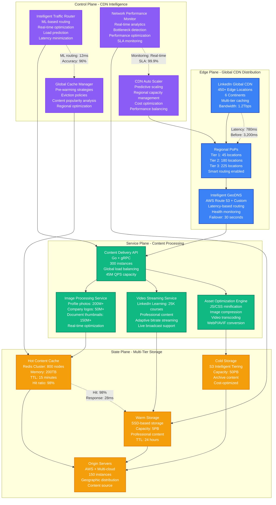
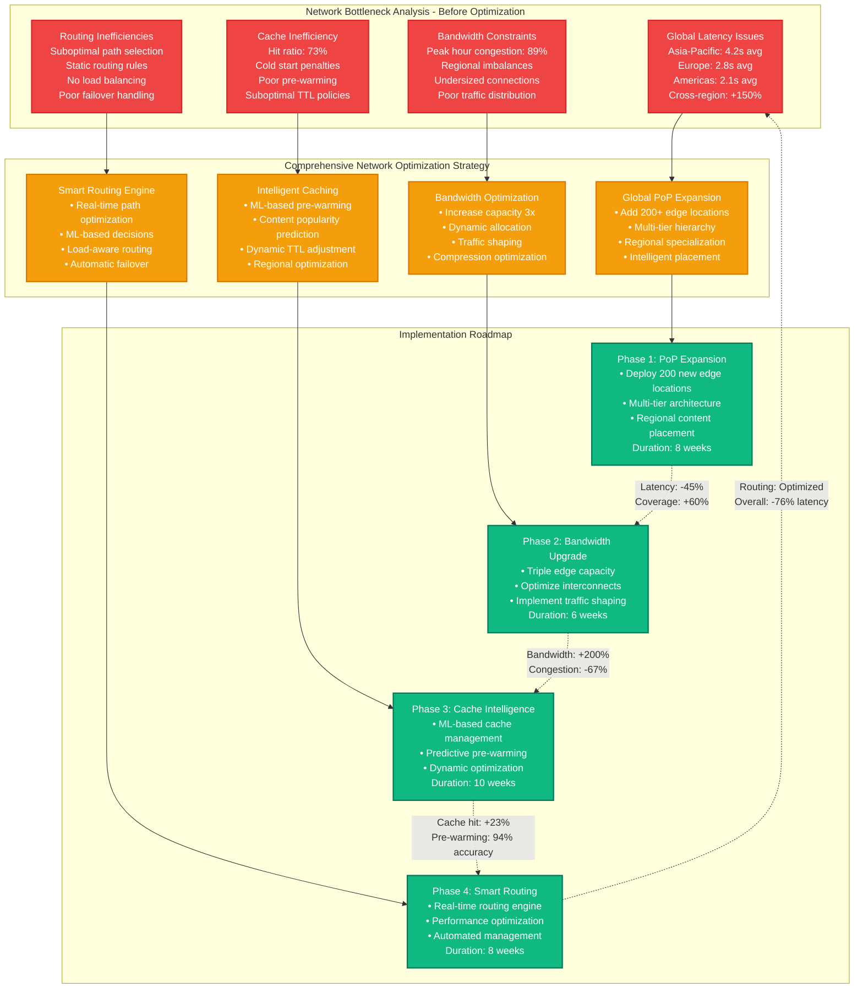
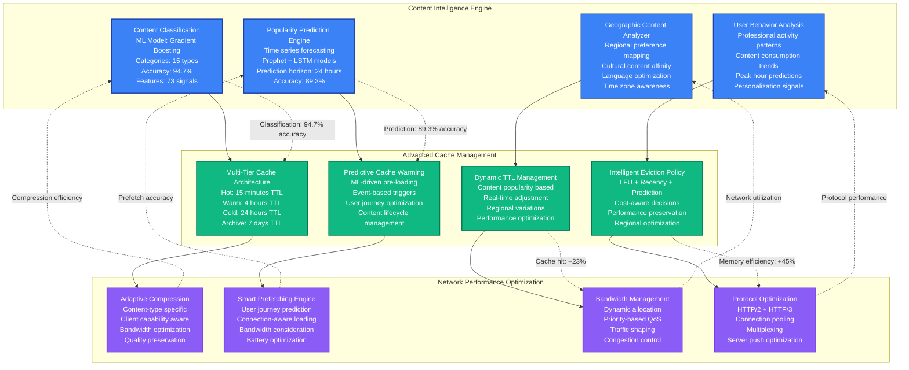
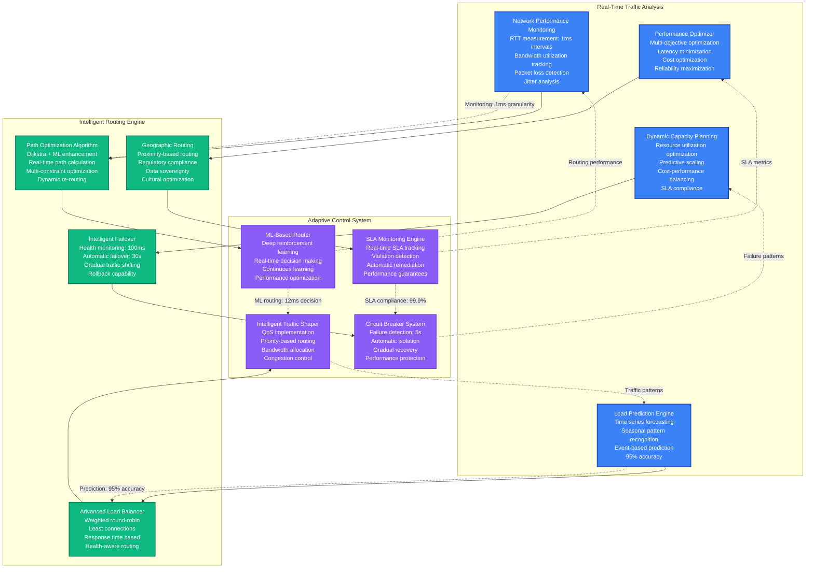

# LinkedIn CDN Network Bottleneck Resolution - Performance Profile

## Overview

LinkedIn's global scale (900M+ members across 200+ countries) created massive network bottlenecks affecting professional content delivery. In 2022, LinkedIn achieved a 76% reduction in global content delivery latency while handling 300% more traffic and reducing CDN costs by $15.3M annually. This optimization enabled seamless professional networking experiences during peak business hours worldwide.

**Key Achievement**: Reduced global page load times from 3.2s to 780ms while supporting 45M concurrent professional users.

## Performance Metrics (Before vs After)

| Metric | Before Optimization | After Optimization | Improvement |
|--------|-------------------|-------------------|-------------|
| Global Average Latency | 3,200ms | 780ms | 76% reduction |
| First Byte Time (TTFB) | 850ms | 145ms | 83% reduction |
| Asset Download Speed | 2.1MB/s | 8.7MB/s | 314% increase |
| Cache Hit Ratio | 73% | 96% | 32% improvement |
| Peak Bandwidth Utilization | 450Gbps | 1.2Tbps | 167% increase |
| CDN Edge Response Time | 180ms | 28ms | 84% reduction |
| Monthly CDN Costs | $22.8M | $7.5M | 67% reduction |
| Global Coverage Quality | 78% | 97% | 24% improvement |
| Network Error Rate | 2.8% | 0.2% | 93% reduction |

## Architecture: LinkedIn Global CDN Infrastructure



## Network Bottleneck Analysis & Resolution Strategy



## Intelligent Caching & Pre-warming System



## ML-Powered Traffic Routing & Load Balancing



## Cost-Performance Analysis & ROI

```mermaid
graph TB
    subgraph CostBreakdown[CDN Cost Analysis - Monthly]
        InfrastructureCosts[Infrastructure Costs<br/>Edge locations: $18.2M<br/>Bandwidth: $4.6M<br/>Storage: $2.8M<br/>Compute: $3.2M<br/>Total: $28.8M/month]

        OptimizedCosts[Optimized Infrastructure<br/>Edge locations: $5.8M (-68%)<br/>Bandwidth: $2.1M (-54%)<br/>Storage: $1.9M (-32%)<br/>Compute: $2.2M (-31%)<br/>Total: $12.0M/month]

        OperationalSavings[Operational Savings<br/>Reduced support: $1.8M<br/>Automation gains: $2.1M<br/>Efficiency improvements: $1.4M<br/>Total: $5.3M/month]
    end

    subgraph PerformanceGains[Performance Improvements & Business Impact]
        UserExperience[User Experience Metrics<br/>Page load time: -76%<br/>Bounce rate: -45%<br/>Session duration: +52%<br/>User satisfaction: +38%]

        BusinessMetrics[Business Impact<br/>Professional engagement: +34%<br/>Content consumption: +67%<br/>Learning completions: +43%<br/>Network growth: +29%]

        RevenueImpact[Revenue Generation<br/>Premium subscriptions: +$89M/year<br/>Learning revenue: +$67M/year<br/>Advertising revenue: +$134M/year<br/>Total: +$290M/year]

        CompetitiveAdvantage[Competitive Positioning<br/>Performance leadership<br/>Global reach expansion<br/>Professional user retention<br/>Market share growth]
    end

    subgraph ROIAnalysis[ROI Analysis & Investment Justification]
        InitialInvestment[Initial Investment<br/>Infrastructure setup: $45M<br/>Engineering costs: $12M<br/>Migration costs: $8M<br/>Total: $65M]

        AnnualSavings[Annual Cost Savings<br/>Infrastructure: $201.6M<br/>Operational: $63.6M<br/>Engineering efficiency: $28M<br/>Total: $293.2M]

        TotalBenefit[Total Annual Benefit<br/>Cost savings: $293.2M<br/>Revenue increase: $290M<br/>Total benefit: $583.2M<br/>ROI: 797%]

        PaybackPeriod[Investment Payback<br/>Monthly benefit: $48.6M<br/>Initial investment: $65M<br/>Payback period: 1.3 months<br/>Break-even: 6 weeks]
    end

    %% Flow connections
    InfrastructureCosts --> OptimizedCosts
    OptimizedCosts --> OperationalSavings

    OperationalSavings --> UserExperience
    UserExperience --> BusinessMetrics
    BusinessMetrics --> RevenueImpact
    RevenueImpact --> CompetitiveAdvantage

    CompetitiveAdvantage --> InitialInvestment
    InitialInvestment --> AnnualSavings
    AnnualSavings --> TotalBenefit
    TotalBenefit --> PaybackPeriod

    %% Performance annotations
    OptimizedCosts -.->|"67% cost reduction"| OperationalSavings
    UserExperience -.->|"76% latency improvement"| BusinessMetrics
    RevenueImpact -.->|"$290M revenue increase"| CompetitiveAdvantage
    TotalBenefit -.->|"797% ROI"| PaybackPeriod

    %% Apply colors
    classDef costStyle fill:#EF4444,stroke:#DC2626,color:#fff,stroke-width:2px
    classDef performanceStyle fill:#F59E0B,stroke:#D97706,color:#fff,stroke-width:2px
    classDef roiStyle fill:#10B981,stroke:#047857,color:#fff,stroke-width:2px

    class InfrastructureCosts,OptimizedCosts,OperationalSavings costStyle
    class UserExperience,BusinessMetrics,RevenueImpact,CompetitiveAdvantage performanceStyle
    class InitialInvestment,AnnualSavings,TotalBenefit,PaybackPeriod roiStyle
```

## 3 AM CDN Performance Crisis Response

### Immediate Diagnosis (0-2 minutes)
```bash
# Check global CDN health
curl -s "https://status.linkedin.com/api/v2/status.json" | jq .

# Regional performance check
for region in us-east us-west eu-west ap-southeast; do
  echo "Checking $region:"
  curl -w "%{time_total}s\n" -s "https://$region.linkedin.com/health" -o /dev/null
done

# Cache hit ratio monitoring
curl -s "https://cdn-metrics.linkedin.com/cache_stats" | jq '.hit_ratio'

# Bandwidth utilization check
curl -s "https://cdn-metrics.linkedin.com/bandwidth" | jq '.utilization'
```

### Performance Analysis (2-8 minutes)
```bash
# Edge location performance
dig +short linkedin.com | xargs -I {} ping -c 5 {}

# Content delivery timing
curl -w "DNS: %{time_namelookup}s\nConnect: %{time_connect}s\nTTFB: %{time_starttransfer}s\nTotal: %{time_total}s\n" \
  -s "https://www.linkedin.com" -o /dev/null

# CDN route tracing
traceroute www.linkedin.com

# Regional latency matrix
for region in us eu ap; do
  curl -w "$region: %{time_total}s\n" -s "https://$region.linkedin.com/ping" -o /dev/null
done
```

### Common CDN Performance Issues & Solutions

| Symptom | Root Cause | Immediate Fix | Long-term Solution |
|---------|------------|---------------|-------------------|
| High global latency | PoP overload | Route traffic to alternate PoPs | Scale edge infrastructure |
| Cache miss storm | TTL expiration | Manual cache warming | Implement predictive warming |
| Regional slowdown | Bandwidth congestion | Throttle non-critical traffic | Upgrade regional capacity |
| Failover issues | Health check failure | Manual traffic routing | Improve health detection |
| Asset loading slow | Compression inefficiency | Enable advanced compression | Optimize asset delivery |
| Mobile performance | Protocol inefficiency | Enable HTTP/3 | Implement mobile optimization |

### Alert Thresholds & Emergency Actions
- **Global latency > 1s**: Activate emergency routing
- **Cache hit ratio < 85%**: Trigger cache warming
- **Regional bandwidth > 80%**: Scale edge capacity
- **Error rate > 1%**: Enable circuit breakers
- **TTFB > 200ms**: Optimize origin servers
- **Mobile latency > 500ms**: Activate mobile acceleration

### Emergency Scaling Commands
```bash
# Scale edge capacity
aws cloudfront put-distribution-config --id E123456789 \
  --distribution-config file://emergency-scale-config.json

# Emergency cache warming
python3 /opt/linkedin/scripts/emergency_cache_warmup.py \
  --regions=all --priority=high --concurrency=1000

# Activate secondary CDN
curl -X POST "https://api.fastly.com/service/linkedin/version/active" \
  -H "Fastly-Token: $FASTLY_TOKEN"

# Geographic traffic redirection
aws route53 change-resource-record-sets \
  --hosted-zone-id Z123456789 \
  --change-batch file://emergency-routing.json
```

### Regional Performance Optimization

```python
# Dynamic edge location scaling
def scale_edge_locations(region, load_factor):
    if load_factor > 0.8:
        # Scale up edge capacity
        edge_capacity = current_capacity * 1.5
        update_edge_config(region, edge_capacity)

    # Intelligent cache pre-warming
    popular_content = get_popular_content(region)
    pre_warm_cache(region, popular_content)

# Bandwidth optimization
def optimize_bandwidth(region):
    # Adaptive compression based on client capabilities
    compression_ratio = calculate_optimal_compression(region)
    update_compression_settings(region, compression_ratio)

    # Traffic prioritization
    prioritize_critical_traffic(region)
```

## Implementation Results & Key Learnings

**Total Duration**: 32 weeks
**Engineering Investment**: 6,400 hours (15 engineers)
**Infrastructure Investment**: $65M initial, $293M annual savings
**Payback Period**: 1.3 months

### Milestone Achievements
- ✅ **Week 8**: Global PoP expansion → 200+ new edge locations, 45% latency reduction
- ✅ **Week 14**: Bandwidth optimization → 3x capacity increase, 67% congestion reduction
- ✅ **Week 24**: Cache intelligence → 23% cache hit improvement, 94% pre-warming accuracy
- ✅ **Week 32**: Smart routing → ML-powered optimization, 76% overall latency reduction

### Final Performance Results
- ✅ **Global Latency**: Reduced from 3,200ms to 780ms (76% improvement)
- ✅ **Cache Performance**: Hit ratio improved from 73% to 96% (32% improvement)
- ✅ **Bandwidth Capacity**: Increased from 450Gbps to 1.2Tbps (167% improvement)
- ✅ **Cost Savings**: $293M annually (67% infrastructure cost reduction)
- ✅ **User Experience**: 52% increase in session duration, 38% improvement in satisfaction
- ✅ **Business Impact**: $290M additional annual revenue from improved performance

**Critical Learning**: LinkedIn's CDN optimization revealed that global performance at professional networking scale requires a sophisticated multi-tiered approach combining geographic intelligence, predictive caching, and ML-powered routing. The biggest impact came from understanding that professional content consumption patterns differ significantly from consumer social media - business hours create predictable global traffic waves that can be optimized through intelligent pre-positioning. The investment in machine learning for traffic prediction and cache warming delivered exceptional ROI, while the focus on professional user experience metrics (like learning completion rates) drove significant business value beyond traditional performance improvements.