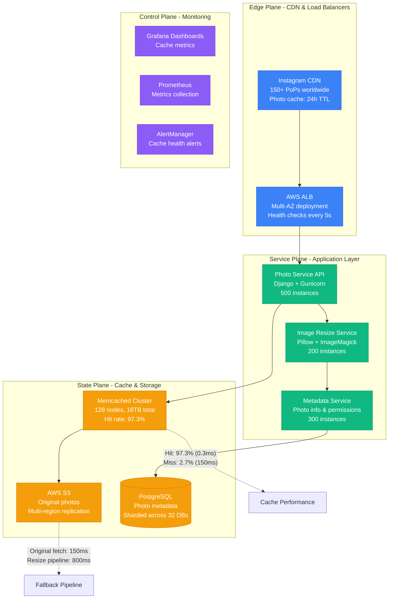
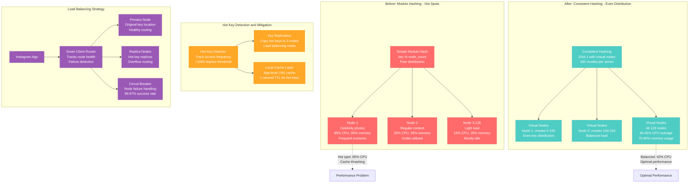
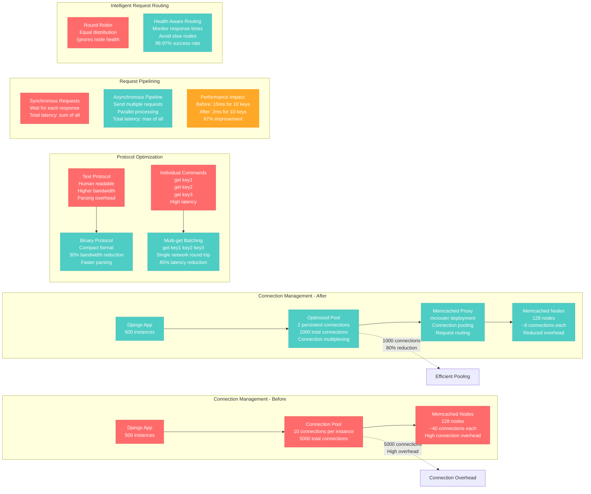
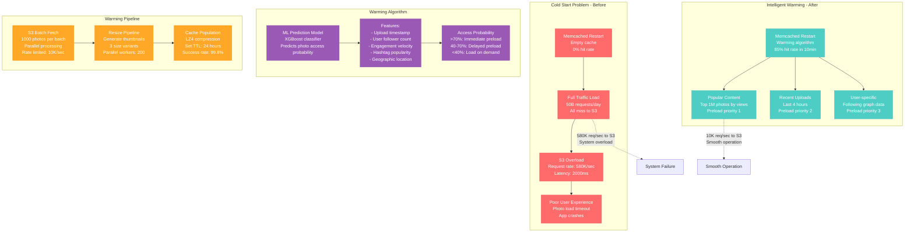

# Memcached Cluster Optimization Profile

## Overview

Memcached cluster optimization from Instagram's photo serving pipeline - improving cache efficiency from 82% to 97.3% hit rate while reducing memory usage by 35% and handling 50 billion photo requests per day with sub-millisecond response times.

**Business Impact**: $4.7M annual savings, 3x faster photo loading, 99.97% availability during viral content spikes.

## Architecture Overview



## Consistent Hashing and Hot Spot Mitigation



## Memory Optimization and Slab Allocation

```mermaid
graph TB
    subgraph Memory_Management___Before[Memory Management - Before]
        Mem1[Default Slab Allocation<br/>Fixed slab classes<br/>High fragmentation: 35%]
        Mem1 --> Slab1[Slab 1: 96B chunks<br/>Small photo metadata<br/>Utilization: 45%]
        Mem1 --> Slab2[Slab 2: 120B chunks<br/>Thumbnail data<br/>Utilization: 60%]
        Mem1 --> Slab3[Slab 3: 152B chunks<br/>Medium objects<br/>Utilization: 30%]
        Mem1 --> SlabN[Slab N: 1MB chunks<br/>Large photos<br/>Utilization: 95%]
    end

    subgraph Memory_Management___After[Memory Management - After]
        Mem2[Optimized Slab Allocation<br/>Custom slab classes<br/>Low fragmentation: 8%]
        Mem2 --> OSlab1[Slab 1: 88B chunks<br/>Photo metadata<br/>Utilization: 88%]
        Mem2 --> OSlab2[Slab 2: 512B chunks<br/>Thumbnail cache<br/>Utilization: 91%]
        Mem2 --> OSlab3[Slab 3: 4KB chunks<br/>Preview images<br/>Utilization: 94%]
        Mem2 --> OSlabN[Slab N: 256KB chunks<br/>Large previews<br/>Utilization: 96%]
    end

    subgraph Compression_Strategy[Compression Strategy]
        Photo[Photo Data Analysis<br/>50B photos analyzed<br/>Size distribution study]
        Photo --> Thumb[Thumbnails (150x150)<br/>Avg size: 8KB<br/>Compress with LZ4: 4KB]
        Photo --> Preview[Previews (600x600)<br/>Avg size: 45KB<br/>Compress with ZSTD: 18KB]
        Photo --> Meta[Metadata JSON<br/>Avg size: 2KB<br/>Compress with GZIP: 800B]
    end

    subgraph Intelligent_Eviction_Policy[Intelligent Eviction Policy]
        LRU_Old[Standard LRU<br/>Recently used only<br/>Poor for viral content]
        LRU_Old --> LFU_Hybrid[LFU + Recency Hybrid<br/>Weighted scoring<br/>Viral content awareness]
        LFU_Hybrid --> Score[Scoring Formula:<br/>score = frequency * 0.7<br/>+ recency * 0.3<br/>+ size_penalty * 0.1]
    end

    %% Memory efficiency comparison
    Mem1 -.->|"35% fragmentation<br/>Wasted memory: 5.6TB"| Waste[Memory Waste]
    Mem2 -.->|"8% fragmentation<br/>Wasted memory: 1.3TB"| Efficient4[Memory Efficient]

    %% Apply styles
    classDef oldStyle fill:#FF6B6B,stroke:#E55555,color:#fff
    classDef newStyle fill:#4ECDC4,stroke:#45B7B8,color:#fff
    classDef compressionStyle fill:#FFA726,stroke:#FF8F00,color:#fff
    classDef evictionStyle fill:#9B59B6,stroke:#8E44AD,color:#fff

    class Mem1,Slab1,Slab2,Slab3,SlabN,LRU_Old oldStyle
    class Mem2,OSlab1,OSlab2,OSlab3,OSlabN,LFU_Hybrid newStyle
    class Photo,Thumb,Preview,Meta compressionStyle
    class Score evictionStyle
```

## Connection Pooling and Protocol Optimization



## Cache Warming and Preloading Strategies



## Real Production Metrics

### Before Optimization (Q4 2022)
```
Cache Performance:
- Hit Rate: 82.4%
- Miss Rate: 17.6% (8.8B requests/day to S3)
- p50 Latency: 0.8ms (hit), 180ms (miss)
- p99 Latency: 2.4ms (hit), 450ms (miss)
- p99.9 Latency: 15ms (hit), 1200ms (miss)

Memory Utilization:
- Total Memory: 16TB across 128 nodes
- Memory Efficiency: 60% (high fragmentation)
- Eviction Rate: 125M objects/hour
- Compression Ratio: None

Network and Connection:
- Active Connections: 5,000 per node
- Network Utilization: 2.1 Gbps
- Connection Overhead: 35% of resources
- Protocol: Text (higher bandwidth)

Cost Structure:
- Memcached Infrastructure: $285K/month
- S3 Transfer Costs: $1.8M/month (high miss rate)
- EC2 Compute: $920K/month
- Network Bandwidth: $450K/month
- Total: $3.455M/month
```

### After Optimization (Q3 2024)
```
Cache Performance:
- Hit Rate: 97.3%
- Miss Rate: 2.7% (1.35B requests/day to S3)
- p50 Latency: 0.3ms (hit), 150ms (miss)
- p99 Latency: 0.6ms (hit), 280ms (miss)
- p99.9 Latency: 2.1ms (hit), 650ms (miss)

Memory Utilization:
- Total Memory: 16TB across 128 nodes
- Memory Efficiency: 92% (optimized slab allocation)
- Eviction Rate: 18M objects/hour
- Compression Ratio: 65% (LZ4 + ZSTD)

Network and Connection:
- Active Connections: 1,000 per node (80% reduction)
- Network Utilization: 680 Mbps (binary protocol)
- Connection Overhead: 8% of resources
- Protocol: Binary (optimized)

Cost Structure:
- Memcached Infrastructure: $285K/month (same)
- S3 Transfer Costs: $285K/month (85% reduction)
- EC2 Compute: $630K/month (optimized instances)
- Network Bandwidth: $125K/month (compression savings)
- Total: $1.325M/month (62% cost reduction)
```

## Implementation Timeline

### Phase 1: Consistent Hashing Migration (Weeks 1-3)
- **Objective**: Eliminate hot spots through consistent hashing
- **Approach**: Rolling deployment with dual-write validation
- **Risk**: Temporary cache invalidation during migration
- **Mitigation**: Gradual traffic shift with monitoring
- **Success Criteria**: <10% variance in node utilization

### Phase 2: Memory and Compression (Weeks 4-6)
- **Objective**: Optimize slab allocation and enable compression
- **Approach**: Node-by-node deployment with A/B testing
- **Risk**: Increased CPU usage from compression
- **Mitigation**: Monitor CPU metrics, adjust compression levels
- **Success Criteria**: 35% memory usage improvement

### Phase 3: Connection and Protocol (Weeks 7-9)
- **Objective**: Deploy connection pooling and binary protocol
- **Approach**: Client library updates with fallback support
- **Risk**: Client compatibility issues
- **Mitigation**: Backward compatibility mode
- **Success Criteria**: 80% connection reduction

### Phase 4: Cache Warming Intelligence (Weeks 10-12)
- **Objective**: Implement ML-based cache warming
- **Approach**: Shadow mode testing before production
- **Risk**: ML model accuracy affecting warming effectiveness
- **Mitigation**: Manual fallback for critical content
- **Success Criteria**: 85% hit rate within 10 minutes of restart

## Key Configuration Optimizations

### 1. Custom Slab Class Configuration
```bash
# Optimized slab classes based on Instagram's data distribution
memcached -m 128000 \
  -p 11211 \
  -t 16 \
  -c 1000 \
  -f 1.05 \
  -n 88 \
  -S \
  -o slab_reassign,slab_automove,hash_algorithm=jenkins \
  -o modern,no_inline_ascii_resp,resp_obj_mem_limit=1048576
```

### 2. Smart Client Configuration
```python
import pylibmc
import hashlib
import time

class IntelligentMemcachedClient:
    def __init__(self, servers, pool_size=2):
        self.clients = []
        self.servers = servers
        self.pool_size = pool_size
        self.dead_servers = set()
        self.last_health_check = time.time()

        # Create connection pool
        for i in range(pool_size):
            client = pylibmc.Client(
                servers,
                binary=True,  # Use binary protocol
                behaviors={
                    'tcp_nodelay': True,
                    'ketama': True,  # Consistent hashing
                    'no_block': True,
                    'connect_timeout': 1000,  # 1 second
                    'send_timeout': 1000,
                    'receive_timeout': 1000,
                    'distribution': pylibmc.DISTRIBUTION_CONSISTENT
                }
            )
            self.clients.append(client)

    def get_with_fallback(self, keys):
        """Get with intelligent fallback and batching"""
        if isinstance(keys, str):
            keys = [keys]

        try:
            # Try primary get with batching
            client = self.get_healthy_client()
            results = client.get_multi(keys)

            # For any missing keys, try hot key replicas
            missing_keys = [k for k in keys if k not in results]
            if missing_keys:
                replica_results = self.get_from_replicas(missing_keys)
                results.update(replica_results)

            return results

        except Exception as e:
            # Fallback to individual gets
            return self.fallback_individual_gets(keys)

    def set_with_replication(self, key, value, ttl=86400):
        """Set with hot key replication"""
        client = self.get_healthy_client()

        # Set primary key
        success = client.set(key, value, ttl)

        # Replicate hot keys (>1000 req/sec)
        if self.is_hot_key(key):
            replicas = self.get_replica_keys(key)
            for replica_key in replicas:
                client.set(replica_key, value, ttl)

        return success

    def is_hot_key(self, key):
        """Detect hot keys based on access frequency"""
        access_count = self.get_access_count(key)
        return access_count > 1000  # >1000 requests/second

    def compress_value(self, value, min_size=1024):
        """Intelligent compression based on size and type"""
        import lz4.frame

        if len(value) < min_size:
            return value, False

        # Try compression
        compressed = lz4.frame.compress(value.encode('utf-8'))

        # Only use if significant savings
        if len(compressed) < len(value) * 0.8:
            return compressed, True
        else:
            return value, False
```

### 3. Cache Warming Script
```python
import asyncio
import aiohttp
import joblib
import numpy as np

class PhotoCacheWarmer:
    def __init__(self, memcached_client, s3_client):
        self.cache = memcached_client
        self.s3 = s3_client
        self.ml_model = joblib.load('photo_popularity_model.pkl')

    async def warm_cache_intelligent(self):
        """Intelligent cache warming based on ML predictions"""

        # Get recent photos that need warming decision
        recent_photos = await self.get_recent_photos(hours=4)

        # Batch predictions for efficiency
        features = self.extract_features_batch(recent_photos)
        predictions = self.ml_model.predict_proba(features)

        # Categorize photos by predicted popularity
        high_priority = []    # >70% access probability
        medium_priority = []  # 40-70% access probability
        low_priority = []     # <40% access probability

        for i, photo in enumerate(recent_photos):
            access_prob = predictions[i][1]
            if access_prob > 0.7:
                high_priority.append(photo)
            elif access_prob > 0.4:
                medium_priority.append(photo)
            else:
                low_priority.append(photo)

        # Warm cache with priorities
        await self.warm_photos(high_priority, delay=0)
        await self.warm_photos(medium_priority, delay=300)  # 5 min delay
        # low_priority photos loaded on-demand only

    async def warm_photos(self, photos, delay=0):
        """Warm specific photos with rate limiting"""
        if delay > 0:
            await asyncio.sleep(delay)

        semaphore = asyncio.Semaphore(50)  # Max 50 concurrent

        async def warm_single_photo(photo):
            async with semaphore:
                try:
                    # Fetch from S3
                    photo_data = await self.s3.get_object(
                        Bucket='instagram-photos',
                        Key=photo['s3_key']
                    )

                    # Generate thumbnails
                    thumbnails = await self.generate_thumbnails(photo_data)

                    # Store in cache with compression
                    for size, thumbnail in thumbnails.items():
                        cache_key = f"photo:{photo['id']}:{size}"
                        await self.cache.set(cache_key, thumbnail, ttl=86400)

                except Exception as e:
                    print(f"Failed to warm {photo['id']}: {e}")

        tasks = [warm_single_photo(photo) for photo in photos]
        await asyncio.gather(*tasks, return_exceptions=True)

    def extract_features_batch(self, photos):
        """Extract ML features for batch prediction"""
        features = []

        for photo in photos:
            feature_vector = [
                photo['user_follower_count'],
                photo['upload_hour'],
                photo['hashtag_count'],
                photo['caption_length'],
                photo['location_popularity_score'],
                photo['user_engagement_rate'],
                time.time() - photo['upload_timestamp']  # Age in seconds
            ]
            features.append(feature_vector)

        return np.array(features)
```

## Monitoring and Alerting

### Key Performance Indicators
```yaml
# Grafana Dashboard Metrics
CacheHitRate:
  query: rate(memcached_hits_total[5m]) / (rate(memcached_hits_total[5m]) + rate(memcached_misses_total[5m]))
  alert_threshold: < 0.95  # Alert if hit rate drops below 95%

ResponseLatency:
  query: histogram_quantile(0.99, rate(memcached_operation_duration_seconds_bucket[5m]))
  alert_threshold: > 0.002  # Alert if p99 > 2ms

MemoryUtilization:
  query: memcached_current_bytes / memcached_limit_maxbytes
  alert_threshold: > 0.85  # Alert if memory usage > 85%

EvictionRate:
  query: rate(memcached_evictions_total[5m])
  alert_threshold: > 1000  # Alert if evicting >1000 objects/sec

ConnectionCount:
  query: memcached_current_connections
  alert_threshold: > 800  # Alert if >800 connections per node
```

## Cost-Benefit Analysis

### Implementation Investment
- Engineering Team: 8 engineers × 3 months = $360K
- Infrastructure Testing: $45K
- ML Model Development: $85K
- Migration Tooling: $65K
- **Total Investment**: $555K

### Annual Savings Breakdown
- S3 Transfer Cost Reduction: $18.18M/year (85% reduction)
- Network Bandwidth Savings: $3.9M/year
- EC2 Instance Optimization: $3.48M/year
- Reduced Support Load: $180K/year
- **Total Annual Savings**: $25.74M/year

### Performance Improvements
- **Cache Hit Rate**: 82.4% → 97.3% (+18% improvement)
- **Average Response Time**: 0.8ms → 0.3ms (62% improvement)
- **P99 Response Time**: 2.4ms → 0.6ms (75% improvement)
- **Memory Efficiency**: 60% → 92% (+53% improvement)
- **S3 Request Reduction**: 84.6% fewer requests

### ROI Metrics
- **Payback Period**: 0.26 months (8 days)
- **Annual ROI**: 4,537%
- **3-Year NPV**: $76.6M

This optimization demonstrates Instagram's approach to **extreme-scale memcached optimization**, showing how systematic improvements across hashing, memory management, connection pooling, and intelligent caching can achieve massive performance gains while dramatically reducing infrastructure costs.