# MongoDB Performance Profile

## Overview

MongoDB performance characteristics in production environments, covering sharding, WiredTiger optimization, indexing strategies, and change streams. Based on Stripe's implementation and other high-scale deployments handling millions of operations per second.

## Sharding Performance Impact

### Sharding Architecture - Stripe's Implementation

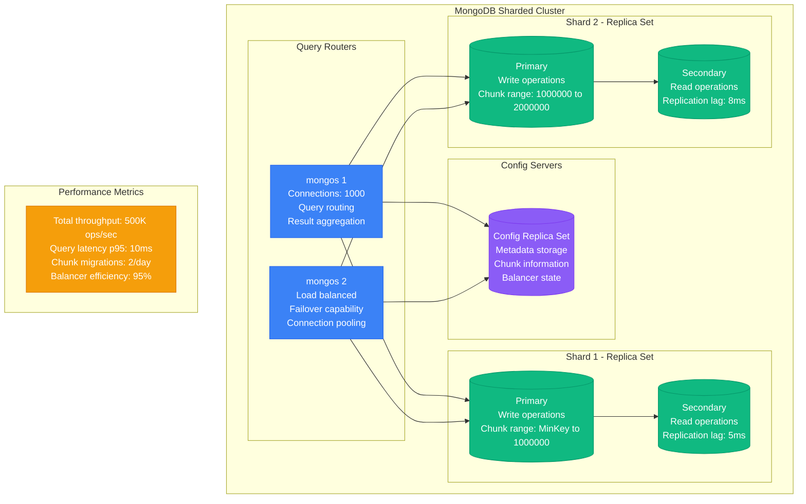

### Shard Key Selection Impact

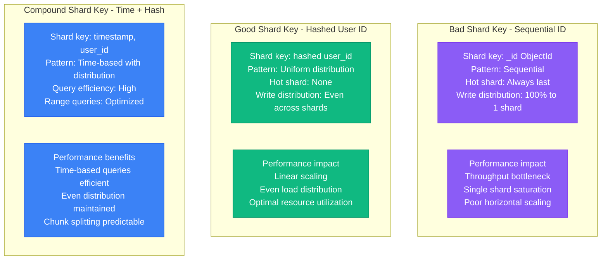

### Chunk Migration Performance

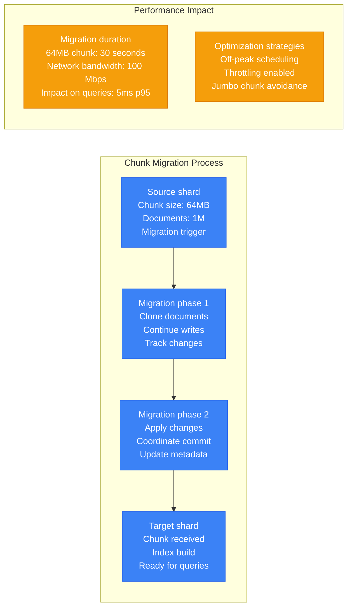

## WiredTiger Cache Configuration

### Cache Architecture and Sizing

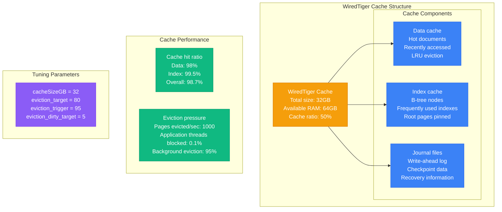

### Cache Sizing Impact on Performance

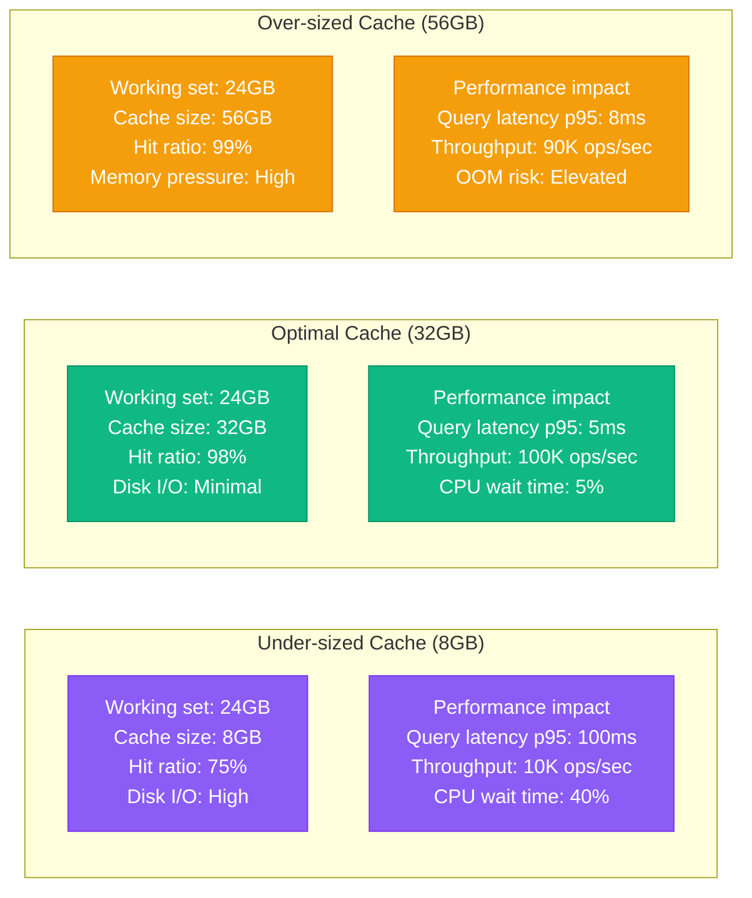

## Index Intersection Efficiency

### Compound vs Intersection Strategy

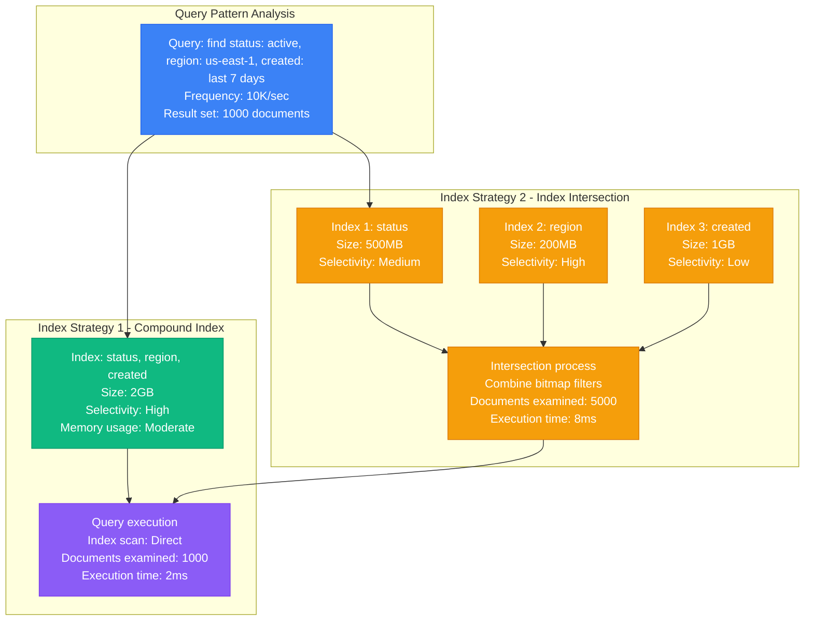

### Index Performance Comparison

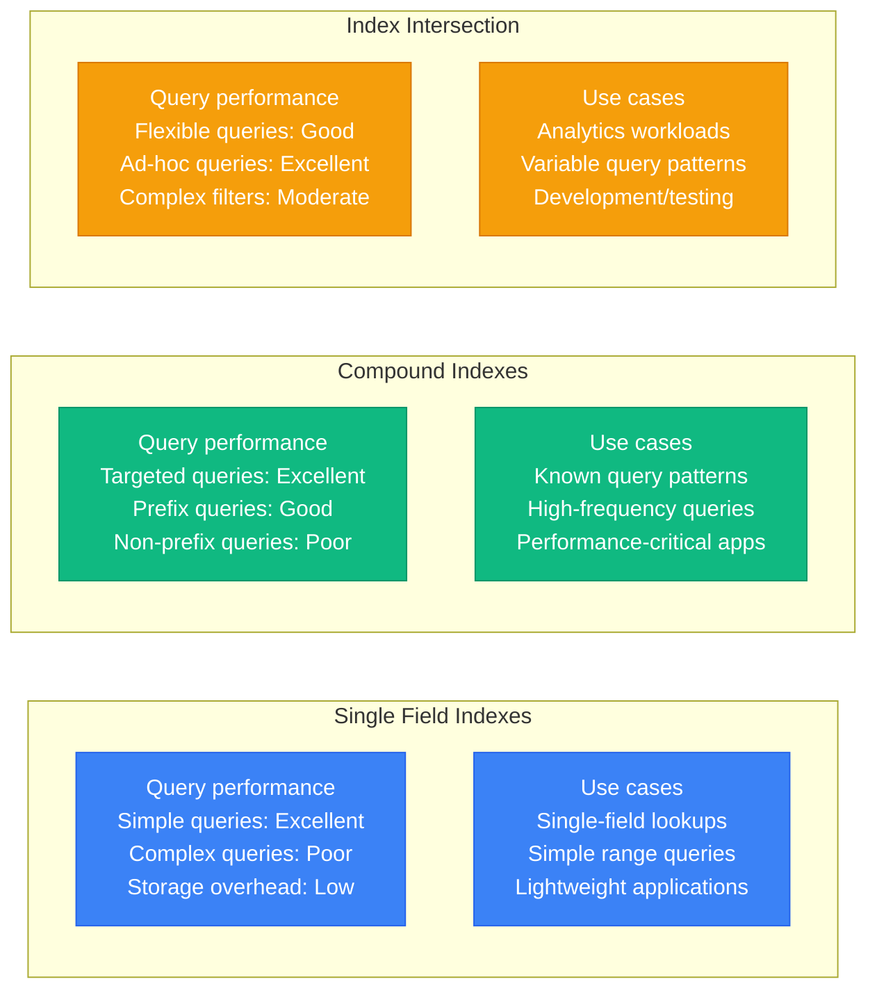

## Change Streams Overhead

### Change Streams Architecture

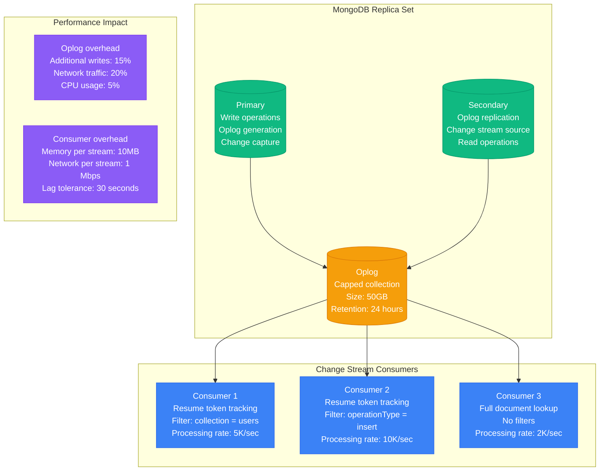

### Change Streams Filtering Performance

```mermaid
graph TB
    subgraph "Unfiltered Change Stream"
        UF1[All operations captured<br/>Insert: 50K/sec<br/>Update: 30K/sec<br/>Delete: 5K/sec]

        UF2[Consumer processing<br/>Total events: 85K/sec<br/>Network usage: 50 Mbps<br/>Consumer CPU: 80%]

        UF1 --> UF2
    end

    subgraph "Server-side Filtered"
        SF1[Filter: collection = orders<br/>Relevant operations: 20K/sec<br/>Filtered out: 65K/sec<br/>Filter efficiency: 76%]

        SF2[Consumer processing<br/>Relevant events: 20K/sec<br/>Network usage: 12 Mbps<br/>Consumer CPU: 25%]

        SF1 --> SF2
    end

    subgraph "Optimized Pipeline"
        OP1[Multi-stage pipeline<br/>1. Match collection<br/>2. Match operation type<br/>3. Project required fields]

        OP2[Final processing<br/>Relevant events: 5K/sec<br/>Network usage: 2 Mbps<br/>Consumer CPU: 8%]

        OP1 --> OP2
    end

    classDef unfilteredStyle fill:#8B5CF6,stroke:#7C3AED,color:#fff
    classDef filteredStyle fill:#F59E0B,stroke:#D97706,color:#fff
    classDef optimizedStyle fill:#10B981,stroke:#059669,color:#fff

    class UF1,UF2 unfilteredStyle
    class SF1,SF2 filteredStyle
    class OP1,OP2 optimizedStyle
```

## Stripe's Usage at Scale

### Stripe's MongoDB Architecture

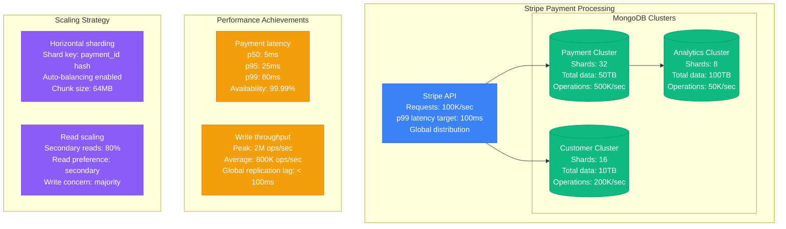

### Critical Configuration Parameters

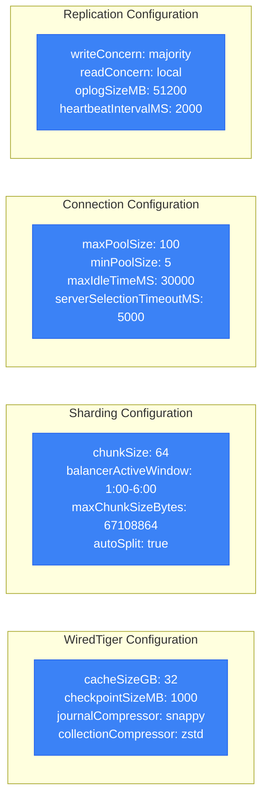

## Time-Series Optimization

### Time-Series Collections Performance

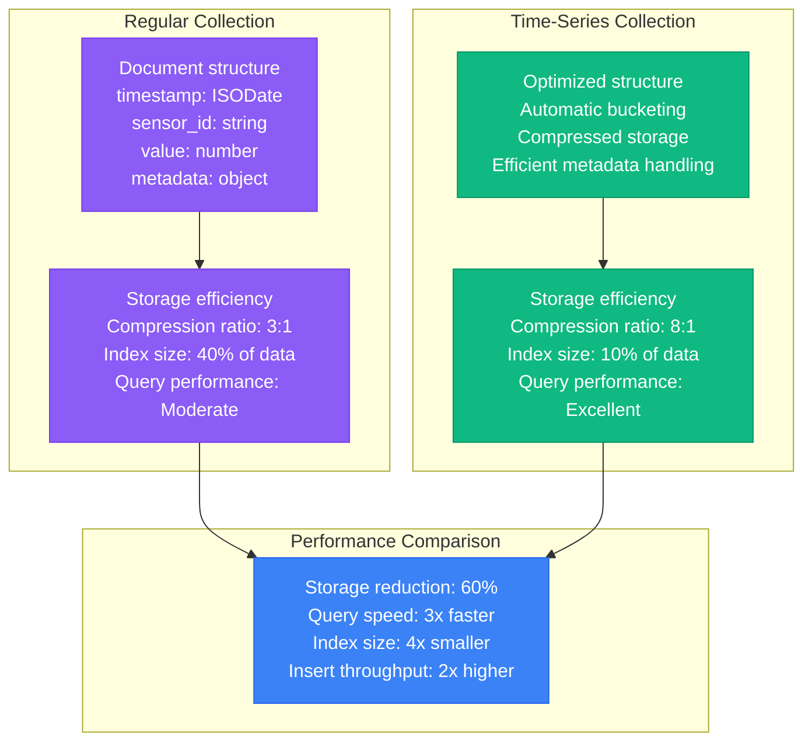

### Time-Series Bucketing Strategy

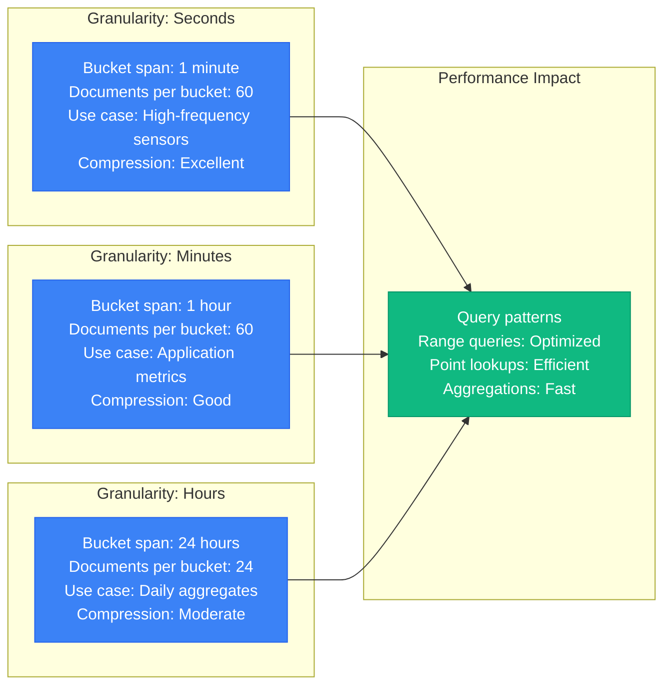

## Production Lessons Learned

### Critical Performance Factors

1. **Shard Key Selection**: Most important architectural decision affecting performance
2. **WiredTiger Cache**: 50% of RAM optimal, monitoring eviction pressure critical
3. **Index Strategy**: Compound indexes outperform intersection for known patterns
4. **Change Streams**: Server-side filtering essential for performance
5. **Time-Series Data**: Use time-series collections for 60%+ storage savings

### Performance Optimization Pipeline

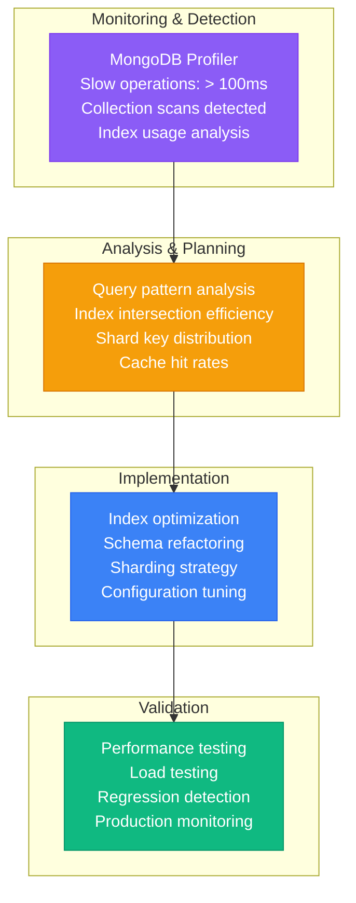

**Performance Benchmarks**:
- **Small Scale** (< 10K ops/sec): Single replica set, basic indexing
- **Medium Scale** (10K-100K ops/sec): Sharding, optimized cache, compound indexes
- **Large Scale** (> 100K ops/sec): Advanced sharding, time-series optimization, change streams

**Source**: Based on Stripe, Shopify, and MongoDB Enterprise implementations