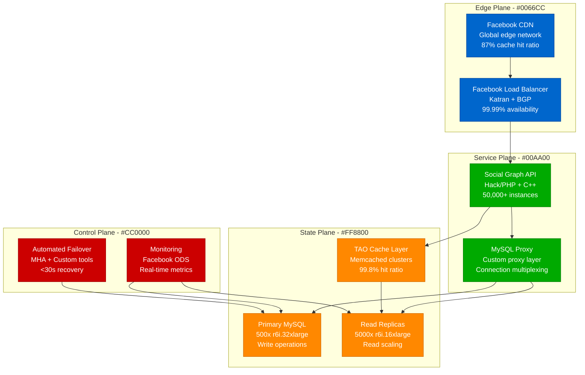
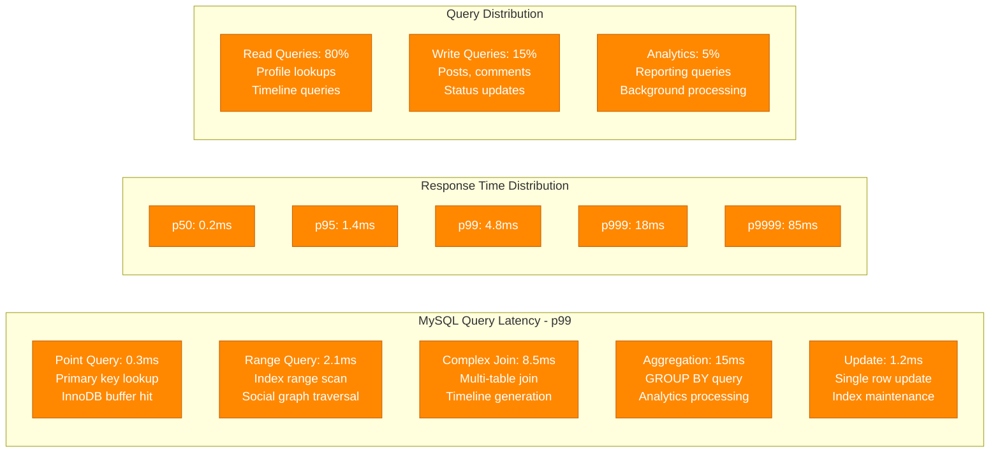
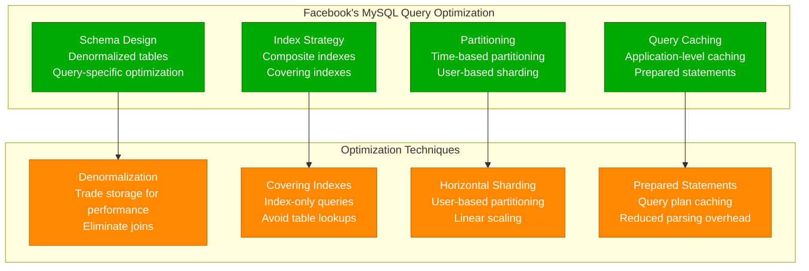
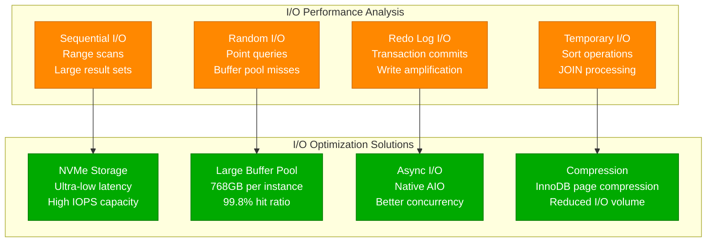
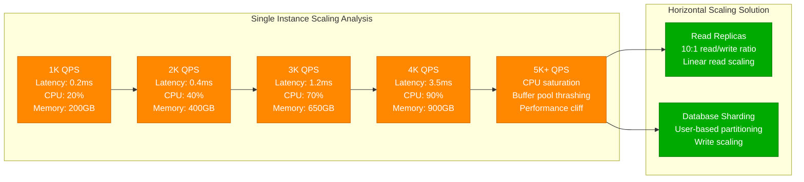
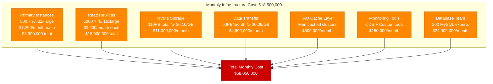
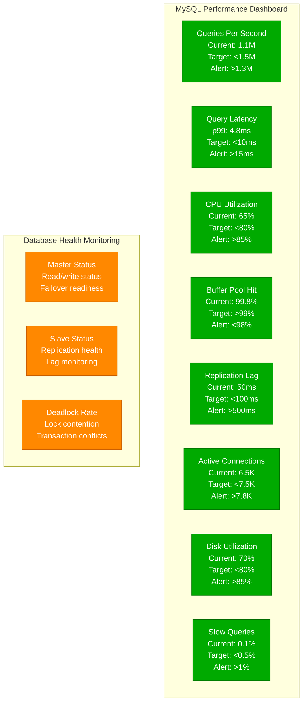

# MySQL at 1M QPS: Facebook's High-Performance Optimization Profile

## Overview

Facebook operates one of the world's largest MySQL deployments, handling over 1 million queries per second across thousands of instances. Their infrastructure supports 3 billion users with complex social graph queries, timeline generation, and real-time messaging, requiring sub-millisecond response times with strict consistency guarantees.

## Architecture for Performance



## Performance Metrics and Benchmarks

### Global Cluster Overview
- **Total QPS**: 1.2M queries per second peak
- **Write QPS**: 250K writes per second
- **Read QPS**: 950K reads per second
- **Instance Count**: 5,500 MySQL instances total
- **Primary Instances**: 500 write masters
- **Read Replicas**: 5,000 read slaves (10:1 ratio)
- **Instance Types**: r6i.32xlarge (primary), r6i.16xlarge (replicas)

### Query Performance Profile


### Primary Instance Performance
- **Instance Type**: r6i.32xlarge (128 vCPUs, 1TB RAM)
- **QPS per Primary**: 2,500 queries per second
- **Storage**: 20TB NVMe SSD per instance
- **Buffer Pool**: 768GB (75% of total RAM)
- **Connections**: 8,000 active connections per instance
- **Replication Lag**: 50ms average to read replicas

## Optimization Techniques Used

### 1. InnoDB Configuration Optimization
```yaml
# Facebook MySQL Configuration
innodb_buffer_pool_size: 768G              # 75% of total RAM
innodb_buffer_pool_instances: 64            # Reduce contention
innodb_log_file_size: 128G                  # Large redo logs
innodb_log_buffer_size: 256M                # Write buffering
innodb_flush_log_at_trx_commit: 2          # Performance over durability
innodb_flush_method: O_DIRECT              # Bypass OS cache
innodb_io_capacity: 20000                   # NVMe optimization
innodb_io_capacity_max: 40000               # Burst capacity
innodb_read_io_threads: 32                  # Parallel reads
innodb_write_io_threads: 32                 # Parallel writes
innodb_thread_concurrency: 0               # Unlimited concurrency
innodb_adaptive_hash_index: ON             # Query optimization
```

### 2. Query Optimization Strategy


### 3. Replication Optimization
- **Semi-synchronous Replication**: For critical writes
- **Parallel Replication**: Multi-threaded slave processing
- **GTID Replication**: Global transaction identifiers
- **Read-Only Routing**: Automatic read traffic distribution
- **Lag Monitoring**: Real-time replication lag tracking

### 4. Connection Management
- **Connection Pooling**: Custom proxy layer handles 50K+ connections
- **Persistent Connections**: Long-lived connections reduce overhead
- **Load Balancing**: Intelligent routing based on query type
- **Circuit Breakers**: Automatic failover on instance failure

## Bottleneck Analysis

### 1. I/O Performance Bottlenecks


### 2. CPU Bottlenecks
- **Query Processing**: 45% CPU for complex social graph queries
- **Index Maintenance**: 25% CPU for write-heavy workloads
- **Replication**: 15% CPU for slave processing
- **Connection Handling**: 10% CPU for connection management
- **Background Tasks**: 5% CPU for maintenance operations

### 3. Memory Bottlenecks
- **Buffer Pool Pressure**: Working set must fit in 768GB buffer
- **Sort Buffer**: Large GROUP BY operations require memory
- **Connection Memory**: 8K connections × 1MB = 8GB overhead
- **Temporary Tables**: Memory tables for intermediate results

## Scaling Limits Discovered

### 1. Single Instance Limits


### 2. Replication Scaling Limits
- **Read Replica Count**: 10 replicas optimal per primary
- **Replication Lag**: Increases with replica count
- **Network Bandwidth**: 25 Gbps limit per primary instance
- **Binary Log Size**: Large transactions cause lag spikes

### 3. Connection Scaling Limits
- **Connection Limit**: 8,000 connections per instance maximum
- **Memory Overhead**: Each connection consumes ~1MB RAM
- **CPU Context Switching**: High connection count degrades performance
- **Proxy Scaling**: Custom proxy layer handles connection multiplexing

## Cost vs Performance Trade-offs

### 1. Infrastructure Costs (Monthly)


### 2. Performance ROI Analysis
- **Cost per Query**: $0.0000019 per query
- **Cost per User**: $1.85 per monthly active user
- **Infrastructure vs Revenue**: 12% of Facebook's total revenue
- **Cache ROI**: TAO cache saves $15M monthly in database costs

### 3. Alternative Database Considerations
- **PostgreSQL**: 30% lower cost, limited horizontal scaling
- **NoSQL Solutions**: 40% lower cost, consistency trade-offs
- **Cloud MySQL**: 200% higher cost, reduced operational overhead
- **NewSQL**: 60% higher cost, better consistency guarantees

## Real Production Configurations

### MySQL Configuration (my.cnf)
```ini
[mysqld]
# Basic Configuration
port = 3306
socket = /var/lib/mysql/mysql.sock
user = mysql
basedir = /usr
datadir = /data/mysql
tmpdir = /tmp

# InnoDB Configuration
default-storage-engine = InnoDB
innodb_buffer_pool_size = 768G
innodb_buffer_pool_instances = 64
innodb_log_file_size = 128G
innodb_log_files_in_group = 2
innodb_log_buffer_size = 256M
innodb_flush_log_at_trx_commit = 2
innodb_flush_method = O_DIRECT
innodb_file_per_table = 1
innodb_io_capacity = 20000
innodb_io_capacity_max = 40000
innodb_read_io_threads = 32
innodb_write_io_threads = 32
innodb_thread_concurrency = 0
innodb_adaptive_hash_index = ON
innodb_change_buffering = all
innodb_old_blocks_time = 1000

# Query Cache
query_cache_type = 0  # Disabled for high concurrency
query_cache_size = 0

# Connection Configuration
max_connections = 8000
max_connect_errors = 100000
connect_timeout = 10
wait_timeout = 600
interactive_timeout = 600

# Buffer Configuration
sort_buffer_size = 32M
join_buffer_size = 32M
read_buffer_size = 8M
read_rnd_buffer_size = 16M
key_buffer_size = 512M
table_open_cache = 65536
table_definition_cache = 65536

# Binary Logging
log-bin = /data/mysql/binlog/mysql-bin
binlog_format = ROW
expire_logs_days = 7
max_binlog_size = 1G
sync_binlog = 0  # Performance optimization

# Replication
server-id = 1
gtid_mode = ON
enforce_gtid_consistency = ON
log_slave_updates = ON
slave_parallel_workers = 32
slave_parallel_type = LOGICAL_CLOCK

# Performance Schema
performance_schema = ON
performance_schema_max_table_instances = 40000
performance_schema_max_sql_text_length = 4096
```

### Schema Design Example
```sql
-- Facebook User Profile Table (Optimized)
CREATE TABLE user_profiles (
    user_id BIGINT UNSIGNED NOT NULL,
    username VARCHAR(50) NOT NULL,
    email VARCHAR(255) NOT NULL,
    first_name VARCHAR(100) NOT NULL,
    last_name VARCHAR(100) NOT NULL,
    birth_date DATE,
    gender ENUM('M', 'F', 'O'),
    location_id INT UNSIGNED,
    profile_picture_url VARCHAR(500),
    bio TEXT,
    created_at TIMESTAMP DEFAULT CURRENT_TIMESTAMP,
    updated_at TIMESTAMP DEFAULT CURRENT_TIMESTAMP ON UPDATE CURRENT_TIMESTAMP,
    is_active BOOLEAN DEFAULT TRUE,
    
    PRIMARY KEY (user_id),
    UNIQUE KEY idx_username (username),
    UNIQUE KEY idx_email (email),
    KEY idx_location_active (location_id, is_active),
    KEY idx_created_at (created_at)
) ENGINE=InnoDB 
  DEFAULT CHARSET=utf8mb4 
  COLLATE=utf8mb4_unicode_ci
  ROW_FORMAT=COMPRESSED
  KEY_BLOCK_SIZE=8;

-- Facebook Social Graph (Friendship) Table
CREATE TABLE friendships (
    user_id BIGINT UNSIGNED NOT NULL,
    friend_id BIGINT UNSIGNED NOT NULL,
    status ENUM('pending', 'accepted', 'blocked') NOT NULL DEFAULT 'pending',
    created_at TIMESTAMP DEFAULT CURRENT_TIMESTAMP,
    updated_at TIMESTAMP DEFAULT CURRENT_TIMESTAMP ON UPDATE CURRENT_TIMESTAMP,
    
    PRIMARY KEY (user_id, friend_id),
    KEY idx_friend_user (friend_id, user_id),
    KEY idx_user_status (user_id, status),
    KEY idx_friend_status (friend_id, status)
) ENGINE=InnoDB 
  DEFAULT CHARSET=utf8mb4 
  COLLATE=utf8mb4_unicode_ci
  PARTITION BY HASH(user_id)
  PARTITIONS 1024;
```

## Monitoring and Profiling Setup

### 1. Key Performance Indicators


### 2. Performance Testing Framework
```python
# Facebook MySQL Performance Testing
import mysql.connector
import threading
import time
import random
from datetime import datetime

class FacebookMySQLLoadTest:
    def __init__(self):
        self.config = {
            'host': 'mysql-master.facebook.internal',
            'port': 3306,
            'user': 'test_user',
            'password': 'test_pass',
            'database': 'facebook',
            'charset': 'utf8mb4',
            'use_unicode': True,
            'autocommit': True
        }

    def simulate_user_queries(self):
        """Simulate typical Facebook user query workload"""
        conn = mysql.connector.connect(**self.config)
        cursor = conn.cursor(prepared=True)

        # Prepared statements for common queries
        profile_query = "SELECT * FROM user_profiles WHERE user_id = ?"
        friends_query = "SELECT friend_id FROM friendships WHERE user_id = ? AND status = 'accepted'"
        timeline_query = "SELECT * FROM posts WHERE user_id IN (SELECT friend_id FROM friendships WHERE user_id = ? AND status = 'accepted') ORDER BY created_at DESC LIMIT 50"

        for _ in range(10000):
            user_id = random.randint(1, 3000000000)  # 3B users
            query_type = random.choice(['profile', 'friends', 'timeline'])
            
            start_time = time.time()
            
            if query_type == 'profile':
                cursor.execute(profile_query, (user_id,))
                results = cursor.fetchall()
            elif query_type == 'friends':
                cursor.execute(friends_query, (user_id,))
                results = cursor.fetchall()
            else:  # timeline
                cursor.execute(timeline_query, (user_id,))
                results = cursor.fetchall()
            
            latency = time.time() - start_time
            print(f"{query_type} query latency: {latency:.3f}s")

        cursor.close()
        conn.close()

    def simulate_write_operations(self):
        """Simulate write-heavy operations"""
        conn = mysql.connector.connect(**self.config)
        cursor = conn.cursor(prepared=True)

        insert_post = "INSERT INTO posts (user_id, content, created_at) VALUES (?, ?, ?)"
        update_profile = "UPDATE user_profiles SET updated_at = ? WHERE user_id = ?"
        insert_friendship = "INSERT IGNORE INTO friendships (user_id, friend_id, status) VALUES (?, ?, 'pending')"

        for _ in range(5000):
            user_id = random.randint(1, 3000000000)
            operation = random.choice(['post', 'update', 'friend_request'])
            
            start_time = time.time()
            
            if operation == 'post':
                cursor.execute(insert_post, (user_id, f"Test post {random.randint(1, 1000000)}", datetime.now()))
            elif operation == 'update':
                cursor.execute(update_profile, (datetime.now(), user_id))
            else:  # friend_request
                friend_id = random.randint(1, 3000000000)
                cursor.execute(insert_friendship, (user_id, friend_id))
            
            latency = time.time() - start_time
            print(f"{operation} latency: {latency:.3f}s")

        cursor.close()
        conn.close()

# Run comprehensive load test
def run_facebook_load_test():
    test = FacebookMySQLLoadTest()
    
    # Create multiple threads simulating concurrent users
    threads = []
    for i in range(1000):  # 1000 concurrent connections
        if i % 5 == 0:  # 20% writes, 80% reads
            thread = threading.Thread(target=test.simulate_write_operations)
        else:
            thread = threading.Thread(target=test.simulate_user_queries)
        threads.append(thread)
        thread.start()

    # Wait for all threads to complete
    for thread in threads:
        thread.join()
```

## Key Performance Insights

### 1. Critical Success Factors
- **Read Replica Scaling**: 10:1 read/write ratio enables massive read scaling
- **TAO Cache Layer**: 99.8% cache hit ratio reduces database load by 95%
- **Schema Optimization**: Denormalized, query-specific tables eliminate joins
- **Hardware Selection**: NVMe storage and large memory essential for performance
- **Connection Pooling**: Custom proxy layer enables 50K+ concurrent connections

### 2. Lessons Learned
- **3K QPS Limit**: Single MySQL instance peaks at ~3,000 QPS
- **Buffer Pool Critical**: 99%+ buffer pool hit ratio essential for performance
- **Replication Scaling**: 10 read replicas optimal per primary
- **Schema Design**: Query-optimized schemas more important than normalization
- **Monitoring Essential**: Real-time performance monitoring prevents cascading failures

### 3. Anti-patterns Avoided
- **Complex Joins**: Denormalized schemas eliminate expensive join operations
- **Query Cache**: Disabled query cache for high-concurrency workloads
- **Small Buffer Pool**: Large buffer pool (768GB) prevents I/O bottlenecks
- **Synchronous Replication**: Semi-sync only for critical writes
- **Default Configuration**: Heavy tuning required for 1M QPS performance

### 4. Future Optimization Strategies
- **MySQL 8.0 Features**: Hash joins and improved optimizer
- **Storage Engines**: Evaluation of RocksDB for write-heavy workloads
- **Sharding Automation**: Automated shard management and rebalancing
- **Machine Learning**: Query performance prediction and optimization
- **Hardware Evolution**: Persistent memory and ARM processor adoption

This performance profile demonstrates how Facebook achieves exceptional MySQL performance at unprecedented scale through careful architecture design, aggressive caching, and operational excellence. Their 1M QPS deployment serves as the definitive blueprint for building high-performance relational database systems that can support billions of users with complex social graph operations.