# MySQL Performance Profile

## Overview

MySQL performance characteristics in production environments, covering InnoDB optimization, replication, partitioning, and threading models. Based on Uber's Schemaless implementation and other high-scale deployments.

## InnoDB Buffer Pool Optimization

### Buffer Pool Architecture and Sizing

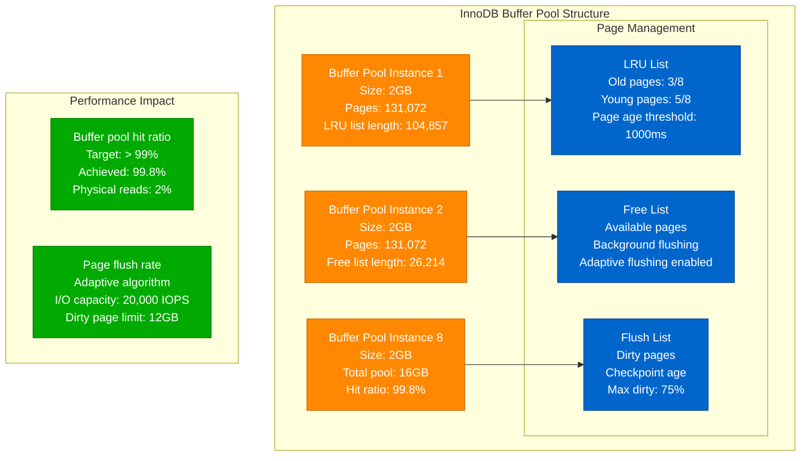

### Buffer Pool Tuning Results - Uber Schemaless

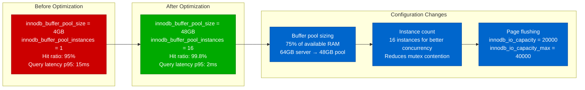

## Group Replication Performance

### Group Replication Architecture

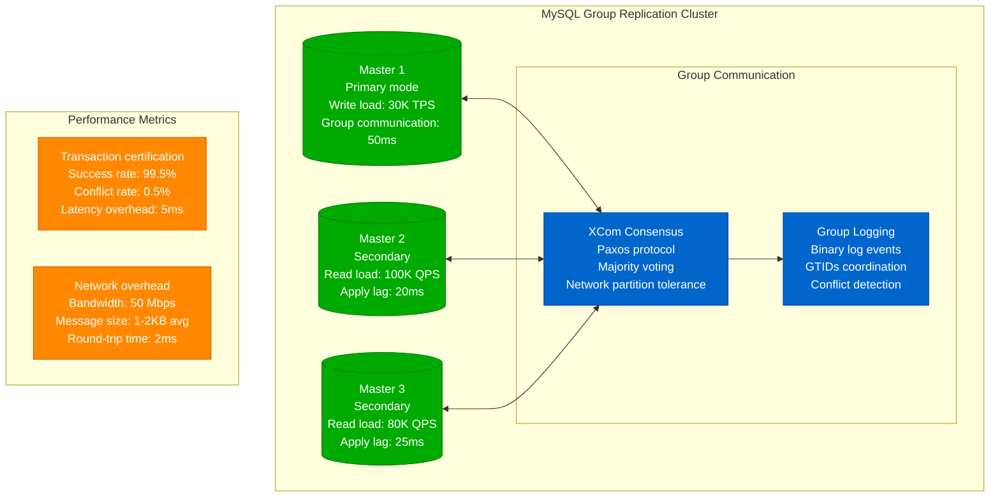

### Group Replication vs Traditional Replication

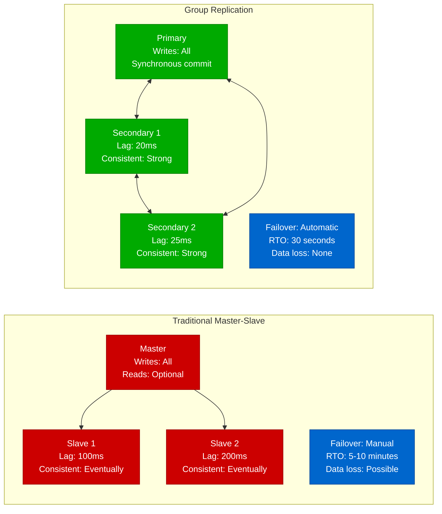

## Partition Pruning Benefits

### Range Partitioning Performance

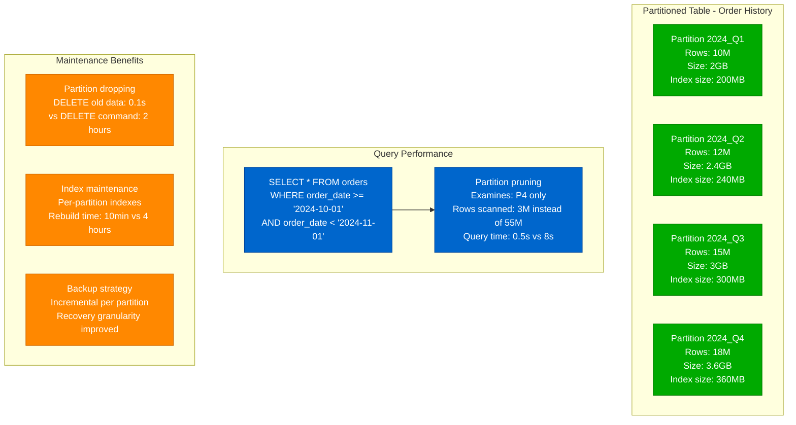

### Hash Partitioning for Load Distribution

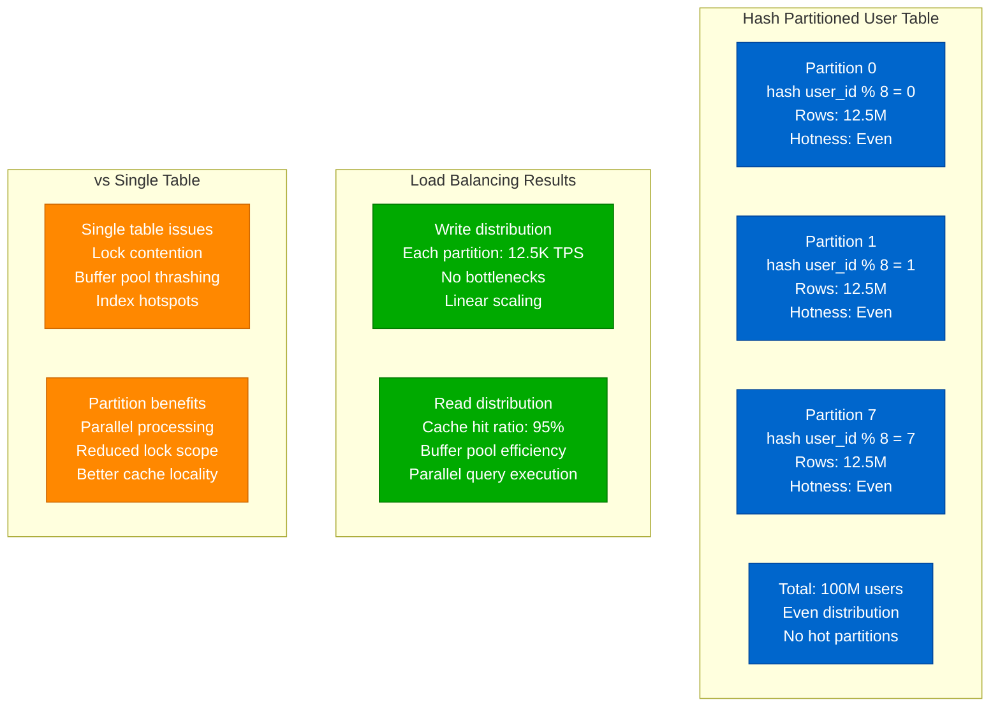

## Thread Pool vs Connection-per-Thread

### Threading Model Comparison

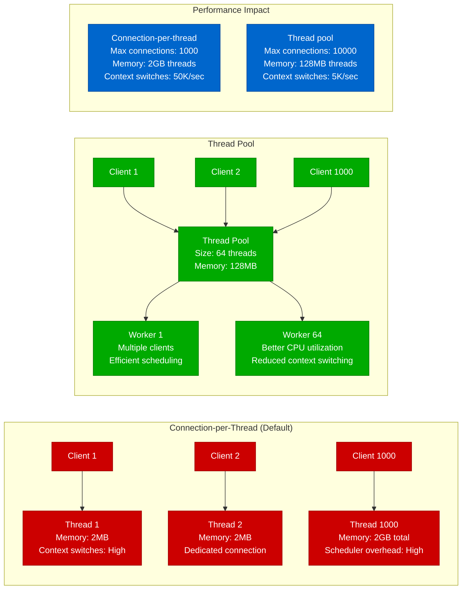

### Thread Pool Configuration Impact

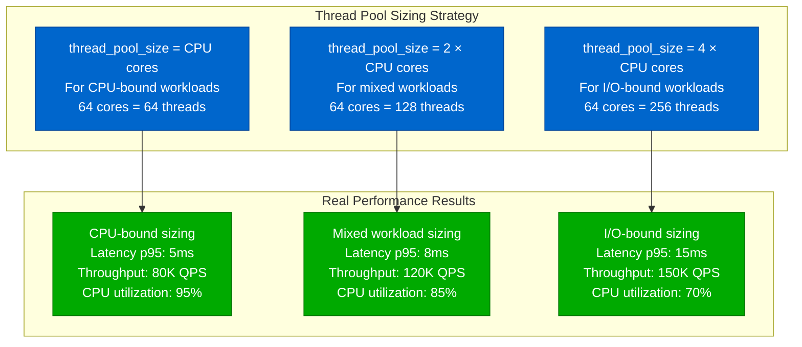

## Uber's Schemaless Implementation Metrics

### Schemaless Architecture Performance

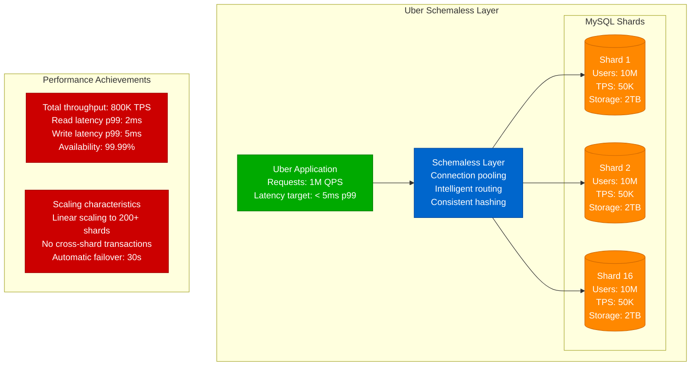

### Key Configuration Parameters

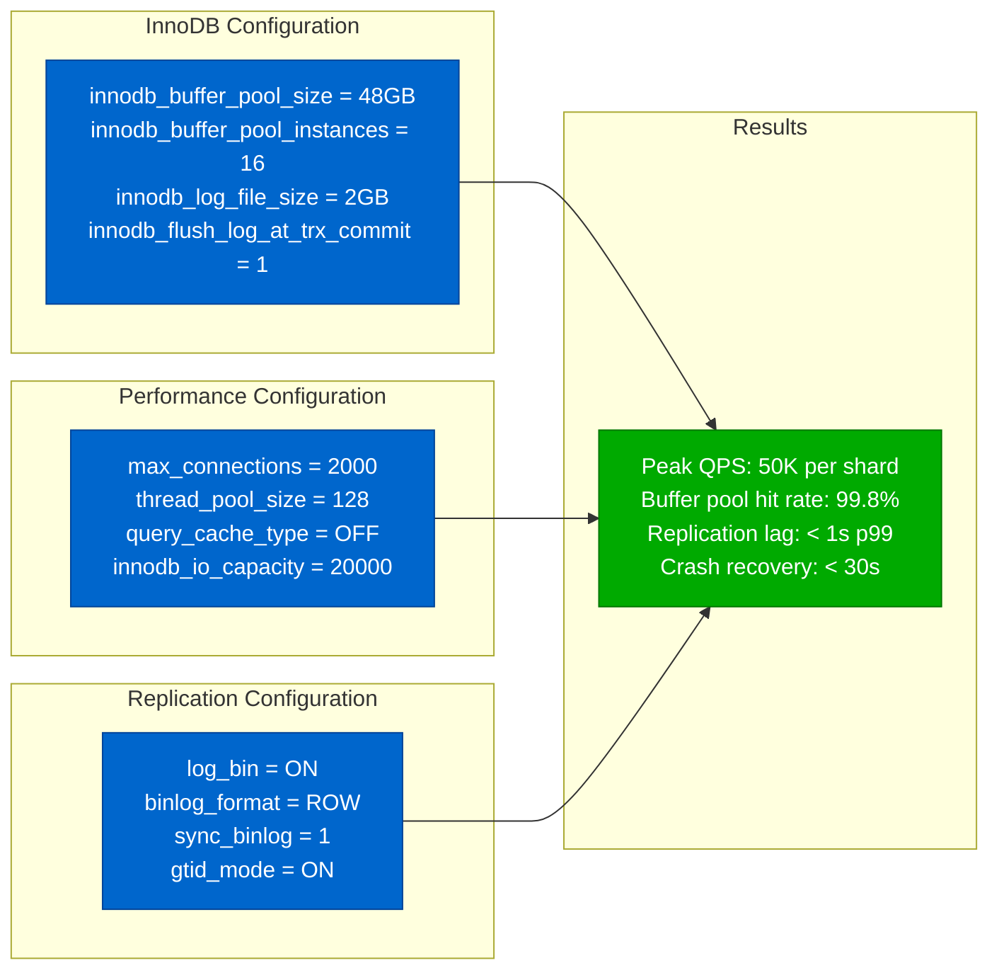

## Production Optimization Strategies

### Query Optimization Pipeline

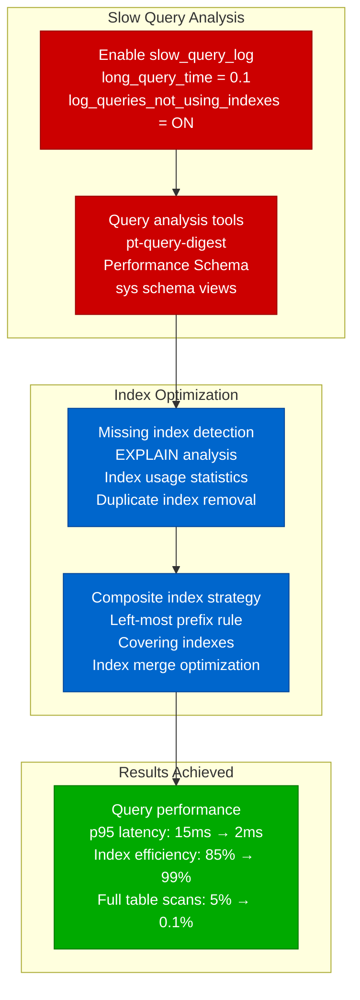

### Critical Lessons Learned

1. **Buffer Pool Sizing**: 75% of RAM is optimal for most workloads
2. **Thread Pool**: Essential for high-concurrency applications (> 1000 connections)
3. **Partitioning**: Mandatory for tables > 100GB or high-velocity time-series data
4. **Group Replication**: Adds 5-10ms latency but provides strong consistency
5. **Connection Pooling**: Application-level pooling more effective than MySQL thread pool alone

**Performance Benchmarks**:
- **Small Scale** (< 10K QPS): Single server, basic configuration
- **Medium Scale** (10K-100K QPS): Read replicas, partitioning, optimized configuration
- **Large Scale** (> 100K QPS): Sharding, advanced replication, specialized hardware

**Source**: Based on Uber Schemaless, Shopify, and GitHub MySQL implementations