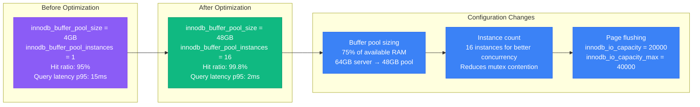
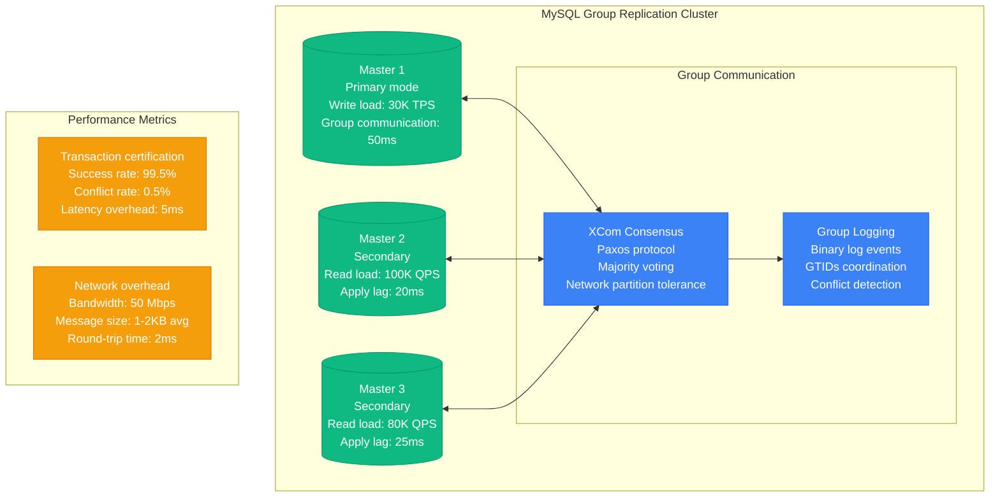
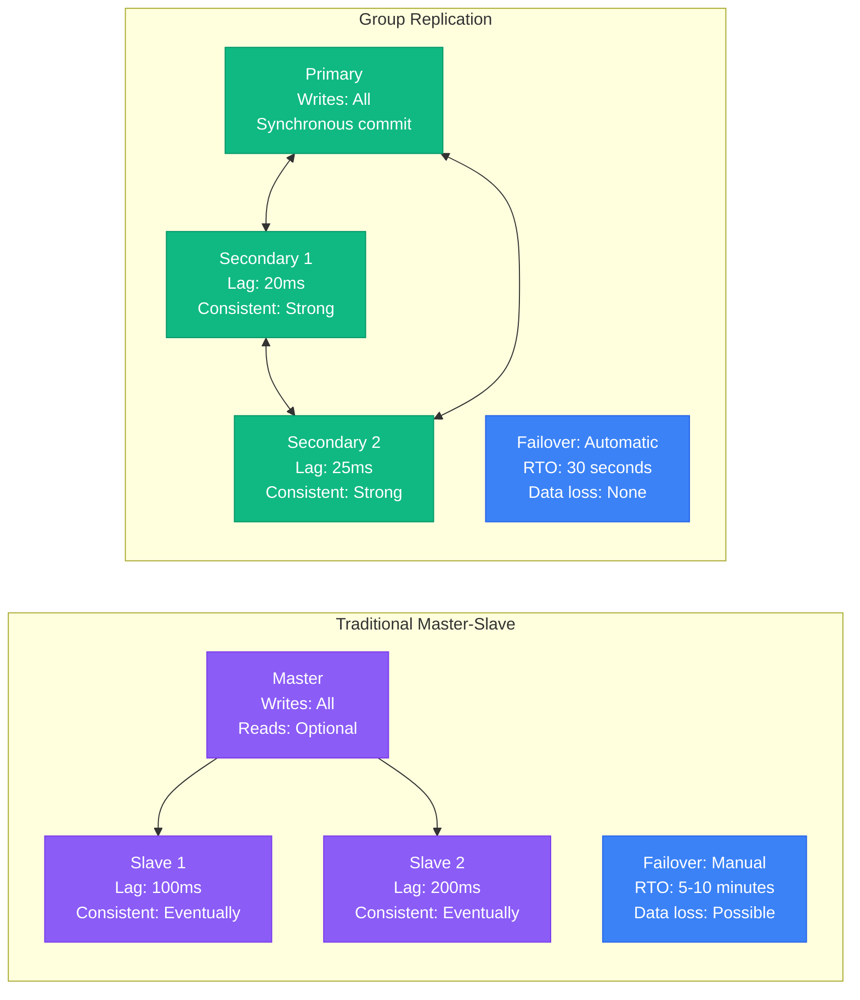
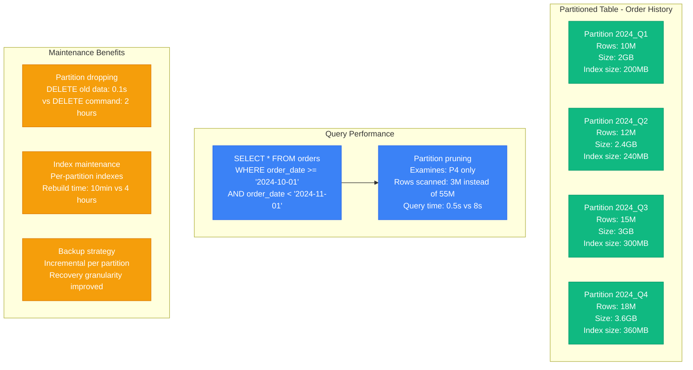
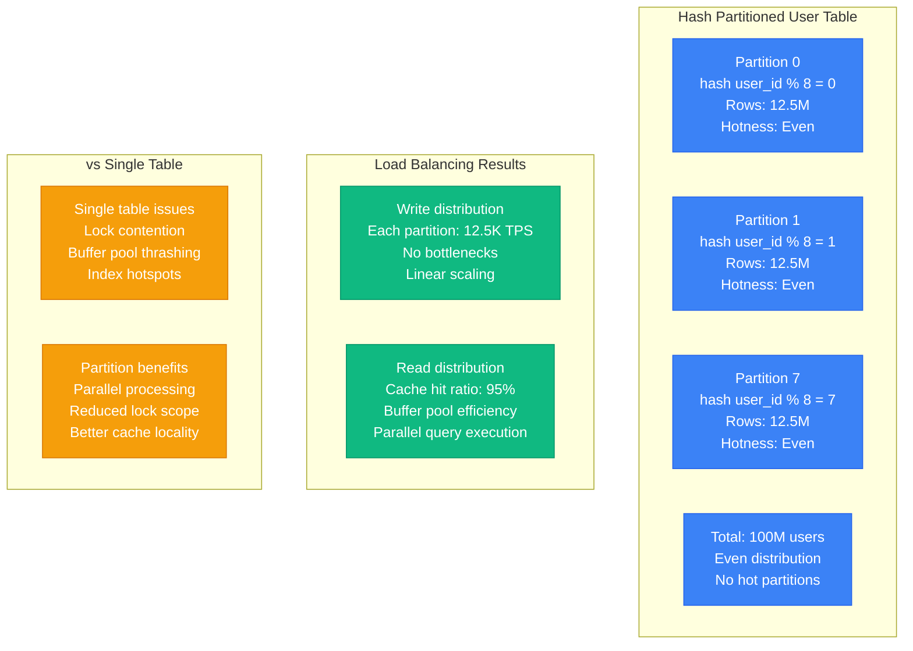
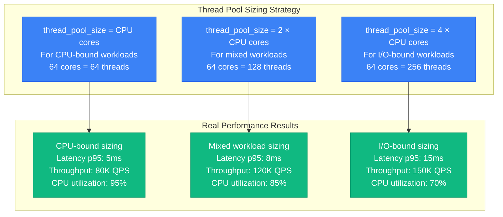
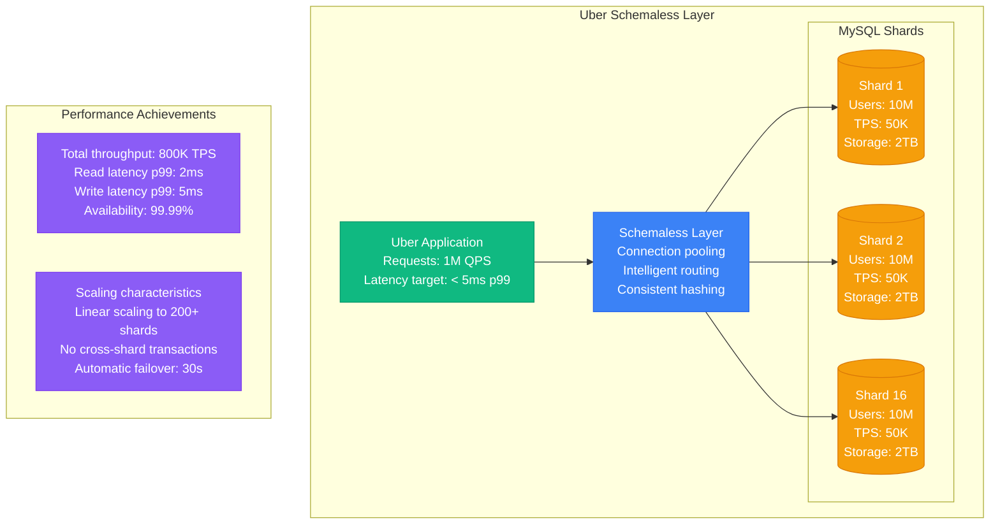
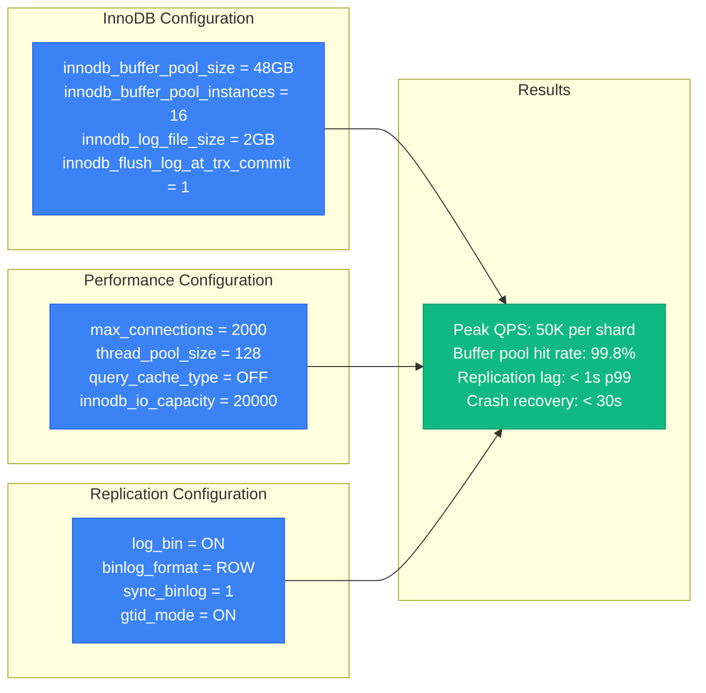
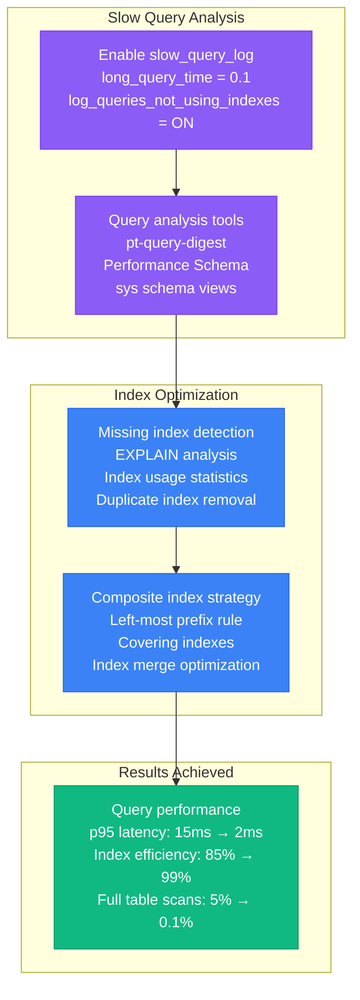

# MySQL Performance Profile

## Overview

MySQL performance characteristics in production environments, covering InnoDB optimization, replication, partitioning, and threading models. Based on Uber's Schemaless implementation and other high-scale deployments.

## 4-Plane MySQL Architecture Performance Profile

### Complete MySQL Performance Stack

```mermaid
graph TB
    subgraph EdgePlane[🔵 Edge Plane - Connection Management]
        ProxySQL[ProxySQL<br/>Connection Pooling<br/>Read/Write Split<br/>Query Routing<br/>💰 $500/month]

        HAProxy[HAProxy<br/>Load Balancing<br/>Health Checks<br/>Circuit Breaking<br/>💰 $200/month]

        MaxScale[MariaDB MaxScale<br/>Connection Multiplexing<br/>Query Load Balancing<br/>Firewall Rules<br/>💰 $800/month]
    end

    subgraph ServicePlane[🟢 Service Plane - Query Processing]
        QueryCache[Query Cache<br/>❌ DISABLED<br/>Reason: High Contention<br/>Replaced with Application Cache]

        QueryParser[SQL Parser & Optimizer<br/>Cost-Based Optimization<br/>Index Selection<br/>Join Algorithms]

        QueryExec[Query Execution Engine<br/>Thread Pool: 64 threads<br/>Memory: 256MB per thread<br/>Timeout: 30s]
    end

    subgraph StatePlane[🟠 State Plane - Storage & Buffer Management]
        BufferPool[InnoDB Buffer Pool<br/>Size: 48GB (75% of RAM)<br/>Instances: 16<br/>Hit Ratio: 99.8%<br/>💰 $2,000/month]

        Storage[Storage Engine<br/>InnoDB: 95% of tables<br/>MyISAM: 5% (read-only)<br/>NVMe SSD: 20,000 IOPS<br/>💰 $3,500/month]

        Replication[Group Replication<br/>3-node cluster<br/>Strong consistency<br/>Auto-failover: 30s<br/>💰 $6,000/month]
    end

    subgraph ControlPlane[🔴 Control Plane - Monitoring & Operations]
        PerfSchema[Performance Schema<br/>Query Analysis<br/>Lock Monitoring<br/>Resource Usage<br/>Storage: 1GB]

        Monitoring[Prometheus + Grafana<br/>MySQL Exporter<br/>Real-time Metrics<br/>Alerting Rules<br/>💰 $300/month]

        Backup[Backup & Recovery<br/>XtraBackup: Daily<br/>Binlog: Real-time<br/>RTO: 15 minutes<br/>💰 $800/month]
    end

    %% Connections
    ProxySQL --> QueryParser
    HAProxy --> QueryExec
    QueryExec --> BufferPool
    BufferPool --> Storage
    Storage --> Replication
    PerfSchema --> Monitoring
    Monitoring --> Backup

    %% Apply 4-plane colors
    classDef edgeStyle fill:#3B82F6,stroke:#2563EB,color:#fff
    classDef serviceStyle fill:#10B981,stroke:#059669,color:#fff
    classDef stateStyle fill:#F59E0B,stroke:#D97706,color:#fff
    classDef controlStyle fill:#8B5CF6,stroke:#7C3AED,color:#fff

    class ProxySQL,HAProxy,MaxScale edgeStyle
    class QueryCache,QueryParser,QueryExec serviceStyle
    class BufferPool,Storage,Replication stateStyle
    class PerfSchema,Monitoring,Backup controlStyle
```

### InnoDB Buffer Pool Optimization - Production Commands

```bash
# 🟠 State Plane Buffer Pool Analysis Commands
# Check current buffer pool status
mysql -e "SHOW ENGINE INNODB STATUS\G" | grep -A 20 "BUFFER POOL AND MEMORY"

# Buffer pool hit ratio (target: >99%)
mysql -e "SELECT
  ROUND(100 - ((Innodb_buffer_pool_reads / Innodb_buffer_pool_read_requests) * 100), 2) AS hit_ratio
  FROM (SELECT VARIABLE_VALUE AS Innodb_buffer_pool_reads FROM performance_schema.global_status WHERE VARIABLE_NAME = 'Innodb_buffer_pool_reads') r,
       (SELECT VARIABLE_VALUE AS Innodb_buffer_pool_read_requests FROM performance_schema.global_status WHERE VARIABLE_NAME = 'Innodb_buffer_pool_read_requests') rr;"

# Buffer pool utilization by instance
mysql -e "SELECT pool_id, pool_size, free_buffers, database_pages, old_database_pages
          FROM information_schema.INNODB_BUFFER_POOL_STATS
          ORDER BY pool_id;"

# Page flush rate monitoring (every 5 seconds)
mysql -e "SELECT pages_made_dirty, pages_flushed,
          (pages_made_dirty - pages_flushed) AS dirty_pages_backlog
          FROM information_schema.INNODB_BUFFER_POOL_STATS;"

# Buffer pool optimization recommendations
mysql -e "SELECT
  'innodb_buffer_pool_size' as parameter,
  @@innodb_buffer_pool_size / 1024 / 1024 / 1024 as current_gb,
  'Recommended: 75% of total RAM' as recommendation
  UNION ALL
  SELECT
  'innodb_buffer_pool_instances' as parameter,
  @@innodb_buffer_pool_instances as current_value,
  'Recommended: 16 for 48GB+ buffer pool' as recommendation;"
```

### Buffer Pool Tuning Results - Uber Schemaless



## Group Replication Performance

### Group Replication Architecture



### Group Replication vs Traditional Replication



## Partition Pruning Benefits

### Range Partitioning Performance



### Hash Partitioning for Load Distribution



## Thread Pool vs Connection-per-Thread

### Threading Model Comparison

```mermaid
graph LR
    subgraph Connection-per-Thread (Default)
        CT1[Client 1] --> T1[Thread 1<br/>Memory: 2MB<br/>Context switches: High]
        CT2[Client 2] --> T2[Thread 2<br/>Memory: 2MB<br/>Dedicated connection]
        CT3[Client 1000] --> T1000[Thread 1000<br/>Memory: 2GB total<br/>Scheduler overhead: High]
    end

    subgraph Thread Pool
        TP1[Client 1] --> P1[Thread Pool<br/>Size: 64 threads<br/>Memory: 128MB]
        TP2[Client 2] --> P1
        TP3[Client 1000] --> P1

        P1 --> W1[Worker 1<br/>Multiple clients<br/>Efficient scheduling]
        P1 --> W2[Worker 64<br/>Better CPU utilization<br/>Reduced context switching]
    end

    subgraph Performance Impact
        PI1[Connection-per-thread<br/>Max connections: 1000<br/>Memory: 2GB threads<br/>Context switches: 50K/sec]

        PI2[Thread pool<br/>Max connections: 10000<br/>Memory: 128MB threads<br/>Context switches: 5K/sec]
    end

    classDef traditionalStyle fill:#8B5CF6,stroke:#7C3AED,color:#fff
    classDef poolStyle fill:#10B981,stroke:#059669,color:#fff
    classDef metricStyle fill:#3B82F6,stroke:#2563EB,color:#fff

    class CT1,CT2,CT3,T1,T2,T1000 traditionalStyle
    class TP1,TP2,TP3,P1,W1,W2 poolStyle
    class PI1,PI2 metricStyle
```

### Thread Pool Configuration Impact



## Uber's Schemaless Implementation Metrics

### Schemaless Architecture Performance



### Key Configuration Parameters



## Production Optimization Strategies

### Query Optimization Pipeline



### 🚨 Production MySQL Performance Troubleshooting

### 4-Plane Performance Bottleneck Commands

#### 🔵 Edge Plane Performance Issues
```bash
# Connection pool analysis (ProxySQL/HAProxy)
# ProxySQL connection stats
mysql -h proxysql-admin -P6032 -uadmin -padmin -e "SELECT * FROM stats_mysql_connection_pool ORDER BY ConnUsed DESC;"

# HAProxy connection metrics
echo "show stat" | socat stdio /var/lib/haproxy/stats | grep mysql | awk -F, '{print $1,$5,$17,$18}'

# Connection refused errors
ss -tuln | grep :3306
netstat -an | grep :3306 | grep -c ESTABLISHED
```

#### 🟢 Service Plane Performance Issues
```bash
# Thread pool saturation detection
mysql -e "SELECT COUNT(*) as active_threads FROM performance_schema.threads WHERE PROCESSLIST_STATE IS NOT NULL;"

# Query execution bottlenecks
mysql -e "SELECT digest_text, count_star, avg_timer_wait/1000000000 as avg_seconds
          FROM performance_schema.events_statements_summary_by_digest
          WHERE avg_timer_wait > 1000000000 ORDER BY avg_timer_wait DESC LIMIT 10;"

# Lock contention analysis
mysql -e "SELECT object_schema, object_name, lock_type, lock_duration, lock_status
          FROM performance_schema.metadata_locks WHERE lock_status = 'PENDING';"
```

#### 🟠 State Plane Performance Issues
```bash
# Buffer pool pressure indicators
mysql -e "SELECT
  pool_id,
  (database_pages / pool_size) * 100 as utilization_pct,
  free_buffers,
  pages_made_dirty - pages_flushed as dirty_backlog
  FROM information_schema.INNODB_BUFFER_POOL_STATS;"

# I/O bottlenecks
mysql -e "SELECT file_name, SUM(count_read) as reads, SUM(count_write) as writes,
          SUM(sum_timer_wait)/1000000000 as total_seconds
          FROM performance_schema.file_summary_by_instance
          GROUP BY file_name ORDER BY total_seconds DESC LIMIT 10;"

# Replication lag measurement
mysql -e "SELECT
  CHANNEL_NAME,
  SERVICE_STATE,
  LAST_ERROR_MESSAGE,
  LAST_ERROR_TIMESTAMP
  FROM performance_schema.replication_connection_status;"
```

#### 🔴 Control Plane Performance Issues
```bash
# Performance Schema overhead
mysql -e "SELECT COUNT(*) as enabled_instruments FROM performance_schema.setup_instruments WHERE ENABLED='YES';"

# Resource exhaustion alerts
mysql -e "SELECT
  'max_connections' as setting,
  @@max_connections as max_value,
  (SELECT COUNT(*) FROM performance_schema.threads WHERE PROCESSLIST_USER IS NOT NULL) as current_connections,
  ROUND(((SELECT COUNT(*) FROM performance_schema.threads WHERE PROCESSLIST_USER IS NOT NULL) / @@max_connections) * 100, 2) as utilization_pct;"

# Backup impact on performance
mysqladmin processlist | grep -i backup
mysql -e "SELECT EVENT_NAME, COUNT_STAR, SUM_TIMER_WAIT/1000000000 as seconds
          FROM performance_schema.events_waits_summary_global_by_event_name
          WHERE EVENT_NAME LIKE '%file%' ORDER BY seconds DESC LIMIT 5;"
```

### Performance Optimization Quick Wins

#### Immediate Actions (< 5 minutes)
1. **Kill Long-Running Queries**:
   ```bash
   mysql -e "SELECT concat('KILL ',id,';') FROM information_schema.processlist
             WHERE command != 'Sleep' AND time > 300;"
   ```

2. **Flush Query Cache** (if enabled):
   ```bash
   mysql -e "FLUSH QUERY CACHE; RESET QUERY CACHE;"
   ```

3. **Check for Lock Waits**:
   ```bash
   mysql -e "SELECT r.trx_id waiting_trx_id, r.trx_mysql_thread_id waiting_thread,
             r.trx_query waiting_query, b.trx_id blocking_trx_id,
             b.trx_mysql_thread_id blocking_thread, b.trx_query blocking_query
             FROM information_schema.innodb_lock_waits w
             INNER JOIN information_schema.innodb_trx b ON b.trx_id = w.blocking_trx_id
             INNER JOIN information_schema.innodb_trx r ON r.trx_id = w.requesting_trx_id;"
   ```

#### Medium-term Optimizations (< 30 minutes)
1. **Enable Thread Pool** (MySQL 8.0+):
   ```sql
   INSTALL PLUGIN thread_pool SONAME 'thread_pool.so';
   SET GLOBAL thread_pool_size = 16;
   SET GLOBAL thread_pool_max_threads = 1000;
   ```

2. **Optimize Buffer Pool**:
   ```sql
   SET GLOBAL innodb_buffer_pool_dump_at_shutdown = ON;
   SET GLOBAL innodb_buffer_pool_load_at_startup = ON;
   ```

3. **Adjust I/O Capacity**:
   ```sql
   SET GLOBAL innodb_io_capacity = 2000;
   SET GLOBAL innodb_io_capacity_max = 4000;
   ```

### Critical Performance Thresholds

| Metric | Healthy | Warning | Critical | Action |
|--------|---------|---------|----------|---------|
| Buffer Pool Hit Rate | >99% | 95-99% | <95% | Increase buffer pool size |
| Active Connections | <70% max | 70-85% | >85% | Scale connection pool |
| Query Response Time | <100ms | 100ms-1s | >1s | Optimize slow queries |
| Replication Lag | <1s | 1-10s | >10s | Check master load |
| Lock Wait Time | <100ms | 100ms-1s | >1s | Identify blocking queries |
| I/O Utilization | <70% | 70-85% | >85% | Upgrade storage |

### Cost-Performance Optimization Matrix

#### Scale Point 1: < 10K QPS
- **Instance**: db.t3.large ($150/month)
- **Storage**: 100GB GP2 SSD ($10/month)
- **Configuration**: Basic InnoDB settings
- **Total Cost**: $160/month

#### Scale Point 2: 10K-50K QPS
- **Instance**: db.r5.xlarge ($450/month)
- **Storage**: 500GB GP3 SSD ($60/month)
- **Read Replicas**: 2x db.r5.large ($600/month)
- **Configuration**: Optimized buffer pool, thread pool
- **Total Cost**: $1,110/month

#### Scale Point 3: > 50K QPS
- **Instance**: db.r5.4xlarge ($1,800/month)
- **Storage**: 2TB GP3 SSD ($240/month)
- **Read Replicas**: 4x db.r5.2xlarge ($2,400/month)
- **Sharding**: Multiple clusters
- **Total Cost**: $4,440/month

### Critical Lessons Learned

1. **Buffer Pool Sizing**: 75% of RAM is optimal for most workloads
   - **Command**: `SELECT @@innodb_buffer_pool_size / (1024*1024*1024) as buffer_pool_gb;`
   - **Monitor**: Buffer pool hit ratio >99%

2. **Thread Pool**: Essential for high-concurrency applications (> 1000 connections)
   - **Command**: `SHOW VARIABLES LIKE 'thread_pool%';`
   - **Monitor**: Thread pool utilization <80%

3. **Partitioning**: Mandatory for tables > 100GB or high-velocity time-series data
   - **Command**: `SELECT table_name, partition_name, table_rows FROM information_schema.partitions WHERE table_schema='mydb';`
   - **Monitor**: Query pruning effectiveness

4. **Group Replication**: Adds 5-10ms latency but provides strong consistency
   - **Command**: `SELECT * FROM performance_schema.replication_group_members;`
   - **Monitor**: Group replication lag <1s

5. **Connection Pooling**: Application-level pooling more effective than MySQL thread pool alone
   - **Monitor**: Connection pool utilization <70%
   - **Alert**: Connection refused errors

**Performance Benchmarks**:
- **Small Scale** (< 10K QPS): Single server, basic configuration
- **Medium Scale** (10K-100K QPS): Read replicas, partitioning, optimized configuration
- **Large Scale** (> 100K QPS): Sharding, advanced replication, specialized hardware

**Source**: Based on Uber Schemaless, Shopify, and GitHub MySQL implementations