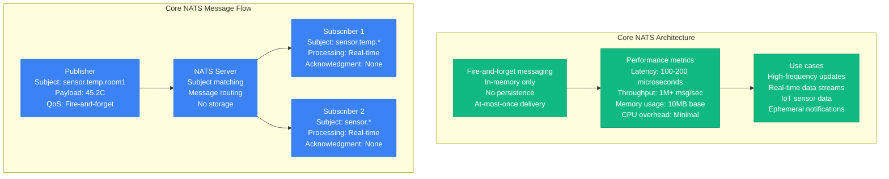
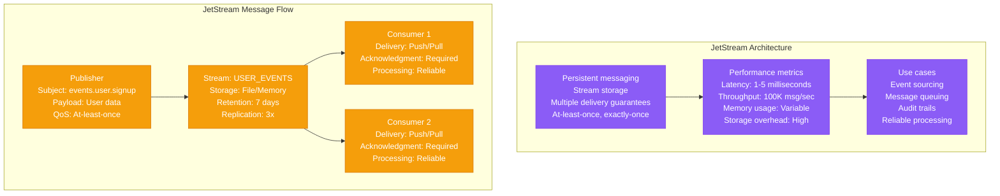
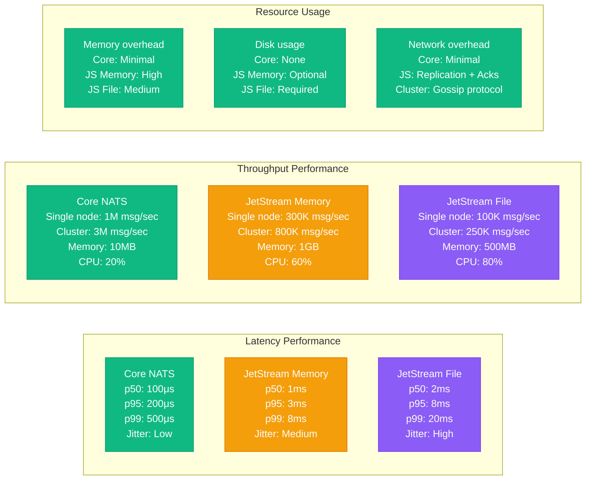
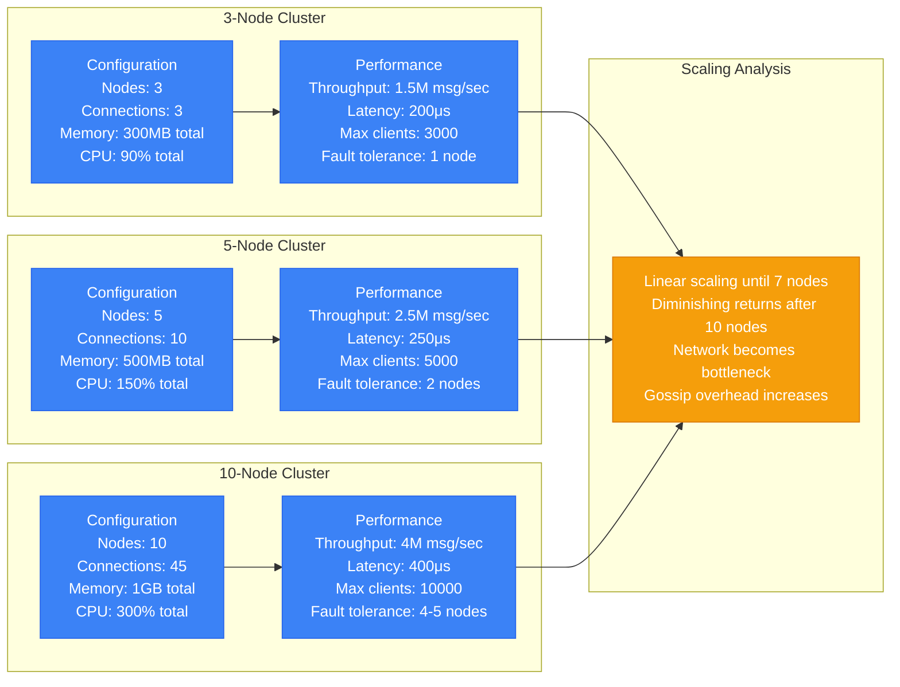
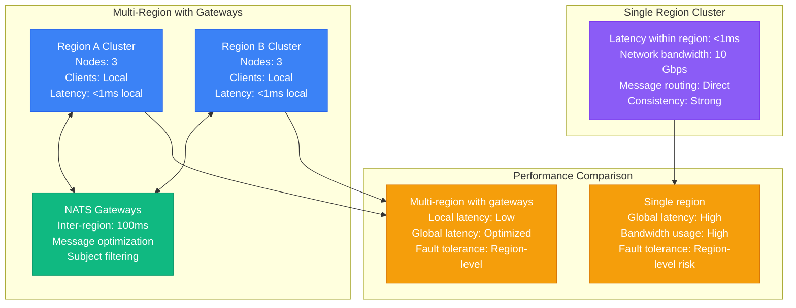
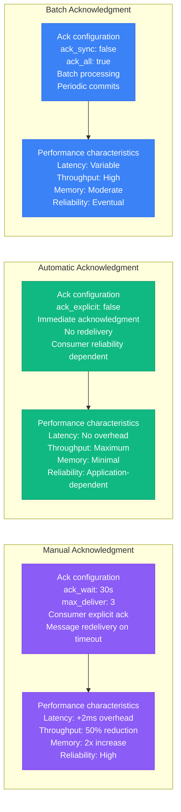
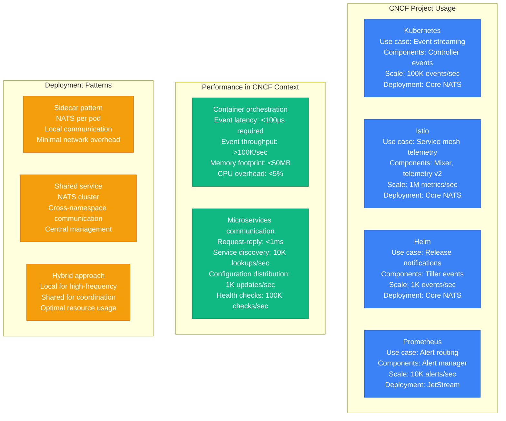
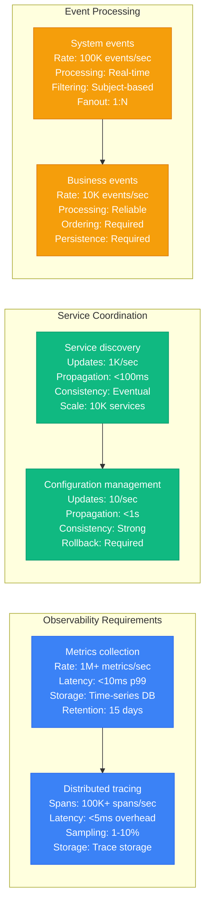

# NATS Performance Profile

## Overview

NATS performance characteristics in production environments, covering JetStream vs Core performance, subject hierarchy impact, clustering topology effects, and message delivery guarantees. Based on CNCF adoption metrics and high-scale deployments.

## JetStream vs Core Performance

### Core NATS Performance Characteristics



### JetStream Performance Characteristics



### Performance Comparison Matrix



## Subject Hierarchy Impact

### Wildcard Subscription Performance

```mermaid
graph TB
    subgraph Subject_Hierarchy_Design[Subject Hierarchy Design]
        HIER1[Good hierarchy<br/>app.service.instance.metric<br/>Example: billing.api.pod-1.cpu<br/>Levels: 4 (optimal)]

        HIER2[Poor hierarchy<br/>very.deep.nested.subject.hierarchy.with.many.levels<br/>Example: company.division.team.service.version.instance.metric.type<br/>Levels: 8+ (excessive)]

        HIER3[Flat hierarchy<br/>billing-api-pod-1-cpu<br/>Example: single_level_subjects<br/>Levels: 1 (limited flexibility)]

        HIER1 --> HIER2 --> HIER3
    end

    subgraph Wildcard_Performance_Impact[Wildcard Performance Impact]
        WILD1[Specific subscription<br/>Subject: billing.api.pod-1.cpu<br/>Matches: 1 exact<br/>CPU overhead: Minimal<br/>Memory: 1KB per sub]

        WILD2[Single wildcard<br/>Subject: billing.api.*.cpu<br/>Matches: ~100 subjects<br/>CPU overhead: Low<br/>Memory: 1KB per sub]

        WILD3[Multiple wildcards<br/>Subject: *.api.*.cpu<br/>Matches: ~1000 subjects<br/>CPU overhead: Medium<br/>Memory: 1KB per sub]

        WILD4[Full wildcard<br/>Subject: ><br/>Matches: ALL subjects<br/>CPU overhead: High<br/>Memory: Proportional to traffic]

        WILD1 --> WILD2 --> WILD3 --> WILD4
    end

    subgraph Performance_Measurements[Performance Measurements]
        PERF1[Routing performance<br/>1-level: 1M msg/sec<br/>2-level wildcard: 800K msg/sec<br/>3-level wildcard: 500K msg/sec<br/>Full wildcard: 100K msg/sec]
    end

    classDef hierStyle fill:#3B82F6,stroke:#2563EB,color:#fff
    classDef wildStyle fill:#F59E0B,stroke:#D97706,color:#fff
    classDef perfStyle fill:#10B981,stroke:#059669,color:#fff

    class HIER1,HIER2,HIER3 hierStyle
    class WILD1,WILD2,WILD3,WILD4 wildStyle
    class PERF1 perfStyle
```

### Subject Optimization Strategies

```mermaid
graph TB
    subgraph Optimization_Techniques[Optimization Techniques]
        OPT1[Subject design principles<br/>• Keep hierarchy shallow (≤4 levels)<br/>• Use meaningful names<br/>• Avoid deep wildcards<br/>• Group related subjects]

        OPT2[Subscription patterns<br/>• Prefer specific over wildcard<br/>• Use queue groups for load balancing<br/>• Minimize overlapping subscriptions<br/>• Monitor subscription count]

        OPT3[Message routing efficiency<br/>• Subject-based sharding<br/>• Avoid broadcast patterns<br/>• Use request-reply for point-to-point<br/>• Implement message filtering]

        OPT1 --> OPT2 --> OPT3
    end

    subgraph Anti_patterns_and_Impact[Anti-patterns and Impact]
        ANTI1[Subject explosion<br/>Unique subject per message<br/>Impact: Memory exhaustion<br/>Performance: Severe degradation]

        ANTI2[Deep wildcard abuse<br/>Pattern: *.*.*.*.><br/>Impact: CPU overhead<br/>Performance: Linear degradation]

        ANTI3[Broadcast overuse<br/>Pattern: All consumers get all messages<br/>Impact: Network saturation<br/>Performance: Bandwidth limitation]

        ANTI1 --> ANTI2 --> ANTI3
    end

    classDef optStyle fill:#10B981,stroke:#059669,color:#fff
    classDef antiStyle fill:#8B5CF6,stroke:#7C3AED,color:#fff

    class OPT1,OPT2,OPT3 optStyle
    class ANTI1,ANTI2,ANTI3 antiStyle
```

## Clustering Topology Effects

### NATS Cluster Architecture

```mermaid
graph TB
    subgraph Full_Mesh_Clustering[Full Mesh Clustering]
        MESH1[Node 1<br/>Connections: 2 (to nodes 2,3)<br/>Memory: 100MB<br/>CPU: 30%<br/>Role: Route + Client]

        MESH2[Node 2<br/>Connections: 2 (to nodes 1,3)<br/>Memory: 100MB<br/>CPU: 30%<br/>Role: Route + Client]

        MESH3[Node 3<br/>Connections: 2 (to nodes 1,2)<br/>Memory: 100MB<br/>CPU: 30%<br/>Role: Route + Client]

        MESH1 <--> MESH2
        MESH2 <--> MESH3
        MESH3 <--> MESH1
    end

    subgraph Cluster_Performance[Cluster Performance]
        CLUSTER_PERF1[Message routing<br/>Hop count: 1 (direct)<br/>Latency overhead: 0.1ms<br/>Throughput: 500K msg/sec<br/>Fault tolerance: N-1 failures]

        CLUSTER_PERF2[Resource overhead<br/>Network connections: O(n²)<br/>Memory per node: 100MB base<br/>CPU overhead: 10% routing<br/>Gossip protocol: Minimal]
    end

    subgraph Client_Distribution[Client Distribution]
        CLIENT1[Client distribution<br/>Clients per node: 1000<br/>Load balancing: Automatic<br/>Failover time: 2-5 seconds<br/>Connection recovery: Automatic]
    end

    classDef meshStyle fill:#3B82F6,stroke:#2563EB,color:#fff
    classDef perfStyle fill:#10B981,stroke:#059669,color:#fff
    classDef clientStyle fill:#F59E0B,stroke:#D97706,color:#fff

    class MESH1,MESH2,MESH3 meshStyle
    class CLUSTER_PERF1,CLUSTER_PERF2 perfStyle
    class CLIENT1 clientStyle
```

### Cluster Scaling Characteristics



### Geographic Distribution



## Message Delivery Guarantees Cost

### Delivery Guarantee Comparison

```mermaid
graph TB
    subgraph At_Most_Once__Core_NATS[At-Most-Once (Core NATS)]
        AMO1[Delivery semantics<br/>Fire-and-forget<br/>No acknowledgments<br/>No retries<br/>No persistence]

        AMO2[Performance impact<br/>Latency: 100μs<br/>Throughput: 1M msg/sec<br/>Memory: Minimal<br/>CPU: 10%]

        AMO3[Use cases<br/>IoT sensor data<br/>Real-time metrics<br/>Non-critical notifications<br/>High-frequency updates]

        AMO1 --> AMO2 --> AMO3
    end

    subgraph At_Least_Once__JetStream[At-Least-Once (JetStream)]
        ALO1[Delivery semantics<br/>Publisher acknowledgment<br/>Consumer acknowledgment<br/>Retry on failure<br/>Persistent storage]

        ALO2[Performance impact<br/>Latency: 2-5ms<br/>Throughput: 200K msg/sec<br/>Memory: High<br/>CPU: 60%]

        ALO3[Use cases<br/>Order processing<br/>Financial transactions<br/>Critical notifications<br/>Audit logs]

        ALO1 --> ALO2 --> ALO3
    end

    subgraph Exactly_Once__JetStream_Dedup[Exactly-Once (JetStream Dedup)]
        EO1[Delivery semantics<br/>Deduplication enabled<br/>Consumer tracking<br/>Idempotent processing<br/>Complex acknowledgment]

        EO2[Performance impact<br/>Latency: 5-10ms<br/>Throughput: 50K msg/sec<br/>Memory: Very high<br/>CPU: 80%]

        EO3[Use cases<br/>Payment processing<br/>Account updates<br/>Inventory management<br/>Critical state changes]

        EO1 --> EO2 --> EO3
    end

    classDef amoStyle fill:#10B981,stroke:#059669,color:#fff
    classDef aloStyle fill:#F59E0B,stroke:#D97706,color:#fff
    classDef eoStyle fill:#8B5CF6,stroke:#7C3AED,color:#fff

    class AMO1,AMO2,AMO3 amoStyle
    class ALO1,ALO2,ALO3 aloStyle
    class EO1,EO2,EO3 eoStyle
```

### Acknowledgment and Retry Overhead



## CNCF Adoption Metrics

### NATS Usage Patterns in CNCF Projects



### Cloud-Native Performance Requirements



## Production Lessons Learned

### Performance Optimization Best Practices

```mermaid
graph TB
    subgraph Core_NATS_Optimization[Core NATS Optimization]
        CORE_OPT1[Connection management<br/>• Use connection pooling<br/>• Minimize connection count<br/>• Configure appropriate timeouts<br/>• Monitor connection health]

        CORE_OPT2[Subject design<br/>• Keep hierarchy shallow<br/>• Use specific subscriptions<br/>• Avoid excessive wildcards<br/>• Group related subjects]

        CORE_OPT1 --> CORE_OPT2
    end

    subgraph JetStream_Optimization[JetStream Optimization]
        JS_OPT1[Stream configuration<br/>• Choose appropriate storage<br/>• Configure retention policies<br/>• Set reasonable message limits<br/>• Monitor stream metrics]

        JS_OPT2[Consumer optimization<br/>• Use pull consumers for control<br/>• Configure appropriate batch sizes<br/>• Set reasonable ack timeouts<br/>• Monitor consumer lag]

        JS_OPT1 --> JS_OPT2
    end

    subgraph Cluster_Optimization[Cluster Optimization]
        CLUSTER_OPT1[Topology design<br/>• Keep clusters small (3-7 nodes)<br/>• Use gateways for geo-distribution<br/>• Monitor inter-node communication<br/>• Plan for network partitions]

        CLUSTER_OPT2[Resource allocation<br/>• Size nodes appropriately<br/>• Monitor memory usage<br/>• Configure garbage collection<br/>• Plan for failover capacity]

        CLUSTER_OPT1 --> CLUSTER_OPT2
    end

    classDef coreOptStyle fill:#10B981,stroke:#059669,color:#fff
    classDef jsOptStyle fill:#3B82F6,stroke:#2563EB,color:#fff
    classDef clusterOptStyle fill:#F59E0B,stroke:#D97706,color:#fff

    class CORE_OPT1,CORE_OPT2 coreOptStyle
    class JS_OPT1,JS_OPT2 jsOptStyle
    class CLUSTER_OPT1,CLUSTER_OPT2 clusterOptStyle
```

### Critical Performance Factors

1. **Use Case Selection**: Core NATS for high-performance, JetStream for reliability
2. **Subject Design**: Shallow hierarchies and specific subscriptions for optimal routing
3. **Cluster Sizing**: 3-7 nodes optimal, gateways for geographic distribution
4. **Delivery Guarantees**: Choose appropriate level for use case requirements
5. **Resource Management**: Monitor memory and CPU usage, especially with JetStream

### Performance Benchmarks by Configuration

| Configuration | Throughput | Latency p95 | Memory Usage | Use Case |
|---------------|------------|-------------|--------------|----------|
| **Core NATS Single** | 1M msg/sec | 200μs | 10MB | IoT, telemetry |
| **Core NATS Cluster** | 3M msg/sec | 400μs | 30MB | Distributed systems |
| **JetStream Memory** | 300K msg/sec | 5ms | 1GB | Reliable messaging |
| **JetStream File** | 100K msg/sec | 20ms | 500MB | Persistent workflows |

### Common Pitfalls

1. **Inappropriate delivery guarantees**: Using JetStream when Core NATS suffices
2. **Poor subject design**: Deep hierarchies and excessive wildcards
3. **Over-clustering**: Too many nodes causing gossip overhead
4. **Resource under-provisioning**: Insufficient memory for JetStream workloads
5. **Missing monitoring**: Performance issues discovered too late

**Source**: Based on CNCF project usage, Synadia implementations, and cloud-native adoption patterns