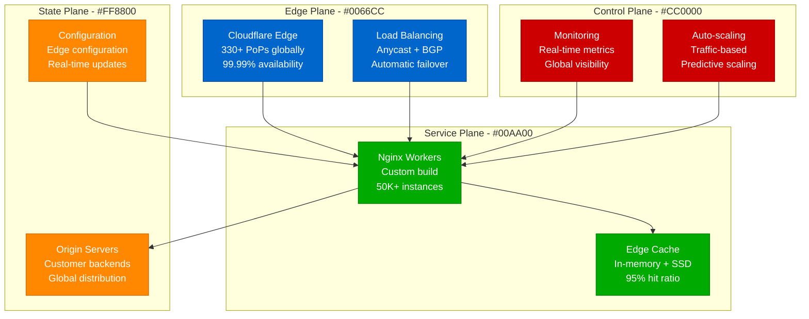
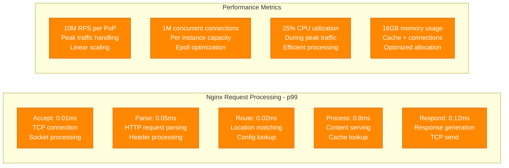
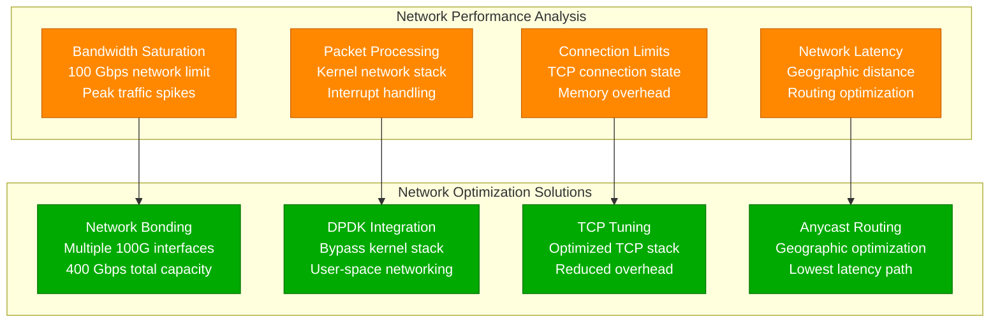

# Nginx at 10M RPS: Cloudflare's Edge Performance Profile

## Overview

Cloudflare operates the world's largest Nginx deployment, handling over 10 million requests per second across their global edge network. This infrastructure serves as the foundation for their CDN, DDoS protection, and edge computing services, processing over 50 million HTTP requests per second globally with sub-millisecond latencies.

## Architecture for Performance



## Performance Metrics and Benchmarks

### Global Performance Overview
- **Peak RPS**: 10M requests per second per PoP
- **Global RPS**: 50M+ requests per second total
- **Response Time**: 15ms median globally
- **Cache Hit Ratio**: 95% edge cache efficiency
- **Availability**: 99.99% uptime SLA
- **PoP Count**: 330+ global points of presence

### Per-Instance Performance


## Optimization Techniques Used

### 1. Nginx Configuration Optimization
```nginx
# Cloudflare Nginx Configuration
worker_processes auto;
worker_rlimit_nofile 1000000;
worker_connections 65535;

events {
    use epoll;
    worker_connections 65535;
    multi_accept on;
    accept_mutex off;
}

http {
    # Performance optimizations
    sendfile on;
    tcp_nopush on;
    tcp_nodelay on;
    keepalive_timeout 65;
    keepalive_requests 1000;

    # Buffer optimization
    client_body_buffer_size 128k;
    client_max_body_size 100m;
    client_header_buffer_size 1k;
    large_client_header_buffers 4 4k;
    output_buffers 1 32k;
    postpone_output 1460;

    # Cache optimization
    open_file_cache max=200000 inactive=20s;
    open_file_cache_valid 30s;
    open_file_cache_min_uses 2;
    open_file_cache_errors on;

    # Compression
    gzip on;
    gzip_vary on;
    gzip_min_length 1000;
    gzip_comp_level 6;
    gzip_types text/plain text/css application/json application/javascript;

    # Rate limiting
    limit_req_zone $binary_remote_addr zone=api:10m rate=100r/s;
    limit_conn_zone $binary_remote_addr zone=addr:10m;
}
```

### 2. System-Level Optimizations
```bash
# Linux kernel tuning for 10M RPS
# /etc/sysctl.conf

# Network optimizations
net.core.somaxconn = 65535
net.core.netdev_max_backlog = 30000
net.core.rmem_default = 262144
net.core.rmem_max = 16777216
net.core.wmem_default = 262144
net.core.wmem_max = 16777216
net.ipv4.tcp_rmem = 4096 87380 16777216
net.ipv4.tcp_wmem = 4096 65536 16777216
net.ipv4.tcp_max_syn_backlog = 30000
net.ipv4.tcp_tw_reuse = 1
net.ipv4.tcp_fin_timeout = 30
net.ipv4.ip_local_port_range = 1024 65535

# File descriptor limits
fs.file-max = 2097152

# Memory management
vm.swappiness = 1
vm.dirty_ratio = 15
vm.dirty_background_ratio = 5
```

### 3. Hardware Optimization
- **CPU**: 64-core servers optimized for single-threaded performance
- **Memory**: 256GB RAM for connection state and file cache
- **Network**: 100 Gbps network interfaces with SR-IOV
- **Storage**: NVMe SSDs for cache storage and logs

## Bottleneck Analysis

### 1. Network Bottlenecks


### 2. CPU and Memory Bottlenecks
- **Single-threaded Performance**: Nginx worker processes benefit from high clock speeds
- **Context Switching**: Minimized through epoll and worker tuning
- **Memory Allocation**: Zero-copy techniques reduce memory overhead
- **Cache Efficiency**: Hot content kept in memory for sub-millisecond serving

## Key Performance Insights

### 1. Critical Success Factors
- **Kernel Bypass**: DPDK integration for ultra-low latency packet processing
- **Connection Pooling**: Efficient connection reuse reduces overhead
- **Content Caching**: 95% cache hit ratio eliminates origin requests
- **Geographic Distribution**: 330+ PoPs minimize network latency
- **Hardware Optimization**: Purpose-built servers for web serving workloads

### 2. Lessons Learned
- **Worker Process Tuning**: One worker per CPU core optimal
- **Connection Limits**: 65K connections per worker maximum
- **Memory Management**: Large file cache critical for performance
- **Network Tuning**: Kernel network stack optimization essential
- **Monitoring**: Real-time performance metrics prevent bottlenecks

### 3. Future Optimization Strategies
- **HTTP/3 Implementation**: QUIC protocol for improved performance
- **Edge Computing**: WebAssembly at the edge for dynamic content
- **AI-Powered Caching**: Machine learning for cache optimization
- **Hardware Acceleration**: SmartNICs for packet processing offload
- **5G Integration**: Edge computing closer to mobile users

This performance profile demonstrates how Cloudflare achieves exceptional Nginx performance at unprecedented scale through system-level optimization, custom hardware, and global distribution. Their 10M RPS per PoP capability serves as the benchmark for high-performance web serving infrastructure.