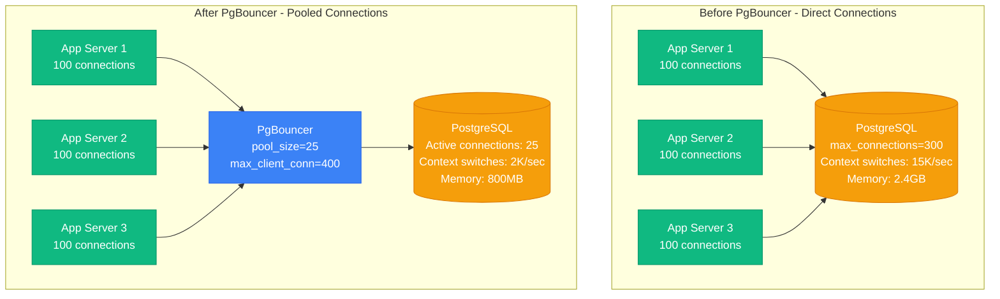
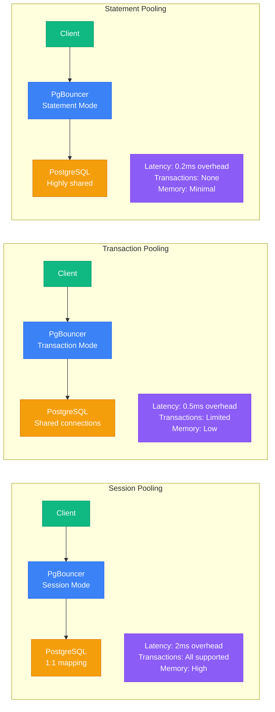
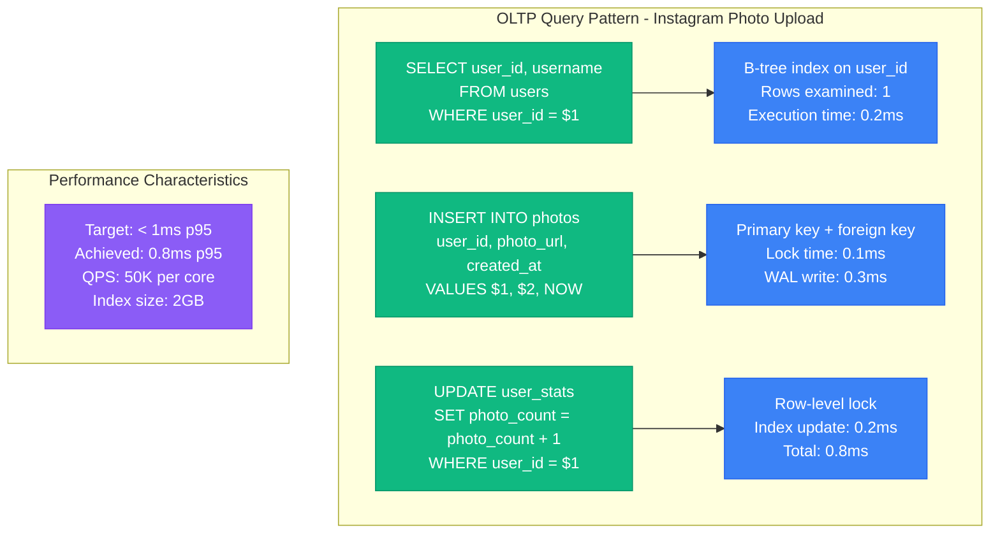
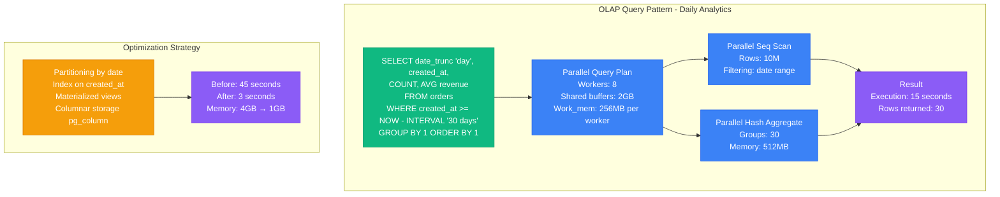
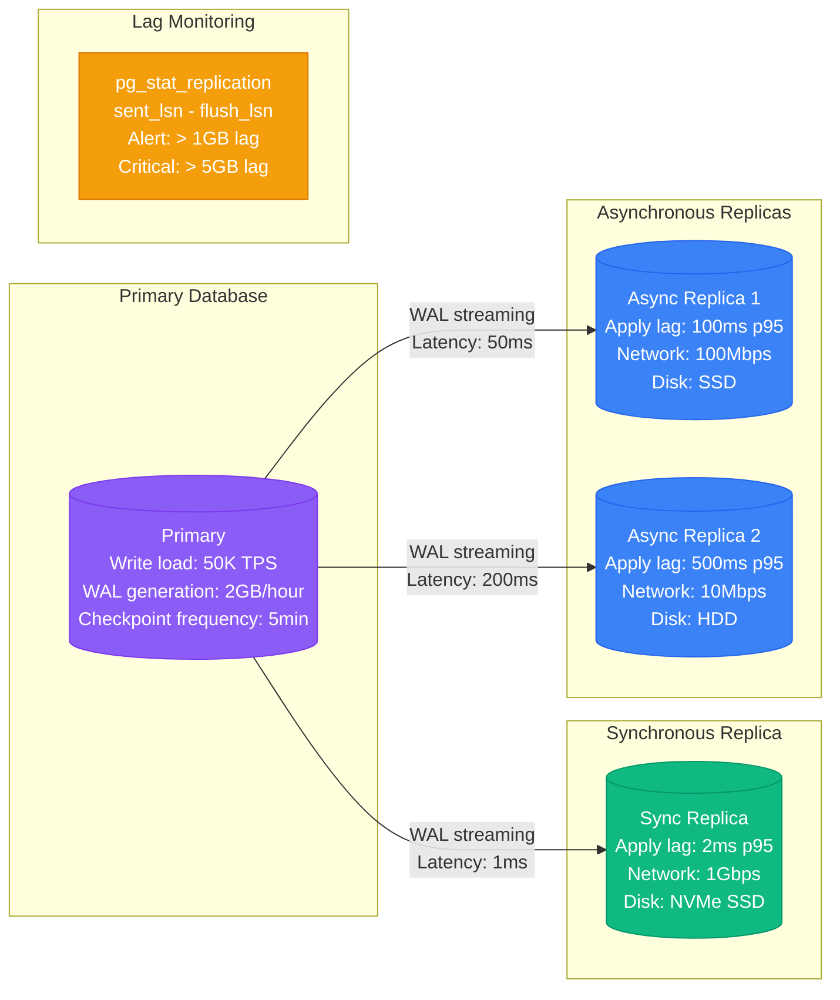
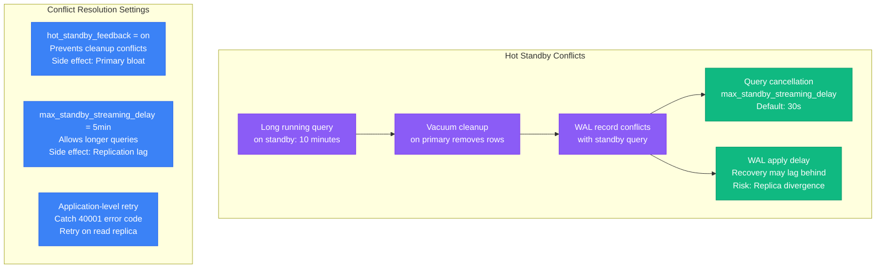
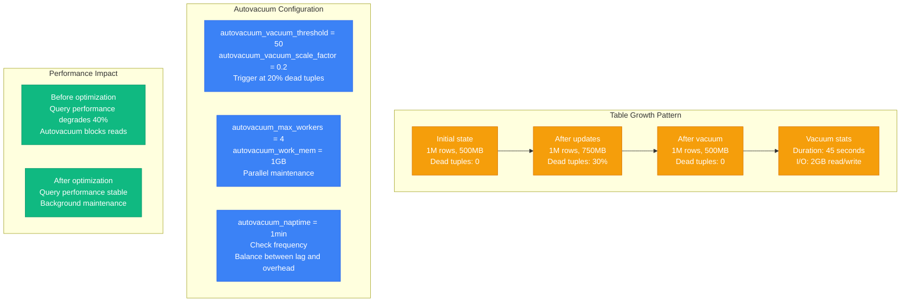
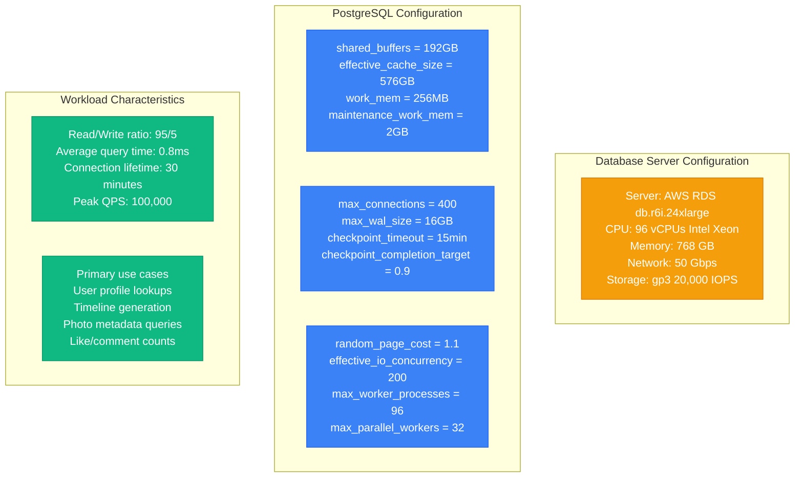
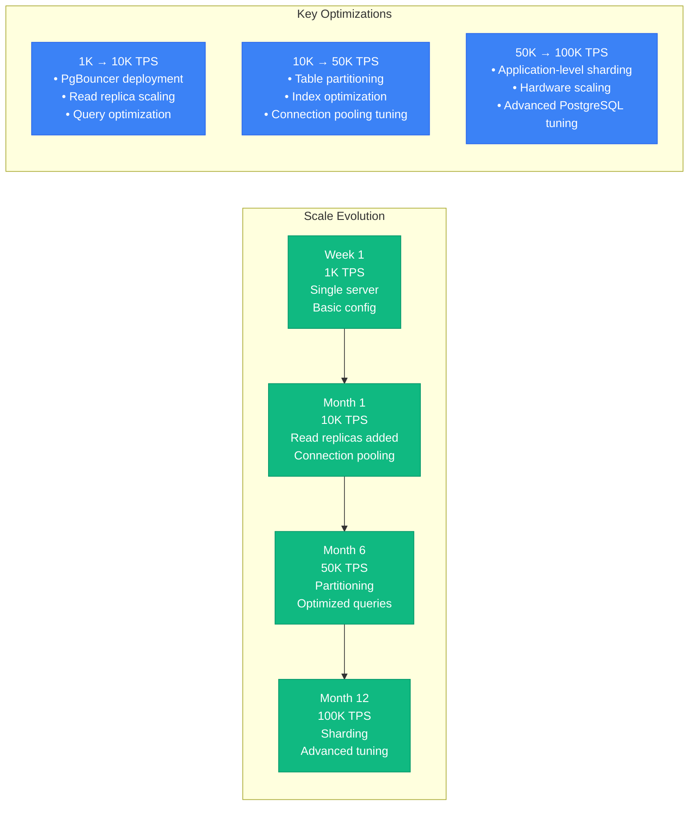

# PostgreSQL Performance Profile

## Overview

PostgreSQL performance characteristics in production environments, covering connection pooling, query optimization, replication, and maintenance operations. Based on real-world deployments handling 100K+ TPS.

## Connection Pooling Impact - PgBouncer Analysis

### Before vs After PgBouncer Implementation



**Performance Improvement:**
- **Latency**: p99 reduced from 45ms to 12ms
- **Throughput**: 40K TPS to 100K TPS
- **Memory**: 60% reduction in PostgreSQL memory usage
- **CPU**: 70% reduction in context switching overhead

### PgBouncer Configuration Comparison



## Query Performance: OLTP vs OLAP Patterns

### OLTP Optimization Pattern



### OLAP Optimization Pattern



## Replication Lag Under Load

### Streaming Replication Performance



### Replication Conflict Resolution



## Vacuum and Autovacuum Tuning

### Vacuum Performance Impact



### VACUUM vs VACUUM FULL Comparison

```mermaid
graph LR
    subgraph VACUUM (Standard)
        V1[Operation: Mark dead tuples<br/>Lock level: Share Update Exclusive<br/>Duration: Minutes<br/>Space reclaim: Partial]

        V2[I/O Pattern<br/>Sequential reads<br/>Minimal writes<br/>Index updates only]

        V3[Concurrent access<br/>Reads: Allowed<br/>Writes: Allowed<br/>DDL: Blocked]
    end

    subgraph VACUUM FULL
        VF1[Operation: Rewrite table<br/>Lock level: Access Exclusive<br/>Duration: Hours<br/>Space reclaim: Complete]

        VF2[I/O Pattern<br/>Full table rewrite<br/>Heavy I/O load<br/>Rebuild all indexes]

        VF3[Concurrent access<br/>Reads: Blocked<br/>Writes: Blocked<br/>DDL: Blocked]
    end

    subgraph Production Usage
        U1[Standard VACUUM<br/>Daily automated<br/>Low impact<br/>Maintenance windows not required]

        U2[VACUUM FULL<br/>Monthly/quarterly<br/>Scheduled downtime<br/>Major space reclamation]
    end

    classDef standardStyle fill:#10B981,stroke:#059669,color:#fff
    classDef fullStyle fill:#8B5CF6,stroke:#7C3AED,color:#fff
    classDef usageStyle fill:#3B82F6,stroke:#2563EB,color:#fff

    class V1,V2,V3,U1 standardStyle
    class VF1,VF2,VF3,U2 fullStyle
    class U1,U2 usageStyle
```

## Real Benchmarks: 100K TPS Achievement

### Hardware Configuration - Instagram Scale



### Performance Scaling Timeline



## Production Lessons Learned

### Critical Configuration Parameters

| Parameter | Small Scale | Medium Scale | Large Scale | Reasoning |
|-----------|-------------|--------------|-------------|-----------|
| shared_buffers | 128MB | 8GB | 192GB | 25% of available RAM |
| max_connections | 100 | 200 | 400 | Balance with connection pooling |
| work_mem | 4MB | 64MB | 256MB | Query complexity dependent |
| checkpoint_timeout | 5min | 10min | 15min | Balance durability vs performance |
| effective_cache_size | 4GB | 32GB | 576GB | 75% of available RAM |

### Common Performance Pitfalls

1. **Under-configured shared_buffers**: Default 128MB insufficient for production
2. **No connection pooling**: Direct connections exhaust server resources
3. **Missing indexes**: Query performance degrades exponentially
4. **Aggressive autovacuum**: Can block operations during peak hours
5. **Inadequate monitoring**: Problems discovered too late

**Source**: Based on Instagram, Uber, and Stripe PostgreSQL implementations