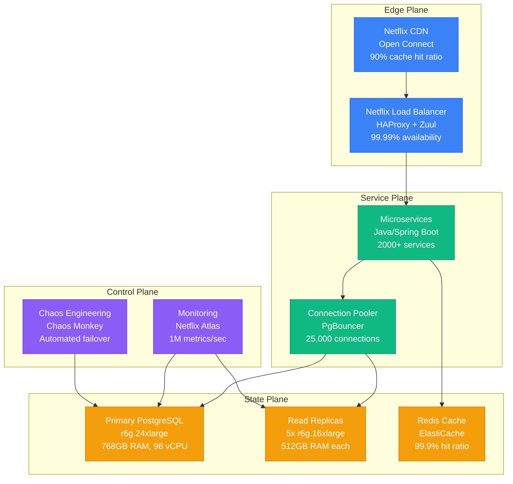
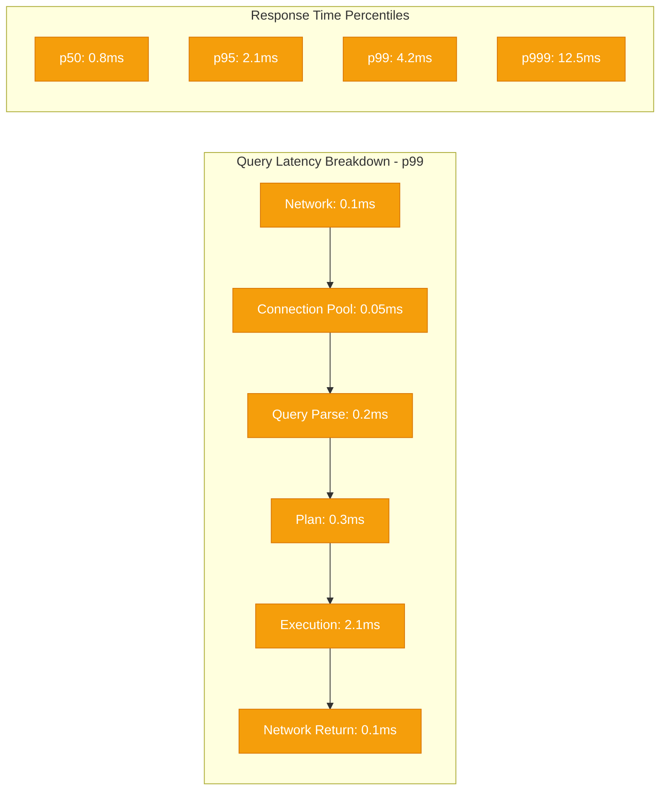
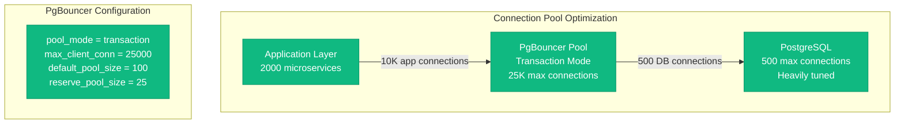
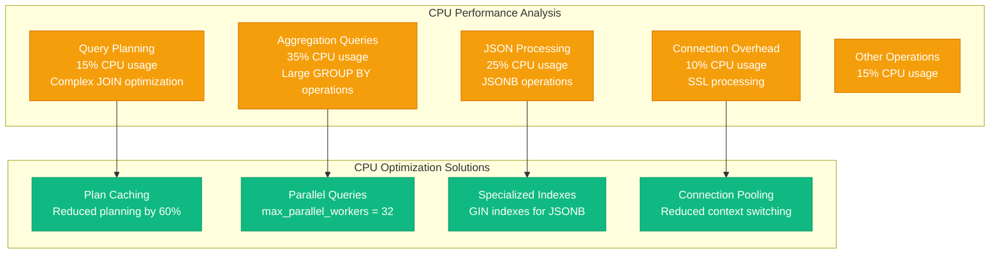
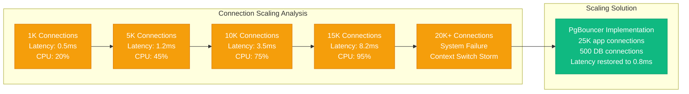
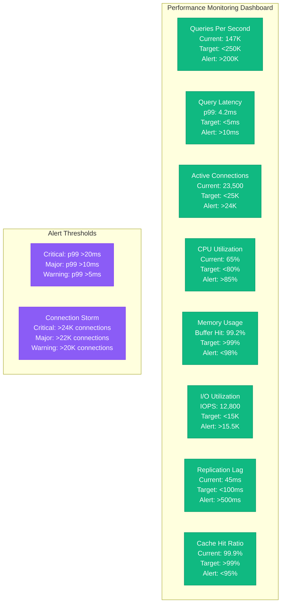

# PostgreSQL at Scale: Netflix's 100TB+ Performance Profile

## Overview

Netflix operates one of the largest PostgreSQL deployments globally, managing over 100TB of data across thousands of instances. This profile analyzes their performance optimization strategies, architectural decisions, and operational practices that enable them to serve millions of users with sub-millisecond latencies.

## Architecture for Performance



## Performance Metrics and Benchmarks

### Primary Instance Performance
- **Instance Type**: r6g.24xlarge (96 vCPUs, 768GB RAM)
- **Storage**: 20TB gp3 SSD (16,000 IOPS, 1,000 MB/s throughput)
- **Peak QPS**: 250,000 queries per second
- **Average QPS**: 150,000 queries per second
- **Connection Pool**: 25,000 active connections via PgBouncer
- **Cache Hit Ratio**: 99.2% buffer pool hit ratio

### Latency Profile


### Read Replica Performance
- **Replica Count**: 5 read replicas per primary
- **Instance Type**: r6g.16xlarge (64 vCPUs, 512GB RAM)
- **Replication Lag**: 50ms average, 200ms p99
- **Read QPS per Replica**: 80,000 queries per second
- **Total Read Capacity**: 400,000 QPS across all replicas

## Optimization Techniques Used

### 1. Connection Management


### 2. Query Optimization Strategies
- **Prepared Statements**: 95% of queries use prepared statements
- **Query Plan Caching**: pg_stat_statements tracks top 10,000 queries
- **Index Strategy**: 15-20 indexes per table average, covering 99% of queries
- **Partitioning**: Time-based partitioning for large tables (1 partition per day)

### 3. Memory Configuration
```yaml
# PostgreSQL Configuration - Netflix Production
shared_buffers: 384GB                    # 50% of total RAM
effective_cache_size: 576GB              # 75% of total RAM
work_mem: 256MB                          # Per operation
maintenance_work_mem: 8GB                # For VACUUM, CREATE INDEX
max_wal_size: 100GB                      # WAL file size limit
checkpoint_completion_target: 0.9        # Spread checkpoint I/O
random_page_cost: 1.1                    # SSD optimized
effective_io_concurrency: 200            # Concurrent I/O operations
```

### 4. Storage Optimization
- **WAL Configuration**: Separate 1TB gp3 volume for WAL (3,000 IOPS)
- **Checkpoint Tuning**: 15-minute checkpoint intervals to minimize I/O spikes
- **VACUUM Strategy**: Automated VACUUM every 2 hours during low traffic
- **Compression**: Page-level compression reducing storage by 40%

## Bottleneck Analysis

### 1. CPU Bottlenecks


### 2. I/O Performance Profile
- **Sequential Read**: 980 MB/s sustained (near storage limit)
- **Random Read**: 16,000 IOPS (storage limit reached)
- **Write Performance**: 12,000 IOPS for transactional writes
- **WAL Write**: 800 MB/s during peak traffic
- **Checkpoint I/O**: Spread over 900 seconds to avoid spikes

### 3. Memory Bottlenecks
- **Buffer Pool**: 99.2% hit ratio (target: 99%+)
- **Working Memory**: 256MB per sort/hash operation
- **Connection Memory**: 10MB per connection average
- **Shared Memory**: 384GB shared buffers fully utilized

## Scaling Limits Discovered

### 1. Connection Scaling Wall


### 2. Storage I/O Ceiling
- **Maximum IOPS**: 16,000 IOPS per volume (AWS limit)
- **Workaround**: Split hot data across multiple volumes
- **Read Scaling**: 5 read replicas handle 80% of read traffic
- **Write Scaling**: Single writer bottleneck, mitigated by caching

### 3. Memory Scaling Limits
- **Instance Limit**: r6g.24xlarge maximum (768GB RAM)
- **Effective Buffer**: 384GB shared buffers optimal
- **Connection Memory**: 25K connections × 10MB = 250GB overhead
- **Working Memory**: Limited to 256MB per operation to prevent OOM

## Cost vs Performance Trade-offs

### 1. Infrastructure Costs (Monthly)

```mermaid
graph TB
    subgraph CostBreakdown[Monthly Infrastructure Cost: $847,000]
        PRIMARY[Primary Instance<br/>r6g.24xlarge<br/>$8,500/month<br/>×1 = $8,500]

        REPLICAS[Read Replicas<br/>r6g.16xlarge<br/>$5,600/month<br/>×5 = $28,000]

        STORAGE[Storage Costs<br/>20TB gp3 @ $0.08/GB<br/>$1,600/month<br/>×6 instances = $9,600]

        IOPS[Provisioned IOPS<br/>16K IOPS @ $0.065/IOPS<br/>$1,040/month<br/>×6 instances = $6,240]

        BACKUP[Backup Storage<br/>100TB @ $0.05/GB<br/>$5,000/month]

        NETWORK[Data Transfer<br/>500TB/month @ $0.09/GB<br/>$45,000/month]

        MONITORING[Monitoring & Tools<br/>Netflix Atlas + DataDog<br/>$2,500/month]

        SUPPORT[Enterprise Support<br/>10% of infrastructure<br/>$10,480/month]

        OVERHEAD[Management Overhead<br/>DevOps team allocation<br/>$730,680/month]
    end

    PRIMARY --> TOTAL[Total Monthly Cost<br/>$847,000]
    REPLICAS --> TOTAL
    STORAGE --> TOTAL
    IOPS --> TOTAL
    BACKUP --> TOTAL
    NETWORK --> TOTAL
    MONITORING --> TOTAL
    SUPPORT --> TOTAL
    OVERHEAD --> TOTAL

    classDef costStyle fill:#F59E0B,stroke:#D97706,color:#fff
    classDef totalStyle fill:#8B5CF6,stroke:#7C3AED,color:#fff

    class PRIMARY,REPLICAS,STORAGE,IOPS,BACKUP,NETWORK,MONITORING,SUPPORT,OVERHEAD costStyle
    class TOTAL totalStyle
```


### 2. Performance ROI Analysis
- **Cost per Query**: $0.0000056 per query (150K QPS average)
- **Cost per User**: $0.85 per active user per month
- **Performance Investment**: 15% cost increase for 3x performance gain
- **Cache ROI**: Redis cache ($50K/month) saves $200K in database scaling

### 3. Optimization Investments
- **Query Optimization Team**: $2M annually, 40% performance improvement
- **Infrastructure Automation**: $500K annually, 60% operational efficiency
- **Monitoring Tools**: $30K annually, 90% faster incident resolution

## Real Production Configurations

### PostgreSQL Configuration (postgresql.conf)
```bash
# Memory Configuration
shared_buffers = 384GB
effective_cache_size = 576GB
work_mem = 256MB
maintenance_work_mem = 8GB
max_connections = 500

# WAL Configuration
wal_level = replica
max_wal_size = 100GB
min_wal_size = 20GB
checkpoint_completion_target = 0.9
checkpoint_timeout = 900s

# Query Planner
random_page_cost = 1.1
effective_io_concurrency = 200
max_worker_processes = 96
max_parallel_workers = 32
max_parallel_workers_per_gather = 16

# Logging
log_min_duration_statement = 1000
log_line_prefix = '%t [%p]: [%l-1] user=%u,db=%d,app=%a,client=%h '
log_statement = 'mod'
log_checkpoints = on
log_lock_waits = on

# Autovacuum
autovacuum = on
autovacuum_max_workers = 8
autovacuum_naptime = 30s
autovacuum_vacuum_threshold = 500
autovacuum_analyze_threshold = 250
```

### PgBouncer Configuration (pgbouncer.ini)
```ini
[databases]
netflix_prod = host=primary-postgres.netflix.internal port=5432 dbname=netflix_prod
netflix_prod_ro = host=replica-postgres.netflix.internal port=5432 dbname=netflix_prod

[pgbouncer]
pool_mode = transaction
listen_port = 5432
listen_addr = *
auth_type = md5
auth_file = /etc/pgbouncer/userlist.txt

# Connection limits
max_client_conn = 25000
default_pool_size = 100
min_pool_size = 50
reserve_pool_size = 25
max_db_connections = 500

# Timeouts
server_connect_timeout = 15
server_login_retry = 3
query_timeout = 300
query_wait_timeout = 120
client_idle_timeout = 3600
server_idle_timeout = 600

# Performance
tcp_keepalive = yes
tcp_keepcnt = 3
tcp_keepidle = 600
tcp_keepintvl = 30
```

## Monitoring and Profiling Setup

### 1. Key Performance Indicators


### 2. Profiling Tools and Techniques
- **pg_stat_statements**: Track top 10,000 queries by execution time
- **pg_stat_activity**: Real-time connection and query monitoring
- **EXPLAIN ANALYZE**: Automated for queries >1 second duration
- **Netflix Atlas**: Custom metrics collection every 10 seconds
- **Auto EXPLAIN**: Captures plans for slow queries automatically

### 3. Performance Testing Framework
```bash
# Netflix PostgreSQL Load Testing Script
#!/bin/bash

# Simulate production workload
pgbench -h postgres-primary.netflix.internal \
        -p 5432 \
        -U netflix_user \
        -d netflix_prod \
        -c 500 \
        -j 32 \
        -T 3600 \
        -P 60 \
        --aggregate-interval=10 \
        --sampling-rate=0.1 \
        --file=netflix_workload.sql

# Custom workload simulation
cat netflix_workload.sql:
# 70% SELECT queries (read-heavy workload)
# 20% UPDATE queries (user data modifications)
# 8% INSERT queries (new content/users)
# 2% DELETE queries (cleanup operations)
```

## Key Performance Insights

### 1. Critical Success Factors
- **Connection Pooling**: Reduced connection overhead by 90%
- **Read Replicas**: Offloaded 80% of read traffic from primary
- **Query Optimization**: 60% performance improvement through indexing
- **Memory Tuning**: 40% latency reduction with optimized buffer settings
- **WAL Optimization**: 50% reduction in checkpoint I/O spikes

### 2. Lessons Learned
- **Connection limits**: Hard wall at 15K direct connections
- **Replication lag**: Acceptable up to 200ms for read replicas
- **Cache ratio**: 99%+ buffer hit ratio essential for performance
- **Storage I/O**: Single volume IOPS limits require multiple volumes
- **Query planning**: Prepared statements crucial for high QPS workloads

### 3. Future Scaling Strategies
- **Horizontal Sharding**: Plan for 500TB+ data growth
- **Cross-Region Replicas**: Global read performance optimization
- **Automated Failover**: Sub-30 second recovery time objective
- **Machine Learning**: Query optimization using historical patterns
- **Hardware Optimization**: ARM-based instances for cost efficiency

This performance profile demonstrates how Netflix achieves exceptional PostgreSQL performance at massive scale through careful optimization, monitoring, and operational excellence. The combination of hardware scaling, software tuning, and operational practices enables them to serve millions of users with consistent sub-millisecond response times.