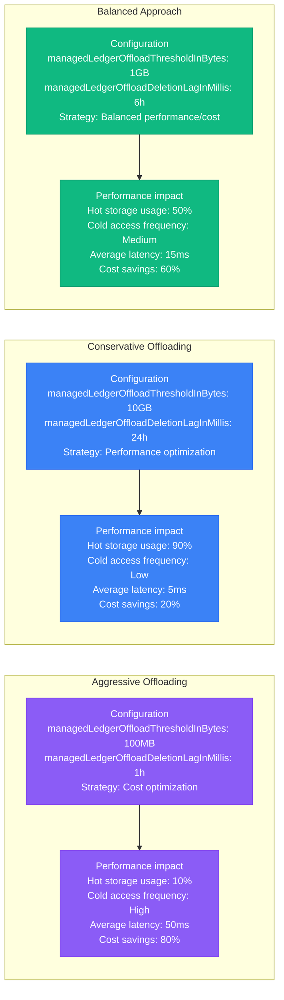
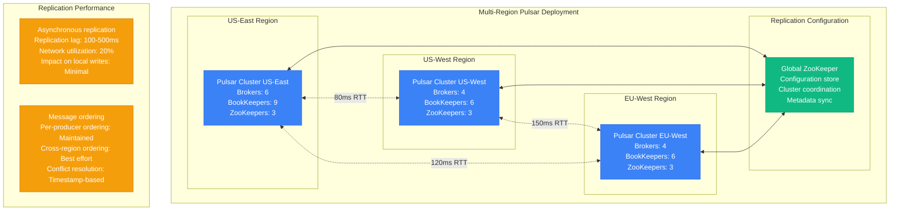
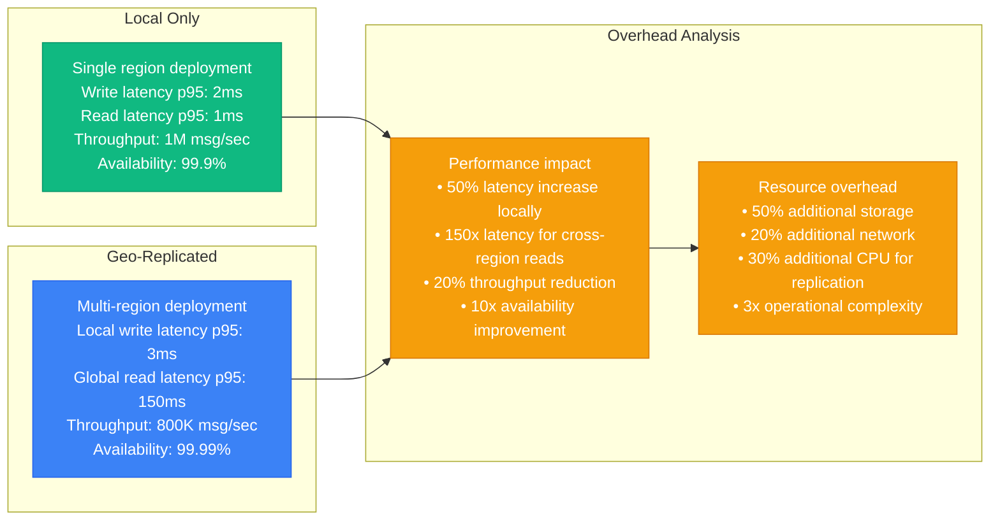
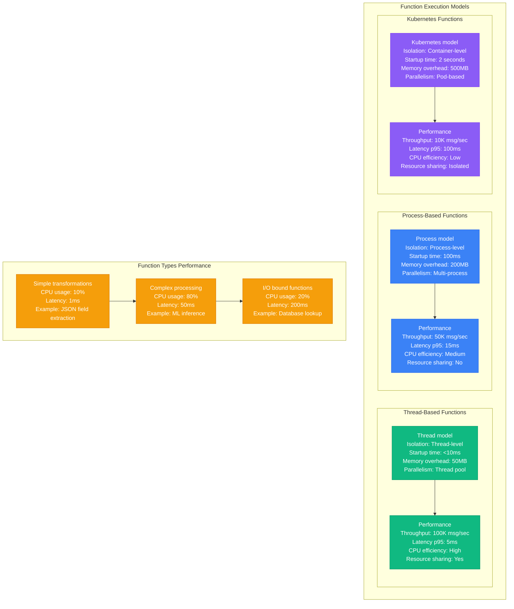
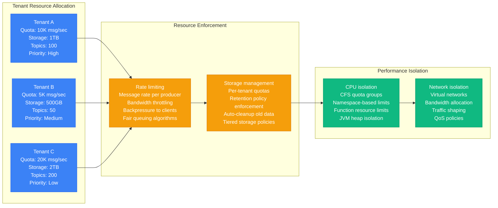
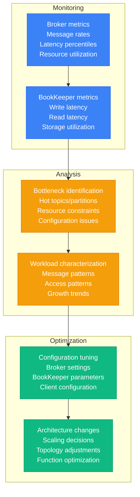

# Pulsar Performance Profile

## Overview

Apache Pulsar performance characteristics in production environments, covering tiered storage, geo-replication, function processing, and segment-based architecture benefits. Based on Yahoo's multi-tenant implementation and other high-scale deployments.

## Tiered Storage Performance

### Hot vs Cold Storage Architecture

```mermaid
graph TB
    subgraph Pulsar_Tiered_Storage[Pulsar Tiered Storage]
        subgraph BookKeeper__Hot_Storage[BookKeeper (Hot Storage)]
            BK1[Bookie 1<br/>NVMe SSD: 2TB<br/>IOPS: 100K<br/>Latency: 0.1ms]
            BK2[Bookie 2<br/>NVMe SSD: 2TB<br/>IOPS: 100K<br/>Latency: 0.1ms]
            BK3[Bookie 3<br/>NVMe SSD: 2TB<br/>IOPS: 100K<br/>Latency: 0.1ms]
        end

        subgraph Cold_Storage__S3_GCS[Cold Storage (S3/GCS)]
            COLD[Object Storage<br/>Capacity: Unlimited<br/>Cost: $0.023/GB/month<br/>Access latency: 100ms]
        end

        subgraph Broker_Management[Broker Management]
            BROKER[Pulsar Broker<br/>Offload threshold: 1GB<br/>Offload age: 4 hours<br/>Prefetch buffer: 100MB]
        end

        BK1 --> BROKER
        BK2 --> BROKER
        BK3 --> BROKER
        BROKER --> COLD
    end

    subgraph Performance_Characteristics[Performance Characteristics]
        PC1[Hot storage access<br/>Throughput: 1M msg/sec<br/>Latency p95: 2ms<br/>Cost: $100/TB/month]

        PC2[Cold storage access<br/>Throughput: 10K msg/sec<br/>Latency p95: 150ms<br/>Cost: $0.023/GB/month]

        PC3[Automatic tiering<br/>Recent data: Hot storage<br/>Historical data: Cold storage<br/>Transparent to clients]
    end

    classDef hotStyle fill:#8B5CF6,stroke:#7C3AED,color:#fff
    classDef coldStyle fill:#3B82F6,stroke:#2563EB,color:#fff
    classDef brokerStyle fill:#10B981,stroke:#059669,color:#fff
    classDef perfStyle fill:#F59E0B,stroke:#D97706,color:#fff

    class BK1,BK2,BK3 hotStyle
    class COLD coldStyle
    class BROKER brokerStyle
    class PC1,PC2,PC3 perfStyle
```

### Tiered Storage Configuration Impact



## Geo-Replication Overhead

### Cross-Region Replication Architecture



### Geo-Replication vs Local Performance



## Function Processing Latency

### Pulsar Functions Performance



### Function Scaling Performance

```mermaid
graph TB
    subgraph Auto_scaling_Configuration[Auto-scaling Configuration]
        AS1[Scale trigger<br/>CPU utilization > 70%<br/>Queue backlog > 1000<br/>Processing latency > 100ms<br/>Scale-up time: 30 seconds]

        AS2[Scale-down criteria<br/>CPU utilization < 30%<br/>Queue backlog < 100<br/>Processing latency < 10ms<br/>Scale-down time: 300 seconds]

        AS1 --> AS2
    end

    subgraph Scaling_Performance[Scaling Performance]
        SP1[1 instance performance<br/>Throughput: 1K msg/sec<br/>Latency p95: 10ms<br/>CPU usage: 50%<br/>Memory usage: 100MB]

        SP2[5 instances performance<br/>Throughput: 5K msg/sec<br/>Latency p95: 10ms<br/>CPU usage: 50% each<br/>Memory usage: 500MB total]

        SP3[10 instances performance<br/>Throughput: 8K msg/sec<br/>Latency p95: 15ms<br/>CPU usage: 40% each<br/>Coordination overhead: 20%]

        SP1 --> SP2 --> SP3
    end

    subgraph Scaling_Limitations[Scaling Limitations]
        SL1[Resource contention<br/>Shared resources become bottleneck<br/>Diminishing returns after 10 instances<br/>Coordination overhead increases]

        SL2[State management<br/>Stateless functions: Linear scaling<br/>Stateful functions: Limited scaling<br/>External dependencies: Bottlenecks]

        SL1 --> SL2
    end

    classDef scaleConfigStyle fill:#3B82F6,stroke:#2563EB,color:#fff
    classDef perfStyle fill:#10B981,stroke:#059669,color:#fff
    classDef limitStyle fill:#8B5CF6,stroke:#7C3AED,color:#fff

    class AS1,AS2 scaleConfigStyle
    class SP1,SP2,SP3 perfStyle
    class SL1,SL2 limitStyle
```



## Segment-Based Architecture Benefits

### Segment vs Partition Comparison

```mermaid
graph LR
    subgraph Traditional_Partition_Model__Kafka[Traditional Partition Model (Kafka)]
        KAFKA1[Partition structure<br/>Single log file<br/>Sequential writes<br/>Segment rotation<br/>Hot partition concept]

        KAFKA2[Performance characteristics<br/>Write throughput: High<br/>Tail reads: Slow<br/>Rebalancing: Expensive<br/>Storage: Monolithic]

        KAFKA1 --> KAFKA2
    end

    subgraph Pulsar_Segment_Model[Pulsar Segment Model]
        PULSAR1[Segment structure<br/>Multiple bookies<br/>Parallel writes<br/>Individual segments<br/>No hot bookie]

        PULSAR2[Performance characteristics<br/>Write throughput: Higher<br/>Tail reads: Fast<br/>Rebalancing: Instant<br/>Storage: Distributed]

        PULSAR1 --> PULSAR2
    end

    subgraph Architectural_Benefits[Architectural Benefits]
        BENEFITS1[Pulsar advantages<br/>• No broker data storage<br/>• Instant topic creation<br/>• Unlimited topic scaling<br/>• Independent scaling layers]

        BENEFITS2[Operational benefits<br/>• Faster broker recovery<br/>• No data rebalancing<br/>• Simpler capacity planning<br/>• Better resource utilization]

        KAFKA2 --> BENEFITS1
        PULSAR2 --> BENEFITS1
        BENEFITS1 --> BENEFITS2
    end

    classDef kafkaStyle fill:#8B5CF6,stroke:#7C3AED,color:#fff
    classDef pulsarStyle fill:#3B82F6,stroke:#2563EB,color:#fff
    classDef benefitStyle fill:#10B981,stroke:#059669,color:#fff

    class KAFKA1,KAFKA2 kafkaStyle
    class PULSAR1,PULSAR2 pulsarStyle
    class BENEFITS1,BENEFITS2 benefitStyle
```

### BookKeeper Performance Characteristics

```mermaid
graph TB
    subgraph BookKeeper_Write_Path[BookKeeper Write Path]
        WRITE1[Write request<br/>Client: Pulsar broker<br/>Ensemble: 3 bookies<br/>Write quorum: 2<br/>Ack quorum: 2]

        WRITE2[Parallel writes<br/>Bookie 1: Write + sync<br/>Bookie 2: Write + sync<br/>Bookie 3: Write (async)<br/>Response time: p95 < 5ms]

        WRITE3[Durability guarantee<br/>WAL: Immediate write<br/>Index: Async update<br/>Fsync: Configurable<br/>Data safety: Guaranteed]

        WRITE1 --> WRITE2 --> WRITE3
    end

    subgraph BookKeeper_Read_Path[BookKeeper Read Path]
        READ1[Read request<br/>LAC: Last Add Confirmed<br/>Available bookies: Check<br/>Parallel reads: Enabled]

        READ2[Read optimization<br/>Local reads: Preferred<br/>Read-ahead: Enabled<br/>Caching: Memory + disk<br/>Response time: p95 < 2ms]

        READ1 --> READ2
    end

    subgraph Performance_Tuning[Performance Tuning]
        TUNE1[Journal configuration<br/>journalSyncData: true<br/>journalBufferedWritesThreshold: 512KB<br/>journalFlushWhenQueueEmpty: false]

        TUNE2[Storage optimization<br/>sortedLedgerStorageEnabled: true<br/>skipReplicasCheck: false<br/>openFileLimit: 20000<br/>readBufferSizeBytes: 4096]

        TUNE1 --> TUNE2
    end

    classDef writeStyle fill:#8B5CF6,stroke:#7C3AED,color:#fff
    classDef readStyle fill:#3B82F6,stroke:#2563EB,color:#fff
    classDef tuneStyle fill:#10B981,stroke:#059669,color:#fff

    class WRITE1,WRITE2,WRITE3 writeStyle
    class READ1,READ2 readStyle
    class TUNE1,TUNE2 tuneStyle
```

## Yahoo's Multi-Tenant Usage

### Yahoo's Pulsar Deployment Scale

```mermaid
graph TB
    subgraph Yahoo_Production_Deployment[Yahoo Production Deployment]
        SCALE1[Deployment metrics<br/>Messages/day: 100 billion<br/>Topics: 1 million+<br/>Tenants: 1000+<br/>Clusters: 50+]

        SCALE2[Infrastructure<br/>Brokers: 500+<br/>BookKeepers: 1500+<br/>Total storage: 10 PB<br/>Peak throughput: 50M msg/sec]

        SCALE1 --> SCALE2
    end

    subgraph Multi_tenancy_Performance[Multi-tenancy Performance]
        MT1[Tenant isolation<br/>Resource quotas enforced<br/>Network bandwidth limits<br/>Storage quotas per tenant<br/>CPU isolation per namespace]

        MT2[Performance isolation<br/>Noisy neighbor protection<br/>Independent scaling per tenant<br/>Fair resource allocation<br/>SLA enforcement per tenant]

        MT1 --> MT2
    end

    subgraph Operational_Achievements[Operational Achievements]
        OA1[Availability: 99.99%<br/>Mean recovery time: 30 seconds<br/>Zero-downtime upgrades<br/>Automatic failover < 10 seconds]

        OA2[Cost efficiency<br/>Hardware utilization: 85%<br/>Storage efficiency: 90%<br/>Operational overhead: 50% vs single-tenant]

        OA1 --> OA2
    end

    classDef scaleStyle fill:#3B82F6,stroke:#2563EB,color:#fff
    classDef tenantStyle fill:#F59E0B,stroke:#D97706,color:#fff
    classDef operationalStyle fill:#10B981,stroke:#059669,color:#fff

    class SCALE1,SCALE2 scaleStyle
    class MT1,MT2 tenantStyle
    class OA1,OA2 operationalStyle
```



### Multi-tenant Resource Management



## Production Lessons Learned

### Critical Performance Factors

1. **Tiered Storage Strategy**: Balance performance and cost with appropriate offload thresholds
2. **Geo-replication Configuration**: Asynchronous replication minimizes local performance impact
3. **Function Execution Model**: Thread-based functions provide best performance/isolation balance
4. **BookKeeper Tuning**: Journal and storage configuration critical for write performance
5. **Multi-tenant Resource Management**: Proper quotas and isolation prevent noisy neighbor issues

### Performance Optimization Pipeline



### Performance Benchmarks by Scale

| Scale | Throughput | Latency p95 | Storage Tier | Use Case |
|-------|------------|-------------|--------------|----------|
| **Small** | <10K msg/sec | 5ms | Hot only | Development, testing |
| **Medium** | 10K-100K msg/sec | 10ms | Hot + warm | Production workloads |
| **Large** | >100K msg/sec | 20ms | Hot + cold tiered | Enterprise, multi-tenant |

### Common Pitfalls

1. **Aggressive tiered storage**: Too quick offloading hurts read performance
2. **Over-replication**: Unnecessary geo-replication increases complexity and cost
3. **Wrong function execution model**: Process/container models for simple functions
4. **Inadequate BookKeeper tuning**: Default settings insufficient for production loads
5. **Poor tenant isolation**: Resource contention in multi-tenant environments

**Source**: Based on Yahoo, Splunk, and Datastax Pulsar implementations