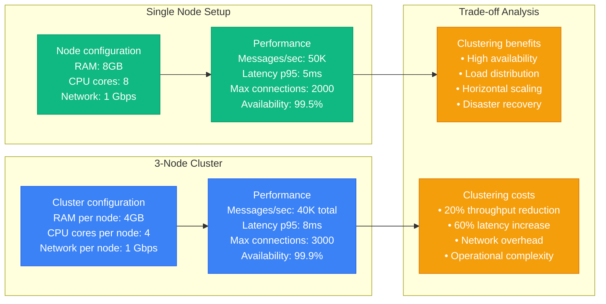
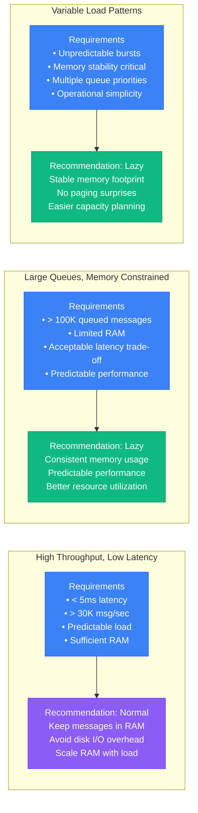
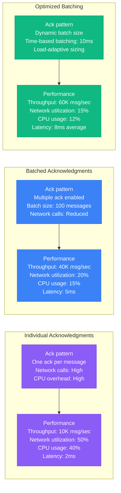
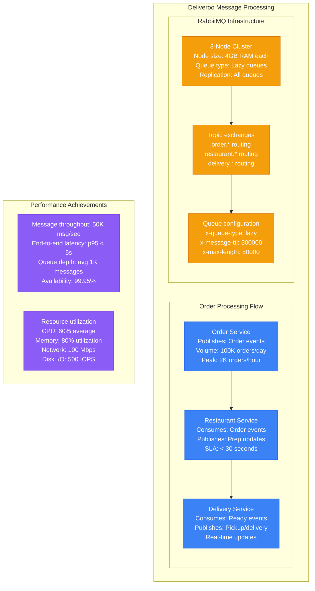
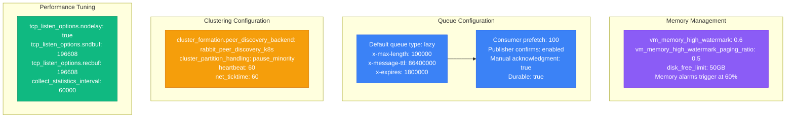
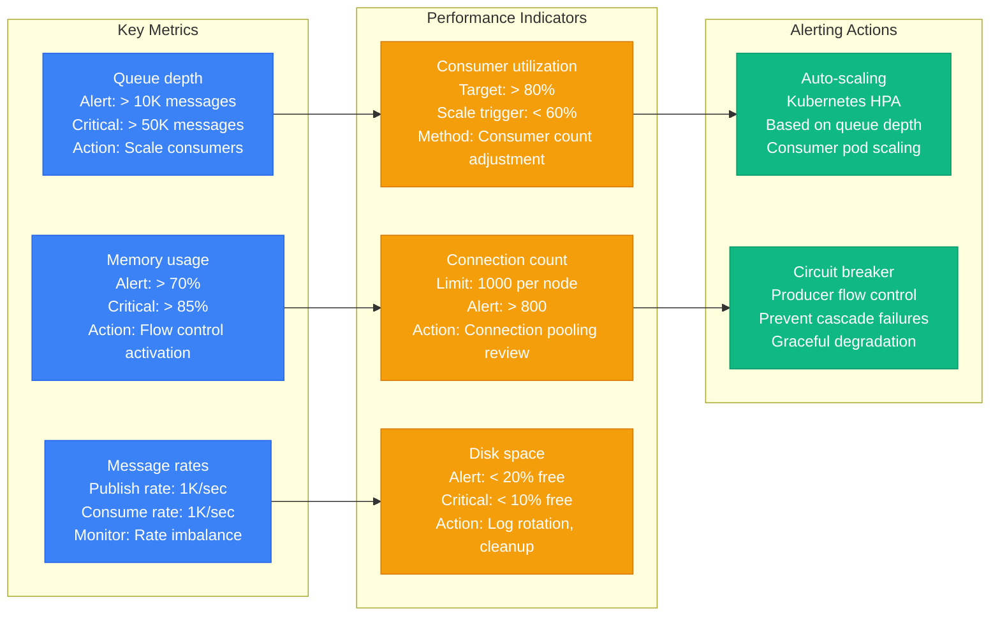

# RabbitMQ Performance Profile

## Overview

RabbitMQ performance characteristics in production environments, covering queue depth management, clustering overhead, lazy queues, and message acknowledgment patterns. Based on Deliveroo's implementation and other high-scale deployments.

## Queue Depth Impact

### Queue Depth vs Performance Relationship

```mermaid
graph TB
    subgraph Shallow_Queue____1K_messages["Shallow Queue (< 1K messages)"]
        SHALLOW1[Queue depth: 500 messages<br/>Memory usage: 50MB<br/>Enqueue rate: 10K msg/sec<br/>Dequeue rate: 10K msg/sec]

        SHALLOW2[Performance characteristics<br/>Latency p95: 2ms<br/>Memory overhead: Low<br/>Paging to disk: None<br/>Status: Optimal]

        SHALLOW1 --> SHALLOW2
    end

    subgraph Medium_Queue__1K___100K_messages[Medium Queue (1K - 100K messages)]
        MEDIUM1[Queue depth: 50K messages<br/>Memory usage: 500MB<br/>Enqueue rate: 8K msg/sec<br/>Dequeue rate: 7K msg/sec]

        MEDIUM2[Performance characteristics<br/>Latency p95: 10ms<br/>Memory overhead: Medium<br/>Paging to disk: Minimal<br/>Status: Acceptable]

        MEDIUM1 --> MEDIUM2
    end

    subgraph Deep_Queue____100K_messages["Deep Queue (> 100K messages)"]
        DEEP1[Queue depth: 1M messages<br/>Memory usage: 2GB<br/>Enqueue rate: 5K msg/sec<br/>Dequeue rate: 4K msg/sec]

        DEEP2[Performance characteristics<br/>Latency p95: 100ms<br/>Memory overhead: High<br/>Paging to disk: Aggressive<br/>Status: Degraded]

        DEEP1 --> DEEP2
    end

    subgraph Critical_Queue____1M_messages["Critical Queue (> 1M messages)"]
        CRITICAL1[Queue depth: 10M messages<br/>Memory usage: 8GB<br/>Enqueue rate: 1K msg/sec<br/>Dequeue rate: 500 msg/sec]

        CRITICAL2[Performance characteristics<br/>Latency p95: 1000ms<br/>Memory overhead: Critical<br/>Paging to disk: Constant<br/>Status: System at risk]

        CRITICAL1 --> CRITICAL2
    end

    classDef shallowStyle fill:#10B981,stroke:#059669,color:#fff
    classDef mediumStyle fill:#3B82F6,stroke:#2563EB,color:#fff
    classDef deepStyle fill:#F59E0B,stroke:#D97706,color:#fff
    classDef criticalStyle fill:#8B5CF6,stroke:#7C3AED,color:#fff

    class SHALLOW1,SHALLOW2 shallowStyle
    class MEDIUM1,MEDIUM2 mediumStyle
    class DEEP1,DEEP2 deepStyle
    class CRITICAL1,CRITICAL2 criticalStyle
```

### Queue Depth Management Strategies

```mermaid
graph TB
    subgraph Producer_Flow_Control[Producer Flow Control]
        PFC1[Connection blocked<br/>Trigger: Memory alarm<br/>Action: Stop accepting messages<br/>Recovery: Memory below threshold]

        PFC2[Publisher confirms<br/>Mode: Synchronous<br/>Impact: Reduced throughput<br/>Benefit: Backpressure signal]

        PFC3[Max queue length<br/>Policy: x-max-length: 100000<br/>Overflow: Drop head/reject<br/>Protection: Memory exhaustion]

        PFC1 --> PFC2 --> PFC3
    end

    subgraph Consumer_Scaling[Consumer Scaling]
        CS1[Auto-scaling consumers<br/>Metric: Queue depth<br/>Scale up: > 10K messages<br/>Scale down: < 1K messages]

        CS2[Prefetch optimization<br/>QoS: 100 messages<br/>Balance: Memory vs throughput<br/>Tuning: Consumer capability]

        CS1 --> CS2
    end

    subgraph Queue_Design_Patterns[Queue Design Patterns]
        QDP1[Work queues<br/>Pattern: Competing consumers<br/>Depth management: Critical<br/>Scaling: Horizontal]

        QDP2[Topic exchanges<br/>Pattern: Pub/sub<br/>Depth management: Per subscriber<br/>Scaling: Queue-specific]

        QDP1 --> QDP2
    end

    classDef flowControlStyle fill:#8B5CF6,stroke:#7C3AED,color:#fff
    classDef consumerStyle fill:#3B82F6,stroke:#2563EB,color:#fff
    classDef designStyle fill:#10B981,stroke:#059669,color:#fff

    class PFC1,PFC2,PFC3 flowControlStyle
    class CS1,CS2 consumerStyle
    class QDP1,QDP2 designStyle
```



## Clustering Overhead

### RabbitMQ Cluster Architecture

```mermaid
graph TB
    subgraph sg_3_Node_RabbitMQ_Cluster[3-Node RabbitMQ Cluster]
        subgraph Node_1___Primary[Node 1 - Primary]
            N1[Node rabbit@node1<br/>RAM usage: 4GB<br/>CPU usage: 60%<br/>Disk I/O: 200 IOPS]

            N1Q[Queues: 500<br/>Messages/sec: 20K<br/>Connections: 1000<br/>Role: Queue master]
        end

        subgraph Node_2___Replica[Node 2 - Replica]
            N2[Node rabbit@node2<br/>RAM usage: 3GB<br/>CPU usage: 40%<br/>Disk I/O: 150 IOPS]

            N2Q[Queues: 300 (replicas)<br/>Messages/sec: 15K<br/>Connections: 800<br/>Role: Replica + new queues]
        end

        subgraph Node_3___Replica[Node 3 - Replica]
            N3[Node rabbit@node3<br/>RAM usage: 3GB<br/>CPU usage: 40%<br/>Disk I/O: 150 IOPS]

            N3Q[Queues: 300 (replicas)<br/>Messages/sec: 15K<br/>Connections: 800<br/>Role: Replica + new queues]
        end

        subgraph Cluster_Communication[Cluster Communication]
            COMM[Erlang distribution<br/>Port: 25672<br/>Heartbeat: 60s<br/>Network overhead: 50 Mbps]
        end

        N1 <--> COMM
        N2 <--> COMM
        N3 <--> COMM
    end

    subgraph Performance_Impact[Performance Impact]
        PI1[Replication overhead<br/>Network: 25% increase<br/>CPU: 15% increase<br/>Memory: 10% increase]

        PI2[Failover characteristics<br/>Detection time: 60 seconds<br/>Recovery time: 30 seconds<br/>Message loss: None (with confirms)]
    end

    classDef nodeStyle fill:#3B82F6,stroke:#2563EB,color:#fff
    classDef queueStyle fill:#10B981,stroke:#059669,color:#fff
    classDef commStyle fill:#F59E0B,stroke:#D97706,color:#fff
    classDef perfStyle fill:#8B5CF6,stroke:#7C3AED,color:#fff

    class N1,N2,N3 nodeStyle
    class N1Q,N2Q,N3Q queueStyle
    class COMM commStyle
    class PI1,PI2 perfStyle
```

### Single Node vs Cluster Performance



### Network Partition Handling

```mermaid
graph TB
    subgraph Cluster_Partition_Scenario[Cluster Partition Scenario]
        BEFORE[Normal operation<br/>Nodes: 3 connected<br/>Queues: Replicated<br/>Messages: Flowing normally]

        PARTITION[Network partition<br/>Node 1: Isolated<br/>Nodes 2+3: Connected<br/>Split brain risk]

        AFTER[Partition handling<br/>Minority node: Paused<br/>Majority nodes: Continue<br/>Automatic recovery on heal]

        BEFORE --> PARTITION --> AFTER
    end

    subgraph Partition_Modes[Partition Modes]
        MODE1[pause_minority (default)<br/>Minority nodes pause<br/>Majority continues<br/>CAP: Consistency + Partition tolerance]

        MODE2[ignore<br/>Both sides continue<br/>Split brain allowed<br/>CAP: Availability + Partition tolerance]

        MODE3[autoheal<br/>Automatic healing<br/>Restart minority<br/>CAP: Eventual consistency]
    end

    subgraph Performance_Impact[Performance Impact]
        PERF1[Partition detection: 60s<br/>Recovery time: 120s<br/>Message loss: None<br/>Downtime: Minority nodes only]
    end

    classDef scenarioStyle fill:#8B5CF6,stroke:#7C3AED,color:#fff
    classDef modeStyle fill:#3B82F6,stroke:#2563EB,color:#fff
    classDef perfStyle fill:#10B981,stroke:#059669,color:#fff

    class BEFORE,PARTITION,AFTER scenarioStyle
    class MODE1,MODE2,MODE3 modeStyle
    class PERF1 perfStyle
```

## Lazy Queues vs Normal Queues

### Memory Usage Comparison

```mermaid
graph TB
    subgraph Normal_Queue_Behavior[Normal Queue Behavior]
        NORMAL1[Message flow<br/>1. Receive message<br/>2. Store in RAM<br/>3. Optionally persist<br/>4. Deliver from RAM]

        NORMAL2[Memory usage pattern<br/>RAM per message: 1KB<br/>1M messages: 1GB RAM<br/>Paging threshold: 40% RAM<br/>Performance: High until paging]

        NORMAL1 --> NORMAL2
    end

    subgraph Lazy_Queue_Behavior[Lazy Queue Behavior]
        LAZY1[Message flow<br/>1. Receive message<br/>2. Write to disk immediately<br/>3. Keep minimal RAM buffer<br/>4. Read from disk for delivery]

        LAZY2[Memory usage pattern<br/>RAM per message: 100 bytes<br/>1M messages: 100MB RAM<br/>Disk I/O: Always active<br/>Performance: Consistent]

        LAZY1 --> LAZY2
    end

    subgraph Performance_Characteristics[Performance Characteristics]
        PERF_NORMAL[Normal queue<br/>Throughput: 50K msg/sec (light)<br/>Throughput: 5K msg/sec (heavy)<br/>Memory: Variable<br/>Predictability: Poor]

        PERF_LAZY[Lazy queue<br/>Throughput: 20K msg/sec (consistent)<br/>Memory: Constant<br/>Disk I/O: Predictable<br/>Predictability: Excellent]

        NORMAL2 --> PERF_NORMAL
        LAZY2 --> PERF_LAZY
    end

    classDef normalStyle fill:#3B82F6,stroke:#2563EB,color:#fff
    classDef lazyStyle fill:#10B981,stroke:#059669,color:#fff
    classDef perfStyle fill:#F59E0B,stroke:#D97706,color:#fff

    class NORMAL1,NORMAL2 normalStyle
    class LAZY1,LAZY2 lazyStyle
    class PERF_NORMAL,PERF_LAZY perfStyle
```

### Use Case Decision Matrix



## Message Acknowledgment Patterns

### Acknowledgment Mode Performance

```mermaid
graph TB
    subgraph Auto_Acknowledge[Auto-Acknowledge]
        AUTO1[Message delivery<br/>1. Send to consumer<br/>2. Mark as delivered<br/>3. Remove from queue<br/>4. No confirmation needed]

        AUTO2[Performance characteristics<br/>Throughput: 100K msg/sec<br/>Latency p95: 1ms<br/>Memory usage: Minimal<br/>Reliability: At-most-once]

        AUTO1 --> AUTO2
    end

    subgraph Manual_Acknowledge[Manual Acknowledge]
        MANUAL1[Message delivery<br/>1. Send to consumer<br/>2. Wait for ack/nack<br/>3. Process acknowledgment<br/>4. Remove from queue]

        MANUAL2[Performance characteristics<br/>Throughput: 50K msg/sec<br/>Latency p95: 3ms<br/>Memory usage: Moderate<br/>Reliability: At-least-once]

        MANUAL1 --> MANUAL2
    end

    subgraph Publisher_Confirms[Publisher Confirms]
        PUB_CONFIRM1[Message publishing<br/>1. Send to exchange<br/>2. Route to queues<br/>3. Persist to disk<br/>4. Send confirmation]

        PUB_CONFIRM2[Performance characteristics<br/>Throughput: 20K msg/sec<br/>Latency p95: 10ms<br/>Memory usage: High<br/>Reliability: Guaranteed delivery]

        PUB_CONFIRM1 --> PUB_CONFIRM2
    end

    subgraph Transactions
        TXN1[Transactional publishing<br/>1. Begin transaction<br/>2. Send messages<br/>3. Commit transaction<br/>4. Confirm all or none]

        TXN2[Performance characteristics<br/>Throughput: 5K msg/sec<br/>Latency p95: 50ms<br/>Memory usage: High<br/>Reliability: ACID properties]

        TXN1 --> TXN2
    end

    classDef autoStyle fill:#10B981,stroke:#059669,color:#fff
    classDef manualStyle fill:#3B82F6,stroke:#2563EB,color:#fff
    classDef confirmStyle fill:#F59E0B,stroke:#D97706,color:#fff
    classDef txnStyle fill:#8B5CF6,stroke:#7C3AED,color:#fff

    class AUTO1,AUTO2 autoStyle
    class MANUAL1,MANUAL2 manualStyle
    class PUB_CONFIRM1,PUB_CONFIRM2 confirmStyle
    class TXN1,TXN2 txnStyle
```



### Acknowledgment Batching Optimization



## Deliveroo's Implementation

### Deliveroo's RabbitMQ Architecture



### Critical Configuration Parameters



### Monitoring and Alerting Strategy



## Production Lessons Learned

### Performance Optimization Checklist

```mermaid
graph TB
    subgraph Queue_Design[Queue Design]
        QD1[Use lazy queues for<br/>• Large message backlogs<br/>• Unpredictable load<br/>• Memory-constrained systems]

        QD2[Use normal queues for<br/>• Low-latency requirements<br/>• Predictable small loads<br/>• Abundant RAM available]

        QD1 --> QD2
    end

    subgraph Consumer_Optimization[Consumer Optimization]
        CO1[Prefetch sizing<br/>• High throughput: 100-1000<br/>• Low memory: 10-50<br/>• Balance throughput vs memory]

        CO2[Acknowledgment strategy<br/>• High reliability: Manual ack<br/>• High throughput: Auto ack<br/>• Batch acknowledgments when possible]

        CO1 --> CO2
    end

    subgraph Infrastructure_Sizing[Infrastructure Sizing]
        IS1[Single node sufficient for<br/>• < 10K msg/sec<br/>• < 99.5% availability requirement<br/>• Development/testing]

        IS2[Clustering required for<br/>• > 10K msg/sec<br/>• > 99.9% availability<br/>• Production workloads]

        IS1 --> IS2
    end

    classDef queueStyle fill:#3B82F6,stroke:#2563EB,color:#fff
    classDef consumerStyle fill:#F59E0B,stroke:#D97706,color:#fff
    classDef infraStyle fill:#10B981,stroke:#059669,color:#fff

    class QD1,QD2 queueStyle
    class CO1,CO2 consumerStyle
    class IS1,IS2 infraStyle
```



### Critical Performance Factors

1. **Queue Type Selection**: Lazy queues for large backlogs, normal for low-latency
2. **Consumer Prefetch**: Balance throughput and memory usage (50-200 optimal range)
3. **Clustering Strategy**: 3-node clusters provide best availability vs complexity
4. **Memory Management**: Monitor and alert on 70% memory usage
5. **Acknowledgment Patterns**: Batch acknowledgments improve throughput significantly

### Performance Benchmarks by Configuration

| Configuration | Throughput | Latency p95 | Memory Usage | Use Case |
|---------------|------------|-------------|--------------|----------|
| **Single Node, Normal** | 50K msg/sec | 2ms | High | Development, low-latency |
| **Single Node, Lazy** | 20K msg/sec | 10ms | Low | Large queues, memory-constrained |
| **Cluster, Normal** | 40K msg/sec | 8ms | High | High availability, low-latency |
| **Cluster, Lazy** | 15K msg/sec | 15ms | Low | High availability, large queues |

### Common Pitfalls

1. **Deep queues without lazy setting**: Memory exhaustion and performance degradation
2. **Over-clustering**: Unnecessary complexity for simple workloads
3. **High prefetch on memory-constrained systems**: OOM conditions
4. **No publisher confirms in critical systems**: Message loss during failures
5. **Inadequate monitoring**: Performance issues discovered too late

**Source**: Based on Deliveroo, Shopify, and RabbitMQ production implementations