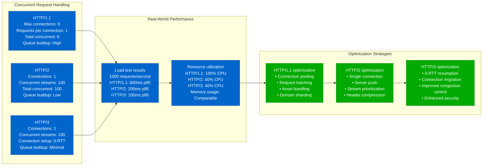
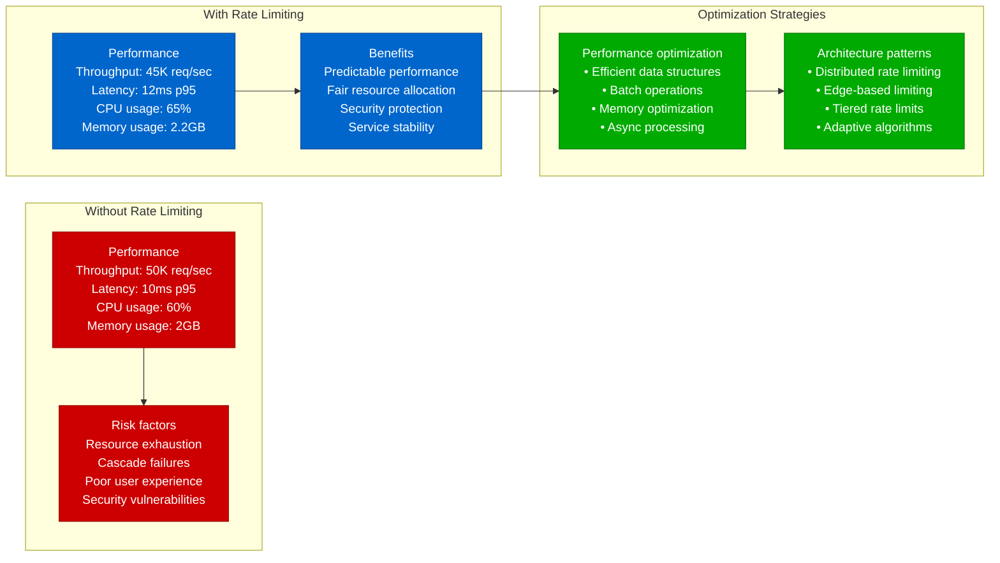
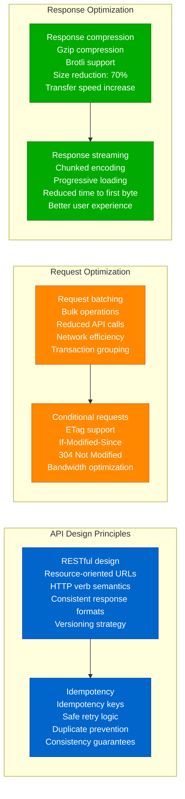

# REST API Performance Profile

## Overview

REST API performance characteristics in production environments, covering HTTP protocol versions, caching strategies, pagination optimization, and rate limiting overhead. Based on Stripe's API latency achievements and other high-scale REST implementations.

## HTTP/1.1 vs HTTP/2 vs HTTP/3

### HTTP Protocol Performance Comparison

```mermaid
graph TB
    subgraph "HTTP/1.1 Characteristics"
        HTTP1_1[HTTP/1.1 Features<br/>Text-based protocol<br/>Request-response blocking<br/>Persistent connections<br/>Pipeline support (limited)]

        HTTP1_PERF[Performance metrics<br/>Latency: 100-500ms<br/>Concurrent connections: 6<br/>Header compression: None<br/>Connection reuse: Limited]

        HTTP1_ISSUES[Performance issues<br/>Head-of-line blocking<br/>Header redundancy<br/>Connection overhead<br/>Limited parallelism]

        HTTP1_1 --> HTTP1_PERF --> HTTP1_ISSUES
    end

    subgraph "HTTP/2 Characteristics"
        HTTP2_1[HTTP/2 Features<br/>Binary protocol<br/>Stream multiplexing<br/>Header compression (HPACK)<br/>Server push capability]

        HTTP2_PERF[Performance metrics<br/>Latency: 50-200ms<br/>Concurrent streams: 100+<br/>Header compression: 85%<br/>Connection reuse: Excellent]

        HTTP2_BENEFITS[Performance benefits<br/>Eliminates head-of-line blocking<br/>Reduces connection overhead<br/>Efficient header handling<br/>Request prioritization]

        HTTP2_1 --> HTTP2_PERF --> HTTP2_BENEFITS
    end

    subgraph "HTTP/3 Characteristics"
        HTTP3_1[HTTP/3 Features<br/>QUIC transport protocol<br/>UDP-based<br/>Built-in encryption<br/>Connection migration]

        HTTP3_PERF[Performance metrics<br/>Latency: 20-100ms<br/>Connection setup: 0-RTT<br/>Packet loss handling: Improved<br/>Mobile performance: Excellent]

        HTTP3_ADVANTAGES[Performance advantages<br/>Eliminates TCP head-of-line blocking<br/>Faster connection establishment<br/>Better congestion control<br/>Network change resilience]

        HTTP3_1 --> HTTP3_PERF --> HTTP3_ADVANTAGES
    end

    classDef http1Style fill:#CC0000,stroke:#990000,color:#fff
    classDef http2Style fill:#0066CC,stroke:#004499,color:#fff
    classDef http3Style fill:#00AA00,stroke:#007700,color:#fff

    class HTTP1_1,HTTP1_PERF,HTTP1_ISSUES http1Style
    class HTTP2_1,HTTP2_PERF,HTTP2_BENEFITS http2Style
    class HTTP3_1,HTTP3_PERF,HTTP3_ADVANTAGES http3Style
```

### Protocol Performance Impact



## Caching Strategies (ETags)

### ETag-based Caching Implementation

```mermaid
graph TB
    subgraph "ETag Generation"
        ETAG1[Resource state<br/>User profile data<br/>Last modified: 2024-01-15T10:00:00Z<br/>Content hash: abc123def456<br/>Version: 1.2.3]

        ETAG2[ETag calculation<br/>Strong ETag: "abc123def456"<br/>Weak ETag: W/"v1.2.3"<br/>Based on content hash<br/>Deterministic generation]

        ETAG3[Response headers<br/>ETag: "abc123def456"<br/>Cache-Control: max-age=300<br/>Last-Modified: Mon, 15 Jan 2024<br/>Vary: Accept, Authorization]

        ETAG1 --> ETAG2 --> ETAG3
    end

    subgraph "Conditional Request Flow"
        REQ1[Client request<br/>GET /api/users/123<br/>If-None-Match: "abc123def456"<br/>If-Modified-Since: Mon, 15 Jan 2024]

        REQ2[Server processing<br/>Check current ETag<br/>Current: "abc123def456"<br/>Requested: "abc123def456"<br/>Match: True]

        REQ3[304 Not Modified response<br/>Status: 304<br/>ETag: "abc123def456"<br/>Body: Empty<br/>Bandwidth saved: 95%]

        REQ1 --> REQ2 --> REQ3
    end

    subgraph "Cache Performance"
        CACHE1[Cache hit performance<br/>Response time: 10ms<br/>Bandwidth usage: 1KB<br/>Server processing: Minimal<br/>Database queries: 0]

        CACHE2[Cache miss performance<br/>Response time: 100ms<br/>Bandwidth usage: 20KB<br/>Server processing: Full<br/>Database queries: 3-5]

        CACHE3[Overall impact<br/>Cache hit ratio: 85%<br/>Bandwidth reduction: 80%<br/>Server load reduction: 75%<br/>Database load reduction: 85%]

        REQ3 --> CACHE1
        CACHE1 --> CACHE2
        CACHE2 --> CACHE3
    end

    classDef etagStyle fill:#0066CC,stroke:#004499,color:#fff
    classDev requestStyle fill:#FF8800,stroke:#CC6600,color:#fff
    classDef cacheStyle fill:#00AA00,stroke:#007700,color:#fff

    class ETAG1,ETAG2,ETAG3 etagStyle
    class REQ1,REQ2,REQ3 requestStyle
    class CACHE1,CACHE2,CACHE3 cacheStyle
```

### Multi-Layer Caching Architecture

```mermaid
graph TB
    subgraph "Client-Side Caching"
        CLIENT1[Browser cache<br/>Cache-Control: max-age=300<br/>Storage: Memory/Disk<br/>Capacity: 50MB<br/>Hit ratio: 60%]

        CLIENT2[Application cache<br/>In-memory cache<br/>Service worker cache<br/>IndexedDB storage<br/>Custom cache logic]

        CLIENT1 --> CLIENT2
    end

    subgraph "CDN/Edge Caching"
        CDN1[CDN caching<br/>Geographic distribution<br/>Edge locations: 200+<br/>Cache TTL: 1 hour<br/>Hit ratio: 90%]

        CDN2[Cache optimization<br/>Static asset caching<br/>API response caching<br/>Gzip compression<br/>Brotli compression]

        CDN1 --> CDN2
    end

    subgraph "Application-Level Caching"
        APP1[Redis/Memcached<br/>In-memory caching<br/>Distributed cache<br/>TTL: 15 minutes<br/>Hit ratio: 80%]

        APP2[Database query cache<br/>Query result caching<br/>Object-relational mapping<br/>Connection pooling<br/>Read replicas]

        APP1 --> APP2
    end

    subgraph "Cache Performance Metrics"
        METRICS1[Overall cache hierarchy<br/>L1 (Client): 60% hit ratio<br/>L2 (CDN): 90% hit ratio<br/>L3 (App): 80% hit ratio<br/>L4 (Database): 95% hit ratio]

        METRICS2[Performance impact<br/>Average response time: 50ms<br/>Cache miss penalty: 500ms<br/>Bandwidth savings: 85%<br/>Server load reduction: 90%]

        CLIENT2 --> METRICS1
        CDN2 --> METRICS1
        APP2 --> METRICS1
        METRICS1 --> METRICS2
    end

    classDef clientStyle fill:#0066CC,stroke:#004499,color:#fff
    classDef cdnStyle fill:#FF8800,stroke:#CC6600,color:#fff
    classDef appStyle fill:#00AA00,stroke:#007700,color:#fff
    classDef metricsStyle fill:#CC0000,stroke:#990000,color:#fff

    class CLIENT1,CLIENT2 clientStyle
    class CDN1,CDN2 cdnStyle
    class APP1,APP2 appStyle
    class METRICS1,METRICS2 metricsStyle
```

## Pagination Optimization

### Pagination Strategy Comparison

```mermaid
graph TB
    subgraph "Offset-Based Pagination"
        OFFSET1[Request pattern<br/>GET /api/users?page=1000&size=50<br/>SQL: LIMIT 50 OFFSET 49950<br/>Skip 49,950 records<br/>Return 50 records]

        OFFSET2[Performance characteristics<br/>Page 1: 10ms<br/>Page 100: 50ms<br/>Page 1000: 500ms<br/>Page 10000: 5000ms]

        OFFSET3[Problems<br/>Deep pagination penalty<br/>Inconsistent results<br/>Memory usage grows<br/>Index scan required]

        OFFSET1 --> OFFSET2 --> OFFSET3
    end

    subgraph "Cursor-Based Pagination"
        CURSOR1[Request pattern<br/>GET /api/users?cursor=eyJ1c2VyX2lkIjo5OTk5fQ<br/>SQL: WHERE user_id > 9999 LIMIT 50<br/>Seek to position<br/>Return next 50]

        CURSOR2[Performance characteristics<br/>Page 1: 10ms<br/>Page 100: 10ms<br/>Page 1000: 10ms<br/>Page 10000: 10ms]

        CURSOR3[Benefits<br/>Consistent performance<br/>Stable results<br/>Index-optimized<br/>Real-time friendly]

        CURSOR1 --> CURSOR2 --> CURSOR3
    end

    subgraph "Hybrid Pagination"
        HYBRID1[Implementation<br/>Offset for small pages (< 100)<br/>Cursor for deep pages (>= 100)<br/>Automatic switching<br/>Client transparency]

        HYBRID2[Performance optimization<br/>Best of both worlds<br/>Simple navigation<br/>Performance at scale<br/>Backward compatibility]

        HYBRID1 --> HYBRID2
    end

    classDef offsetStyle fill:#CC0000,stroke:#990000,color:#fff
    classDef cursorStyle fill:#00AA00,stroke:#007700,color:#fff
    classDef hybridStyle fill:#0066CC,stroke:#004499,color:#fff

    class OFFSET1,OFFSET2,OFFSET3 offsetStyle
    class CURSOR1,CURSOR2,CURSOR3 cursorStyle
    class HYBRID1,HYBRID2 hybridStyle
```

### Pagination Response Design

```mermaid
graph LR
    subgraph "Basic Pagination Response"
        BASIC1[Response structure<br/>{<br/>  "data": [...],<br/>  "page": 5,<br/>  "size": 20,<br/>  "total": 10000<br/>}]

        BASIC2[Client navigation<br/>Previous: page - 1<br/>Next: page + 1<br/>Last: ceil(total / size)<br/>Simple arithmetic]

        BASIC1 --> BASIC2
    end

    subgraph "Cursor Pagination Response"
        CURSOR1[Response structure<br/>{<br/>  "data": [...],<br/>  "has_more": true,<br/>  "next_cursor": "eyJ...",<br/>  "prev_cursor": "eyB..."<br/>}]

        CURSOR2[Client navigation<br/>Next: Use next_cursor<br/>Previous: Use prev_cursor<br/>Has more: Boolean flag<br/>Opaque cursors]

        CURSOR1 --> CURSOR2
    end

    subgraph "Enhanced Response"
        ENHANCED1[Response structure<br/>{<br/>  "data": [...],<br/>  "pagination": {<br/>    "page": 5,<br/>    "size": 20,<br/>    "total": 10000,<br/>    "has_next": true,<br/>    "has_prev": true,<br/>    "next_cursor": "eyJ...",<br/>    "self_url": "/api/users?page=5",<br/>    "next_url": "/api/users?page=6"<br/>  }<br/>}]

        ENHANCED2[Benefits<br/>Multiple navigation options<br/>Self-descriptive<br/>HATEOAS compliance<br/>Client flexibility]

        ENHANCED1 --> ENHANCED2
    end

    classDef basicStyle fill:#FF8800,stroke:#CC6600,color:#fff
    classDef cursorStyle fill:#0066CC,stroke:#004499,color:#fff
    classDef enhancedStyle fill:#00AA00,stroke:#007700,color:#fff

    class BASIC1,BASIC2 basicStyle
    class CURSOR1,CURSOR2 cursorStyle
    class ENHANCED1,ENHANCED2 enhancedStyle
```

## Rate Limiting Overhead

### Rate Limiting Algorithm Comparison

```mermaid
graph TB
    subgraph "Token Bucket Algorithm"
        TOKEN1[Token bucket configuration<br/>Capacity: 100 tokens<br/>Refill rate: 10 tokens/second<br/>Burst capacity: 100 requests<br/>Sustained rate: 10 req/sec]

        TOKEN2[Performance characteristics<br/>Memory per client: 16 bytes<br/>CPU overhead: Low<br/>Precision: High<br/>Burst handling: Excellent]

        TOKEN3[Implementation<br/>Redis-based storage<br/>Atomic operations<br/>Distributed support<br/>Low latency: 1ms]

        TOKEN1 --> TOKEN2 --> TOKEN3
    end

    subgraph "Sliding Window Log"
        WINDOW1[Sliding window configuration<br/>Window size: 1 minute<br/>Max requests: 100<br/>Precision: Per second<br/>Memory: Request timestamps]

        WINDOW2[Performance characteristics<br/>Memory per client: Variable<br/>CPU overhead: High<br/>Precision: Excellent<br/>Burst handling: Good]

        WINDOW3[Implementation<br/>Sorted set in Redis<br/>Cleanup required<br/>Memory intensive<br/>Latency: 5ms]

        WINDOW1 --> WINDOW2 --> WINDOW3
    end

    subgraph "Fixed Window Counter"
        FIXED1[Fixed window configuration<br/>Window size: 1 minute<br/>Max requests: 100<br/>Reset: Fixed intervals<br/>Memory: Single counter]

        FIXED2[Performance characteristics<br/>Memory per client: 8 bytes<br/>CPU overhead: Very low<br/>Precision: Low<br/>Burst handling: Poor]

        FIXED3[Implementation<br/>Simple counter<br/>Minimal memory<br/>High performance<br/>Latency: 0.1ms]

        FIXED1 --> FIXED2 --> FIXED3
    end

    classDef tokenStyle fill:#00AA00,stroke:#007700,color:#fff
    classDef windowStyle fill:#FF8800,stroke:#CC6600,color:#fff
    classDef fixedStyle fill:#0066CC,stroke:#004499,color:#fff

    class TOKEN1,TOKEN2,TOKEN3 tokenStyle
    class WINDOW1,WINDOW2,WINDOW3 windowStyle
    class FIXED1,FIXED2,FIXED3 fixedStyle
```



### Rate Limiting Performance Impact



## Stripe's API Latency Achievements

### Stripe API Performance Architecture

```mermaid
graph TB
    subgraph "Stripe API Infrastructure"
        INFRA1[Global edge network<br/>Locations: 30+ regions<br/>Latency: < 50ms globally<br/>Availability: 99.99%<br/>Throughput: 100K req/sec]

        INFRA2[Application layer<br/>Ruby on Rails<br/>Connection pooling<br/>Database sharding<br/>Async processing]

        INFRA3[Data layer<br/>PostgreSQL primary<br/>Read replicas<br/>Redis caching<br/>MongoDB for logs]

        INFRA1 --> INFRA2 --> INFRA3
    end

    subgraph "Performance Optimizations"
        OPT1[Request processing<br/>Intelligent routing<br/>Connection keep-alive<br/>Response compression<br/>Parallel processing]

        OPT2[Caching strategy<br/>Multi-layer caching<br/>API response caching<br/>Database query caching<br/>CDN integration]

        OPT3[Database optimization<br/>Connection pooling<br/>Query optimization<br/>Index optimization<br/>Sharding strategy]

        OPT1 --> OPT2 --> OPT3
    end

    subgraph "Latency Achievements"
        LATENCY1[API response times<br/>50th percentile: 30ms<br/>95th percentile: 100ms<br/>99th percentile: 300ms<br/>99.9th percentile: 1000ms]

        LATENCY2[Regional performance<br/>US East: 20ms p95<br/>US West: 25ms p95<br/>Europe: 40ms p95<br/>Asia Pacific: 60ms p95]

        LATENCY1 --> LATENCY2
    end

    classDef infraStyle fill:#0066CC,stroke:#004499,color:#fff
    classDef optStyle fill:#00AA00,stroke:#007700,color:#fff
    classDef latencyStyle fill:#FF8800,stroke:#CC6600,color:#fff

    class INFRA1,INFRA2,INFRA3 infraStyle
    class OPT1,OPT2,OPT3 optStyle
    class LATENCY1,LATENCY2 latencyStyle
```



### Stripe's Performance Strategies



## Production Lessons Learned

### Performance Optimization Best Practices

1. **Protocol Selection**: HTTP/2 provides 4x improvement over HTTP/1.1 for concurrent requests
2. **Caching Strategy**: Multi-layer caching reduces server load by 90%
3. **Pagination Design**: Cursor-based pagination essential for deep pagination performance
4. **Rate Limiting**: Token bucket algorithm provides best balance of performance and precision
5. **Response Optimization**: Compression and conditional requests reduce bandwidth by 70-80%

### Critical Performance Factors

```mermaid
graph TB
    subgraph "Request Processing"
        REQ_PROC1[Connection management<br/>• HTTP/2 multiplexing<br/>• Connection pooling<br/>• Keep-alive optimization<br/>• Load balancing]
    end

    subgraph "Response Optimization"
        RESP_OPT[Response efficiency<br/>• Compression (gzip/brotli)<br/>• Conditional requests (ETags)<br/>• Response streaming<br/>• Content negotiation]
    end

    subgraph "Data Access"
        DATA_ACCESS[Data optimization<br/>• Database query optimization<br/>• Index usage<br/>• Connection pooling<br/>• Read replicas]
    end

    subgraph "Caching"
        CACHING[Caching strategy<br/>• Multi-layer caching<br/>• Cache invalidation<br/>• CDN integration<br/>• Application-level caching]
    end

    classDef optStyle fill:#0066CC,stroke:#004499,color:#fff

    class REQ_PROC1,RESP_OPT,DATA_ACCESS,CACHING optStyle
```

### Performance Benchmarks by Configuration

| Configuration | Throughput | Latency p95 | Bandwidth Usage | Use Case |
|---------------|------------|-------------|-----------------|----------|
| **HTTP/1.1 Basic** | 5K req/sec | 200ms | 100% | Legacy systems |
| **HTTP/2 + Caching** | 50K req/sec | 50ms | 30% | Modern APIs |
| **HTTP/3 + Full Optimization** | 100K req/sec | 20ms | 20% | High-performance APIs |
| **Edge + CDN** | 500K req/sec | 10ms | 10% | Global APIs |

### Common Pitfalls

1. **Using HTTP/1.1 for concurrent requests**: Creates connection bottlenecks
2. **No caching strategy**: Misses 90% performance improvement opportunity
3. **Offset-based pagination at scale**: Creates exponential performance degradation
4. **Inefficient rate limiting**: High CPU overhead with sliding window log
5. **Missing compression**: Wastes bandwidth and increases latency

**Source**: Based on Stripe API, GitHub REST API, and Twitter API implementations