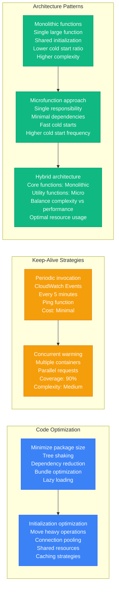
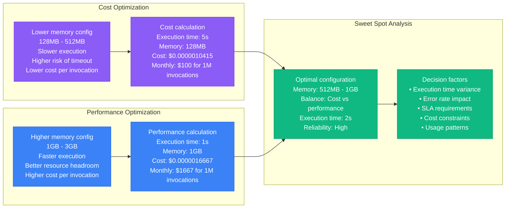
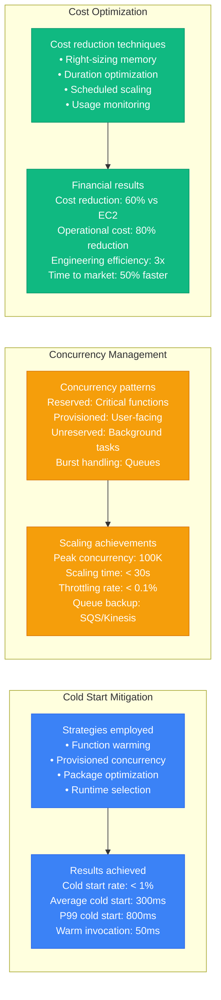

# Serverless Performance Profile

## Overview

Serverless performance characteristics in production environments, covering cold start optimization, concurrent execution limits, memory vs CPU trade-offs, and event source scaling. Based on Netflix's Lambda usage patterns and other high-scale serverless deployments.

## Cold Start Optimization

### Cold Start Performance Analysis

```mermaid
graph TB
    subgraph Cold_Start_Components[Cold Start Components]
        COLD1[Function initialization<br/>Runtime startup: 100ms<br/>Package download: 200ms<br/>Code initialization: 300ms<br/>Total cold start: 600ms]

        COLD2[Runtime comparison<br/>Node.js: 150ms<br/>Python: 200ms<br/>Java: 800ms<br/>C#/.NET: 900ms<br/>.NET Native: 300ms]

        COLD3[Factors affecting startup<br/>Package size<br/>Dependencies<br/>Initialization code<br/>Runtime choice]

        COLD1 --> COLD2 --> COLD3
    end

    subgraph Warm_Invocation[Warm Invocation]
        WARM1[Warm invocation flow<br/>Request received<br/>Existing container reused<br/>Handler function executed<br/>Response returned]

        WARM2[Performance metrics<br/>Latency: 5-20ms<br/>Memory reuse: Available<br/>CPU: Immediate<br/>Network: Established]

        WARM3[Container lifecycle<br/>Idle timeout: 15 minutes<br/>Concurrent reuse: Possible<br/>Memory state: Preserved<br/>Connections: Maintained]

        WARM1 --> WARM2 --> WARM3
    end

    subgraph Provisioned_Concurrency[Provisioned Concurrency]
        PROVISIONED1[Pre-warmed containers<br/>Always available<br/>No cold start delay<br/>Cost: Higher<br/>Performance: Consistent]

        PROVISIONED2[Configuration<br/>Target utilization: 70%<br/>Min capacity: 10<br/>Max capacity: 1000<br/>Auto-scaling enabled]

        PROVISIONED3[Performance impact<br/>Cold start elimination<br/>Consistent latency<br/>Cost increase: 2-3x<br/>SLA improvement: 99.9%]

        PROVISIONED1 --> PROVISIONED2 --> PROVISIONED3
    end

    classDef coldStyle fill:#8B5CF6,stroke:#7C3AED,color:#fff
    classDef warmStyle fill:#10B981,stroke:#059669,color:#fff
    classDef provisionedStyle fill:#3B82F6,stroke:#2563EB,color:#fff

    class COLD1,COLD2,COLD3 coldStyle
    class WARM1,WARM2,WARM3 warmStyle
    class PROVISIONED1,PROVISIONED2,PROVISIONED3 provisionedStyle
```



### Cold Start Mitigation Strategies



## Concurrent Execution Limits

### AWS Lambda Concurrency Model

```mermaid
graph TB
    subgraph Account_Level_Limits[Account-Level Limits]
        ACCOUNT1[Default concurrent executions<br/>US regions: 1000<br/>Other regions: 100<br/>Burst limit: 3000<br/>Scaling rate: 1000/min]

        ACCOUNT2[Quota increases<br/>Support request required<br/>Business justification<br/>Gradual increases<br/>Maximum: 100,000+]

        ACCOUNT3[Throttling behavior<br/>TooManyRequestsException<br/>HTTP 429 status<br/>Exponential backoff<br/>Dead letter queues]

        ACCOUNT1 --> ACCOUNT2 --> ACCOUNT3
    end

    subgraph Function_Level_Concurrency[Function-Level Concurrency]
        FUNCTION1[Reserved concurrency<br/>Dedicated allocation<br/>Guaranteed availability<br/>Isolation from other functions<br/>Cost: Same]

        FUNCTION2[Provisioned concurrency<br/>Pre-warmed containers<br/>Immediate execution<br/>No cold starts<br/>Cost: Higher]

        FUNCTION3[Unreserved concurrency<br/>Shared pool<br/>Best effort allocation<br/>Potential throttling<br/>Cost: Standard]

        FUNCTION1 --> FUNCTION2 --> FUNCTION3
    end

    subgraph Scaling_Behavior[Scaling Behavior]
        SCALING1[Initial burst<br/>Immediate: 1000 concurrent<br/>Duration: 3000 seconds<br/>After burst: 500/minute<br/>Exponential scaling]

        SCALING2[Steady state scaling<br/>Rate: 500 executions/minute<br/>Sustained growth<br/>No burst limit<br/>Linear progression]

        SCALING3[Scale down behavior<br/>Idle detection: 15 minutes<br/>Container cleanup<br/>Gradual reduction<br/>Cost optimization]

        SCALING1 --> SCALING2 --> SCALING3
    end

    classDef accountStyle fill:#8B5CF6,stroke:#7C3AED,color:#fff
    classDef functionStyle fill:#3B82F6,stroke:#2563EB,color:#fff
    classDef scalingStyle fill:#10B981,stroke:#059669,color:#fff

    class ACCOUNT1,ACCOUNT2,ACCOUNT3 accountStyle
    class FUNCTION1,FUNCTION2,FUNCTION3 functionStyle
    class SCALING1,SCALING2,SCALING3 scalingStyle
```



### Concurrency Management Strategies

```mermaid
graph TB
    subgraph Queue_Based_Processing[Queue-Based Processing]
        QUEUE1[SQS trigger<br/>Batch size: 10<br/>Max concurrency: 1000<br/>Visibility timeout: 30s<br/>DLQ on failure]

        QUEUE2[Processing pattern<br/>Message polling<br/>Batch processing<br/>Error handling<br/>Scaling based on queue depth]

        QUEUE3[Performance characteristics<br/>Latency: Variable (0-30s)<br/>Throughput: High<br/>Error handling: Robust<br/>Cost: Moderate]

        QUEUE1 --> QUEUE2 --> QUEUE3
    end

    subgraph Stream_Processing[Stream Processing]
        STREAM1[Kinesis/DynamoDB trigger<br/>Shard-based parallelism<br/>Concurrent per shard: 1<br/>Order preservation<br/>Automatic retries]

        STREAM2[Processing characteristics<br/>Sequential per shard<br/>Parallel across shards<br/>Checkpoint management<br/>Error handling]

        STREAM3[Performance profile<br/>Latency: Low (ms)<br/>Throughput: Shard-limited<br/>Ordering: Guaranteed<br/>Complexity: High]

        STREAM1 --> STREAM2 --> STREAM3
    end

    subgraph API_Gateway_Integration[API Gateway Integration]
        API1[Synchronous invocation<br/>Request-response pattern<br/>Timeout: 30s<br/>Client waits<br/>Error propagation]

        API2[Performance considerations<br/>Cold start impact: Direct<br/>Concurrent limit: Shared<br/>Response time: Critical<br/>Caching recommended]

        API3[Optimization strategies<br/>Provisioned concurrency<br/>Connection pooling<br/>Response caching<br/>Circuit breakers]

        API1 --> API2 --> API3
    end

    classDef queueStyle fill:#3B82F6,stroke:#2563EB,color:#fff
    classDef streamStyle fill:#F59E0B,stroke:#D97706,color:#fff
    classDef apiStyle fill:#10B981,stroke:#059669,color:#fff

    class QUEUE1,QUEUE2,QUEUE3 queueStyle
    class STREAM1,STREAM2,STREAM3 streamStyle
    class API1,API2,API3 apiStyle
```

## Memory vs CPU Trade-offs

### Memory Allocation Performance Impact

```mermaid
graph TB
    subgraph sg_128MB_Configuration[128MB Configuration]
        MEM128_1[Resource allocation<br/>Memory: 128MB<br/>vCPU: 0.083<br/>Network: Limited<br/>Cost: $0.0000002083/sec]

        MEM128_2[Performance characteristics<br/>Cold start: 800ms<br/>Execution time: 5000ms<br/>Timeout risk: High<br/>OOM risk: High]

        MEM128_3[Use cases<br/>Simple operations<br/>Minimal dependencies<br/>Short execution<br/>Cost-sensitive workloads]

        MEM128_1 --> MEM128_2 --> MEM128_3
    end

    subgraph sg_1GB_Configuration[1GB Configuration]
        MEM1GB_1[Resource allocation<br/>Memory: 1024MB<br/>vCPU: 0.67<br/>Network: Good<br/>Cost: $0.0000016667/sec]

        MEM1GB_2[Performance characteristics<br/>Cold start: 600ms<br/>Execution time: 1000ms<br/>Timeout risk: Low<br/>OOM risk: Low]

        MEM1GB_3[Use cases<br/>Data processing<br/>API operations<br/>Medium complexity<br/>Balanced performance]

        MEM1GB_1 --> MEM1GB_2 --> MEM1GB_3
    end

    subgraph sg_3GB_Configuration[3GB Configuration]
        MEM3GB_1[Resource allocation<br/>Memory: 3008MB<br/>vCPU: 2.0<br/>Network: High<br/>Cost: $0.0000050000/sec]

        MEM3GB_2[Performance characteristics<br/>Cold start: 400ms<br/>Execution time: 300ms<br/>Timeout risk: None<br/>CPU-bound optimization]

        MEM3GB_3[Use cases<br/>CPU-intensive tasks<br/>Large datasets<br/>Complex processing<br/>Performance-critical]

        MEM3GB_1 --> MEM3GB_2 --> MEM3GB_3
    end

    classDef mem128Style fill:#8B5CF6,stroke:#7C3AED,color:#fff
    classDef mem1gbStyle fill:#F59E0B,stroke:#D97706,color:#fff
    classDef mem3gbStyle fill:#10B981,stroke:#059669,color:#fff

    class MEM128_1,MEM128_2,MEM128_3 mem128Style
    class MEM1GB_1,MEM1GB_2,MEM1GB_3 mem1gbStyle
    class MEM3GB_1,MEM3GB_2,MEM3GB_3 mem3gbStyle
```



### Performance vs Cost Analysis



## Event Source Scaling

### Event-Driven Scaling Patterns

```mermaid
graph TB
    subgraph S3_Event_Scaling[S3 Event Scaling]
        S3_1[S3 bucket events<br/>Object created/deleted<br/>Event fan-out<br/>Parallel processing<br/>No ordering guarantees]

        S3_2[Scaling characteristics<br/>Immediate scaling<br/>Concurrent: Object count<br/>Limits: Account concurrency<br/>Performance: Excellent]

        S3_3[Use cases<br/>Image processing<br/>Data transformation<br/>ETL triggers<br/>Log processing]

        S3_1 --> S3_2 --> S3_3
    end

    subgraph API_Gateway_Scaling[API Gateway Scaling]
        API_1[HTTP/REST API events<br/>Synchronous invocation<br/>Request-response pattern<br/>Client waits for response<br/>Timeout: 30 seconds]

        API_2[Scaling characteristics<br/>Demand-based scaling<br/>Concurrent: Request load<br/>Cold start impact: Direct<br/>Performance: Variable]

        API_3[Optimization techniques<br/>Provisioned concurrency<br/>Connection pooling<br/>Response caching<br/>Error handling]

        API_1 --> API_2 --> API_3
    end

    subgraph EventBridge_Scaling[EventBridge Scaling]
        EVENT_1[EventBridge rules<br/>Pattern matching<br/>Event filtering<br/>Multiple targets<br/>Retry policies]

        EVENT_2[Scaling behavior<br/>Rule-based triggering<br/>Parallel execution<br/>Fan-out capability<br/>Built-in reliability]

        EVENT_3[Performance profile<br/>Latency: 500ms p95<br/>Throughput: High<br/>Reliability: 99.99%<br/>Cost: Per million events]

        EVENT_1 --> EVENT_2 --> EVENT_3
    end

    classDef s3Style fill:#F59E0B,stroke:#D97706,color:#fff
    classDef apiStyle fill:#3B82F6,stroke:#2563EB,color:#fff
    classDf eventStyle fill:#10B981,stroke:#059669,color:#fff

    class S3_1,S3_2,S3_3 s3Style
    class API_1,API_2,API_3 apiStyle
    class EVENT_1,EVENT_2,EVENT_3 eventStyle
```

### Scaling Performance Comparison

```mermaid
graph LR
    subgraph Batch_Processing__SQS[Batch Processing (SQS)]
        BATCH1[Processing model<br/>Batch size: 1-10<br/>Polling interval: Variable<br/>Latency: 0-20s<br/>Throughput: Very high]

        BATCH2[Scaling pattern<br/>Queue depth based<br/>Gradual scaling<br/>Cost efficient<br/>High throughput]

        BATCH1 --> BATCH2
    end

    subgraph Stream_Processing__Kinesis[Stream Processing (Kinesis)]
        STREAM1[Processing model<br/>Record by record<br/>Shard-based parallelism<br/>Latency: 100ms<br/>Throughput: Shard limited]

        STREAM2[Scaling pattern<br/>Shard count based<br/>Linear scaling<br/>Ordered processing<br/>Real-time capable]

        STREAM1 --> STREAM2
    end

    subgraph Real_time__API_Gateway[Real-time (API Gateway)]
        REALTIME1[Processing model<br/>Request-response<br/>Synchronous<br/>Latency: 1ms-30s<br/>Throughput: Concurrent limited]

        REALTIME2[Scaling pattern<br/>Demand based<br/>Immediate scaling<br/>Cold start impact<br/>User-facing]

        REALTIME1 --> REALTIME2
    end

    classDev batchStyle fill:#10B981,stroke:#059669,color:#fff
    classDef streamStyle fill:#3B82F6,stroke:#2563EB,color:#fff
    classDef realtimeStyle fill:#F59E0B,stroke:#D97706,color:#fff

    class BATCH1,BATCH2 batchStyle
    class STREAM1,STREAM2 streamStyle
    class REALTIME1,REALTIME2 realtimeStyle
```

## Netflix's Lambda Usage Patterns

### Netflix Serverless Architecture Scale

```mermaid
graph TB
    subgraph Netflix_Lambda_Usage_Statistics[Netflix Lambda Usage Statistics]
        STATS1[Function metrics<br/>Active functions: 10,000+<br/>Daily invocations: 1 billion<br/>Peak concurrency: 100,000<br/>Average duration: 2 seconds]

        STATS2[Cost optimization<br/>Monthly Lambda costs: $500K<br/>Cost per invocation: $0.0005<br/>Savings vs containers: 60%<br/>Operational overhead: 80% reduction]

        STATS3[Performance requirements<br/>Cold start tolerance: < 1s<br/>P99 latency: < 5s<br/>Success rate: > 99.9%<br/>Availability: 99.95%]

        STATS1 --> STATS2 --> STATS3
    end

    subgraph Use_Case_Categories[Use Case Categories]
        UC1[Content processing<br/>Video encoding triggers<br/>Thumbnail generation<br/>Metadata extraction<br/>Quality analysis]

        UC2[Data pipeline operations<br/>ETL processing<br/>Log aggregation<br/>Metrics collection<br/>Analytics triggers]

        UC3[API and integration<br/>Microservice glue<br/>External API calls<br/>Data transformation<br/>Event routing]

        UC4[Infrastructure automation<br/>Resource provisioning<br/>Scaling triggers<br/>Health checks<br/>Maintenance tasks]

        UC1 --> UC2 --> UC3 --> UC4
    end

    subgraph Optimization_Strategies[Optimization Strategies]
        OPT1[Function sizing<br/>Memory: 512MB - 3GB<br/>Duration: 30s - 15min<br/>Language: Python/Java<br/>Package size: < 10MB]

        OPT2[Performance tuning<br/>Connection pooling<br/>Caching strategies<br/>Async processing<br/>Error handling]

        OPT3[Cost management<br/>Reserved concurrency<br/>Provisioned concurrency<br/>Usage monitoring<br/>Right-sizing analysis]

        OPT1 --> OPT2 --> OPT3
    end

    classDef statsStyle fill:#3B82F6,stroke:#2563EB,color:#fff
    classDef useCaseStyle fill:#F59E0B,stroke:#D97706,color:#fff
    classDef optStyle fill:#10B981,stroke:#059669,color:#fff

    class STATS1,STATS2,STATS3 statsStyle
    class UC1,UC2,UC3,UC4 useCaseStyle
    class OPT1,OPT2,OPT3 optStyle
```



### Netflix's Performance Optimizations



## Production Lessons Learned

### Performance Optimization Hierarchy

```mermaid
graph TB
    subgraph Level_1__Function_Design[Level 1: Function Design]
        L1[Function optimization<br/>• Package size reduction<br/>• Dependency minimization<br/>• Initialization optimization<br/>• Runtime selection]
    end

    subgraph Level_2__Resource_Configuration[Level 2: Resource Configuration]
        L2[Resource tuning<br/>• Memory allocation<br/>• Timeout configuration<br/>• Concurrency settings<br/>• Reserved capacity]
    end

    subgraph Level_3__Architecture_Patterns[Level 3: Architecture Patterns]
        L3[Pattern optimization<br/>• Event source selection<br/>• Async vs sync patterns<br/>• Batching strategies<br/>• Error handling]
    end

    subgraph Level_4__Infrastructure_Integration[Level 4: Infrastructure Integration]
        L4[Infrastructure optimization<br/>• VPC configuration<br/>• Database connections<br/>• External service integration<br/>• Monitoring setup]
    end

    L1 --> L2 --> L3 --> L4

    classDf levelStyle fill:#3B82F6,stroke:#2563EB,color:#fff

    class L1,L2,L3,L4 levelStyle
```

### Critical Performance Factors

1. **Cold Start Management**: Package optimization and provisioned concurrency for latency-sensitive functions
2. **Memory Allocation**: Sweet spot typically 512MB-1GB for balanced cost and performance
3. **Concurrency Planning**: Reserved concurrency for critical functions, monitoring for scaling
4. **Event Source Selection**: Choose appropriate trigger based on latency and throughput requirements
5. **Error Handling**: Robust retry logic and dead letter queues for reliability

### Performance Benchmarks by Configuration

| Memory | vCPU | Cold Start | Execution Time | Cost/Million | Use Case |
|--------|------|------------|----------------|--------------|----------|
| **128MB** | 0.083 | 800ms | 5000ms | $208 | Simple operations |
| **512MB** | 0.33 | 600ms | 2000ms | $833 | Standard workloads |
| **1GB** | 0.67 | 500ms | 1000ms | $1667 | Data processing |
| **3GB** | 2.0 | 400ms | 300ms | $5000 | CPU-intensive tasks |

### Common Pitfalls

1. **Under-provisioning memory**: Leads to timeouts and poor performance
2. **Over-provisioning resources**: Wastes money without proportional benefits
3. **Ignoring cold starts**: Impacts user experience for synchronous functions
4. **Poor error handling**: Creates cascading failures and data loss
5. **Inadequate monitoring**: Makes optimization and debugging difficult

**Source**: Based on Netflix, Coca-Cola, and AWS re:Invent serverless implementations