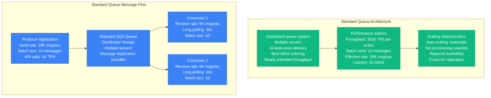
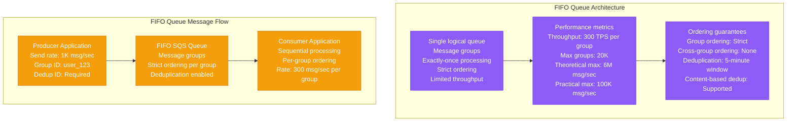
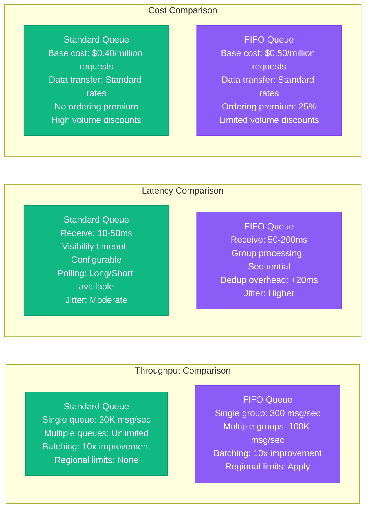
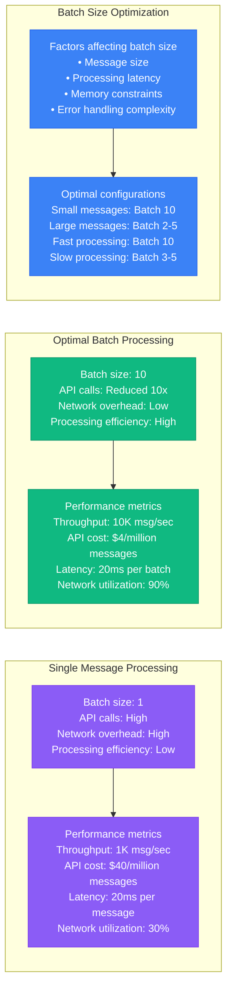
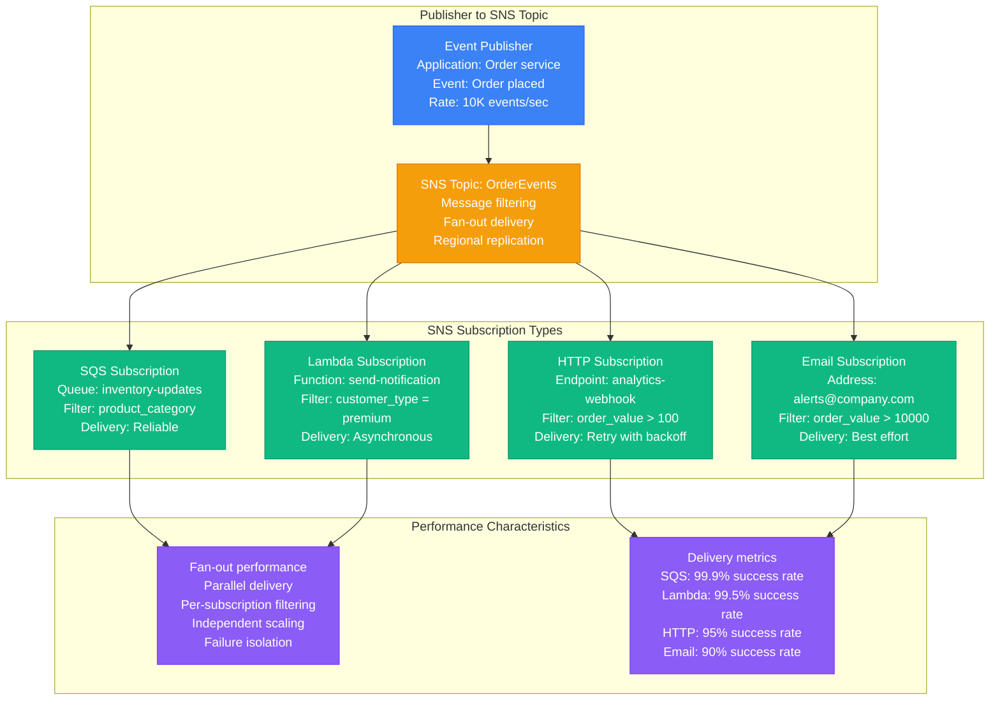
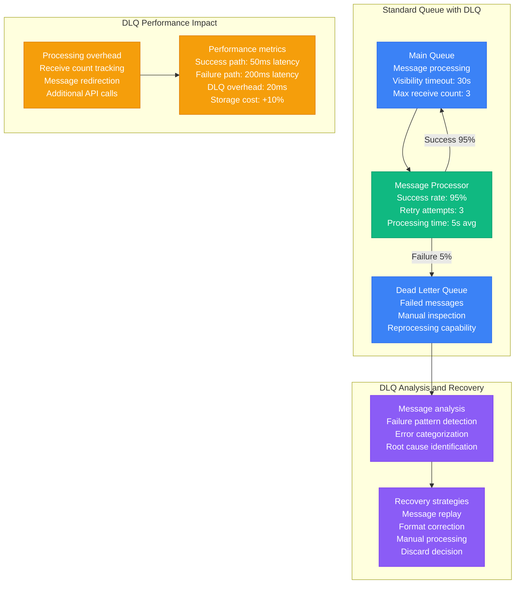
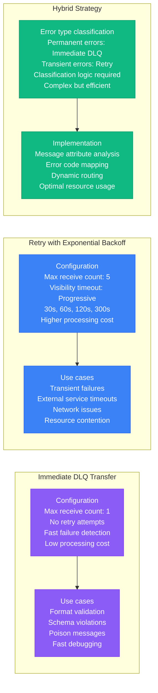
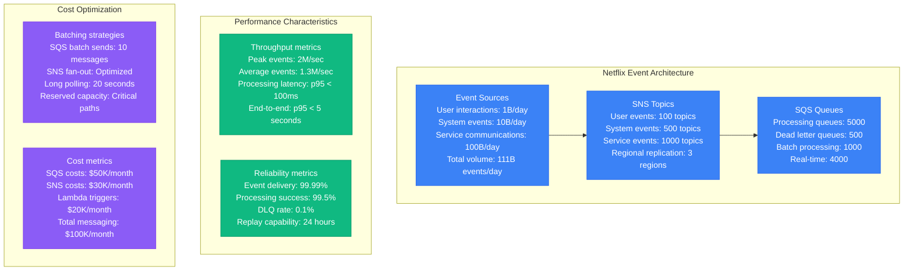
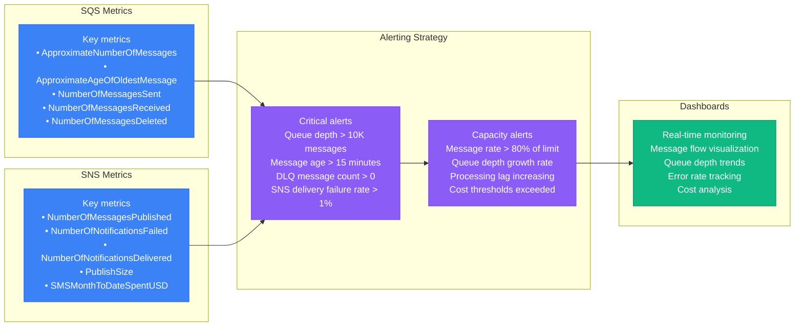

# SQS/SNS Performance Profile

## Overview

Amazon SQS and SNS performance characteristics in production environments, covering FIFO vs Standard queue performance, long polling optimization, fan-out patterns with SNS, and dead letter queue overhead. Based on Netflix's event-driven architecture and other high-scale AWS deployments.

## FIFO vs Standard Queue Performance

### Standard SQS Queue Characteristics



### FIFO SQS Queue Characteristics



### Performance Comparison Matrix



## Long Polling Optimization

### Polling Strategy Performance Impact

```mermaid
graph TB
    subgraph "Short Polling (0 seconds)"
        SHORT1[Polling configuration<br/>WaitTimeSeconds: 0<br/>Immediate return<br/>Empty response possible<br/>High API call frequency]

        SHORT2[Performance characteristics<br/>Latency: 10-20ms<br/>API calls: 1 per second minimum<br/>Cost: High (empty receives)<br/>CPU usage: High]

        SHORT3[Use cases<br/>Real-time processing<br/>Low-latency requirements<br/>Simple implementation<br/>High cost tolerance]

        SHORT1 --> SHORT2 --> SHORT3
    end

    subgraph "Long Polling (20 seconds)"
        LONG1[Polling configuration<br/>WaitTimeSeconds: 20<br/>Wait for messages<br/>Connection held open<br/>Reduced API calls]

        LONG2[Performance characteristics<br/>Latency: 0-20000ms<br/>API calls: Reduced by 10x<br/>Cost: Low (fewer empty receives)<br/>CPU usage: Low]

        LONG3[Use cases<br/>Batch processing<br/>Cost optimization<br/>Standard workloads<br/>Reduced complexity]

        LONG1 --> LONG2 --> LONG3
    end

    subgraph "Hybrid Polling Strategy"
        HYBRID1[Adaptive polling<br/>Short poll during high load<br/>Long poll during low load<br/>Dynamic adjustment<br/>Load-based switching]

        HYBRID2[Implementation<br/>CloudWatch metrics<br/>Queue depth monitoring<br/>Automatic switching<br/>Cost optimization]

        HYBRID1 --> HYBRID2
    end

    classDef shortStyle fill:#8B5CF6,stroke:#7C3AED,color:#fff
    classDef longStyle fill:#10B981,stroke:#059669,color:#fff
    classDef hybridStyle fill:#3B82F6,stroke:#2563EB,color:#fff

    class SHORT1,SHORT2,SHORT3 shortStyle
    class LONG1,LONG2,LONG3 longStyle
    class HYBRID1,HYBRID2 hybridStyle
```

### Batching Impact on Performance



## Fan-out Patterns with SNS

### SNS Topic Fan-out Architecture



### Message Filtering Performance

```mermaid
graph TB
    subgraph "No Filtering (Broadcast)"
        NO_FILTER1[All messages delivered<br/>to all subscriptions<br/>Processing overhead: High<br/>Network utilization: High]

        NO_FILTER2[Performance impact<br/>Delivery rate: 100K msg/sec<br/>Network bandwidth: 500 Mbps<br/>Processing cost: $100/day<br/>Unwanted messages: 80%]

        NO_FILTER1 --> NO_FILTER2
    end

    subgraph "Attribute-based Filtering"
        ATTR_FILTER1[Server-side filtering<br/>Message attributes<br/>Filter policies<br/>Selective delivery]

        ATTR_FILTER2[Performance impact<br/>Delivery rate: 20K msg/sec<br/>Network bandwidth: 100 Mbps<br/>Processing cost: $20/day<br/>Unwanted messages: 5%]

        ATTR_FILTER1 --> ATTR_FILTER2
    end

    subgraph "Content-based Filtering"
        CONTENT_FILTER1[Message body filtering<br/>JSON path expressions<br/>Complex conditions<br/>Advanced matching]

        CONTENT_FILTER2[Performance impact<br/>Filter overhead: +5ms<br/>CPU usage: +30%<br/>Precision: 99%<br/>Complexity: High]

        CONTENT_FILTER1 --> CONTENT_FILTER2
    end

    subgraph "Filter Policy Examples"
        EXAMPLES[Attribute filtering<br/>{"order_value": [{"numeric": [">=", 100]}]}<br/>{"region": ["us-east-1", "us-west-2"]}<br/>{"event_type": ["order", "payment"]}]
    end

    classDef noFilterStyle fill:#8B5CF6,stroke:#7C3AED,color:#fff
    classDef attrFilterStyle fill:#10B981,stroke:#059669,color:#fff
    classDef contentFilterStyle fill:#3B82F6,stroke:#2563EB,color:#fff
    classDef exampleStyle fill:#F59E0B,stroke:#D97706,color:#fff

    class NO_FILTER1,NO_FILTER2 noFilterStyle
    class ATTR_FILTER1,ATTR_FILTER2 attrFilterStyle
    class CONTENT_FILTER1,CONTENT_FILTER2 contentFilterStyle
    class EXAMPLES exampleStyle
```

## Dead Letter Queue Overhead

### DLQ Configuration and Performance



### DLQ Strategy Comparison



## Netflix's Event-Driven Architecture

### Netflix's SQS/SNS Usage Scale



### Critical Architecture Patterns

```mermaid
graph TB
    subgraph "Event Sourcing Pattern"
        ES1[Event store<br/>SNS topic per aggregate<br/>All state changes captured<br/>Immutable event log]

        ES2[Event replay<br/>SQS queues for consumers<br/>Checkpointing supported<br/>Temporal decoupling]

        ES3[Projection building<br/>Multiple materialized views<br/>Eventually consistent<br/>Independent scaling]

        ES1 --> ES2 --> ES3
    end

    subgraph "CQRS Implementation"
        CQRS1[Command handling<br/>Write-side processing<br/>Business logic validation<br/>Event publication]

        CQRS2[Read model updates<br/>Event subscribers<br/>Denormalized views<br/>Query optimization]

        CQRS3[Read/write separation<br/>Independent scaling<br/>Technology diversity<br/>Performance optimization]

        CQRS1 --> CQRS2 --> CQRS3
    end

    subgraph "Saga Orchestration"
        SAGA1[Saga coordinator<br/>Long-running transactions<br/>Compensation actions<br/>State management]

        SAGA2[Step execution<br/>SQS for step commands<br/>SNS for step completion<br/>Error handling]

        SAGA3[Saga recovery<br/>DLQ for failed steps<br/>Manual intervention<br/>Compensation execution]

        SAGA1 --> SAGA2 --> SAGA3
    end

    classDef esStyle fill:#3B82F6,stroke:#2563EB,color:#fff
    classDef cqrsStyle fill:#10B981,stroke:#059669,color:#fff
    classDef sagaStyle fill:#F59E0B,stroke:#D97706,color:#fff

    class ES1,ES2,ES3 esStyle
    class CQRS1,CQRS2,CQRS3 cqrsStyle
    class SAGA1,SAGA2,SAGA3 sagaStyle
```



### Monitoring and Observability



## Production Lessons Learned

### Performance Optimization Best Practices

1. **Queue Type Selection**: Standard for throughput, FIFO for ordering requirements
2. **Polling Strategy**: Long polling reduces costs by 90% with minimal latency impact
3. **Batching**: Always use maximum batch size (10) for optimal performance/cost
4. **Message Filtering**: Server-side SNS filtering reduces unnecessary processing by 80%
5. **DLQ Strategy**: Configure based on failure types - immediate for permanent errors

### Critical Performance Factors

```mermaid
graph TB
    subgraph "Throughput Optimization"
        THR_OPT1[Batching strategies<br/>• Send/receive in batches of 10<br/>• Use SendMessageBatch API<br/>• Implement client-side batching<br/>• Monitor batch efficiency]
    end

    subgraph "Latency Optimization"
        LAT_OPT1[Polling optimization<br/>• Use long polling (20s)<br/>• Minimize empty receives<br/>• Implement adaptive polling<br/>• Monitor receive latency]
    end

    subgraph "Cost Optimization"
        COST_OPT1[Cost reduction strategies<br/>• Message filtering at SNS<br/>• Optimal visibility timeouts<br/>• Reserved capacity for predictable loads<br/>• DLQ threshold tuning]
    end

    subgraph "Reliability Optimization"
        REL_OPT1[Error handling<br/>• Appropriate DLQ configuration<br/>• Exponential backoff<br/>• Circuit breaker patterns<br/>• Monitoring and alerting]
    end

    classDef optStyle fill:#3B82F6,stroke:#2563EB,color:#fff

    class THR_OPT1,LAT_OPT1,COST_OPT1,REL_OPT1 optStyle
```

### Performance Benchmarks by Configuration

| Configuration | Throughput | Latency p95 | Cost/Million Msgs | Use Case |
|---------------|------------|-------------|-------------------|----------|
| **Standard + Batching** | 30K msg/sec | 50ms | $4 | High throughput |
| **FIFO + Batching** | 3K msg/sec | 100ms | $5 | Ordered processing |
| **SNS Fan-out** | 100K msg/sec | 200ms | $0.5 + delivery | Event distribution |
| **DLQ Enabled** | -10% throughput | +20ms | +10% cost | Reliability |

### Common Pitfalls

1. **Short polling overuse**: Increases costs by 10x without latency benefits
2. **Single message processing**: Reduces throughput by 90% and increases costs
3. **No message filtering**: Wastes processing resources and increases costs
4. **Inappropriate queue types**: Using FIFO when ordering not required
5. **Poor DLQ configuration**: Either too aggressive or too permissive retry policies

**Source**: Based on Netflix, Airbnb, and AWS Well-Architected messaging patterns