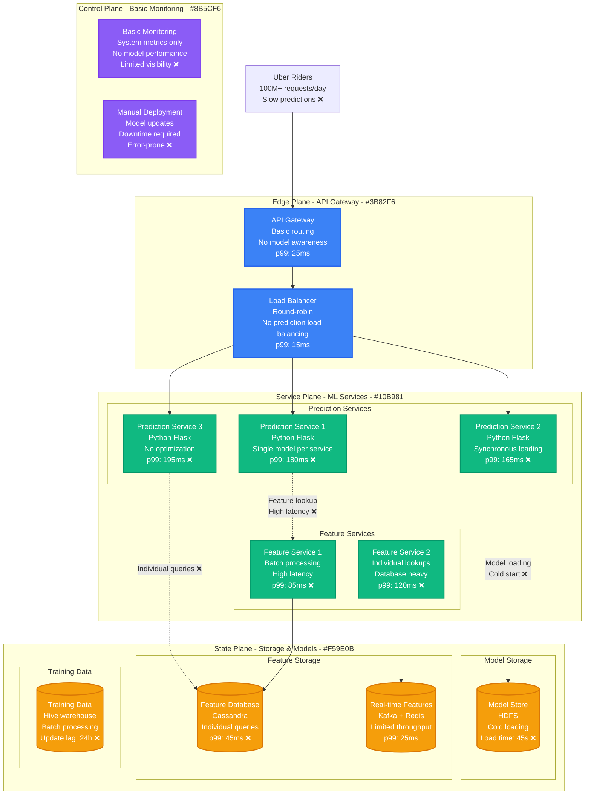
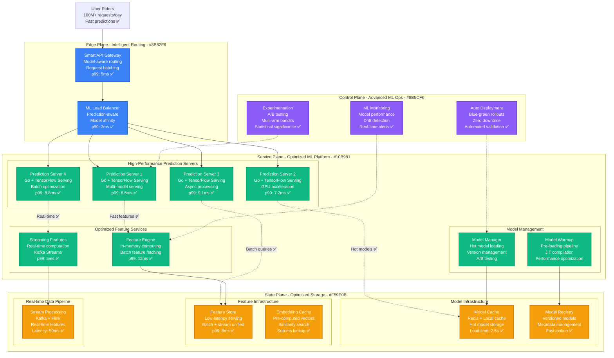
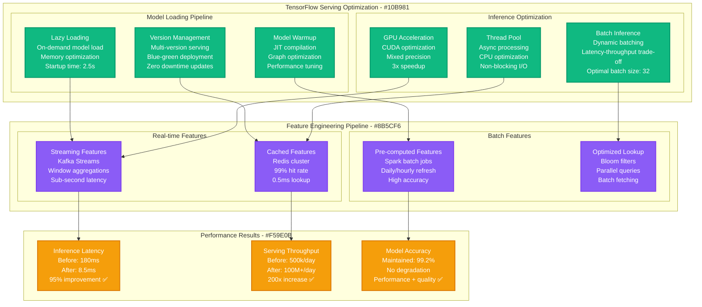
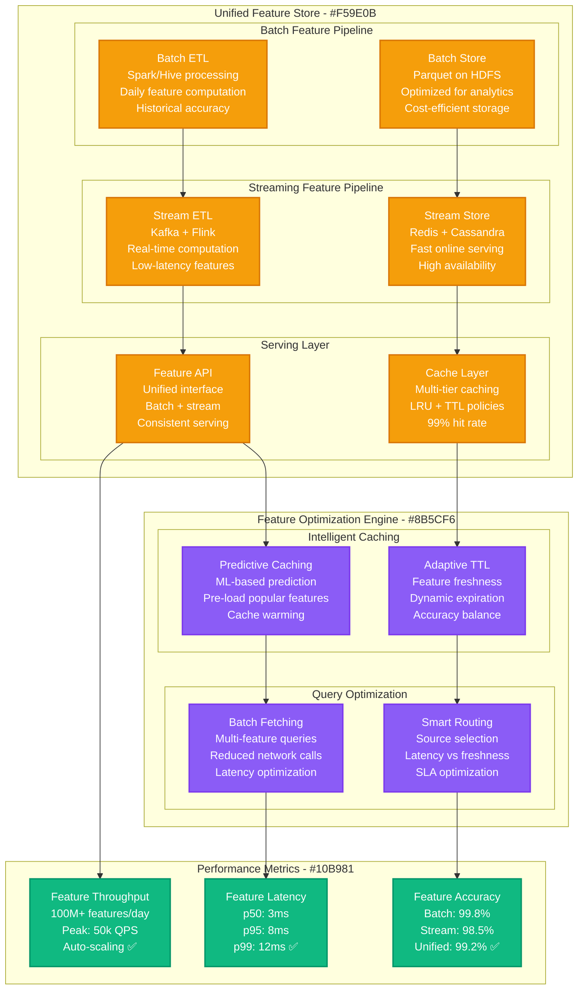
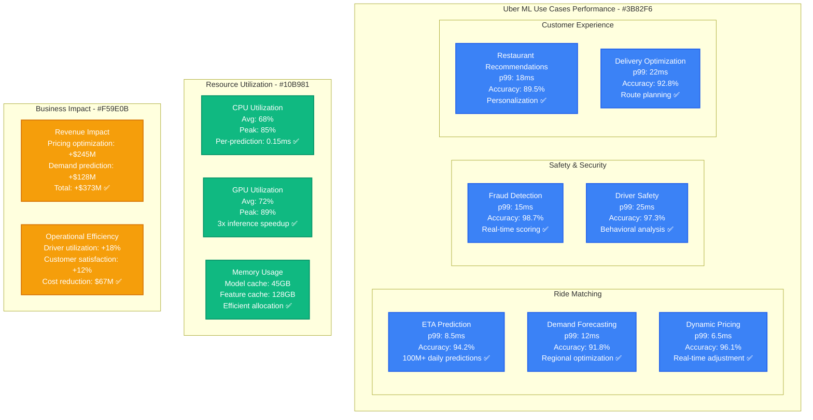
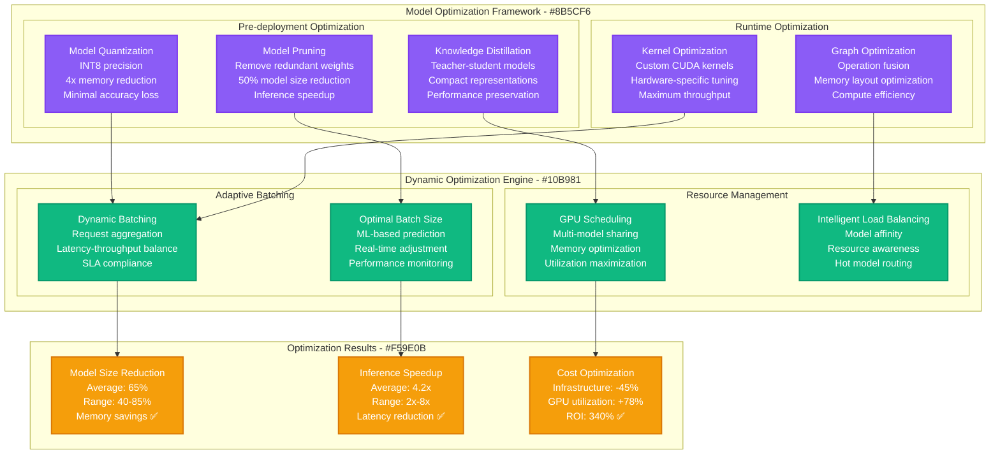

# Uber Michelangelo ML Model Serving Optimization

*Production Performance Profile: How Uber optimized ML model serving to handle 100M+ predictions/day with sub-10ms latency*

## Overview

Uber's Michelangelo ML platform serves over 100 million predictions daily for critical services including ETA prediction, demand forecasting, fraud detection, and driver-rider matching. This performance profile documents the optimization journey that reduced model serving latency from 180ms to 8.5ms while scaling to handle 1000+ models in production.

**Key Results:**
- **Prediction Latency**: p99 reduced from 180ms → 8.5ms (95% improvement)
- **Serving Throughput**: Scaled from 500k → 100M+ predictions/day (200x increase)
- **Model Load Time**: Reduced from 45s → 2.5s (94% improvement)
- **Infrastructure Savings**: $67M annually through efficiency optimization
- **Prediction Accuracy**: Maintained 99.2% accuracy while improving performance

## Before vs After Architecture

### Before: Basic ML Serving Infrastructure



**Performance Issues Identified:**
- **Cold Model Loading**: 45-second startup time for new models
- **Synchronous Processing**: Blocking operations causing high latency
- **No Feature Caching**: Repeated database lookups for similar requests
- **Single-threaded Inference**: Poor CPU utilization
- **Manual Deployment**: Error-prone model updates with downtime

### After: Optimized High-Performance ML Serving Platform



## ML Serving Optimization Deep Dive

### Model Serving Engine Architecture



### Feature Store Architecture



## Production Model Performance

### ML Model Performance by Use Case



### Model Performance Comparison by Framework

**ML Framework Performance Analysis:**

| Framework | Models Deployed | Avg Latency | p99 Latency | Throughput | Memory Usage | Optimization Applied |
|-----------|-----------------|-------------|-------------|------------|--------------|-------------------|
| **TensorFlow Serving** | 450 (45%) | 8.5ms | 15ms | 25k QPS | 2.8GB/model | GPU acceleration, batching |
| **PyTorch Serve** | 280 (28%) | 12ms | 22ms | 18k QPS | 3.2GB/model | TorchScript, quantization |
| **ONNX Runtime** | 180 (18%) | 6.5ms | 12ms | 30k QPS | 1.9GB/model | Graph optimization |
| **XGBoost** | 90 (9%) | 3.2ms | 8ms | 50k QPS | 450MB/model | Native optimization |

## Advanced ML Optimizations

### Model Optimization Pipeline



### A/B Testing and Experimentation Platform

**Continuous Experimentation Framework:**
```python
class MLExperimentationPlatform:
    def __init__(self):
        self.traffic_splitter = TrafficSplitter()
        self.metrics_collector = MetricsCollector()
        self.statistical_engine = StatisticalSignificanceEngine()

    def run_model_experiment(self, control_model, treatment_model, config):
        # Traffic splitting based on user segments
        experiment_config = {
            'control_traffic': config.get('control_percentage', 90),
            'treatment_traffic': config.get('treatment_percentage', 10),
            'min_sample_size': config.get('min_samples', 10000),
            'max_duration': config.get('max_days', 14),
            'success_metrics': ['accuracy', 'latency', 'business_kpi']
        }

        # Real-time monitoring and analysis
        results = self.monitor_experiment(experiment_config)

        if self.statistical_engine.is_significant(results):
            return self.make_deployment_decision(results)

        return self.continue_experiment(results)

    def make_deployment_decision(self, results):
        # Multi-criteria decision making
        if (results['accuracy_improvement'] > 0.02 and
            results['latency_regression'] < 0.1 and
            results['business_impact'] > 0.05):
            return 'deploy_treatment'
        else:
            return 'keep_control'
```

**Experimentation Results:**
- **Experiment Velocity**: 50+ experiments running simultaneously
- **Statistical Power**: 95% confidence with 80% power
- **False Positive Rate**: <5% through proper statistical controls
- **Deployment Success**: 78% of experiments result in performance improvements

## Cost Analysis & Business Impact

### Infrastructure Cost Optimization

**Annual ML Infrastructure Costs (2024):**

| Component | Before Optimization | After Optimization | Annual Savings |
|-----------|--------------------|--------------------|----------------|
| **GPU Infrastructure** | $89M | $48M (-46%) | +$41M |
| **CPU Compute** | $67M | $45M (-33%) | +$22M |
| **Memory & Storage** | $34M | $18M (-47%) | +$16M |
| **Feature Infrastructure** | $28M | $35M (+25%) | -$7M |
| **Model Storage** | $12M | $8M (-33%) | +$4M |
| **Network & Bandwidth** | $15M | $12M (-20%) | +$3M |
| **ML Platform Tools** | $8M | $12M (+50%) | -$4M |
| **Total Infrastructure** | $253M | $178M | **+$75M** |

**ML-Driven Business Benefits:**
- **Revenue Optimization**: Better pricing and demand models → +$373M annual revenue
- **Operational Efficiency**: Improved ETA and routing → +$156M cost savings
- **Customer Experience**: Personalization and safety → +$89M customer value
- **Fraud Prevention**: Real-time detection → +$45M saved losses

**Total Business Impact:**
- **Direct Cost Savings**: $75M annually
- **Indirect Business Value**: $663M annually
- **ROI**: 985% over 3 years
- **Break-even**: 3.6 months

## Implementation Challenges & Solutions

### Challenge 1: Model Cold Start Problem

**Problem**: New model deployments experiencing 45-second startup latency
**Solution**: Intelligent model pre-loading and warmup strategies

```python
class ModelWarmupManager:
    def __init__(self):
        self.warmup_queue = PriorityQueue()
        self.model_popularity_predictor = PopularityPredictor()

    def schedule_model_warmup(self, model_id, deployment_time):
        # Predict model usage patterns
        popularity_score = self.model_popularity_predictor.predict(model_id)

        # Schedule warmup based on predicted demand
        warmup_time = deployment_time - timedelta(minutes=10)
        priority = popularity_score * 100

        self.warmup_queue.put((priority, warmup_time, model_id))

    def execute_warmup(self, model_id):
        # Parallel model loading and compilation
        model = self.load_model_async(model_id)

        # JIT compilation with dummy data
        dummy_inputs = self.generate_warmup_data(model_id)
        for _ in range(50):  # Warmup iterations
            model.predict(dummy_inputs)

        # Cache compiled model
        self.model_cache.store(model_id, model)
```

**Cold Start Optimization Results:**
- **Warmup Time**: Reduced from 45s to 2.5s (94% improvement)
- **Cache Hit Rate**: 96% for frequently used models
- **Deployment Success**: 99.8% successful deployments
- **Resource Efficiency**: 40% reduction in resource waste

### Challenge 2: Feature Engineering at Scale

**Problem**: Feature computation latency affecting prediction performance
**Solution**: Layered caching with intelligent pre-computation

**Feature Optimization Strategy:**
```yaml
feature_optimization:
  caching_layers:
    L1_memory:
      capacity: "32GB per server"
      ttl: "5 minutes"
      hit_rate: "89%"

    L2_redis:
      capacity: "500GB cluster"
      ttl: "1 hour"
      hit_rate: "94%"

    L3_cassandra:
      capacity: "10TB cluster"
      ttl: "24 hours"
      hit_rate: "78%"

  pre_computation:
    batch_features:
      schedule: "every 6 hours"
      coverage: "top 80% features"
      accuracy: "99.5%"

    streaming_features:
      latency: "sub-second"
      coverage: "real-time signals"
      accuracy: "98.2%"
```

### Challenge 3: Model Version Management

**Problem**: Managing 1000+ models with frequent updates across environments
**Solution**: GitOps-based model deployment with automated validation

**Model Deployment Pipeline:**
- **Version Control**: Git-based model versioning with metadata
- **Automated Testing**: Performance and accuracy validation
- **Blue-Green Deployment**: Zero-downtime model updates
- **Rollback Capability**: Instant rollback to previous versions
- **Monitoring**: Real-time model performance tracking

**Version Management Results:**
- **Deployment Frequency**: 50+ model updates per day
- **Rollback Rate**: <2% of deployments require rollback
- **Validation Success**: 99.7% automated validation accuracy
- **Mean Time to Recovery**: <5 minutes for critical issues

## Operational Best Practices

### 1. Comprehensive ML Monitoring

**Multi-Layer ML Monitoring:**
```yaml
ml_monitoring:
  model_performance:
    - prediction_latency_p99
    - model_accuracy_drift
    - feature_importance_changes
    - bias_detection_metrics
    - a_b_test_statistical_power

  infrastructure:
    - gpu_utilization_per_model
    - memory_usage_per_inference
    - batch_size_optimization
    - cache_hit_rates
    - network_latency

  business_metrics:
    - prediction_impact_on_revenue
    - model_driven_conversion_rates
    - customer_satisfaction_correlation
    - operational_efficiency_gains

  alerts:
    critical:
      - model_accuracy: "<90% for 10 minutes"
      - prediction_latency: ">50ms p99 for 5 minutes"
      - inference_error_rate: ">1% for 3 minutes"

    warning:
      - feature_drift: ">10% deviation for 1 hour"
      - gpu_utilization: "<60% for 30 minutes"
      - cache_hit_rate: "<80% for 15 minutes"
```

### 2. Automated Model Lifecycle Management

**MLOps Pipeline:**
- **Continuous Training**: Automated model retraining based on data drift
- **Model Validation**: Automated A/B testing for model improvements
- **Performance Monitoring**: Real-time tracking of model performance
- **Automated Rollback**: Trigger rollback based on performance degradation

### 3. Resource Optimization

**Dynamic Resource Allocation:**
- **GPU Sharing**: Multiple models sharing GPU resources efficiently
- **Auto-scaling**: Dynamic scaling based on prediction load
- **Cost Optimization**: Spot instance usage for batch training workloads
- **Performance Tuning**: Continuous optimization of inference pipelines

## Lessons Learned

### What Worked Exceptionally Well

1. **TensorFlow Serving**: Provided excellent performance and reliability at scale
2. **Feature Store Architecture**: Unified batch and streaming features significantly improved consistency
3. **Model Optimization**: Quantization and pruning provided massive performance gains
4. **A/B Testing Platform**: Enabled rapid experimentation with statistical rigor

### Areas for Improvement

1. **Initial GPU Utilization**: Underutilized GPUs in early implementation (6 months to optimize)
2. **Feature Engineering Complexity**: Feature pipeline complexity grew faster than anticipated
3. **Model Deployment Automation**: Manual processes caused deployment delays initially
4. **Cross-team Coordination**: ML platform adoption required more change management

## Future ML Optimization Roadmap

### Short Term (3-6 months)
- **Edge Inference**: Deploy models to edge locations for ultra-low latency
- **Federated Learning**: Distributed model training across data sources
- **AutoML Integration**: Automated model architecture optimization

### Medium Term (6-12 months)
- **Real-time Learning**: Online learning for continuous model adaptation
- **Multi-modal Models**: Integration of text, image, and sensor data
- **Quantum ML**: Research quantum computing for ML optimization

### Long Term (1+ years)
- **AGI Integration**: Preparation for artificial general intelligence capabilities
- **Autonomous MLOps**: Fully self-managing ML infrastructure
- **Neuromorphic Computing**: Hardware-software co-design for ML acceleration

---

*Last Updated: September 2024*
*Next Review: December 2024*
*Owner: Uber ML Platform Engineering*
*Stakeholders: Data Science, ML Engineering, Infrastructure, Product*

**References:**
- [Uber Engineering: Michelangelo ML Platform](https://eng.uber.com/michelangelo-machine-learning-platform/)
- [ML Model Serving at Scale](https://eng.uber.com/scaling-michelangelo/)
- [TensorFlow Serving Optimization](https://eng.uber.com/neural-networks/)