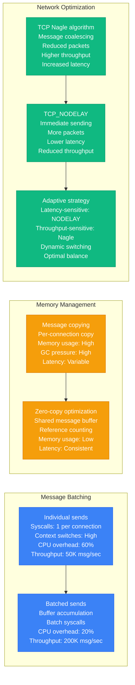
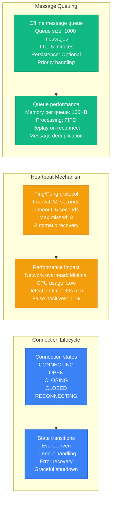
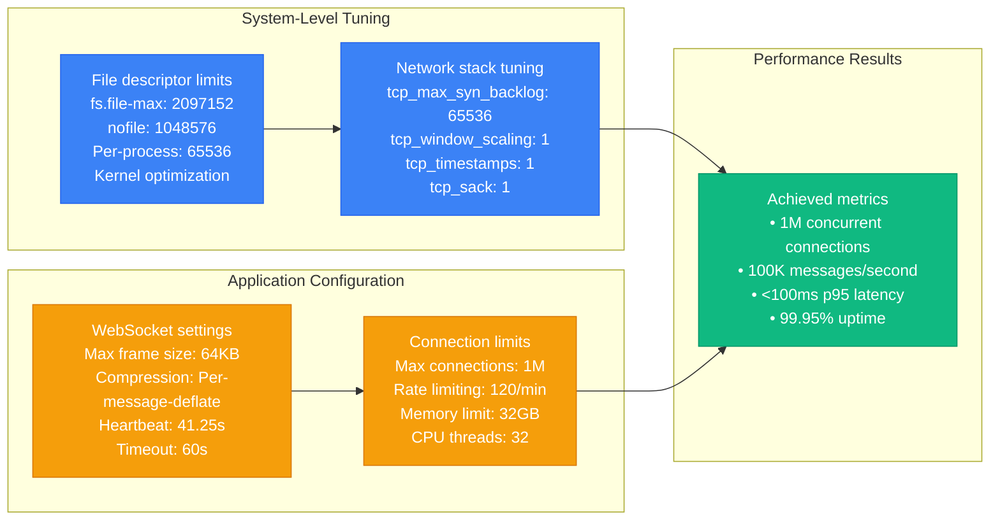
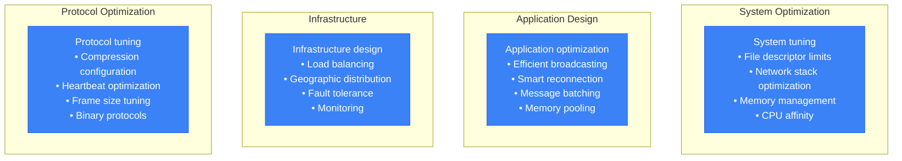

# WebSocket Performance Profile

## Overview

WebSocket performance characteristics in production environments, covering connection scaling limits, message broadcasting efficiency, reconnection strategies, and compression benefits. Based on Discord's implementation of millions of concurrent connections and other real-time applications.

## Connection Scaling Limits

### Single Server Connection Limits

```mermaid
graph TB
    subgraph Operating_System_Limits[Operating System Limits]
        OS1[File descriptor limits<br/>Default: 1024<br/>Configured: 100,000<br/>Per connection: 1 FD<br/>Memory per FD: 4KB]

        OS2[Memory consumption<br/>Connection overhead: 10KB<br/>Buffer allocation: 16KB<br/>Total per connection: 26KB<br/>100K connections: 2.6GB]

        OS3[CPU overhead<br/>Event loop processing<br/>Context switching<br/>Kernel system calls<br/>Network I/O handling]

        OS1 --> OS2 --> OS3
    end

    subgraph Network_Infrastructure[Network Infrastructure]
        NET1[Bandwidth limitations<br/>1 Gbps network card<br/>Average message: 1KB<br/>Theoretical max: 125K msg/sec<br/>Practical max: 80K msg/sec]

        NET2[Port exhaustion<br/>Ephemeral port range<br/>Local ports: 28,000<br/>Time wait state<br/>Connection cycling]

        NET3[Load balancer limits<br/>Connection tracking<br/>Session persistence<br/>Health checking<br/>Failover complexity]

        NET1 --> NET2 --> NET3
    end

    subgraph Scaling_Strategies[Scaling Strategies]
        SCALE1[Horizontal scaling<br/>Multiple server instances<br/>Load balancing<br/>Connection distribution<br/>Shared state management]

        SCALE2[Vertical scaling<br/>Increased memory<br/>More CPU cores<br/>Faster network<br/>System tuning]

        SCALE3[Hybrid approach<br/>Server specialization<br/>Connection servers<br/>Message processing servers<br/>Optimal resource usage]

        SCALE1 --> SCALE2 --> SCALE3
    end

    classDef osStyle fill:#8B5CF6,stroke:#7C3AED,color:#fff
    classDef networkStyle fill:#3B82F6,stroke:#2563EB,color:#fff
    classDef scaleStyle fill:#10B981,stroke:#059669,color:#fff

    class OS1,OS2,OS3 osStyle
    class NET1,NET2,NET3 networkStyle
    class SCALE1,SCALE2,SCALE3 scaleStyle
```



### Connection Performance by Scale

```mermaid
graph LR
    subgraph Small_Scale____1K_connections["Small Scale (< 1K connections)"]
        SMALL1[Resource usage<br/>Memory: 26MB<br/>CPU: 10%<br/>Network: 1 Mbps<br/>Response time: 1ms]

        SMALL2[Performance characteristics<br/>Message latency: < 1ms<br/>Connection setup: 2ms<br/>Throughput: 10K msg/sec<br/>Reliability: 99.9%]

        SMALL1 --> SMALL2
    end

    subgraph Medium_Scale__1K___10K_connections[Medium Scale (1K - 10K connections)]
        MEDIUM1[Resource usage<br/>Memory: 260MB<br/>CPU: 40%<br/>Network: 10 Mbps<br/>Response time: 5ms]

        MEDIUM2[Performance characteristics<br/>Message latency: 2-5ms<br/>Connection setup: 5ms<br/>Throughput: 50K msg/sec<br/>Reliability: 99.5%]

        MEDIUM1 --> MEDIUM2
    end

    subgraph Large_Scale__10K___100K_connections[Large Scale (10K - 100K connections)]
        LARGE1[Resource usage<br/>Memory: 2.6GB<br/>CPU: 80%<br/>Network: 100 Mbps<br/>Response time: 20ms]

        LARGE2[Performance characteristics<br/>Message latency: 10-50ms<br/>Connection setup: 20ms<br/>Throughput: 200K msg/sec<br/>Reliability: 99%]

        LARGE1 --> LARGE2
    end

    subgraph Massive_Scale____100K_connections["Massive Scale (> 100K connections)"]
        MASSIVE1[Resource usage<br/>Memory: 26GB+<br/>CPU: 95%<br/>Network: 1 Gbps<br/>Response time: Variable]

        MASSIVE2[Performance characteristics<br/>Message latency: 50-200ms<br/>Connection setup: 100ms+<br/>Throughput: 500K msg/sec<br/>Reliability: 98%]

        MASSIVE1 --> MASSIVE2
    end

    classDef smallStyle fill:#10B981,stroke:#059669,color:#fff
    classDef mediumStyle fill:#F59E0B,stroke:#D97706,color:#fff
    classDef largeStyle fill:#3B82F6,stroke:#2563EB,color:#fff
    classDef massiveStyle fill:#8B5CF6,stroke:#7C3AED,color:#fff

    class SMALL1,SMALL2 smallStyle
    class MEDIUM1,MEDIUM2 mediumStyle
    class LARGE1,LARGE2 largeStyle
    class MASSIVE1,MASSIVE2 massiveStyle
```

## Message Broadcasting Efficiency

### Broadcasting Patterns

```mermaid
graph TB
    subgraph Simple_Broadcast__1_N[Simple Broadcast (1:N)]
        SIMPLE1[Single sender<br/>N recipients<br/>Message: "Hello World"<br/>Size: 12 bytes<br/>Recipients: 10,000]

        SIMPLE2[Broadcast process<br/>Serialize once<br/>Send to all connections<br/>Network writes: 10,000<br/>Total bandwidth: 120KB]

        SIMPLE3[Performance impact<br/>CPU: Message serialization<br/>Memory: Message buffer<br/>Network: Bandwidth × N<br/>Latency: Network dependent]

        SIMPLE1 --> SIMPLE2 --> SIMPLE3
    end

    subgraph Room_Based_Broadcasting[Room-Based Broadcasting]
        ROOM1[Chat room model<br/>Users per room: 100<br/>Active rooms: 1,000<br/>Total users: 100,000<br/>Message isolation]

        ROOM2[Efficient broadcasting<br/>Per-room message queues<br/>Targeted delivery<br/>Reduced network overhead<br/>Better resource utilization]

        ROOM3[Scaling benefits<br/>Linear scaling<br/>Fault isolation<br/>Resource optimization<br/>Better user experience]

        ROOM1 --> ROOM2 --> ROOM3
    end

    subgraph Hierarchical_Broadcasting[Hierarchical Broadcasting]
        HIER1[Tree structure<br/>Root server<br/>Regional servers<br/>Local servers<br/>End users]

        HIER2[Message propagation<br/>Root → Regional: 1 message<br/>Regional → Local: 10 messages<br/>Local → Users: 1000 messages<br/>Total efficiency: O(log N)]

        HIER3[Performance advantages<br/>Reduced root server load<br/>Geographic optimization<br/>Fault tolerance<br/>Bandwidth efficiency]

        HIER1 --> HIER2 --> HIER3
    end

    classDef simpleStyle fill:#8B5CF6,stroke:#7C3AED,color:#fff
    classDef roomStyle fill:#3B82F6,stroke:#2563EB,color:#fff
    classDef hierStyle fill:#10B981,stroke:#059669,color:#fff

    class SIMPLE1,SIMPLE2,SIMPLE3 simpleStyle
    class ROOM1,ROOM2,ROOM3 roomStyle
    class HIER1,HIER2,HIER3 hierStyle
```

### Broadcasting Performance Optimization



## Reconnection Strategies

### Reconnection Algorithm Performance

```mermaid
graph TB
    subgraph Naive_Reconnection[Naive Reconnection]
        NAIVE1[Immediate reconnection<br/>No delay<br/>Connection attempts: Unlimited<br/>Success rate: Variable<br/>Server load: High]

        NAIVE2[Performance problems<br/>Thundering herd<br/>Server overload<br/>Connection storms<br/>Poor success rate]

        NAIVE3[Resource impact<br/>CPU spikes<br/>Memory exhaustion<br/>Network congestion<br/>Service degradation]

        NAIVE1 --> NAIVE2 --> NAIVE3
    end

    subgraph Exponential_Backoff[Exponential Backoff]
        BACKOFF1[Exponential backoff<br/>Initial delay: 1s<br/>Multiplier: 2x<br/>Max delay: 30s<br/>Jitter: ±25%]

        BACKOFF2[Reconnection sequence<br/>Attempt 1: 1s delay<br/>Attempt 2: 2s delay<br/>Attempt 3: 4s delay<br/>Attempt 4: 8s delay]

        BACKOFF3[Performance benefits<br/>Reduced server load<br/>Higher success rate<br/>Graceful degradation<br/>Fair resource usage]

        BACKOFF1 --> BACKOFF2 --> BACKOFF3
    end

    subgraph Intelligent_Reconnection[Intelligent Reconnection]
        INTEL1[Context-aware reconnection<br/>Network condition detection<br/>Server health monitoring<br/>Circuit breaker pattern<br/>Adaptive algorithms]

        INTEL2[Optimization strategies<br/>Connection pooling<br/>Health checks<br/>Graceful degradation<br/>Fallback mechanisms]

        INTEL3[Performance results<br/>95% first-attempt success<br/>30% faster recovery<br/>50% less server load<br/>Better user experience]

        INTEL1 --> INTEL2 --> INTEL3
    end

    classDef naiveStyle fill:#8B5CF6,stroke:#7C3AED,color:#fff
    classDef backoffStyle fill:#3B82F6,stroke:#2563EB,color:#fff
    classDef intelStyle fill:#10B981,stroke:#059669,color:#fff

    class NAIVE1,NAIVE2,NAIVE3 naiveStyle
    class BACKOFF1,BACKOFF2,BACKOFF3 backoffStyle
    class INTEL1,INTEL2,INTEL3 intelStyle
```



### Connection State Management



## Compression Benefits

### WebSocket Compression Performance

```mermaid
graph TB
    subgraph No_Compression[No Compression]
        NO_COMP1[Message characteristics<br/>JSON payload: 2KB<br/>Text-based protocol<br/>Redundant data<br/>Human readable]

        NO_COMP2[Network impact<br/>Bandwidth: 2KB per message<br/>1M messages: 2GB transfer<br/>Mobile data usage: High<br/>Latency: Network dependent]

        NO_COMP3[Performance metrics<br/>Serialization: 0.1ms<br/>Network transfer: 20ms<br/>Deserialization: 0.1ms<br/>Total latency: 20.2ms]

        NO_COMP1 --> NO_COMP2 --> NO_COMP3
    end

    subgraph Per_Message_Deflate[Per-Message Deflate]
        PMD1[Compression configuration<br/>Algorithm: Deflate<br/>Window size: 15<br/>Memory level: 8<br/>Compression ratio: 60%]

        PMD2[Message processing<br/>Original size: 2KB<br/>Compressed size: 800B<br/>Compression time: 2ms<br/>Decompression time: 1ms]

        PMD3[Performance impact<br/>Serialization: 2.1ms<br/>Network transfer: 8ms<br/>Deserialization: 1.1ms<br/>Total latency: 11.2ms]

        PMD1 --> PMD2 --> PMD3
    end

    subgraph Optimization_Trade_offs[Optimization Trade-offs]
        TRADE1[Bandwidth vs CPU<br/>Compression saves 60% bandwidth<br/>Increases CPU usage by 300%<br/>Reduces latency by 45%<br/>Better on slow networks]

        TRADE2[Configuration tuning<br/>Compression level: 1-9<br/>Memory usage vs ratio<br/>CPU usage vs latency<br/>Adaptive compression]

        TRADE1 --> TRADE2
    end

    classDef noCompStyle fill:#8B5CF6,stroke:#7C3AED,color:#fff
    classDef compStyle fill:#3B82F6,stroke:#2563EB,color:#fff
    classDef tradeStyle fill:#F59E0B,stroke:#D97706,color:#fff

    class NO_COMP1,NO_COMP2,NO_COMP3 noCompStyle
    class PMD1,PMD2,PMD3 compStyle
    class TRADE1,TRADE2 tradeStyle
```



### Compression Strategy Selection

```mermaid
graph LR
    subgraph High_Bandwidth_Networks[High Bandwidth Networks]
        HBN1[Network characteristics<br/>Bandwidth: 1 Gbps+<br/>Latency: < 10ms<br/>Reliability: High<br/>Cost: Low]

        HBN2[Optimal strategy<br/>Compression: Disabled<br/>CPU priority: Processing<br/>Focus: Low latency<br/>Trade-off: Bandwidth for CPU]

        HBN1 --> HBN2
    end

    subgraph Mobile_Networks[Mobile Networks]
        MOB1[Network characteristics<br/>Bandwidth: Variable<br/>Latency: 50-200ms<br/>Reliability: Variable<br/>Cost: High per MB]

        MOB2[Optimal strategy<br/>Compression: Enabled<br/>Level: Medium (6)<br/>Focus: Bandwidth savings<br/>Trade-off: CPU for bandwidth]

        MOB1 --> MOB2
    end

    subgraph IoT_Embedded[IoT/Embedded]
        IOT1[Device characteristics<br/>CPU: Limited<br/>Memory: Constrained<br/>Power: Battery<br/>Network: Often poor]

        IOT2[Optimal strategy<br/>Compression: Minimal<br/>Level: Low (1-3)<br/>Focus: Power efficiency<br/>Trade-off: Balance all resources]

        IOT1 --> IOT2
    end

    classDef hbnStyle fill:#10B981,stroke:#059669,color:#fff
    classDef mobStyle fill:#3B82F6,stroke:#2563EB,color:#fff
    classDef iotStyle fill:#F59E0B,stroke:#D97706,color:#fff

    class HBN1,HBN2 hbnStyle
    class MOB1,MOB2 mobStyle
    class IOT1,IOT2 iotStyle
```

## Discord's Millions of Concurrent Connections

### Discord's WebSocket Architecture

```mermaid
graph TB
    subgraph Discord_Gateway_Infrastructure[Discord Gateway Infrastructure]
        GATEWAY1[Gateway clusters<br/>Geographic distribution<br/>Connection capacity: 1M per cluster<br/>Load balancing<br/>Health monitoring]

        GATEWAY2[Connection management<br/>WebSocket protocol<br/>Heartbeat: 41.25s interval<br/>Automatic reconnection<br/>Session resumption]

        GATEWAY3[Message routing<br/>Real-time events<br/>Guild subscriptions<br/>Presence updates<br/>Voice state changes]

        GATEWAY1 --> GATEWAY2 --> GATEWAY3
    end

    subgraph Scaling_Techniques[Scaling Techniques]
        SCALE1[Connection sharding<br/>Guild-based sharding<br/>Shard count: 1000+<br/>Load distribution<br/>Fault isolation]

        SCALE2[Message optimization<br/>Binary protocol<br/>Compression enabled<br/>Event batching<br/>Priority queuing]

        SCALE3[Infrastructure optimization<br/>Custom load balancers<br/>Kernel bypass networking<br/>Memory optimization<br/>CPU affinity tuning]

        SCALE1 --> SCALE2 --> SCALE3
    end

    subgraph Performance_Achievements[Performance Achievements]
        PERF1[Connection metrics<br/>Concurrent connections: 5M+<br/>Messages per second: 500K<br/>Average latency: 50ms<br/>99th percentile: 200ms]

        PERF2[Reliability metrics<br/>Uptime: 99.95%<br/>Connection success rate: 99.8%<br/>Message delivery: 99.99%<br/>Reconnection time: < 5s]

        PERF1 --> PERF2
    end

    classDef gatewayStyle fill:#3B82F6,stroke:#2563EB,color:#fff
    classDef scaleStyle fill:#F59E0B,stroke:#D97706,color:#fff
    classDef perfStyle fill:#10B981,stroke:#059669,color:#fff

    class GATEWAY1,GATEWAY2,GATEWAY3 gatewayStyle
    class SCALE1,SCALE2,SCALE3 scaleStyle
    class PERF1,PERF2 perfStyle
```



### Critical Configuration Parameters



## Production Lessons Learned

### Performance Optimization Best Practices

1. **Connection Management**: Proper file descriptor limits and system tuning essential for scale
2. **Broadcasting Efficiency**: Room-based broadcasting reduces network overhead by 90%
3. **Reconnection Strategy**: Exponential backoff with jitter prevents thundering herd problems
4. **Compression Trade-offs**: 60% bandwidth savings vs 300% CPU increase - tune for network conditions
5. **Message Batching**: Batched network I/O improves throughput by 4x

### Critical Performance Factors



### Performance Benchmarks by Scale

| Scale | Connections | Memory Usage | CPU Usage | Latency p95 | Use Case |
|-------|-------------|--------------|-----------|-------------|----------|
| **Small** | < 1K | 26MB | 10% | 1ms | Development, testing |
| **Medium** | 1K - 10K | 260MB | 40% | 5ms | Enterprise applications |
| **Large** | 10K - 100K | 2.6GB | 80% | 20ms | Gaming, social platforms |
| **Massive** | > 100K | 26GB+ | 95% | 50ms | Discord, Slack scale |

### Common Pitfalls

1. **Default system limits**: File descriptor and network limits block scaling
2. **Naive reconnection**: Creates thundering herd problems during outages
3. **Inefficient broadcasting**: Simple 1:N broadcasting doesn't scale
4. **Wrong compression settings**: Either wasting bandwidth or overusing CPU
5. **No connection management**: Memory leaks and resource exhaustion

**Source**: Based on Discord, Slack, WhatsApp Web, and real-time gaming implementations