# WebSocket at Scale: Discord's 10M Connections Performance Profile

## Overview

Discord operates one of the world's largest WebSocket deployments, maintaining over 10 million concurrent connections globally to power real-time voice and text communication for 150+ million monthly active users. Their infrastructure handles millions of messages per second with sub-20ms latency requirements across voice channels, text chat, and live streaming.

## Architecture for Performance


## Performance Metrics and Benchmarks

### Connection Performance Overview
- **Concurrent Connections**: 10M+ WebSocket connections per region
- **Message Throughput**: 25M messages per second globally
- **Connection Density**: 65K connections per gateway server
- **Latency Target**: <20ms message delivery
- **Uptime Requirement**: 99.99% availability
- **Voice Quality**: 99.5% packet delivery rate

### Performance Profile


## Optimization Techniques Used

### 1. Elixir/Erlang Actor Model
```elixir
# Discord Gateway Server - Elixir Implementation
defmodule Discord.Gateway.ConnectionHandler do
  use GenServer
  require Logger

  @heartbeat_interval 41_250  # 41.25 seconds
  @max_missed_heartbeats 3

  def start_link(socket, opts \\ []) do
    GenServer.start_link(__MODULE__, {socket, opts})
  end

  def init({socket, _opts}) do
    # Set socket options for performance
    :inet.setopts(socket, [
      {:nodelay, true},          # Disable Nagle's algorithm
      {:sndbuf, 65536},          # Send buffer size
      {:recbuf, 65536},          # Receive buffer size
      {:high_watermark, 1024},   # Flow control
      {:low_watermark, 512}
    ])

    state = %{
      socket: socket,
      user_id: nil,
      guild_subscriptions: MapSet.new(),
      last_heartbeat: System.monotonic_time(:millisecond),
      heartbeat_ack: true,
      compression: :zlib
    }

    # Start heartbeat timer
    schedule_heartbeat()

    {:ok, state}
  end

  def handle_info({:tcp, socket, data}, %{socket: socket} = state) do
    case decode_frame(data, state.compression) do
      {:ok, frame} ->
        handle_frame(frame, state)
      {:error, reason} ->
        Logger.warn("Frame decode error: #{inspect(reason)}")
        {:noreply, state}
    end
  end

  def handle_frame(%{op: 1} = _heartbeat, state) do
    # Respond to heartbeat immediately
    send_frame(state.socket, %{op: 11}, state.compression)
    {:noreply, %{state | last_heartbeat: System.monotonic_time(:millisecond)}}
  end

  def handle_frame(%{op: 2, d: identify_payload}, state) do
    # Handle identify - authenticate user
    case authenticate_user(identify_payload.token) do
      {:ok, user_id} ->
        # Send ready payload with optimized data
        ready_payload = build_ready_payload(user_id)
        send_frame(state.socket, %{op: 0, t: "READY", d: ready_payload}, state.compression)
        {:noreply, %{state | user_id: user_id}}
      {:error, _reason} ->
        # Close connection with authentication failed
        send_frame(state.socket, %{op: 4002}, state.compression)
        {:stop, :normal, state}
    end
  end

  defp send_frame(socket, payload, compression) do
    # Efficient frame encoding with compression
    encoded = payload
              |> Jason.encode!()
              |> compress_payload(compression)
              |> build_websocket_frame()

    :gen_tcp.send(socket, encoded)
  end

  defp compress_payload(data, :zlib) do
    # Discord uses zlib-stream compression
    :zlib.compress(data)
  end

  defp schedule_heartbeat do
    Process.send_after(self(), :heartbeat_timer, @heartbeat_interval)
  end
end

# Connection pooling and load balancing
defmodule Discord.Gateway.ConnectionPool do
  use GenServer

  def start_link(opts) do
    GenServer.start_link(__MODULE__, opts, name: __MODULE__)
  end

  def init(_opts) do
    # Monitor system resources
    :erlang.system_monitor(self(), [
      {:long_gc, 100},           # GC over 100ms
      {:large_heap, 8388608},    # Heap over 8MB
      busy_port                  # Port busy
    ])

    state = %{
      active_connections: 0,
      max_connections: 65_000,
      connection_rate: 0,
      memory_pressure: false
    }

    {:ok, state}
  end

  def handle_info({:monitor, pid, :long_gc, info}, state) do
    # Log long garbage collection events
    Logger.warn("Long GC detected: #{inspect(pid)} - #{inspect(info)}")
    {:noreply, state}
  end

  def handle_info({:monitor, pid, :large_heap, size}, state) do
    # Handle processes with large heaps
    if size > 50_000_000 do  # 50MB
      Logger.error("Process #{inspect(pid)} has large heap: #{size} bytes")
      # Consider terminating the process
      Process.exit(pid, :kill)
    end
    {:noreply, state}
  end
end
```

### 2. Connection Optimization
- **TCP_NODELAY**: Disabled Nagle's algorithm for low latency
- **Connection Pooling**: Persistent connections with keep-alive
- **Binary Protocol**: Efficient message serialization
- **Compression**: zlib-stream compression for large payloads
- **Flow Control**: Backpressure handling for overwhelmed clients

### 3. Voice Server Optimization (Rust)
```rust
// Discord Voice Server - Rust Implementation
use std::collections::HashMap;
use std::sync::Arc;
use tokio::sync::{mpsc, RwLock};
use tokio::net::UdpSocket;
use std::time::Duration;

pub struct VoiceServer {
    connections: Arc<RwLock<HashMap<u64, VoiceConnection>>>,
    udp_socket: Arc<UdpSocket>,
    encoder: opus::Encoder,
    packet_sender: mpsc::UnboundedSender<VoicePacket>,
}

impl VoiceServer {
    pub async fn new(bind_addr: &str) -> Result<Self, Box<dyn std::error::Error>> {
        let udp_socket = UdpSocket::bind(bind_addr).await?;

        // Configure socket for optimal performance
        udp_socket.set_recv_buffer_size(1048576)?;  // 1MB receive buffer
        udp_socket.set_send_buffer_size(1048576)?;  // 1MB send buffer

        let encoder = opus::Encoder::new(
            48000,          // Sample rate
            opus::Channels::Stereo,
            opus::Application::Voip,
        )?;

        let (packet_sender, packet_receiver) = mpsc::unbounded_channel();

        // Start packet processing task
        let socket_clone = Arc::clone(&udp_socket);
        tokio::spawn(async move {
            Self::packet_processor(socket_clone, packet_receiver).await;
        });

        Ok(VoiceServer {
            connections: Arc::new(RwLock::new(HashMap::new())),
            udp_socket: Arc::new(udp_socket),
            encoder,
            packet_sender,
        })
    }

    pub async fn handle_voice_packet(&self, user_id: u64, audio_data: Vec<u8>) {
        // Encode audio with Opus
        let encoded = match self.encoder.encode_vec(&audio_data, 960) {
            Ok(data) => data,
            Err(_) => return,
        };

        // Create RTP packet
        let rtp_packet = RtpPacket {
            version: 2,
            payload_type: 120,  // Opus
            sequence: self.get_next_sequence(user_id).await,
            timestamp: self.get_timestamp(),
            ssrc: user_id as u32,
            payload: encoded,
        };

        // Send to all connected users in the channel
        if let Some(channel_users) = self.get_channel_users(user_id).await {
            for target_user in channel_users {
                let packet = VoicePacket {
                    target_user,
                    data: rtp_packet.serialize(),
                };

                let _ = self.packet_sender.send(packet);
            }
        }
    }

    async fn packet_processor(
        socket: Arc<UdpSocket>,
        mut receiver: mpsc::UnboundedReceiver<VoicePacket>,
    ) {
        let mut batch: Vec<VoicePacket> = Vec::with_capacity(100);
        let mut interval = tokio::time::interval(Duration::from_millis(20));

        loop {
            tokio::select! {
                // Batch packets for efficient sending
                packet = receiver.recv() => {
                    if let Some(packet) = packet {
                        batch.push(packet);

                        // Send immediately if batch is full
                        if batch.len() >= 100 {
                            Self::send_batch(&socket, &mut batch).await;
                        }
                    }
                }

                // Send batched packets every 20ms
                _ = interval.tick() => {
                    if !batch.is_empty() {
                        Self::send_batch(&socket, &mut batch).await;
                    }
                }
            }
        }
    }

    async fn send_batch(socket: &UdpSocket, batch: &mut Vec<VoicePacket>) {
        for packet in batch.drain(..) {
            if let Some(addr) = Self::get_user_address(packet.target_user).await {
                let _ = socket.send_to(&packet.data, addr).await;
            }
        }
    }
}

#[derive(Debug)]
struct VoicePacket {
    target_user: u64,
    data: Vec<u8>,
}

#[derive(Debug)]
struct RtpPacket {
    version: u8,
    payload_type: u8,
    sequence: u16,
    timestamp: u32,
    ssrc: u32,
    payload: Vec<u8>,
}

impl RtpPacket {
    fn serialize(&self) -> Vec<u8> {
        let mut packet = Vec::with_capacity(12 + self.payload.len());

        // RTP header (12 bytes)
        packet.push((self.version << 6) | (self.payload_type & 0x7F));
        packet.push(self.payload_type);
        packet.extend_from_slice(&self.sequence.to_be_bytes());
        packet.extend_from_slice(&self.timestamp.to_be_bytes());
        packet.extend_from_slice(&self.ssrc.to_be_bytes());

        // Payload
        packet.extend_from_slice(&self.payload);

        packet
    }
}
```

## Bottleneck Analysis

### 1. Connection Scaling Bottlenecks

```mermaid
graph TB
    subgraph Bottlenecks[WebSocket Scaling Bottlenecks]
        MEMORY[Memory Usage<br/>65K connections × 8KB<br/>520MB per server]
        CPU[CPU Processing<br/>Message parsing<br/>Frame encoding/decoding]
        NETWORK[Network I/O<br/>Socket operations<br/>Kernel networking stack]
        STATE[State Management<br/>Presence synchronization<br/>Redis cluster load]
    end

    subgraph Solutions[Scaling Solutions]
        ERLANG[Erlang VM<br/>Lightweight processes<br/>1M+ processes per node]
        POOLING[Connection Pooling<br/>Efficient socket reuse<br/>Reduced overhead]
        BATCHING[Message Batching<br/>Bulk operations<br/>Reduced syscalls]
        SHARDING[State Sharding<br/>Distributed Redis<br/>Load distribution]
    end

    MEMORY --> ERLANG
    CPU --> BATCHING
    NETWORK --> POOLING
    STATE --> SHARDING

    classDef bottleneckStyle fill:#FF8800,stroke:#CC6600,color:#fff
    classDef solutionStyle fill:#00AA00,stroke:#007700,color:#fff

    class MEMORY,CPU,NETWORK,STATE bottleneckStyle
    class ERLANG,POOLING,BATCHING,SHARDING solutionStyle
```


### 2. Voice-Specific Bottlenecks
- **Jitter Buffer**: Audio packet timing and reordering
- **Packet Loss**: UDP reliability over unreliable networks
- **Encoding Latency**: Opus encoder performance
- **Mixing Overhead**: Multi-user audio mixing CPU cost

## Scaling Limits Discovered

### 1. Per-Server Connection Limits


## Key Performance Insights

### 1. Critical Success Factors
- **Erlang VM**: Actor model perfect for massive connection concurrency
- **Binary Protocol**: Efficient message encoding reduces bandwidth
- **UDP for Voice**: Prioritizes low latency over guaranteed delivery
- **Connection Pooling**: Reuses TCP connections to reduce overhead
- **Geographic Distribution**: Regional servers minimize network latency

### 2. Lessons Learned
- **65K Connection Limit**: Sweet spot for Elixir process density
- **Heartbeat Optimization**: 41.25-second interval balances connectivity vs overhead
- **Voice Quality**: 20ms audio frames optimal for latency vs quality
- **State Management**: Distributed caching essential for presence systems
- **Error Handling**: Graceful degradation during network issues

### 3. Future Optimization Strategies
- **HTTP/3 and QUIC**: Improved connection establishment and reliability
- **WebRTC Data Channels**: Direct peer-to-peer communication
- **Edge Computing**: Voice processing at edge for reduced latency
- **Machine Learning**: Intelligent audio enhancement and noise reduction
- **Hardware Acceleration**: GPU-based audio processing for large servers

This performance profile demonstrates how Discord achieves exceptional WebSocket performance at massive scale through language-specific optimizations (Elixir/Erlang), efficient protocols, and careful resource management. Their 10M connection capability serves as the benchmark for real-time communication systems requiring ultra-low latency and high reliability.