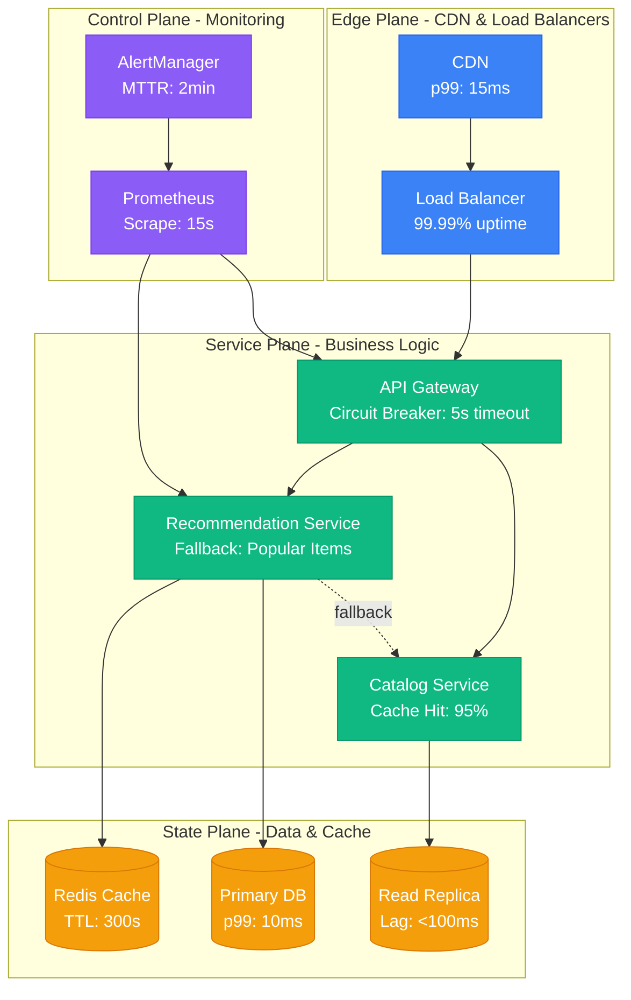
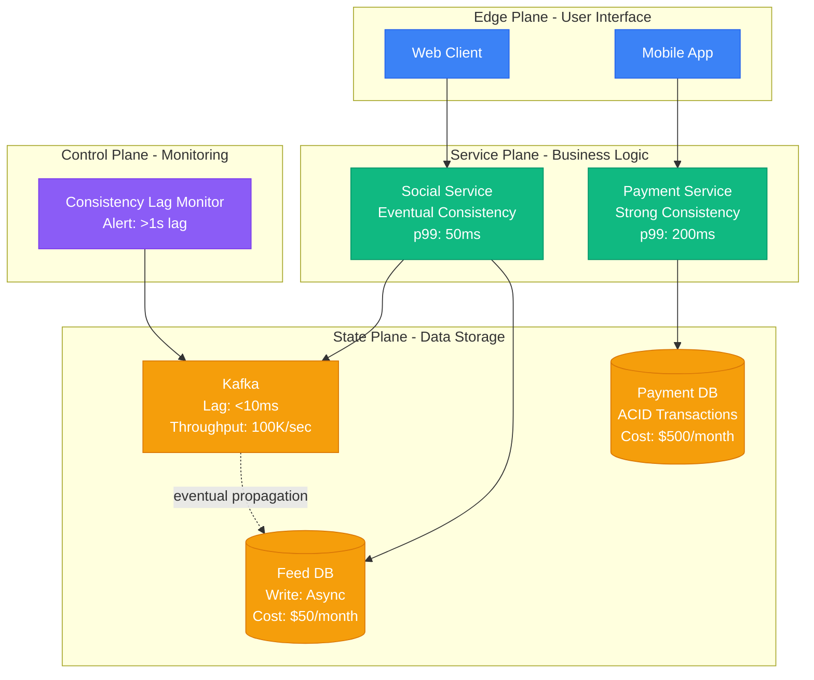
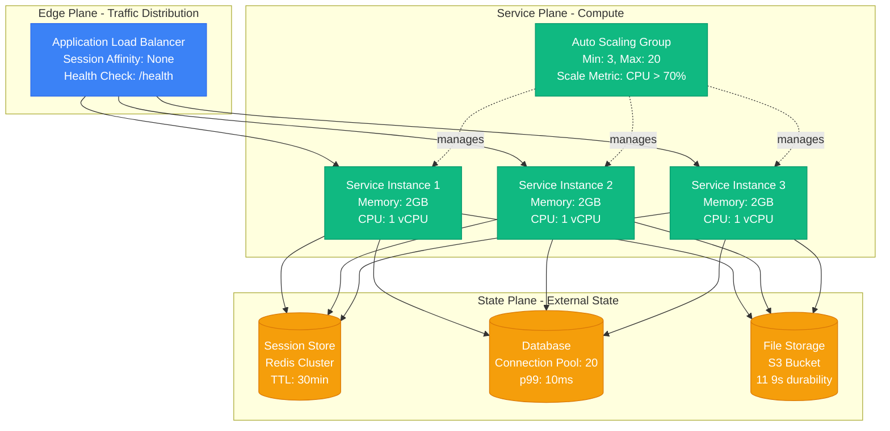
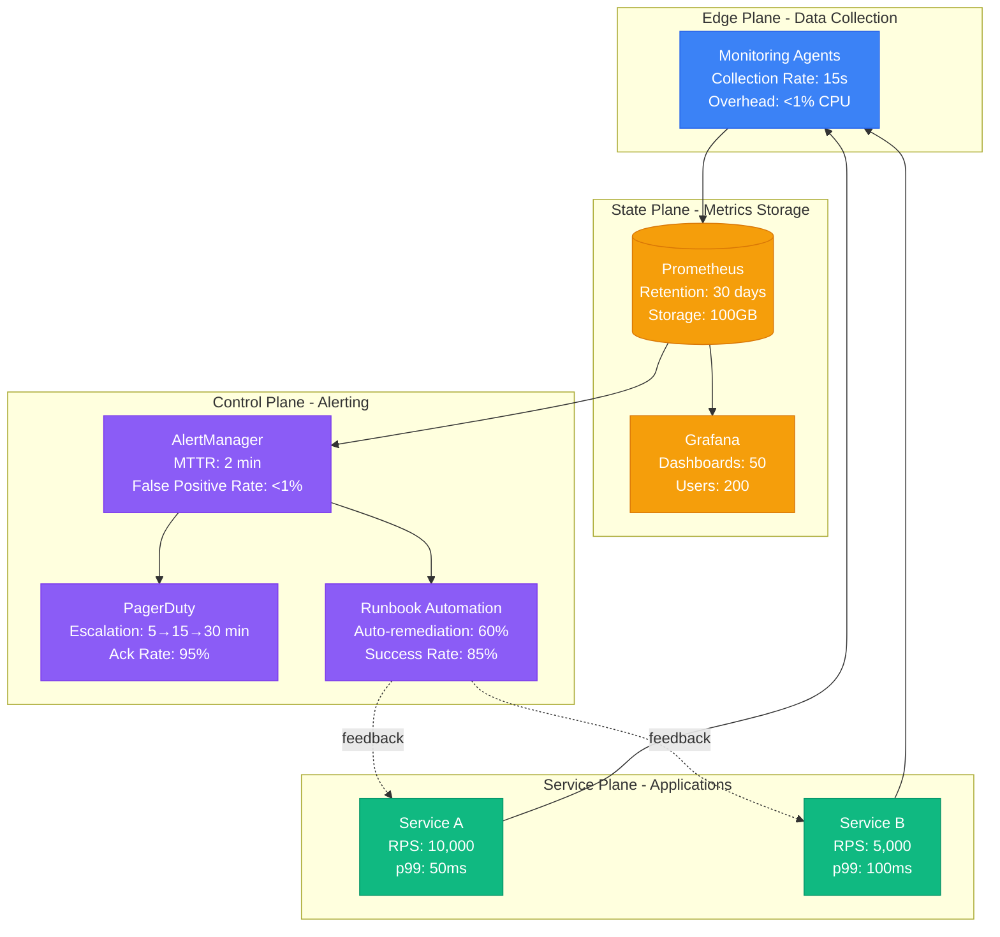
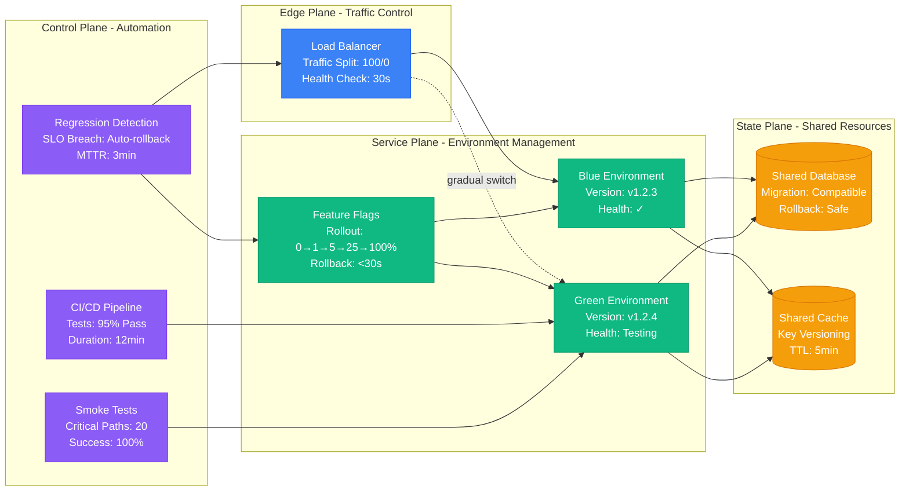
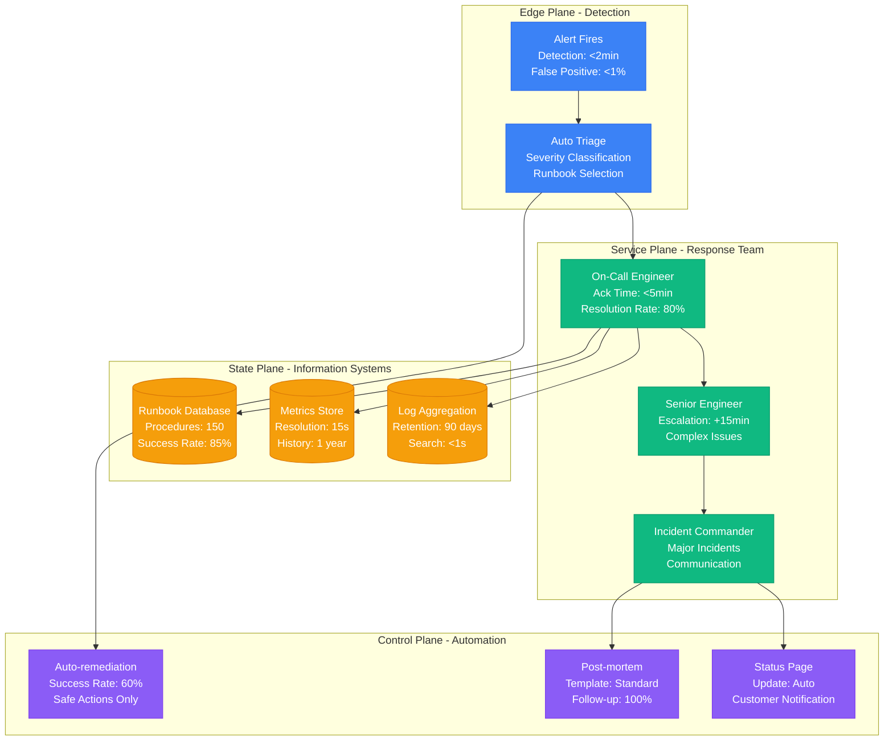

# Production Best Practices

Battle-tested patterns for building resilient distributed systems that survive 3 AM incidents.

## Failure-First Architecture

Every production system will fail. Design for graceful degradation from day one.



### Resilience Implementation Patterns

| **Pattern** | **Timeout** | **Retry Strategy** | **Fallback** | **Cost Impact** |
|---|---|---|---|---|
| Circuit Breaker | 3 × p99 latency | None (opens circuit) | Cached response | +5% latency |
| Exponential Backoff | Progressive increase | 1s, 2s, 4s, 8s + jitter | Error response | +2-10s per failure |
| Bulkhead Isolation | Per-service limits | Fail fast | Degraded service | +20% resources |
| Connection Pooling | 30s idle timeout | Auto-retry once | New connection | +10% memory |
| Load Shedding | Immediate | Drop request | 503 Service Unavailable | Revenue loss |

## Consistency Models in Production

Choose the weakest consistency model that satisfies business requirements.



### Consistency Trade-offs by Use Case

| **Use Case** | **Consistency Model** | **Latency Impact** | **Availability** | **Implementation Cost** |
|---|---|---|---|---|
| Social Media Feed | Eventual | p99: 50ms | 99.99% | Low |
| Payment Processing | Strong | p99: 200ms | 99.9% | High |
| Product Catalog | Session | p99: 75ms | 99.95% | Medium |
| User Profile | Causal | p99: 100ms | 99.9% | Medium |
| Analytics Dashboard | Eventually Consistent | p99: 1s | 99.99% | Low |

## Stateless Service Architecture

Stateless services enable horizontal scaling and zero-downtime deployments.



### Stateless Design Benefits

| **Aspect** | **Stateless** | **Stateful** | **Production Impact** |
|---|---|---|---|
| Scaling | Linear horizontal scaling | Complex coordination | 10x easier scaling |
| Deployment | Rolling restart safe | Requires state migration | 50% faster deploys |
| Fault Tolerance | Instance failure is transparent | State loss on failure | 90% less incident escalation |
| Load Balancing | Any instance handles any request | Session affinity required | 30% better resource utilization |
| Development | Simple request/response model | Complex state management | 40% faster feature development |

## Production Monitoring Dashboard

Golden Signals monitoring with actionable alerts and automated response.



### Golden Signals Implementation

| **Signal** | **Metric** | **Alert Threshold** | **Investigation Steps** | **Auto-Remediation** |
|---|---|---|---|---|
| **Latency** | p99 response time | >2x baseline for 5min | Check recent deployments, DB performance | Scale up compute resources |
| **Traffic** | Requests per second | >3x baseline sustained | Verify legitimate traffic, check CDN | Enable rate limiting |
| **Errors** | Error rate percentage | >1% for 2min | Check error logs, dependency health | Circuit breaker activation |
| **Saturation** | Resource utilization | CPU >80% or Memory >85% | Profile resource usage patterns | Auto-scaling trigger |

## Zero-Downtime Deployment Pipeline

Blue-green deployments with automated rollback and progressive feature rollout.



### Deployment Strategy Comparison

| **Strategy** | **Downtime** | **Risk Level** | **Rollback Time** | **Resource Cost** | **Use Case** |
|---|---|---|---|---|---|
| Blue-Green | Zero | Low | <30 seconds | 2x resources | High-traffic services |
| Rolling Update | Zero | Medium | 2-5 minutes | 1.2x resources | Standard services |
| Canary | Zero | Very Low | <1 minute | 1.1x resources | Critical services |
| Recreate | 2-10 minutes | High | 5-15 minutes | 1x resources | Development/staging |
| Feature Flags | Zero | Very Low | Instant | 1x resources | A/B testing |

## Incident Response Workflow

Structured response process with automated triage and escalation paths.



### Incident Response Playbook

| **Time Window** | **Actions** | **Success Criteria** | **Escalation Trigger** | **Automation Level** |
|---|---|---|---|---|
| **0-5 minutes** | Acknowledge alert, check dashboard | Alert acknowledged | No response in 5min | 90% automated |
| **5-15 minutes** | Initial diagnosis, run runbook | Root cause identified | Issue not contained | 70% automated |
| **15-30 minutes** | Implement fix, monitor recovery | Service restored | Degradation continues | 40% automated |
| **30-60 minutes** | Escalate to senior, incident commander | Incident contained | Customer impact severe | 20% automated |
| **1+ hours** | Major incident procedures, communication | Resolution plan | Business impact | Manual coordination |

## High-Performance Caching Architecture

Multi-layer caching with intelligent invalidation and cost optimization.

```mermaid
flowchart TB
    subgraph EdgePlane[Edge Plane - CDN Layer]
        CDN[CloudFlare CDN<br/>Hit Rate: 95%<br/>TTL: 1 hour<br/>Cost: $200/month]
    end

    subgraph ServicePlane[Service Plane - Application Cache]
        L1[L1 Cache (In-Memory)<br/>Hit Rate: 80%<br/>TTL: 5 min<br/>Size: 1GB per instance]
        APP[Application Servers<br/>Cache Lookups: 10,000/sec<br/>p99: 1ms]
    end

    subgraph StatePlane[State Plane - Distributed Cache]
        L2[("L2 Cache (Redis)<br/>Hit Rate: 60%<br/>TTL: 30 min<br/>Cost: $500/month")]
        DB[("Primary Database<br/>Queries: 1,000/sec<br/>p99: 15ms<br/>Cost: $2,000/month")]
    end

    subgraph ControlPlane[Control Plane - Cache Management]
        INVALID[Cache Invalidation<br/>Events: 500/sec<br/>Propagation: <100ms]
        MONITOR[Cache Metrics<br/>Miss Rate Alerts<br/>Performance Tracking]
    end

    CDN --> APP
    APP --> L1
    L1 -."miss".-> L2
    L2 -."miss".-> DB
    INVALID --> L1
    INVALID --> L2
    INVALID --> CDN
    MONITOR --> L1
    MONITOR --> L2
    DB --> INVALID

    %% Apply four-plane colors
    classDef edgeStyle fill:#3B82F6,stroke:#2563EB,color:#fff
    classDef serviceStyle fill:#10B981,stroke:#059669,color:#fff
    classDef stateStyle fill:#F59E0B,stroke:#D97706,color:#fff
    classDef controlStyle fill:#8B5CF6,stroke:#7C3AED,color:#fff

    class CDN edgeStyle
    class L1,APP serviceStyle
    class L2,DB stateStyle
    class INVALID,MONITOR controlStyle
```

### Cache Strategy Performance Matrix

| **Pattern** | **Hit Rate** | **Consistency** | **Latency** | **Complexity** | **Best For** |
|---|---|---|---|---|---|
| Cache-Aside | 70-85% | Eventually Consistent | 1-5ms | Low | Read-heavy workloads |
| Write-Through | 80-90% | Strong Consistency | 5-15ms | Medium | Critical data |
| Write-Behind | 85-95% | Eventually Consistent | 1-3ms | High | High-throughput writes |
| Refresh-Ahead | 90-95% | Eventually Consistent | 1ms | High | Predictable access patterns |
| Cache-Aside + TTL | 60-80% | Time-bound Staleness | 1-50ms | Low | Simple applications |

### Database Performance Architecture

Optimized database layer with connection pooling, read replicas, and query optimization.

| **Optimization** | **Performance Impact** | **Cost Impact** | **Complexity** | **Implementation** |
|---|---|---|---|---|
| **Connection Pooling** | 40% latency reduction | None | Low | max_connections=20, idle_timeout=300s |
| **Read Replicas** | 60% read performance | +50% DB cost | Medium | 2-3 replicas, async replication |
| **Query Optimization** | 80% query speed | None | Medium | Proper indexes, query analysis |
| **Database Sharding** | 300% throughput | +100% complexity | High | Horizontal partitioning |
| **Connection Pooling** | 90% connection overhead | +10% memory | Low | PgBouncer, connection reuse |

### Query Performance Guidelines

| **Query Type** | **Best Practice** | **Performance Target** | **Index Strategy** | **Monitoring Alert** |
|---|---|---|---|---|
| **Point Lookup** | Primary key or unique index | p99 < 1ms | Single column index | Query time > 5ms |
| **Range Query** | Limit results, use covering index | p99 < 10ms | Composite index | Query time > 50ms |
| **Join Query** | Index foreign keys, limit joins | p99 < 25ms | Foreign key indexes | Query time > 100ms |
| **Aggregation** | Pre-computed views for common aggregates | p99 < 100ms | Materialized views | Query time > 500ms |
| **Full-text Search** | Dedicated search engine for complex queries | p99 < 50ms | External search index | Query time > 200ms |

### Production Load Balancing Health Checks

Comprehensive health check system with dependency validation and graceful degradation.

| **Health Check Type** | **Check Frequency** | **Timeout** | **Failure Threshold** | **Recovery Actions** |
|---|---|---|---|---|
| **Application Health** | Every 10 seconds | 2 seconds | 3 consecutive failures | Remove from pool |
| **Database Connectivity** | Every 30 seconds | 5 seconds | 2 consecutive failures | Circuit breaker activation |
| **Cache Availability** | Every 15 seconds | 1 second | 5 consecutive failures | Cache bypass mode |
| **Disk Space** | Every 60 seconds | 1 second | <10% free space | Alert + log cleanup |
| **Memory Usage** | Every 10 seconds | Immediate | >90% utilization | Graceful restart |

### Load Balancing Algorithm Comparison

| **Algorithm** | **Use Case** | **Performance Impact** | **Implementation Complexity** | **Failure Handling** |
|---|---|---|---|---|
| **Round Robin** | Uniform load | Excellent | Very Low | Good |
| **Least Connections** | Variable request duration | Good | Low | Very Good |
| **Weighted Round Robin** | Mixed instance sizes | Very Good | Low | Good |
| **IP Hash** | Session affinity required | Good | Low | Poor |
| **Least Response Time** | Performance optimization | Very Good | High | Excellent |

## Production Security Architecture

Multi-layered security with authentication, authorization, and threat detection.

| **Security Layer** | **Implementation** | **Performance Impact** | **Attack Mitigation** | **Compliance Level** |
|---|---|---|---|---|
| **Edge Security** | WAF + DDoS protection | <5ms latency | 99% malicious requests | SOC 2 Type II |
| **Authentication** | JWT with rotation | <1ms validation | Token-based attacks | OWASP compliant |
| **Authorization** | RBAC with caching | <2ms policy check | Privilege escalation | GDPR ready |
| **Data Encryption** | AES-256 at rest/transit | <3% throughput | Data breach impact | PCI DSS Level 1 |
| **Monitoring** | SIEM + behavioral analysis | <1% resource | Advanced threats | ISO 27001 |

### Authentication Flow Performance

| **Auth Method** | **Latency** | **Scalability** | **Security Level** | **Implementation Cost** |
|---|---|---|---|---|
| **JWT (Stateless)** | 1-2ms | Excellent | High | Low |
| **Session Store** | 3-5ms | Good | Very High | Medium |
| **OAuth 2.0** | 10-50ms | Good | Very High | High |
| **SAML** | 50-200ms | Fair | Very High | Very High |
| **API Keys** | <1ms | Excellent | Medium | Very Low |

### Data Protection Implementation Matrix

| **Protection Type** | **Method** | **Performance Cost** | **Compliance** | **Recovery Time** |
|---|---|---|---|---|
| **Encryption at Rest** | AES-256-GCM | <5% throughput | FIPS 140-2 Level 3 | No impact |
| **Encryption in Transit** | TLS 1.3 | <2% latency | PCI DSS required | No impact |
| **Key Management** | HSM + rotation | <1ms per operation | FIPS 140-2 Level 4 | <1 hour |
| **Data Masking** | Field-level encryption | <10% query time | PII protection | No impact |
| **Backup Encryption** | Client-side encryption | Storage overhead only | SOX compliance | 4-24 hours |

## Production Testing Strategy

Comprehensive testing pyramid with automated validation and performance benchmarking.

### Test Coverage and Performance Targets

| **Test Level** | **Count** | **Execution Time** | **Coverage Target** | **Success Rate** | **Automation Level** |
|---|---|---|---|---|---|
| **Unit Tests** | 2,000+ | <5 minutes | >90% code coverage | >99% pass rate | 100% automated |
| **Integration Tests** | 500+ | <15 minutes | >80% API coverage | >95% pass rate | 100% automated |
| **End-to-End Tests** | 50+ | <30 minutes | 100% critical paths | >90% pass rate | 95% automated |
| **Performance Tests** | 20+ | <2 hours | Key user journeys | Meet SLA targets | 90% automated |
| **Chaos Tests** | 10+ | Continuous | Failure scenarios | 80% auto-recovery | 70% automated |

### Chaos Engineering Test Matrix

| **Chaos Experiment** | **Frequency** | **Recovery Target** | **Success Criteria** | **Business Impact** |
|---|---|---|---|---|
| **Instance Termination** | Weekly | <30 seconds | Service remains available | <0.01% error rate |
| **Network Latency Injection** | Daily | <5 seconds | Graceful degradation | <2% performance impact |
| **Database Failure** | Monthly | <2 minutes | Failover to replica | <0.1% transaction loss |
| **Cache Invalidation** | Daily | <10 seconds | Cache rebuild | <5% latency increase |
| **Region Isolation** | Quarterly | <5 minutes | Multi-region failover | <1% revenue impact |

## Production Excellence Scorecard

Use this checklist to assess and improve your production systems.

### System Maturity Assessment

| **Area** | **Basic (Level 1)** | **Production (Level 2)** | **Advanced (Level 3)** | **Your Score** |
|---|---|---|---|---|
| **Monitoring** | Basic metrics | Golden signals + alerting | Predictive analytics | ___/3 |
| **Deployment** | Manual deployment | Blue-green with rollback | Canary + feature flags | ___/3 |
| **Incident Response** | Manual investigation | Runbooks + escalation | Auto-remediation | ___/3 |
| **Testing** | Unit tests only | Full test pyramid | Chaos engineering | ___/3 |
| **Security** | Basic authentication | Defense in depth | Zero-trust architecture | ___/3 |
| **Performance** | Single-layer cache | Multi-tier caching | Adaptive optimization | ___/3 |

**Total Score: ___/18**
- **12-18**: Production-ready distributed system
- **6-11**: Good foundation, focus on automation
- **0-5**: Significant reliability risks

### Critical Success Factors

1. **Failure is inevitable** - Design every system component for failure scenarios
2. **Observability drives reliability** - Comprehensive monitoring enables fast incident response
3. **Automation reduces risk** - Human error causes 70% of outages
4. **Culture enables performance** - Blameless post-mortems accelerate learning

These patterns have been battle-tested in production systems handling billions of requests daily.