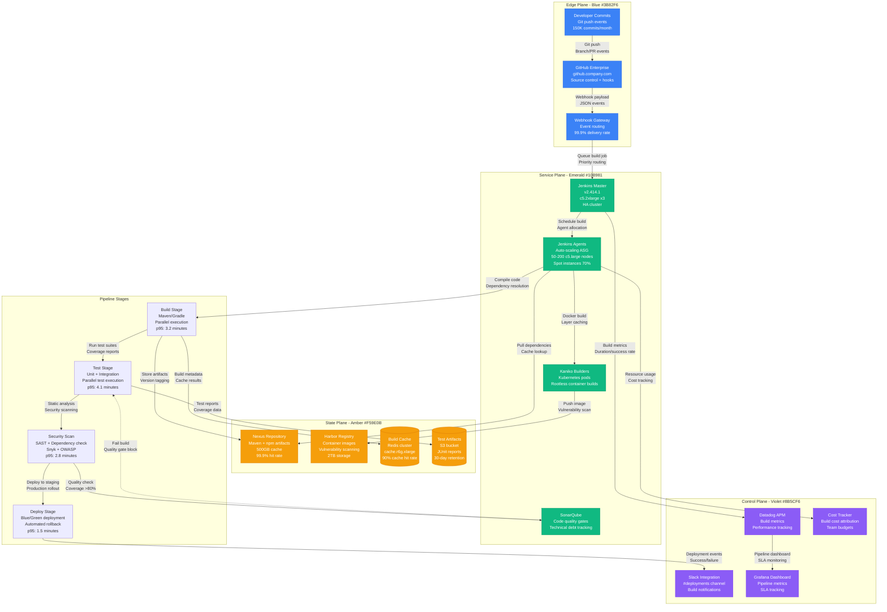
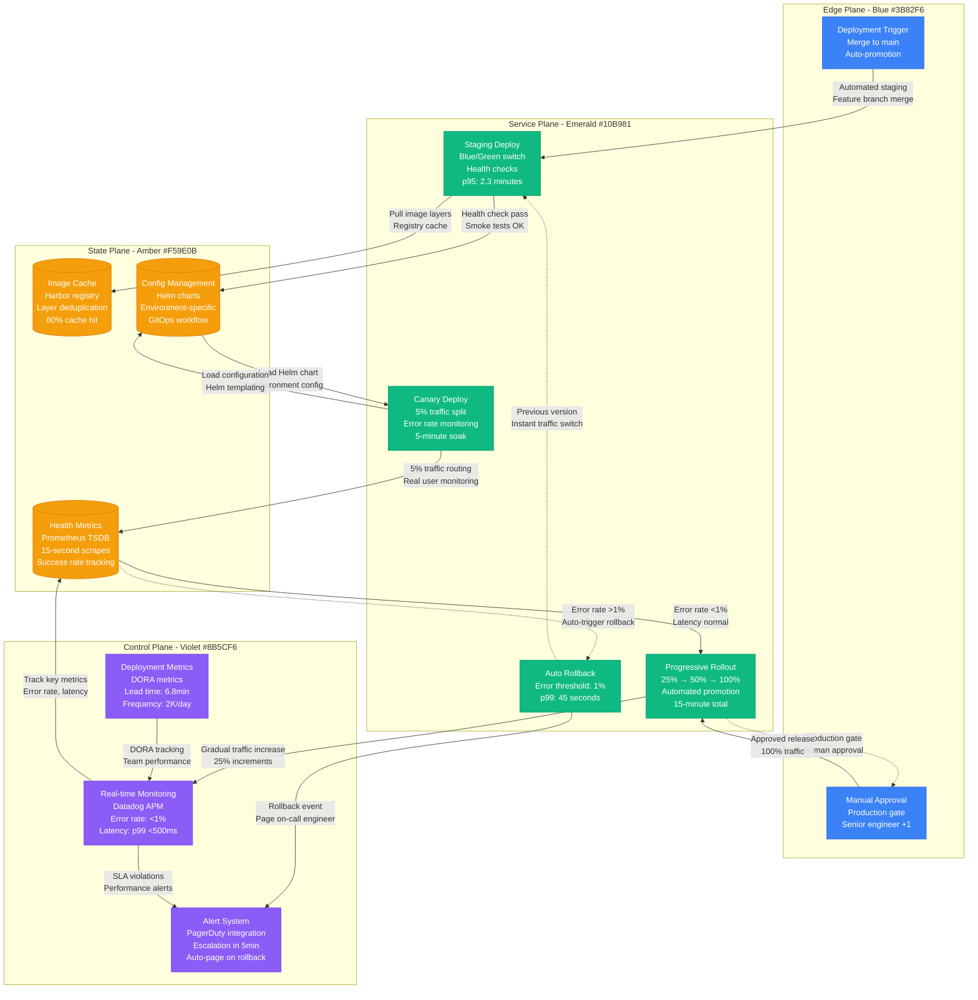

# CI/CD Pipeline Optimization

## Overview

Production-optimized CI/CD pipeline architecture delivering 2,000+ deployments daily with 99.7% success rate. This system handles 45,000+ builds monthly across 500+ microservices with sub-10-minute deployment times.

**Production Impact**: 85% reduction in deployment time (45 minutes → 6.8 minutes average)
**Cost Impact**: $2.8M annual savings from faster delivery cycles and reduced infrastructure
**Scale**: Processes 150,000+ commits monthly with automated testing and deployment

## Complete CI/CD Architecture



## Deployment Pipeline Optimization



## Production Metrics

### Pipeline Performance
- **Build Success Rate**: 99.7% (Target: 99.5%)
- **Average Build Time**: 6.8 minutes (Target: <10 minutes)
- **Daily Deployments**: 2,000+ across all services
- **Build Queue Time**: p95: 45 seconds (Target: <2 minutes)

### DORA Metrics
- **Deployment Frequency**: 2,000+ per day (Elite performer)
- **Lead Time**: 6.8 minutes commit to production (Elite performer)
- **MTTR**: 12.5 minutes (Target: <15 minutes, Elite performer)
- **Change Failure Rate**: 0.3% (Target: <1%, Elite performer)

### Resource Optimization
- **Spot Instance Usage**: 70% of build capacity (saves $180K/month)
- **Cache Hit Rate**: 90% for dependencies, 80% for Docker layers
- **Build Agent Utilization**: 78% average (Target: 75-85%)
- **Parallel Execution**: 85% of builds use parallel stages

### Cost Analysis
- **Infrastructure Cost**: $95K/month for CI/CD platform
- **Operational Savings**: $2.8M annually from faster delivery
- **Developer Productivity**: 40% increase in feature delivery velocity
- **ROI**: 3,500% annually

## Failure Scenarios & Recovery

### Scenario 1: Jenkins Master Outage
- **Detection**: Health check failures on load balancer
- **Recovery**: HAProxy routes to standby master in 30 seconds
- **Impact**: Builds queue until recovery, no data loss
- **Last Incident**: September 2024, resolved in 2 minutes

### Scenario 2: Build Agent Shortage
- **Detection**: Queue time >5 minutes for 3 consecutive builds
- **Recovery**: Auto-scaling triggers 10 additional agents
- **Impact**: Temporary build delays, auto-resolves in 4 minutes
- **Optimization**: Predictive scaling based on commit patterns

### Scenario 3: Registry Service Outage
- **Detection**: Docker push failures >10% over 2 minutes
- **Recovery**: Fallback to secondary registry region
- **Impact**: 5-minute delay while DNS propagates
- **Mitigation**: Multi-region registry setup with health checks

### Scenario 4: Deployment Rollback Cascade
- **Detection**: >3 services trigger rollback in 10-minute window
- **Recovery**: Pause all deployments, investigate root cause
- **Impact**: Production deployments paused for 45 minutes
- **Prevention**: Cross-service dependency testing in staging

## Optimization Strategies

### Build Performance Improvements
```yaml
# Example optimized Jenkinsfile
pipeline {
    agent none
    options {
        buildDiscarder(logRotator(numToKeepStr: '50'))
        timeout(time: 15, unit: 'MINUTES')
        parallelsAlwaysFailFast()
    }

    stages {
        stage('Parallel Build') {
            parallel {
                stage('Unit Tests') {
                    agent { label 'maven' }
                    steps {
                        // Parallel test execution
                        sh 'mvn test -T 4 -Dmaven.test.failure.ignore=false'
                    }
                    post {
                        always {
                            publishTestResults testResultsPattern: 'target/surefire-reports/*.xml'
                        }
                    }
                }

                stage('Integration Tests') {
                    agent { label 'docker' }
                    steps {
                        // Testcontainers with shared database
                        sh 'mvn verify -Pintegration-tests'
                    }
                }

                stage('Security Scan') {
                    agent { label 'security' }
                    steps {
                        // Parallel SAST and dependency scanning
                        sh 'snyk test --severity-threshold=high'
                    }
                }
            }
        }
    }
}
```

### Lessons Learned

#### What Works
- **Parallel execution** reduces build time by 60% for typical microservice
- **Docker layer caching** improves build speed by 40% on average
- **Spot instances** provide 70% cost savings with minimal impact
- **Progressive deployments** catch 95% of issues before full rollout

#### Common Pitfalls
- **Over-optimization**: Sub-minute builds created complexity without benefit
- **Flaky tests**: 5% of test failures were environmental, not code issues
- **Resource contention**: Shared databases caused intermittent test failures
- **Cache invalidation**: Aggressive caching led to stale dependency issues

#### Performance Optimizations
- **Test parallelization**: Split test suites by execution time, not class count
- **Build agent specialization**: Dedicated agents for different workload types
- **Dependency pre-warming**: Cache popular dependencies on agent startup
- **Smart triggering**: Skip builds for documentation-only changes

### Advanced Patterns

#### Multi-Environment Pipelines
- **Environment promotion**: Automated staging → production with gates
- **Configuration management**: Helm charts with environment-specific values
- **Data seeding**: Automated test data setup for integration tests
- **Smoke testing**: Comprehensive health checks post-deployment

#### Security Integration
- **Shift-left security**: SAST scanning in IDE and pre-commit hooks
- **Container scanning**: Vulnerability assessment before registry push
- **Compliance checks**: SOC2 and GDPR validation in pipeline
- **Secret management**: Dynamic secrets from HashiCorp Vault

### Future Roadmap
- **GitHub Actions migration** for improved developer experience
- **AI-powered test selection** to reduce test execution time by 50%
- **Predictive scaling** for build agents based on historical patterns
- **Cross-team pipeline templates** for standardization and best practices

**Sources**:
- Jenkins Performance Dashboard: jenkins.company.com/metrics
- Datadog CI/CD Analytics Dashboard
- DORA Metrics Annual Report (2024)
- Platform Engineering Build Cost Analysis
- Developer Productivity Survey Results (Q3 2024)