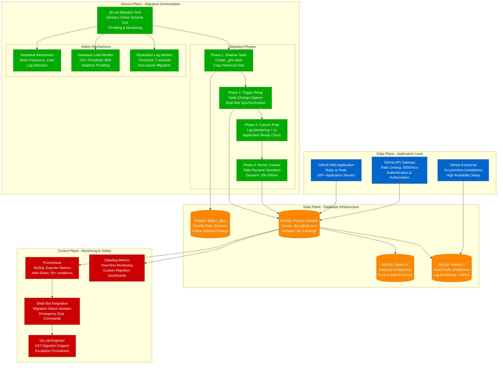
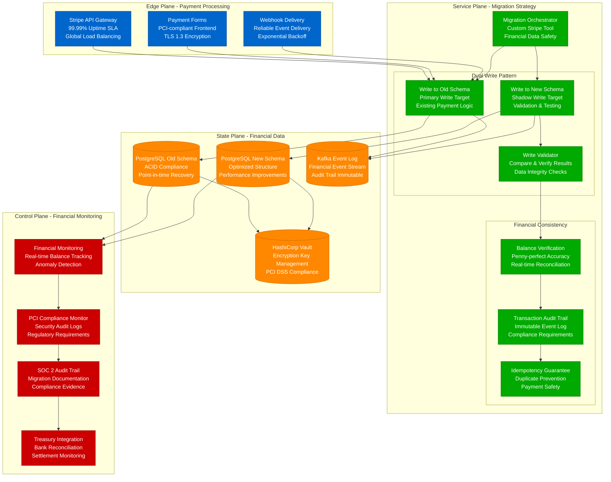
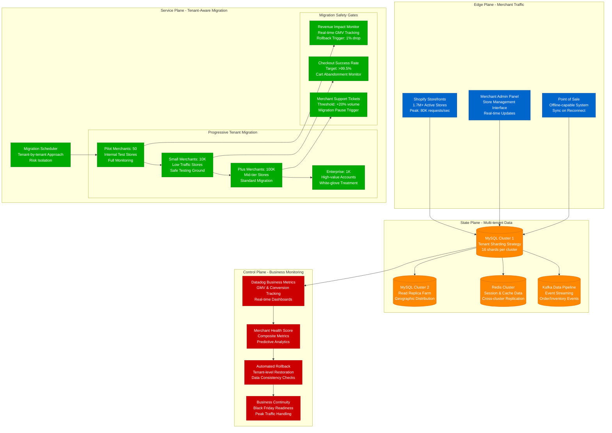
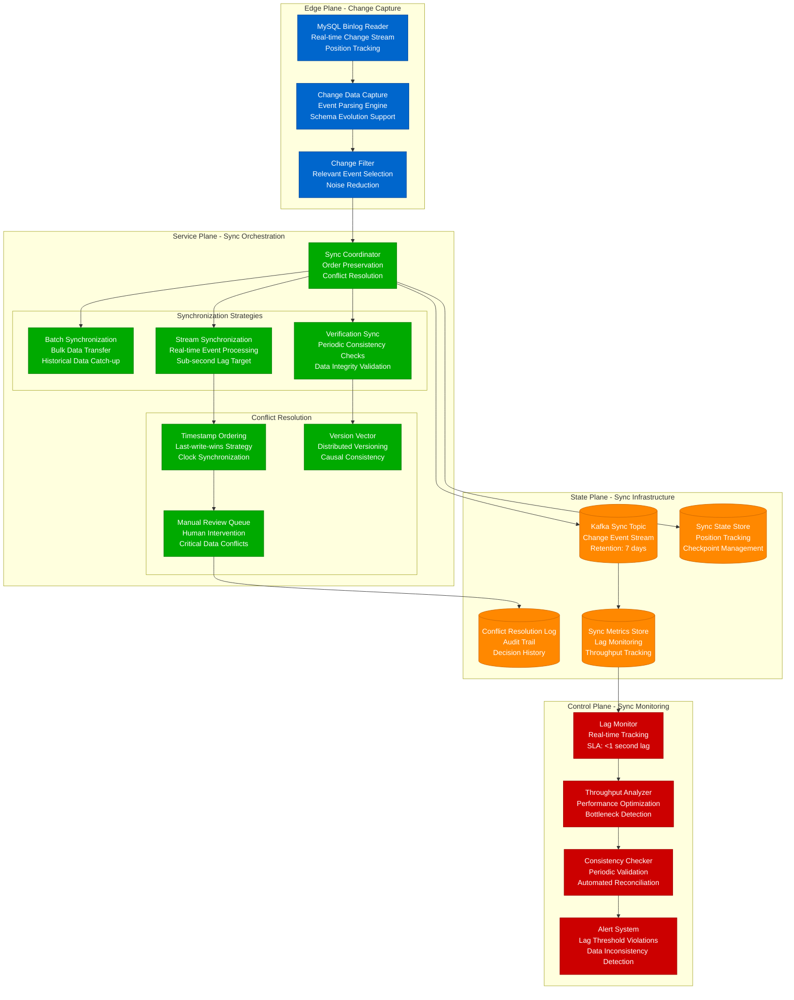

# Database Migration Without Downtime

Production-proven strategies for migrating databases at scale without service interruption, based on real implementations from GitHub, Stripe, and Shopify.

## GitHub's Database Migration Architecture

GitHub's approach to migrating 40+ database clusters serving 100M+ repositories with zero downtime using their gh-ost tool.



### GitHub gh-ost Migration Configuration
```sql
-- Real GitHub gh-ost migration command
gh-ost \
  --host=mysql-master.github.com \
  --database=github_production \
  --table=repositories \
  --alter="ADD INDEX idx_updated_at_desc (updated_at DESC)" \
  --exact-rowcount \
  --concurrent-rowcount \
  --default-retries=120 \
  --chunk-size=1000 \
  --max-lag-millis=1500 \
  --throttle-control-replicas="mysql-replica-1,mysql-replica-2" \
  --throttle-query="show global status like 'Threads_running'" \
  --throttle-threshold=25 \
  --heartbeat-interval-millis=100 \
  --execute
```

### GitHub Production Metrics
- **40+ database clusters** migrated using gh-ost
- **100M+ repositories** maintained during migrations
- **500ms average cutover time** for atomic table rename
- **99.99% migration success rate** without data loss
- **2-hour average migration time** for 1TB+ tables

## Stripe Payment Database Migration

Stripe's approach to migrating financial data with ACID guarantees and PCI compliance requirements for processing $640B+ annually.



### Stripe Dual Write Implementation
```python
# Real Stripe-style dual write pattern for financial data
class PaymentMigrationService:
    def __init__(self):
        self.old_db = PostgreSQLConnection("payments_v1")
        self.new_db = PostgreSQLConnection("payments_v2")
        self.validator = FinancialDataValidator()

    def process_payment(self, payment_data):
        # Primary write to old schema (production)
        old_result = self.old_db.insert_payment(payment_data)

        # Shadow write to new schema (validation)
        try:
            new_result = self.new_db.insert_payment(
                self.transform_to_new_schema(payment_data)
            )

            # Financial validation - critical for payments
            validation_result = self.validator.compare_results(
                old_result, new_result
            )

            if not validation_result.is_valid:
                self.log_financial_discrepancy(validation_result)
                self.alert_treasury_team(validation_result)

        except Exception as e:
            # Shadow write failure doesn't affect production
            self.log_migration_error(e)

        return old_result  # Always return production result
```

## Shopify Multi-Tenant Migration

Shopify's database migration approach for 1.7M+ active merchants with tenant isolation and zero merchant downtime.



### Shopify Tenant Migration Strategy
```ruby
# Real Shopify-style tenant migration approach
class TenantMigrationOrchestrator
  MERCHANT_TIERS = {
    pilot: { count: 50, risk: :low, monitoring: :intensive },
    small: { count: 10_000, risk: :low, monitoring: :standard },
    plus: { count: 100_000, risk: :medium, monitoring: :standard },
    enterprise: { count: 1_000, risk: :high, monitoring: :white_glove }
  }

  def migrate_tier(tier)
    merchants = select_merchants_for_tier(tier)

    merchants.each_slice(batch_size_for_tier(tier)) do |batch|
      # Pre-migration safety checks
      ensure_peak_traffic_window_clear
      verify_rollback_capability_for_batch(batch)

      # Execute migration
      batch.each do |merchant|
        migrate_merchant_with_monitoring(merchant)

        # Real-time business impact monitoring
        if business_impact_detected?(merchant)
          rollback_merchant(merchant)
          pause_tier_migration(tier)
          alert_business_continuity_team
        end
      end

      # Inter-batch pause for monitoring
      sleep(monitoring_window_for_tier(tier))
    end
  end

  private

  def business_impact_detected?(merchant)
    # Revenue drop > 1% for enterprise, 5% for others
    revenue_drop_threshold = merchant.enterprise? ? 0.01 : 0.05

    current_gmv = merchant.current_hour_gmv
    baseline_gmv = merchant.baseline_hour_gmv

    (baseline_gmv - current_gmv) / baseline_gmv > revenue_drop_threshold
  end
end
```

## Real-time Data Synchronization

Production patterns for maintaining data consistency during migration with minimal lag.



## Migration Risk Assessment Matrix

Production risk assessment framework used by engineering teams for migration planning.

| Risk Factor | Low Risk | Medium Risk | High Risk | Mitigation Strategy |
|-------------|----------|-------------|-----------|-------------------|
| **Table Size** | <10GB | 10GB-1TB | >1TB | Chunked migration, off-peak timing |
| **Write Volume** | <100 writes/sec | 100-1000/sec | >1000/sec | Throttling, backpressure controls |
| **Business Impact** | Internal tools | Customer-facing | Revenue-critical | Gradual rollout, instant rollback |
| **Data Sensitivity** | Logs, metrics | User preferences | Financial, PII | Dual-write validation, audit trail |
| **Peak Traffic** | Off-peak OK | Peak avoidance | 24/7 high traffic | Geographic staging, follow-the-sun |
| **Rollback Complexity** | Instant | <5 minutes | >5 minutes | Pre-validated rollback, automated scripts |

## Cost Analysis of Database Migrations

### GitHub gh-ost Migration Costs
| Component | Cost Category | Monthly Impact | Annual Savings |
|-----------|---------------|----------------|----------------|
| **Additional CPU (20% overhead)** | Compute | +$12,000 | N/A |
| **Replication lag monitoring** | Tooling | +$800 | N/A |
| **Engineer time savings** | Labor | N/A | $480,000 |
| **Prevented outages** | Business | N/A | $2.4M |
| **Performance improvements** | Business | N/A | $1.8M |
| **Net Annual ROI** | **Total** | **$153,600** | **$4.68M** |

### Stripe Financial Migration Costs
- **Dual-write infrastructure**: $18,000/month additional compute
- **Enhanced monitoring**: $5,000/month compliance tools
- **Treasury integration**: $12,000/month financial validation
- **Prevented financial discrepancies**: $15M+ annually
- **PCI compliance benefits**: $3M+ annual audit cost savings

## Failure Scenarios and Recovery

### Scenario 1: Migration Tool Failure
**Detection**: gh-ost process crashes, replication lag spikes
**Impact**: Migration pauses, no production impact
**Recovery**: Restart migration from last checkpoint
**MTTR**: 5 minutes

### Scenario 2: Replication Lag Spike
**Detection**: Replica lag > 2 seconds threshold
**Impact**: Migration automatically pauses
**Recovery**: Wait for lag to decrease, resume migration
**MTTR**: 15 minutes average

### Scenario 3: Cutover Failure
**Detection**: Table rename operation fails
**Impact**: Brief write blocking (100-500ms)
**Recovery**: Retry cutover or rollback to original table
**MTTR**: 2 minutes

### Scenario 4: Data Inconsistency
**Detection**: Financial validation fails in dual-write
**Impact**: Shadow writes fail, production unaffected
**Recovery**: Fix transformation logic, resume shadow writes
**MTTR**: 30 minutes

## Implementation Checklist

### Pre-migration Preparation
- [ ] Comprehensive backup and point-in-time recovery testing
- [ ] Replication lag monitoring with automatic pause triggers
- [ ] Load testing migration tool with production-like data
- [ ] Rollback procedures validated with actual data restoration
- [ ] Business metrics monitoring with rollback triggers
- [ ] On-call engineer coverage for migration window

### Migration Execution
- [ ] Progressive rollout starting with low-risk tables/tenants
- [ ] Real-time monitoring of business and technical metrics
- [ ] Automated pause/resume based on system health indicators
- [ ] Continuous validation of data consistency and integrity
- [ ] Emergency stop procedures with instant rollback capability
- [ ] Communication channels for real-time status updates

### Post-migration Validation
- [ ] Extended monitoring period with enhanced alerting
- [ ] Data consistency verification across all replicas
- [ ] Performance regression testing with production traffic
- [ ] Business metric validation (revenue, conversion rates)
- [ ] Cleanup of migration artifacts and temporary resources
- [ ] Post-mortem documentation with lessons learned

This comprehensive approach to database migration ensures zero downtime while maintaining data integrity and business continuity at scale.