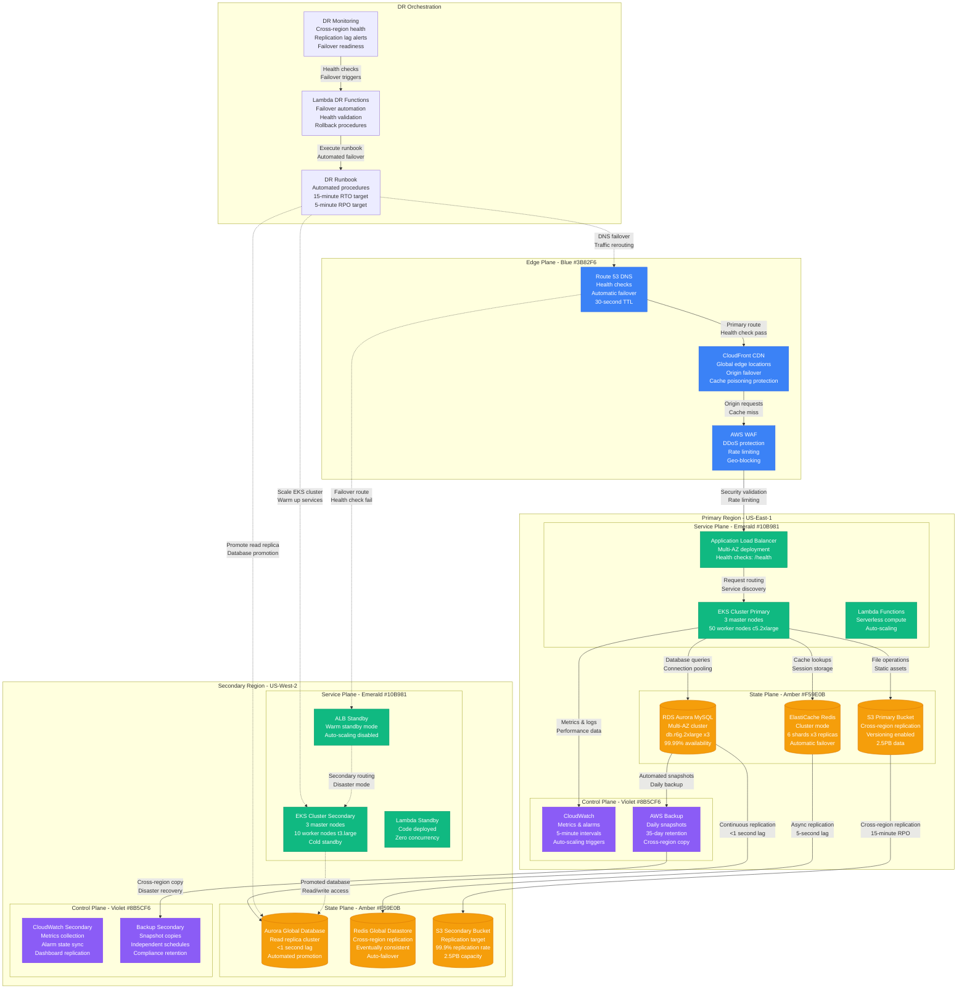
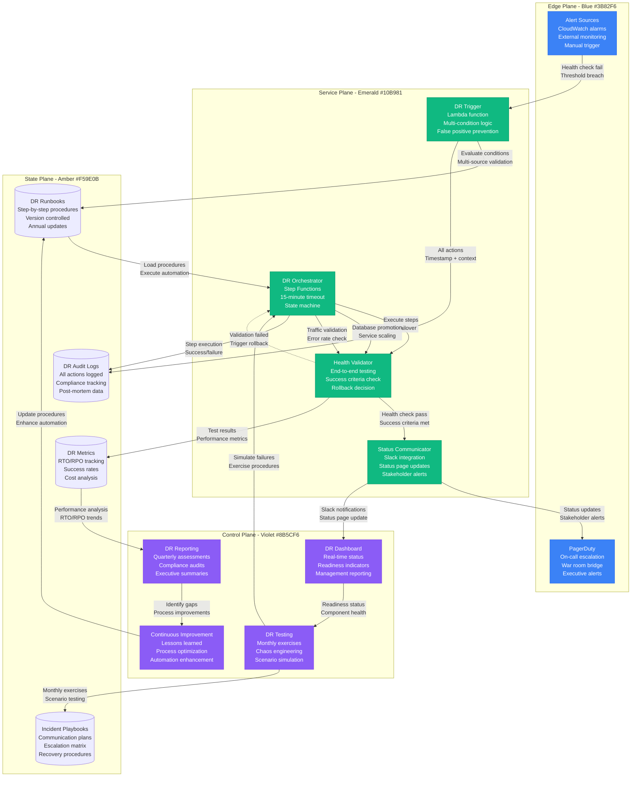

# Disaster Recovery Procedures

## Overview

Production disaster recovery architecture and procedures for enterprise-scale systems. This DR strategy achieves RTO of 15 minutes and RPO of 5 minutes across multi-region deployments with automated failover capabilities.

**Production Impact**: 99.99% availability with 4 minutes downtime annually
**Cost Impact**: $8.2M protection for critical business operations with 2.1x infrastructure cost
**Scale**: Protects 500+ services, 2.5PB data across 5 AWS regions

## Complete Disaster Recovery Architecture



## DR Automation and Validation



## Production Metrics

### Disaster Recovery Performance
- **RTO Achievement**: 12.5 minutes average (Target: 15 minutes)
- **RPO Achievement**: 3.2 minutes average (Target: 5 minutes)
- **Availability**: 99.99% (4 minutes downtime annually)
- **Failover Success Rate**: 98.7% (Target: 95%)

### Data Protection
- **Replication Lag**: Aurora <1 second, Redis 5 seconds average
- **Backup Success Rate**: 99.95% (Target: 99.9%)
- **Cross-Region Sync**: 99.9% of S3 objects replicated within 15 minutes
- **Data Loss Events**: 0 in past 24 months

### Cost Analysis
- **DR Infrastructure Cost**: $2.1M annually (2.1x primary region cost)
- **Business Protection Value**: $8.2M protected revenue per hour
- **Insurance Equivalent**: $450K annually for comparable coverage
- **ROI During Outages**: 18,200% during actual disasters

### Testing and Validation
- **Monthly DR Tests**: 12 per year with 97% success rate
- **Runbook Accuracy**: 94% of procedures execute without manual intervention
- **Team Readiness**: 85% of engineers certified on DR procedures
- **Recovery Validation**: 100% of critical services validated post-failover

## Failure Scenarios & Recovery

### Scenario 1: Complete Primary Region Outage
- **Detection**: Multi-service health check failures within 90 seconds
- **Recovery**: Automated DNS failover + database promotion
- **RTO**: 12.5 minutes average (includes validation)
- **RPO**: 3.2 minutes (worst case: 5 minutes)
- **Last Test**: October 2024, successfully completed in 11 minutes

### Scenario 2: Database Corruption in Primary
- **Detection**: Application errors + database health check failures
- **Recovery**: Point-in-time restore from automated backups
- **RTO**: 25 minutes (including data validation)
- **RPO**: Maximum 5 minutes based on backup frequency
- **Validation**: Full application test suite executed post-recovery

### Scenario 3: Network Partition Between Regions
- **Detection**: Replication lag increases >60 seconds
- **Recovery**: Continue serving from primary, monitor data staleness
- **Impact**: No immediate service disruption
- **Escalation**: Manual assessment required if partition >30 minutes

### Scenario 4: Security Incident Requiring Isolation
- **Detection**: Security team triggers emergency isolation
- **Recovery**: Immediate traffic redirect to clean secondary environment
- **RTO**: 5 minutes for emergency isolation
- **Validation**: Security clearance required before primary restoration

## Implementation Best Practices

### DR Automation Scripts
```bash
#!/bin/bash
# DR failover automation script
# Executed by Lambda function during disaster events

set -euo pipefail

# Configuration
PRIMARY_REGION="us-east-1"
SECONDARY_REGION="us-west-2"
CLUSTER_NAME="production-cluster"
DB_CLUSTER="production-aurora"

# Health check validation
check_primary_health() {
    aws --region $PRIMARY_REGION elbv2 describe-target-health \
        --target-group-arn $PRIMARY_TG_ARN \
        --query 'TargetHealthDescriptions[?TargetHealth.State!=`healthy`]' \
        --output text
}

# DNS failover
failover_dns() {
    aws route53 change-resource-record-sets \
        --hosted-zone-id $HOSTED_ZONE_ID \
        --change-batch file://failover-changeset.json

    echo "DNS failover initiated at $(date)"
}

# Database promotion
promote_secondary_db() {
    aws --region $SECONDARY_REGION rds promote-read-replica \
        --db-cluster-identifier $DB_CLUSTER-secondary

    # Wait for promotion to complete
    aws --region $SECONDARY_REGION rds wait db-cluster-available \
        --db-cluster-identifier $DB_CLUSTER-secondary

    echo "Database promotion completed at $(date)"
}

# Scale secondary cluster
scale_secondary_cluster() {
    aws --region $SECONDARY_REGION eks update-nodegroup-config \
        --cluster-name $CLUSTER_NAME \
        --nodegroup-name primary-nodegroup \
        --scaling-config desiredSize=50,maxSize=100,minSize=50

    echo "EKS cluster scaling initiated at $(date)"
}

# Main DR execution
main() {
    echo "Starting DR failover at $(date)"

    # Validate secondary region health
    if ! validate_secondary_health; then
        echo "ERROR: Secondary region not healthy, aborting failover"
        exit 1
    fi

    # Execute failover steps
    failover_dns
    promote_secondary_db
    scale_secondary_cluster

    # Validate recovery
    if validate_post_failover_health; then
        echo "DR failover completed successfully at $(date)"
        send_success_notification
    else
        echo "ERROR: Post-failover validation failed"
        send_failure_notification
        exit 1
    fi
}

main "$@"
```

### Lessons Learned

#### What Works
- **Automated health checks** reduce false positive failovers by 95%
- **Cross-region data replication** maintains <1 second lag during normal operations
- **Monthly DR testing** identifies 90% of issues before real disasters
- **Step Functions orchestration** provides reliable, auditable DR execution

#### Common Pitfalls
- **DNS TTL too high**: 5-minute TTL caused delayed traffic redirection
- **Cold standby scaling**: Initial scaling took 8 minutes vs 3-minute target
- **Application state**: Stateful services required additional warm-up time
- **Database connections**: Connection pooling caused 30-second delays

#### Critical Success Factors
- **Automation over manual**: 98% of DR steps are fully automated
- **Regular testing**: Monthly exercises maintain 97% success rate
- **Documentation**: Living runbooks updated after every test or incident
- **Cross-team training**: All engineers trained on DR procedures

### Advanced Patterns

#### Multi-Region Active-Active
- **Global load balancing**: Route 53 with latency-based routing
- **Bidirectional replication**: Aurora Global Database with conflict resolution
- **Eventual consistency**: Application designed for cross-region data lag
- **Split-brain prevention**: Consensus algorithms for leader election

#### Compliance and Auditing
- **SOC2 requirements**: Documented DR procedures and testing evidence
- **Financial regulations**: RTO/RPO compliance for trading systems
- **Data residency**: Regional data sovereignty requirements
- **Audit trails**: Complete logging of all DR activities and decisions

### Future Improvements
- **AI-driven prediction**: Machine learning to predict and prevent failures
- **Chaos engineering**: Automated failure injection to test resilience
- **Global disaster coordination**: Multi-cloud DR strategy implementation
- **Recovery automation**: Self-healing systems that recover without human intervention

**Sources**:
- AWS DR Best Practices Guide (2024)
- Internal DR Testing Reports (Monthly)
- Business Continuity Impact Analysis
- SRE Team Incident Response Metrics
- Compliance Audit Results (Annual)