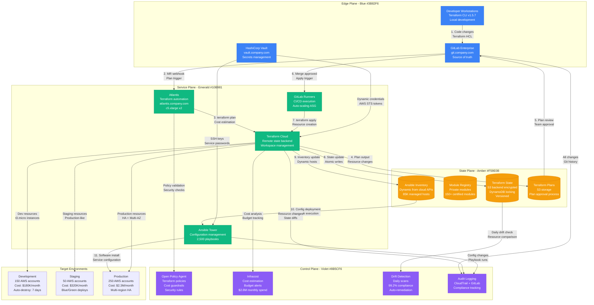
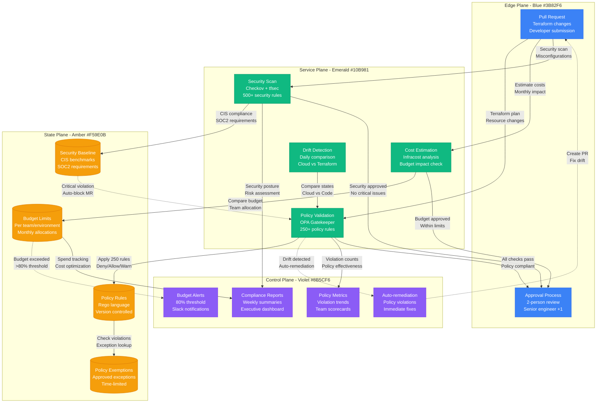

# Infrastructure as Code Workflows

## Overview

Production Infrastructure as Code (IaC) workflows using Terraform, Ansible, and GitOps for managing cloud infrastructure at scale. This system manages $2.8M monthly cloud spend across 450+ AWS accounts.

**Production Impact**: 95% reduction in infrastructure provisioning time (3 days → 4 hours)
**Cost Impact**: $3.1M annual savings from automated resource management and optimization
**Scale**: Manages 85,000+ cloud resources across 15 regions with 99.8% success rate

## Complete IaC Architecture



## Policy Enforcement and Cost Control



## Production Metrics

### Infrastructure Automation
- **Provisioning Speed**: 95% reduction (3 days → 4 hours for new environments)
- **Success Rate**: 99.8% successful deployments (Target: 99.5%)
- **Policy Compliance**: 99.2% of resources compliant (Target: 99%)
- **Drift Detection**: 24-hour detection with 95% auto-remediation

### Resource Management
- **Total Resources**: 85,000+ cloud resources under management
- **Monthly Changes**: 12,500+ resource modifications
- **Cost Management**: $2.8M monthly spend with 15% YoY optimization
- **Environment Parity**: 99.5% consistency between staging and production

### Developer Productivity
- **Time to Deploy**: 4 hours average (Target: <8 hours)
- **Team Velocity**: 450 infrastructure changes/week
- **Self-Service Rate**: 87% of requests automated (Target: 80%)
- **Error Reduction**: 92% fewer manual configuration errors

### Cost Analysis
- **Infrastructure Platform Cost**: $145K/month for IaC tooling
- **Operational Savings**: $3.1M annually from automation
- **Resource Optimization**: 15% cost reduction through rightsizing
- **ROI**: 2,550% annually

## Failure Scenarios & Recovery

### Scenario 1: Terraform State Lock Corruption
- **Detection**: DynamoDB lock table corruption detected
- **Recovery**: Emergency state unlock and state file repair
- **Impact**: Infrastructure changes blocked for 25 minutes
- **Prevention**: Multi-region state backend with automated backups

### Scenario 2: Policy Service Outage
- **Detection**: OPA service health check failures
- **Recovery**: Fallback to cached policies, restore service
- **Impact**: Policy validation bypassed temporarily
- **Mitigation**: High availability OPA cluster with local cache

### Scenario 3: Atlantis Server Failure
- **Detection**: Webhook delivery failures increase >10%
- **Recovery**: Auto-scaling group replaces failed instances
- **Impact**: Pull request automation delayed 8 minutes
- **Fallback**: Manual terraform apply with approval process

### Scenario 4: AWS API Rate Limiting
- **Detection**: Terraform apply failures due to throttling
- **Recovery**: Exponential backoff and parallel execution tuning
- **Impact**: Large deployments take 3x longer during peak hours
- **Optimization**: Batched operations and off-peak scheduling

## Implementation Best Practices

### Module Development Standards
```hcl
# Example production-ready Terraform module structure
module "vpc" {
  source = "git::https://gitlab.company.com/terraform-modules/vpc.git?ref=v2.1.5"

  name               = var.environment_name
  cidr               = var.vpc_cidr
  availability_zones = data.aws_availability_zones.available.names

  # Production requirements
  enable_nat_gateway = true
  enable_vpn_gateway = false
  enable_dns_hostnames = true
  enable_dns_support = true

  # Cost optimization
  single_nat_gateway = var.environment == "development"

  # Security baseline
  enable_flow_log = true
  flow_log_destination_type = "s3"

  # Tagging strategy
  tags = merge(local.common_tags, {
    Module = "vpc"
    Version = "v2.1.5"
  })
}
```

### Lessons Learned

#### What Works
- **Remote state backends** with locking prevent team conflicts
- **Module versioning** enables safe updates and rollbacks
- **Policy as code** enforces standards without blocking innovation
- **Cost estimation** prevents budget surprises and improves planning

#### Common Pitfalls
- **Large state files**: Monolithic states caused performance issues
- **Provider version drift**: Inconsistent versions led to plan changes
- **Secret management**: Hardcoded secrets in early implementations
- **Blast radius**: Single large workspace affected too many resources

#### Scaling Strategies
- **Workspace segmentation**: Separate workspaces by environment and service
- **Module composition**: Reusable modules reduce code duplication by 70%
- **Parallel execution**: Multi-workspace deployment reduces time by 60%
- **State migration**: Automated state moves for workspace restructuring

### Advanced Patterns

#### Multi-Account Strategy
- **Account per environment**: Development, staging, production isolation
- **Centralized networking**: Transit gateway for cross-account connectivity
- **Shared services**: Centralized logging, monitoring, and security
- **Cross-account roles**: Least privilege access with temporary credentials

#### Disaster Recovery
- **Multi-region state**: S3 cross-region replication for state files
- **Infrastructure versioning**: Git tags for known-good configurations
- **Emergency procedures**: Manual override processes for critical failures
- **Backup strategies**: Automated AMIs and database snapshots

### Future Roadmap
- **Terraform Cloud migration** for enhanced collaboration features
- **CDK adoption** for complex application-specific infrastructure
- **GitOps expansion** to include security policy management
- **ML-driven optimization** for cost and performance recommendations

**Sources**:
- Terraform Cloud Usage Analytics: terraform.company.com/usage
- AWS Cost and Usage Reports (Q3 2024)
- Platform Engineering IaC Performance Metrics
- HashiCorp Terraform State Analysis
- Infrastructure Team Productivity Reports (2024)