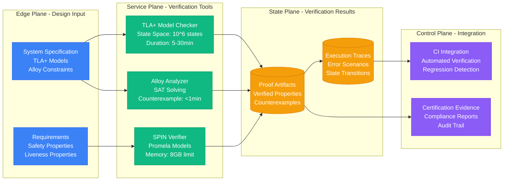
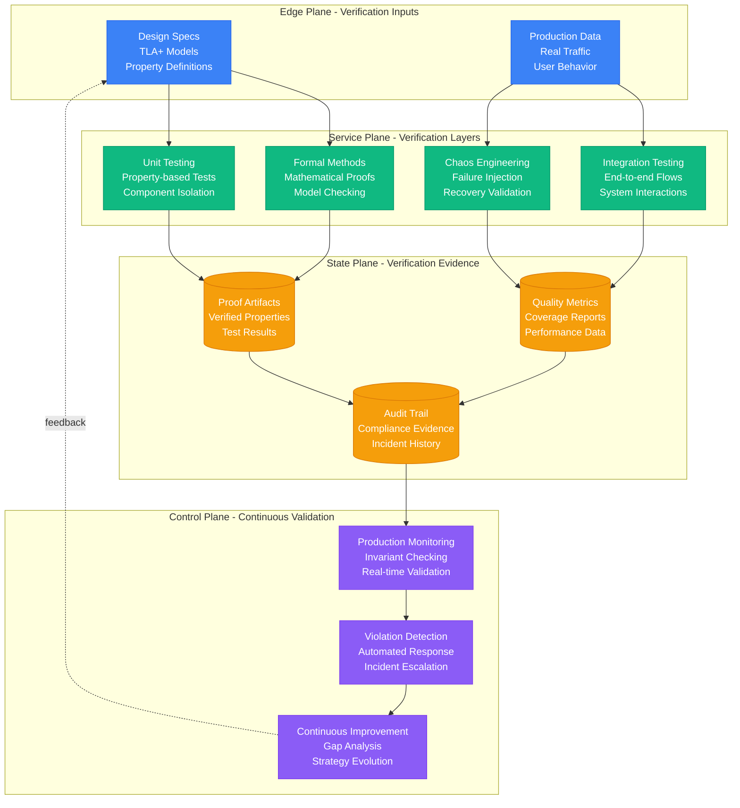

# Part IV: The Proof Obligations

Distributed systems must be continuously verified to ensure they meet their guarantees. This section provides formal verification methods and testing strategies.

## Continuous Verification Requirements

```yaml
continuous_proofs:
  consistency:
    linearizability:
      tool: jepsen_style_checker
      frequency: every_write_in_test_env
      production: sample_1_percent
      alert: any_violation
      
    staleness:
      method: synthetic_timestamp_writes  
      frequency: every_60_seconds
      alert: p99 > slo
      
  availability:
    health_checks:
      frequency: every_10_seconds
      locations: 5_regions
      alert: success < 99.9%_for_5min
      
  performance:
    latency:
      percentiles: [p50, p95, p99, p99.9]
      frequency: every_second
      alert: p99 > budget_for_5min
      
  durability:
    backup_recovery:
      frequency: monthly_full_quarterly_test
      target: restore < rto
      verification: checksum_all_data
```

## The Test Pyramid

### Level 1: Unit Tests (1000s)
**Purpose**: Test each primitive in isolation
**Coverage**: >80% code coverage
**Execution**: Every commit
**Duration**: <5 minutes total

```python
# Example: Testing idempotency primitive
def test_idempotency_duplicate_requests():
    service = PaymentService()
    request_id = "payment-123"
    
    # First request succeeds
    result1 = service.process_payment(request_id, amount=100)
    assert result1.success == True
    assert result1.charge_id == "charge-456"
    
    # Duplicate request returns same result
    result2 = service.process_payment(request_id, amount=100)
    assert result2.success == True
    assert result2.charge_id == "charge-456"  # Same charge ID
    
    # Verify only one actual charge occurred
    assert service.get_charges_count() == 1

def test_consensus_split_brain_prevention():
    cluster = RaftCluster(nodes=5)
    
    # Partition cluster: 3 nodes vs 2 nodes
    cluster.partition([0, 1, 2], [3, 4])
    
    # Majority partition can elect leader
    majority_leader = cluster.get_leader(partition=[0, 1, 2])
    assert majority_leader is not None
    
    # Minority partition cannot elect leader
    minority_leader = cluster.get_leader(partition=[3, 4])
    assert minority_leader is None
    
    # Only majority can commit writes
    assert cluster.write("key", "value", partition=[0, 1, 2]) == True
    assert cluster.write("key", "value", partition=[3, 4]) == False
```

### Level 2: Integration Tests (100s)
**Purpose**: Test primitive combinations and micro-patterns
**Coverage**: All critical paths
**Execution**: Every merge to main
**Duration**: <30 minutes total

```python
# Example: Testing CQRS pattern integration
def test_cqrs_write_to_read_propagation():
    # Setup write side
    write_db = PostgreSQL()
    outbox = OutboxTable(write_db)
    
    # Setup stream processing
    kafka = KafkaCluster()
    cdc = DebeziumConnector(write_db, kafka)
    
    # Setup read side
    read_store = Elasticsearch()
    projection = OrderProjection(kafka, read_store)
    
    # Write to command side
    order = Order(id="order-123", customer="cust-456", amount=100)
    write_service.create_order(order)
    
    # Verify event in stream
    events = kafka.consume("order-events", timeout=5)
    assert len(events) == 1
    assert events[0].order_id == "order-123"
    
    # Verify projection in read store
    projection.wait_for_projection(timeout=10)
    projected_order = read_store.get("order-123")
    assert projected_order.customer == "cust-456"
    assert projected_order.amount == 100

def test_saga_compensation_on_failure():
    saga = OrderFulfillmentSaga()
    
    # Configure services to fail at shipping step
    payment_service.configure(success=True)
    inventory_service.configure(success=True)
    shipping_service.configure(success=False)  # This will fail
    
    # Execute saga
    result = saga.execute(order_id="order-123")
    
    # Verify saga failed at shipping
    assert result.success == False
    assert result.failed_step == "shipping"
    
    # Verify compensations were executed
    assert payment_service.get_refunds("order-123") == [100]  # Payment refunded
    assert inventory_service.get_reservations("order-123") == []  # Inventory released
    assert shipping_service.get_shipments("order-123") == []  # No shipment created
```

### Level 3: System Tests (10s)
**Purpose**: Test end-to-end flows and system patterns
**Coverage**: All user journeys
**Execution**: Nightly
**Duration**: <2 hours total

```python
# Example: Testing full e-commerce checkout flow
def test_end_to_end_checkout():
    # Setup: Create customer and add items to cart
    customer = create_test_customer()
    product = create_test_product(inventory=10)
    cart_service.add_item(customer.id, product.id, quantity=2)
    
    # Execute: Complete checkout
    checkout_request = {
        'customer_id': customer.id,
        'payment_method': 'credit_card',
        'shipping_address': customer.default_address
    }
    
    order = checkout_service.complete_checkout(checkout_request)
    
    # Verify: Order created correctly
    assert order.status == "confirmed"
    assert order.total_amount == product.price * 2
    
    # Verify: Inventory decremented
    updated_product = product_service.get(product.id)
    assert updated_product.inventory == 8
    
    # Verify: Payment processed
    payment = payment_service.get_payment(order.payment_id)
    assert payment.status == "captured"
    assert payment.amount == order.total_amount
    
    # Verify: Shipping label created
    shipment = shipping_service.get_shipment(order.shipment_id)
    assert shipment.status == "label_created"
    assert shipment.tracking_number is not None
    
    # Verify: Customer notification sent
    notifications = notification_service.get_sent(customer.id)
    assert any(n.type == "order_confirmation" for n in notifications)

def test_system_handles_traffic_spike():
    # Setup: Configure system for normal load
    load_balancer.configure(max_connections=1000)
    
    # Execute: Send 10x normal traffic
    normal_rps = 1000
    spike_rps = 10000
    
    with load_generator(rps=spike_rps, duration=300):  # 5 minutes
        # Verify: System handles spike gracefully
        errors = monitor.get_error_rate()
        latency = monitor.get_latency_p99()
        
        # Allow some degradation but not complete failure
        assert errors < 0.05  # <5% error rate
        assert latency < 5000  # <5s latency (degraded but functional)
        
        # Verify: Load shedding activated
        assert load_balancer.get_shed_rate() > 0
        
        # Verify: No cascading failures
        assert all(service.is_healthy() for service in critical_services)
```

### Level 4: Chaos Tests (Continuous)
**Purpose**: Test failure scenarios and recovery
**Coverage**: All failure modes
**Execution**: Continuously in staging, weekly in production
**Duration**: Continuous

```python
# Example: Chaos engineering scenarios
def test_database_failure_recovery():
    # Setup: Healthy system with replicated database
    assert primary_db.is_healthy()
    assert replica_db.is_healthy()
    
    # Chaos: Kill primary database
    chaos.kill_process(primary_db)
    
    # Verify: Automatic failover occurs
    wait_for(lambda: app_service.get_db_status() == "replica", timeout=30)
    
    # Verify: Service remains available
    response = app_service.get("/health")
    assert response.status_code == 200
    
    # Verify: Writes continue to work
    test_data = {"key": "value", "timestamp": time.now()}
    response = app_service.post("/data", json=test_data)
    assert response.status_code == 201
    
    # Recovery: Restore primary
    chaos.start_process(primary_db)
    wait_for(lambda: primary_db.is_healthy(), timeout=60)
    
    # Verify: Data consistency maintained
    primary_data = primary_db.get("/data")
    replica_data = replica_db.get("/data")
    assert primary_data == replica_data

def test_network_partition_handling():
    # Setup: Multi-region deployment
    regions = ["us-east", "us-west", "eu-west"]
    
    # Chaos: Create network partition (split brain scenario)
    chaos.partition_network(["us-east"], ["us-west", "eu-west"])
    
    # Verify: Majority partition remains available
    majority_regions = ["us-west", "eu-west"]
    for region in majority_regions:
        response = get_health_check(region)
        assert response.status_code == 200
    
    # Verify: Minority partition becomes read-only or unavailable
    minority_response = get_health_check("us-east")
    assert minority_response.status_code in [503, 423]  # Unavailable or locked
    
    # Verify: No split-brain writes
    write_attempts = []
    for region in regions:
        try:
            response = write_data(region, {"test": "partition"})
            write_attempts.append((region, response.status_code))
        except:
            write_attempts.append((region, "timeout"))
    
    successful_writes = [w for w in write_attempts if w[1] == 201]
    assert len(successful_writes) <= 1  # At most one region can write
    
    # Recovery: Heal partition
    chaos.heal_network_partition()
    
    # Verify: All regions come back online
    for region in regions:
        wait_for(lambda: get_health_check(region).status_code == 200, timeout=60)
```

### Level 5: Load Tests (Weekly)
**Purpose**: Verify performance under load
**Coverage**: Peak and sustained load scenarios
**Execution**: Weekly, before major releases
**Duration**: 2-4 hours

```python
# Example: Load testing framework
def test_peak_load_performance():
    # Setup: Configure monitoring
    monitor = PerformanceMonitor()
    monitor.start_collection()
    
    # Test: Gradual ramp to peak load
    peak_rps = 50000
    test_duration = 3600  # 1 hour
    
    with load_generator() as load:
        # Ramp up: 0 to peak over 10 minutes
        load.ramp_up(target_rps=peak_rps, duration=600)
        
        # Sustain: Hold peak for 30 minutes
        load.sustain(rps=peak_rps, duration=1800)
        
        # Ramp down: Peak to 0 over 10 minutes
        load.ramp_down(duration=600)
    
    # Verify: Performance within SLA
    metrics = monitor.get_metrics()
    
    assert metrics.error_rate < 0.001  # <0.1% errors
    assert metrics.latency_p50 < 50    # <50ms median
    assert metrics.latency_p95 < 200   # <200ms p95
    assert metrics.latency_p99 < 1000  # <1s p99
    
    # Verify: Resource utilization reasonable
    assert metrics.cpu_usage < 0.7     # <70% CPU
    assert metrics.memory_usage < 0.8  # <80% memory
    assert metrics.disk_io < 0.6       # <60% disk I/O
    
    # Verify: Auto-scaling worked
    assert metrics.max_instances >= metrics.min_instances * 2

def test_sustained_load_endurance():
    # Test: Run at 50% peak load for 24 hours
    sustained_rps = 25000
    test_duration = 86400  # 24 hours
    
    with load_generator(rps=sustained_rps, duration=test_duration):
        # Monitor for memory leaks
        memory_samples = []
        for hour in range(24):
            time.sleep(3600)  # Wait 1 hour
            memory_usage = monitor.get_memory_usage()
            memory_samples.append(memory_usage)
            
            # Verify no significant memory growth
            if hour > 2:  # Allow initial warm-up
                memory_growth = memory_usage - memory_samples[2]
                assert memory_growth < 0.1  # <10% growth per hour
        
        # Verify no performance degradation
        final_metrics = monitor.get_metrics()
        initial_metrics = monitor.get_initial_metrics()
        
        latency_degradation = (final_metrics.latency_p99 - initial_metrics.latency_p99) / initial_metrics.latency_p99
        assert latency_degradation < 0.2  # <20% latency increase
```

## Property-Based Testing

```python
# Example: Property-based testing for distributed systems
from hypothesis import given, strategies as st

@given(
    operations=st.lists(
        st.tuples(
            st.sampled_from(['read', 'write', 'delete']),
            st.text(min_size=1, max_size=10),  # key
            st.text(min_size=0, max_size=100)  # value
        ),
        min_size=1,
        max_size=100
    )
)
def test_eventual_consistency_property(operations):
    """
    Property: In an eventually consistent system, if we stop writes
    and wait long enough, all replicas will converge to the same state
    """
    # Setup: Create replicated system
    replicas = [create_replica() for _ in range(3)]
    
    # Execute: Perform operations concurrently
    for op_type, key, value in operations:
        replica = random.choice(replicas)
        if op_type == 'write':
            replica.write(key, value)
        elif op_type == 'delete':
            replica.delete(key)
        # reads don't change state
    
    # Wait: Allow convergence
    wait_for_convergence(replicas, timeout=30)
    
    # Verify: All replicas have same state
    states = [replica.get_all_data() for replica in replicas]
    assert all(state == states[0] for state in states)

@given(
    partitions=st.lists(
        st.lists(st.integers(min_value=0, max_value=4), min_size=1, max_size=3),
        min_size=2,
        max_size=3
    ).filter(lambda parts: sum(len(p) for p in parts) == 5)  # 5 nodes total
)
def test_consensus_safety_property(partitions):
    """
    Property: In a consensus system, at most one leader can be elected
    in each term, regardless of network partitions
    """
    # Setup: 5-node Raft cluster
    cluster = RaftCluster(nodes=5)
    
    # Execute: Create arbitrary network partition
    for partition in partitions:
        cluster.isolate_nodes(partition)
    
    # Verify: At most one leader per term
    leaders_by_term = {}
    for node in cluster.nodes:
        if node.role == 'leader':
            term = node.current_term
            if term in leaders_by_term:
                # Multiple leaders in same term = safety violation
                assert False, f"Multiple leaders in term {term}: {leaders_by_term[term]} and {node.id}"
            leaders_by_term[term] = node.id
```

## Formal Verification Pipeline

Mathematical proof systems for critical distributed system properties.



### Formal Method Tool Comparison

| **Tool** | **Verification Scope** | **Model Size Limit** | **Verification Time** | **Learning Curve** | **Industry Usage** |
|---|---|---|---|---|---|
| **TLA+** | Concurrent algorithms | 10^6 states | 5-30 minutes | High | Amazon, Microsoft |
| **Alloy** | System structure | 50 objects | <1 minute | Medium | MIT, JPL |
| **SPIN** | Protocol verification | 8GB memory | 1-60 minutes | High | Telecommunications |
| **CBMC** | C code verification | 1M lines | 10-120 minutes | Medium | Automotive, aerospace |
| **Dafny** | Functional correctness | 10K lines | 1-10 minutes | High | Microsoft research |

## Production Invariant Monitoring

Real-time validation of business and system invariants with automated violation response.

### Business Invariant Matrix

| **Invariant Type** | **Check Frequency** | **Violation Severity** | **Auto-Response** | **Business Impact** |
|---|---|---|---|---|
| **Account Balance ≥ 0** | Every transaction | CRITICAL | Block transactions | Compliance violation |
| **Inventory Conservation** | Every 60 seconds | HIGH | Audit reconciliation | Revenue loss |
| **Single Leader per Term** | Every 5 seconds | CRITICAL | Force re-election | Split-brain scenario |
| **Data Consistency** | Every write | HIGH | Read from primary | Stale data served |
| **Rate Limiting** | Every request | MEDIUM | Throttle requests | Service degradation |

## Comprehensive Verification Strategy

Multi-layered verification ensures system correctness from design through production operation.



### Verification Layer ROI Analysis

| **Verification Layer** | **Implementation Cost** | **Bug Detection Rate** | **Production Impact** | **ROI Timeframe** |
|---|---|---|---|---|
| **Formal Methods** | High (6 months) | 95% critical bugs | Prevents catastrophic failures | 2-3 years |
| **Unit Testing** | Low (2 weeks) | 60% component bugs | Faster development cycles | 3-6 months |
| **Integration Testing** | Medium (1 month) | 80% interface bugs | Reduces system outages | 6-12 months |
| **Chaos Engineering** | Medium (2 months) | 70% failure modes | Improves resilience | 1-2 years |
| **Production Monitoring** | Low (1 month) | 90% runtime issues | Faster incident response | 1-3 months |

### Success Metrics Dashboard

| **Metric** | **Target** | **Current** | **Trend** | **Action Required** |
|---|---|---|---|---|
| **Test Coverage** | >90% | 87% | ↗ | Add integration tests |
| **MTTR** | <5 minutes | 8 minutes | ↘ | Improve automation |
| **False Positive Rate** | <1% | 3% | ↘ | Tune alert thresholds |
| **Production Bugs** | <1 per release | 2 per release | ↗ | Enhance pre-prod testing |
| **Verification Cost** | <15% dev time | 18% dev time | ↘ | Optimize test efficiency |

**Total Score: ___/18**
- **12-18**: Production-ready verification system
- **6-11**: Good foundation, focus on automation
- **0-5**: Significant reliability risks

This layered approach provides comprehensive verification coverage while maintaining development velocity and production reliability.