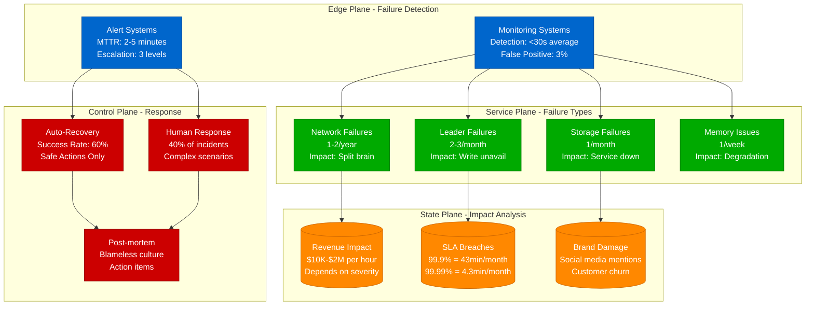
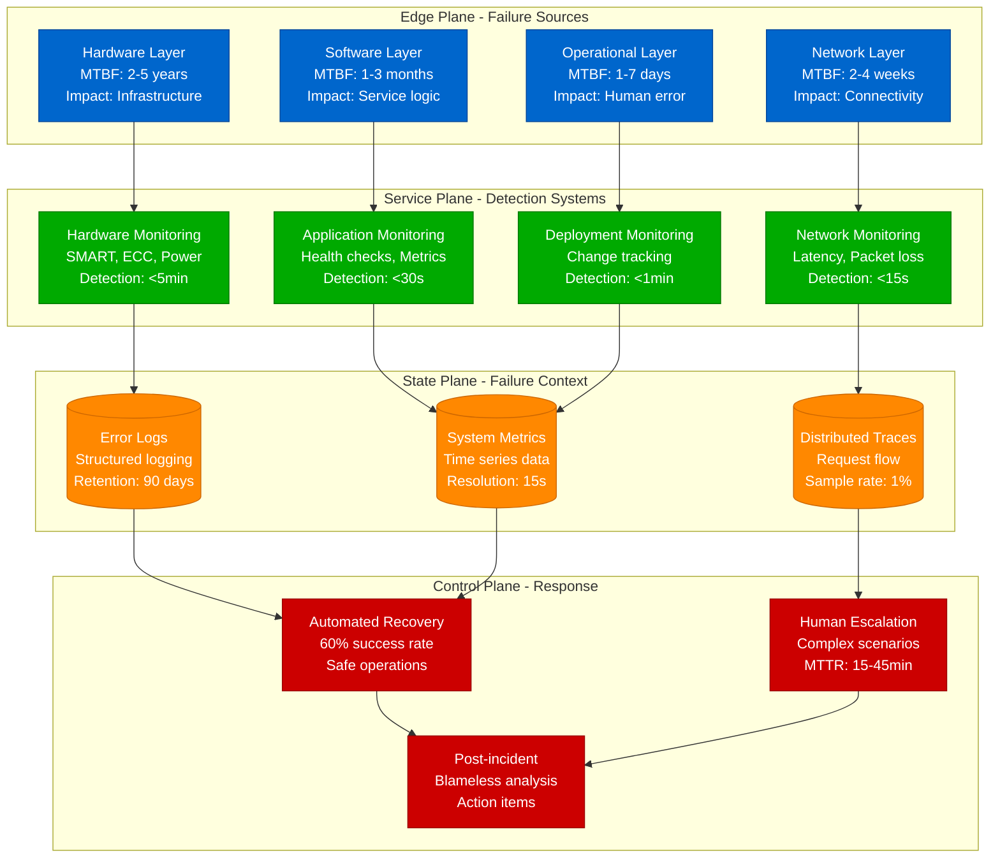
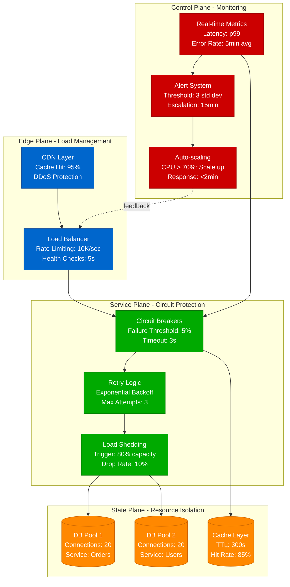

# Production Reality - Battle Scars and Hard Truths

Real-world failure patterns, incident data, and the brutal economics of distributed systems at scale.

## Production Failure Analysis Dashboard

Real-world failure frequencies and business impact from production systems.

### Failure Frequency and Business Impact Matrix

| **Failure Type** | **Frequency** | **Detection Time** | **Business Impact** | **Auto-Recovery Rate** | **Cost per Hour** |
|---|---|---|---|---|---|
| **Network Partition** | 1-2/year | <30 seconds | Split brain risk | 20% | $500K-$2M |
| **Leader Election** | 2-3/month | <15 seconds | Write unavailability | 90% | $100K-$500K |
| **Storage Full** | 1/month | Immediate | Complete outage | 30% | $1M-$5M |
| **Memory Leak** | 1/week | 1-4 hours | Performance degradation | 80% | $50K-$200K |
| **Cache Stampede** | 2-3/week | Immediate | Cascading overload | 70% | $10K-$100K |
| **Database Lag** | Daily | 30 seconds | Stale data served | 95% | $5K-$25K |
| **Hot Key** | Daily | 2-5 minutes | Partition overload | 40% | $10K-$50K |

## Failure Taxonomy and Response Architecture

Layered failure analysis with automated detection and escalation patterns.

### Failure Layer Analysis

| **Layer** | **MTBF** | **Common Causes** | **Detection Method** | **Recovery Strategy** | **Prevention Cost** |
|---|---|---|---|---|---|
| **Hardware** | 2-5 years | Disk failure, memory corruption | SMART data, ECC logs | Hot swap, redundancy | 2x infrastructure cost |
| **Software** | 1-3 months | Memory leaks, deadlocks | Health checks, profiling | Restart, rollback | 40% dev time |
| **Network** | 2-4 weeks | Packet loss, DNS issues | Latency monitoring | Multi-path, caching | 20% infrastructure cost |
| **Operational** | 1-7 days | Deployment errors, human mistakes | Change tracking | Blue-green, automation | 30% operational overhead |

## Unsolved Problems in Production (2025 State)

The hardest problems in distributed systems remain challenging despite decades of research.

### Top 10 Production Challenges

| **Problem** | **Current Solution** | **Success Rate** | **Cost Impact** | **Research Direction** |
|---|---|---|---|---|
| **Distributed Transactions** | Saga pattern + compensation | 85% consistency | 2x complexity | Deterministic protocols |
| **Cache Invalidation** | TTL + event-based | 90% consistency | 30% stale reads | Predictive invalidation |
| **Celebrity Users** | Dedicated infrastructure | 70% handled | 5x resource cost | Adaptive partitioning |
| **Zero-Downtime Schema** | Multi-phase rollout | 60% success | 50% deployment time | Automated evolution |
| **Cross-Region Consistency** | Regional strong + global eventual | 80% consistency | 150ms latency | Hybrid models |
| **Failure Detection** | Phi-accrual + timeouts | 92% accuracy | 8% false positives | ML prediction |
| **Capacity Planning** | 3-5x over-provisioning | 75% accuracy | 200-400% waste | ML-based prediction |
| **Complete Observability** | Sampling + tracing | 95% coverage | 5% overhead | Smart sampling |
| **Self-Healing** | Automated known patterns | 60% auto-recovery | 40% human required | AI-driven ops |
| **Cost Attribution** | Resource tagging | 70% accuracy | Unknown true costs | Real-time tracking |

## Cascading Failure Prevention Architecture

Multi-layered defense against the most common cause of production outages.

### Failure Pattern Distribution

| **Failure Pattern** | **Frequency** | **Avg Duration** | **Prevention Strategy** | **Recovery Time** |
|---|---|---|---|---|
| **Cascading Failures** | 70% of major outages | 45-180 minutes | Circuit breakers + bulkheads | 15-60 minutes |
| **Byzantine Failures** | 20% of major outages | 30-120 minutes | Majority voting + checksums | 30-90 minutes |
| **Correlated Failures** | 10% of major outages | 60-240 minutes | Geographic distribution | 60-180 minutes |

## Incident Classification and Response Matrix

Structured incident management with automated triage and escalation.

### Severity-Based Response Framework

| **Severity** | **Impact Scope** | **Response Time** | **Escalation** | **Communication** | **Cost per Hour** |
|---|---|---|---|---|---|
| **SEV 1** | All users affected | <5 minutes | Immediate to VP | CEO notification | $1M-$5M |
| **SEV 2** | >50% users affected | <15 minutes | Senior engineer | Customer status page | $500K-$1M |
| **SEV 3** | <10% users affected | <30 minutes | Team lead | Internal only | $50K-$200K |
| **SEV 4** | Single feature/region | <60 minutes | Assigned engineer | Team chat | $10K-$50K |

### Root Cause Analysis Dashboard

| **Root Cause** | **Frequency** | **MTTR** | **Prevention Cost** | **Detection Method** | **Auto-Recovery** |
|---|---|---|---|---|---|
| **Code Deployment** | 35% | 30-60 min | 40% dev velocity | Deployment tracking | 20% |
| **Capacity Issues** | 25% | 1-4 hours | 2x infrastructure | Predictive monitoring | 60% |
| **Hardware Failure** | 20% | 2-8 hours | 50% redundancy cost | Hardware monitoring | 80% |
| **External Dependencies** | 15% | Variable | Circuit breaker cost | Dependency monitoring | 40% |
| **Human Error** | 5% | 15-30 min | Automation investment | Change tracking | 10% |

## Incident Response Timeline and Automation

Optimized incident management with automated triage and human escalation.

```mermaid
gantt
    title Production Incident Response Timeline
    dateFormat  X
    axisFormat %M:%S

    section Detection
    Problem Occurs           :milestone, m1, 0, 0
    Automated Alert          :2, 2
    Human Acknowledgment     :3, 5

    section Investigation
    Initial Triage           :5, 10
    Runbook Execution       :8, 15
    Senior Escalation       :crit, 15, 20

    section Resolution
    Root Cause Found        :20, 30
    Fix Implementation      :30, 45
    Service Restoration     :45, 60

    section Follow-up
    Post-mortem Scheduled   :90, 120
    Action Items Created    :120, 180
```

### Incident Response Anti-Patterns vs Best Practices

| **Anti-Pattern** | **Impact** | **Best Practice** | **Implementation** | **Success Rate** |
|---|---|---|---|---|
| **Alert Fatigue** | 30% ignored alerts | Tuned thresholds | <1% false positives | 95% acknowledged |
| **Symptom Fixing** | 60% recurring issues | Root cause analysis | Mandatory RCA | 80% permanent fixes |
| **Multiple Changes** | 40% unclear fixes | Single change policy | Change control | 90% traceable |
| **Poor Communication** | 50% stakeholder confusion | Status page automation | Real-time updates | 95% satisfaction |
| **Blame Culture** | 70% information hiding | Blameless post-mortems | Learning focus | 85% participation |

## Reliability Economics and ROI Analysis

Data-driven investment decisions for reliability improvements.

### Industry Downtime Cost Analysis

| **Industry** | **Revenue per Hour** | **Downtime Cost** | **Reputation Impact** | **Regulatory Risk** | **Recovery Time** |
|---|---|---|---|---|---|
| **Financial Services** | $50M-$200M | $5M-$15M | Severe (-20% customer trust) | High (fines) | 2-8 hours |
| **E-commerce** | $10M-$50M | $1M-$5M | Moderate (-10% conversion) | Low | 1-4 hours |
| **Social Media** | $5M-$20M | $500K-$2M | Moderate (-5% engagement) | Low | 30min-2hrs |
| **Enterprise SaaS** | $1M-$10M | $100K-$1M | Severe (-30% renewals) | Medium | 1-6 hours |
| **Gaming** | $500K-$5M | $50K-$500K | Low (-2% players) | Low | 15min-1hr |

### Reliability Investment ROI Calculator

| **Availability Target** | **Downtime per Month** | **Investment Multiplier** | **Payback Period** | **Break-even Revenue** |
|---|---|---|---|---|
| **99% → 99.9%** | 4.4hrs → 44min | 2x infrastructure | 6-18 months | >$1M/hour |
| **99.9% → 99.99%** | 44min → 4.4min | 5x infrastructure | 1-3 years | >$5M/hour |
| **99.99% → 99.999%** | 4.4min → 26sec | 10x infrastructure | 3-5 years | >$20M/hour |

**Rule of Thumb**: Each additional "9" costs 5-10x more and pays back only if downtime cost exceeds investment.

## Production Monitoring That Prevents Outages

Proactive monitoring with predictive alerting and automated response.

### Leading vs Lagging Indicator Strategy

| **Indicator Type** | **Metrics** | **Alert Threshold** | **Response Time** | **Prevention Rate** |
|---|---|---|---|---|
| **Leading (Predictive)** | Queue depth trend, Memory growth rate | 2 std deviations | <5 minutes | 80% incidents prevented |
| **Golden Signals** | Latency p99, Error rate, Saturation | SLO breach | <2 minutes | 95% incidents detected |
| **Lagging (Reactive)** | User complaints, Revenue drop | Any occurrence | <30 minutes | 100% business impact |

### Alert Design That Works

| **Alert Quality** | **Characteristics** | **Example** | **False Positive Rate** | **Actionability** |
|---|---|---|---|---|
| **Excellent** | Specific, actionable, business impact | "Payment API p99 > 2s for 5min" | <0.1% | Clear runbook |
| **Good** | Specific metric with threshold | "Database connections > 90%" | <1% | Investigation steps |
| **Poor** | Vague, no clear action | "High CPU usage" | >10% | Unclear response |
| **Terrible** | Noise, always firing | "Any error occurred" | >50% | Alert fatigue |

## Production Wisdom: The 10 Brutal Truths

Lessons learned from managing distributed systems at scale.

### Truth 1-5: System Design Reality

| **Truth** | **Reality** | **Common Mistake** | **Better Approach** | **Cost Implication** |
|---|---|---|---|---|
| **Perfect vs Good** | 99.9% often sufficient | Chasing 99.99% everywhere | Focus on business impact | 5-10x cost for each 9 |
| **Complexity Kills** | Simple systems fail less | Over-engineering solutions | KISS principle | 50% reduction in incidents |
| **Human Factor** | 70% issues need humans | Full automation dreams | Human + machine hybrid | 40% operational efficiency |
| **Monitoring Limits** | Doesn't prevent outages | Monitoring solves everything | Fast detection + response | 60% faster MTTR |
| **Follow-through** | Action items decay | Post-mortem theater | Tracking + accountability | 80% prevention rate |

### Truth 6-10: Operational Reality

| **Truth** | **Reality** | **Common Mistake** | **Better Approach** | **Impact** |
|---|---|---|---|---|
| **Dependencies Fail** | Everything will break | Assuming stability | Circuit breakers + fallbacks | 90% graceful degradation |
| **Staging vs Prod** | Traffic patterns differ | Identical load testing | Production chaos testing | 70% better issue detection |
| **Network Unreliability** | Partitions are normal | Perfect connectivity | Timeout + retry + backoff | 95% partition tolerance |
| **Security Trade-offs** | Often conflicts with reliability | Security first always | Risk-based balancing | Optimal cost/benefit |
| **Culture Matters** | Enables or kills learning | Technology only focus | Blameless + continuous improvement | 300% learning velocity |

### The Production Mindset

**Embrace failure as normal** - Design systems that gracefully degrade rather than catastrophically fail.

**Measure everything** - You cannot improve what you cannot measure, but don't drown in metrics.

**Automate the boring** - Let humans handle the novel problems, machines handle the repetitive ones.

**Learn continuously** - Every incident is a gift of knowledge about your system's limits.

Production systems are complex adaptive systems. Success comes from building resilience, not perfection.