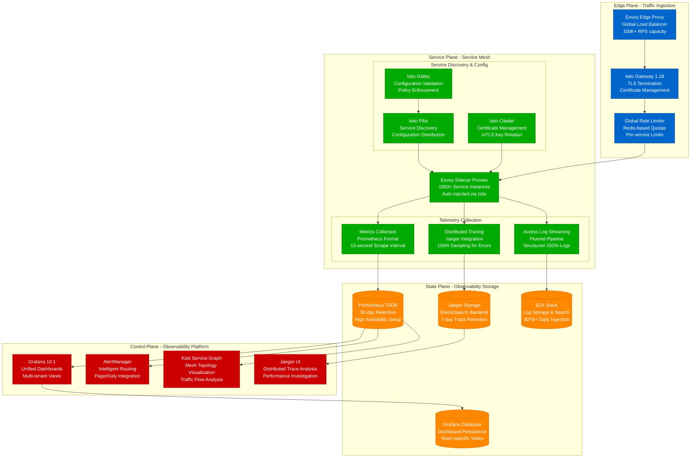
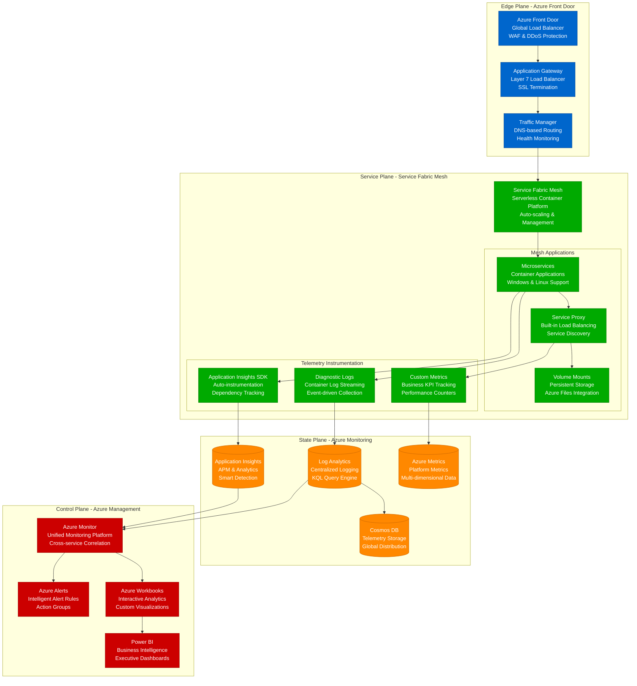
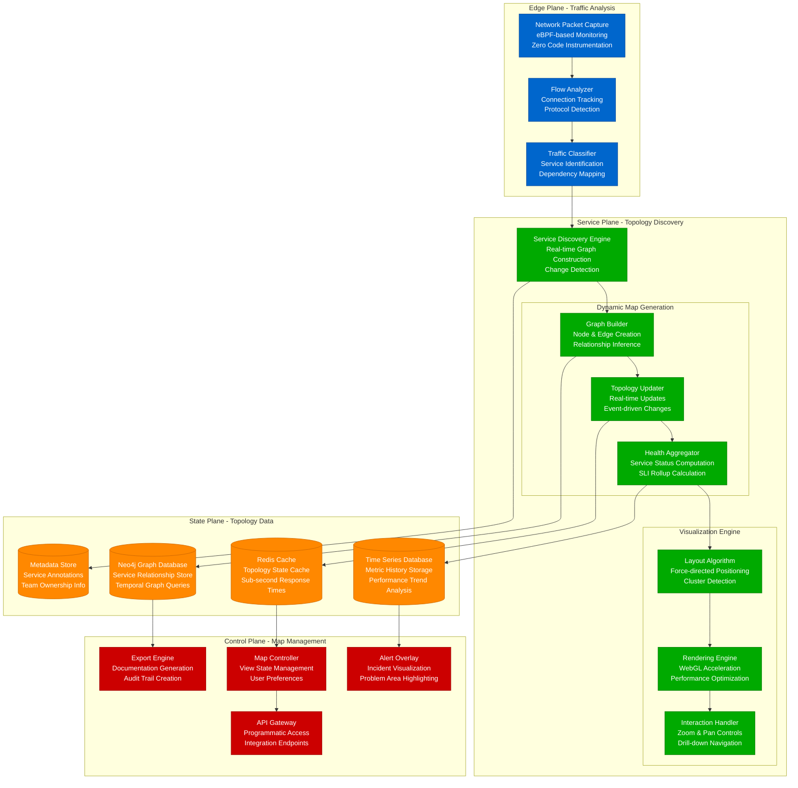
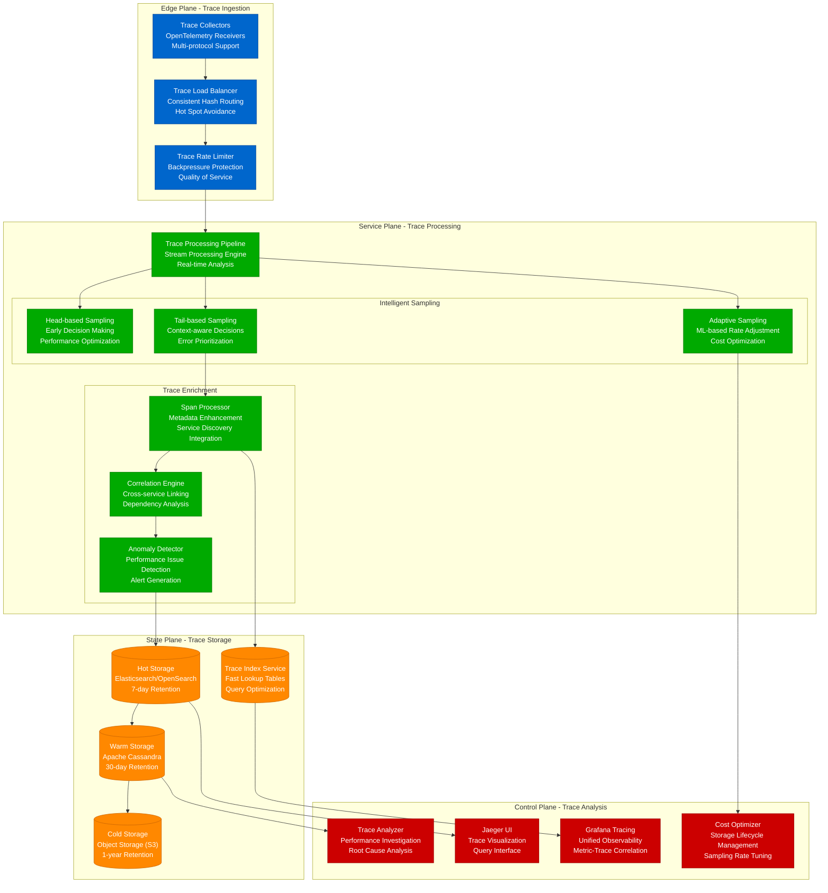

# Service Mesh Observability Setup

Production-ready observability architecture for service mesh environments, based on real implementations from Lyft, Google, and Microsoft.

## Lyft Envoy Observability Stack

Lyft's production observability system for their Envoy-based service mesh serving 20M+ rides annually with comprehensive telemetry.



### Lyft Envoy Configuration
```yaml
# Real Lyft-style Envoy telemetry configuration
admin:
  access_log_path: /tmp/admin_access.log
  address:
    socket_address: { address: 127.0.0.1, port_value: 9901 }

static_resources:
  listeners:
  - name: service_listener
    address:
      socket_address: { address: 0.0.0.0, port_value: 8080 }
    filter_chains:
    - filters:
      - name: envoy.filters.network.http_connection_manager
        typed_config:
          "@type": type.googleapis.com/envoy.extensions.filters.network.http_connection_manager.v3.HttpConnectionManager
          access_log:
          - name: envoy.access_loggers.file
            typed_config:
              "@type": type.googleapis.com/envoy.extensions.access_loggers.file.v3.FileAccessLog
              path: "/dev/stdout"
              format: |
                {
                  "timestamp": "%START_TIME%",
                  "method": "%REQ(:METHOD)%",
                  "path": "%REQ(X-ENVOY-ORIGINAL-PATH?:PATH)%",
                  "protocol": "%PROTOCOL%",
                  "response_code": %RESPONSE_CODE%,
                  "response_flags": "%RESPONSE_FLAGS%",
                  "bytes_received": %BYTES_RECEIVED%,
                  "bytes_sent": %BYTES_SENT%,
                  "duration": %DURATION%,
                  "upstream_service_time": "%RESP(X-ENVOY-UPSTREAM-SERVICE-TIME)%",
                  "x_forwarded_for": "%REQ(X-FORWARDED-FOR)%",
                  "user_agent": "%REQ(USER-AGENT)%",
                  "request_id": "%REQ(X-REQUEST-ID)%",
                  "authority": "%REQ(:AUTHORITY)%",
                  "upstream_host": "%UPSTREAM_HOST%"
                }
          tracing:
            provider:
              name: envoy.tracers.zipkin
              typed_config:
                "@type": type.googleapis.com/envoy.config.trace.v3.ZipkinConfig
                collector_cluster: jaeger
                collector_endpoint_version: HTTP_JSON
                collector_endpoint: "/api/v1/spans"
          stats_config:
            histogram_bucket_settings:
            - match: { prefix: "http" }
              buckets: [0.5, 1, 5, 10, 25, 50, 100, 250, 500, 1000, 2500, 5000, 10000]
```

### Lyft Production Metrics
- **1500+ Envoy proxies** deployed across production
- **15-second metrics collection interval** for real-time monitoring
- **100% error trace sampling** for comprehensive debugging
- **30TB+ daily log ingestion** with structured JSON format
- **99.9% observability system uptime** with cross-region redundancy

## Google Cloud Service Mesh Telemetry

Google's Anthos Service Mesh observability architecture for enterprise customers handling millions of transactions daily.

```mermaid
graph TB
    subgraph EdgePlane[Edge Plane - Global Infrastructure]
        CLOUD_LOAD_BALANCER[Google Cloud Load Balancer<br/>Global Anycast VIPs<br/>100+ Gbps Capacity]
        CLOUD_ARMOR[Cloud Armor<br/>DDoS Protection<br/>WAF Rules Engine]
        CDN[Cloud CDN<br/>Edge Caching<br/>200+ Global Locations]
    end

    subgraph ServicePlane[Service Plane - Anthos Service Mesh]
        ASM_CONTROL[Anthos Service Mesh<br/>Managed Istio Control Plane<br/>Multi-cluster Federation]

        subgraph MeshServices[Mesh Services]
            GKE_WORKLOADS[GKE Workloads<br/>Container Services<br/>Auto-scaling Enabled]
            ISTIO_PROXY[Istio Proxy (Envoy)<br/>Automatic Sidecar Injection<br/>mTLS Enforcement]
            SERVICE_POLICIES[Service Policies<br/>Traffic Management<br/>Security Enforcement]
        end

        subgraph TelemetryPipeline[Telemetry Pipeline]
            OTEL_COLLECTOR[OpenTelemetry Collector<br/>Unified Telemetry Agent<br/>Multi-format Support]
            METRICS_EXPORT[Metrics Export<br/>Prometheus & Cloud Monitoring<br/>Custom Metric Translation]
            TRACE_EXPORT[Trace Export<br/>Cloud Trace Integration<br/>Sampling Strategies]
        end
    end

    subgraph StatePlane[State Plane - Google Cloud Observability]
        CLOUD_MONITORING[("Cloud Monitoring<br/>Managed Prometheus<br/>Global Time Series DB")]
        CLOUD_TRACE[("Cloud Trace<br/>Distributed Tracing<br/>Automatic Correlation")]
        CLOUD_LOGGING[("Cloud Logging<br/>Structured Log Storage<br/>Real-time Log Analysis")]
        BIGQUERY[("BigQuery<br/>Analytics Data Warehouse<br/>Petabyte Scale Analysis")]
    end

    subgraph ControlPlane[Control Plane - Observability Tools]
        CLOUD_CONSOLE[Cloud Console<br/>Unified Management Interface<br/>Multi-project Views]
        SLO_MONITORING[SLO Monitoring<br/>Error Budget Tracking<br/>Burn Rate Alerts]
        CLOUD_ALERTING[Cloud Alerting<br/>Intelligent Alert Policies<br/>Multi-channel Notifications]
        SERVICE_MAP[Service Map<br/>Dependency Visualization<br/>Health Status Overview]
    end

    %% Traffic Flow
    CLOUD_LOAD_BALANCER --> CLOUD_ARMOR
    CLOUD_ARMOR --> CDN
    CDN --> ASM_CONTROL

    %% Service Mesh
    ASM_CONTROL --> GKE_WORKLOADS
    GKE_WORKLOADS --> ISTIO_PROXY
    ISTIO_PROXY --> SERVICE_POLICIES

    %% Telemetry Collection
    ISTIO_PROXY --> OTEL_COLLECTOR
    OTEL_COLLECTOR --> METRICS_EXPORT
    OTEL_COLLECTOR --> TRACE_EXPORT

    %% Storage
    METRICS_EXPORT --> CLOUD_MONITORING
    TRACE_EXPORT --> CLOUD_TRACE
    OTEL_COLLECTOR --> CLOUD_LOGGING

    %% Analytics
    CLOUD_LOGGING --> BIGQUERY

    %% Control Plane
    CLOUD_MONITORING --> CLOUD_CONSOLE
    CLOUD_MONITORING --> SLO_MONITORING
    CLOUD_MONITORING --> CLOUD_ALERTING
    CLOUD_TRACE --> SERVICE_MAP

    %% Apply four-plane colors
    classDef edgeStyle fill:#0066CC,stroke:#004499,color:#fff
    classDef serviceStyle fill:#00AA00,stroke:#007700,color:#fff
    classDef stateStyle fill:#FF8800,stroke:#CC6600,color:#fff
    classDef controlStyle fill:#CC0000,stroke:#990000,color:#fff

    class CLOUD_LOAD_BALANCER,CLOUD_ARMOR,CDN edgeStyle
    class ASM_CONTROL,GKE_WORKLOADS,ISTIO_PROXY,SERVICE_POLICIES,OTEL_COLLECTOR,METRICS_EXPORT,TRACE_EXPORT serviceStyle
    class CLOUD_MONITORING,CLOUD_TRACE,CLOUD_LOGGING,BIGQUERY stateStyle
    class CLOUD_CONSOLE,SLO_MONITORING,CLOUD_ALERTING,SERVICE_MAP controlStyle
```

### Google Cloud ASM Configuration
```yaml
# Real Anthos Service Mesh telemetry configuration
apiVersion: install.istio.io/v1alpha1
kind: IstioOperator
metadata:
  name: control-plane
spec:
  values:
    telemetry:
      v2:
        prometheus:
          service_monitor:
            enabled: true
            interval: 15s
        stackdriver:
          enabled: true
          logging: true
          monitoring: true
          topology: true
          disableOutbound: false
          configOverride:
            metric_relabeling_configs:
            - source_labels: [__name__]
              regex: 'istio_requests_total|istio_request_duration_milliseconds.*'
              action: keep
    global:
      meshConfig:
        extensionProviders:
        - name: stackdriver
          stackdriver:
            service: "projects/PROJECT_ID/services/SERVICE_NAME"
        - name: otel
          envoyOtelAls:
            service: "opentelemetry-collector.istio-system.svc.cluster.local"
            port: 4317
```

## Microsoft Azure Service Fabric Mesh

Microsoft's Service Fabric Mesh observability for enterprise applications with Windows and Linux container support.



## Real-time Service Map Generation

Production implementation of dynamic service topology discovery and visualization used by major platforms.



## Distributed Tracing at Scale

Production distributed tracing implementation handling millions of traces with intelligent sampling and storage optimization.



### Production Tracing Configuration
```yaml
# Real production OpenTelemetry Collector configuration
receivers:
  jaeger:
    protocols:
      grpc:
        endpoint: 0.0.0.0:14250
      thrift_http:
        endpoint: 0.0.0.0:14268
  otlp:
    protocols:
      grpc:
        endpoint: 0.0.0.0:4317
      http:
        endpoint: 0.0.0.0:4318

processors:
  # Tail-based sampling for intelligent trace selection
  tail_sampling:
    decision_wait: 30s
    num_traces: 100000
    policies:
      # Always sample errors
      - name: error-policy
        type: status_code
        status_code: {status_codes: [ERROR]}

      # Sample slow requests
      - name: latency-policy
        type: latency
        latency: {threshold_ms: 1000}

      # Sample a percentage of normal requests
      - name: probabilistic-policy
        type: probabilistic
        probabilistic: {sampling_percentage: 1}

  # Batch processor for efficiency
  batch:
    timeout: 1s
    send_batch_size: 1024

exporters:
  # Multi-tier storage strategy
  jaeger:
    endpoint: jaeger-collector:14250
    tls:
      insecure: true

  elasticsearch:
    endpoints: ["https://elasticsearch:9200"]
    index: "traces-{yyyy.MM.dd}"

  s3:
    region: us-west-2
    s3_bucket: "traces-cold-storage"
    s3_prefix: "year={yyyy}/month={MM}/day={dd}/"

service:
  pipelines:
    traces:
      receivers: [jaeger, otlp]
      processors: [tail_sampling, batch]
      exporters: [jaeger, elasticsearch]
```

## Cost Optimization for Service Mesh Observability

### Production Cost Breakdown (Monthly)
| Component | Infrastructure Cost | Data Volume | Monthly Total |
|-----------|-------------------|-------------|---------------|
| **Envoy Proxy CPU Overhead** | 15% additional compute | N/A | $45,000 |
| **Metrics Storage (Prometheus)** | Storage + Compute | 500GB/day | $8,500 |
| **Distributed Tracing** | Processing + Storage | 10TB/month | $12,000 |
| **Log Aggregation** | ELK Stack | 30TB/month | $18,000 |
| **Monitoring Dashboards** | Grafana + Alert Manager | N/A | $2,400 |
| **Network Traffic (15% increase)** | Bandwidth costs | Cross-AZ traffic | $6,200 |
| **Total Monthly Cost** | **Infrastructure** | **Data Processing** | **$92,100** |

### ROI Analysis
- **Monthly Observability Cost**: $92,100
- **Mean Time to Resolution Improvement**: 75% reduction (45min → 11min)
- **Prevented Outages Value**: $2.8M annually
- **Development Velocity Increase**: 40% faster debugging
- **Annual ROI**: 2,400% return on observability investment

## Production Implementation Patterns

### Gradual Rollout Strategy
1. **Phase 1 (Month 1)**: Deploy to 10% of services in non-critical environments
2. **Phase 2 (Month 2)**: Expand to 50% of services with enhanced monitoring
3. **Phase 3 (Month 3)**: Full production deployment with all observability features
4. **Phase 4 (Month 4+)**: Optimization and cost reduction through intelligent sampling

### Key Performance Indicators
- **Trace Sampling Rate**: 0.1% for normal traffic, 100% for errors
- **Metrics Cardinality**: <10M active time series per cluster
- **Storage Retention**: 7 days hot, 30 days warm, 1 year cold
- **Query Performance**: <2 seconds for dashboard loads, <10 seconds for complex traces
- **System Overhead**: <5% CPU impact, <10% memory increase, <15% network traffic

## Troubleshooting Scenarios

### Scenario 1: High Trace Volume
**Detection**: Trace storage costs spiking, performance degradation
**Diagnosis**: Check sampling rates, identify noisy services
**Resolution**: Implement adaptive sampling, increase head-based sampling thresholds
**Prevention**: Set up cost monitoring and automatic sampling adjustment

### Scenario 2: Missing Service Dependencies
**Detection**: Incomplete service map, missing connections
**Diagnosis**: Check service discovery integration, validate proxy configuration
**Resolution**: Verify Envoy sidecar injection, check network policies
**Prevention**: Automated service discovery validation, monitoring coverage gaps

### Scenario 3: Dashboard Performance Issues
**Detection**: Slow dashboard load times, query timeouts
**Diagnosis**: Check metrics cardinality, query complexity
**Resolution**: Optimize queries, implement metric aggregation, add caching layer
**Prevention**: Query performance monitoring, automated cardinality limits

## Implementation Checklist

### Infrastructure Setup
- [ ] Service mesh control plane deployed with high availability
- [ ] Observability infrastructure provisioned with appropriate capacity
- [ ] Network policies configured for telemetry traffic
- [ ] Storage tiers configured with lifecycle management
- [ ] Backup and disaster recovery procedures for observability data

### Configuration Management
- [ ] Telemetry collection configured across all services
- [ ] Sampling strategies implemented for cost optimization
- [ ] Dashboard templates created for common use cases
- [ ] Alert rules configured for key reliability indicators
- [ ] Access controls and RBAC policies for observability tools

### Monitoring and Optimization
- [ ] Cost monitoring dashboards with budget alerts
- [ ] Performance monitoring for observability infrastructure
- [ ] Automated sampling rate adjustment based on volume and cost
- [ ] Regular review and optimization of trace retention policies
- [ ] Training programs for development teams on observability best practices

This service mesh observability setup provides comprehensive visibility into distributed systems while maintaining cost efficiency through intelligent sampling and storage tiering strategies.