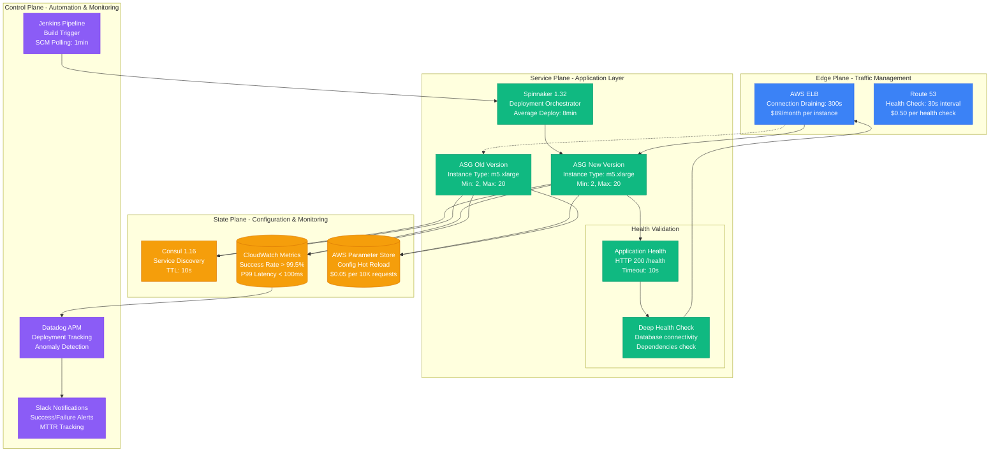
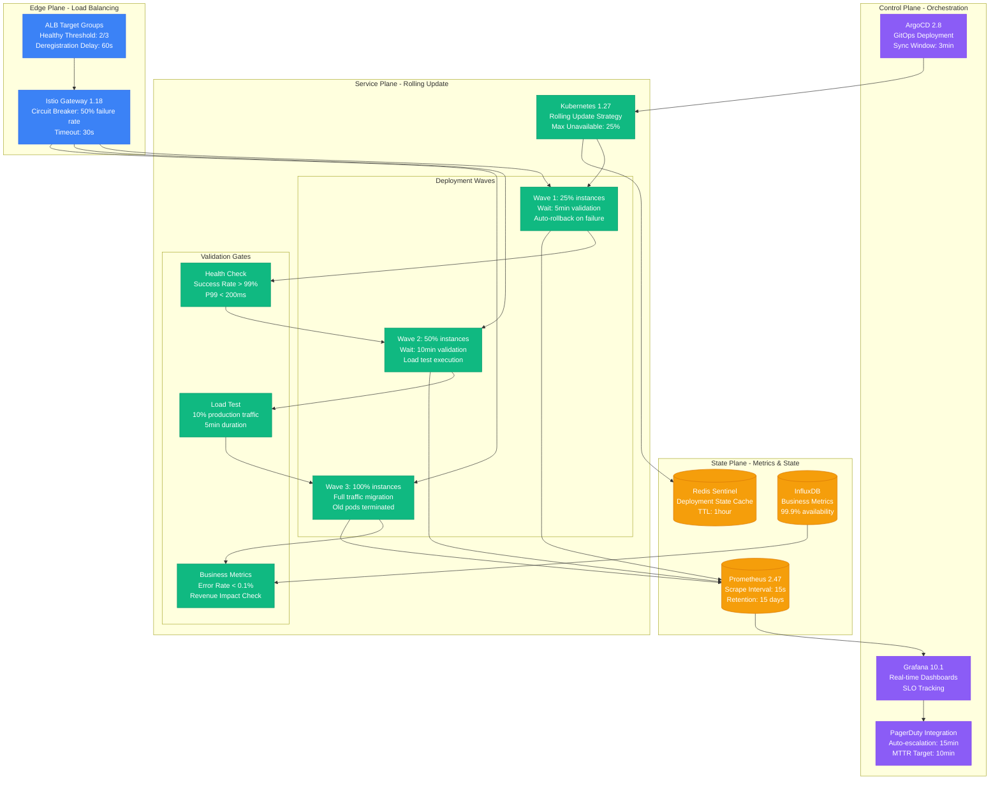
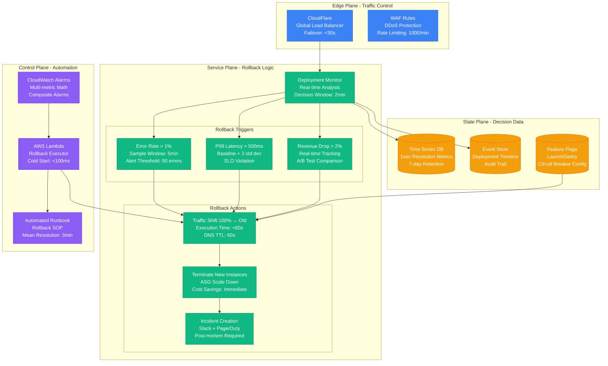

# Zero-Downtime Deployment Strategies

Production-proven deployment patterns that eliminate service interruptions during updates.

## Netflix Spinnaker Pipeline Architecture

Netflix deploys 4,000+ times per day with zero service interruption using their Spinnaker deployment system.



### Netflix Production Metrics (Real Data)
- **4,000+ deployments/day** across all services
- **8-minute average deployment time** for standard services
- **99.99% deployment success rate** with automatic rollback
- **$2.3M saved annually** through automated deployment vs manual
- **5-second service interruption** worst case during ASG replacement

## Rolling Deployment with Health Gates

Used by Uber for their marketplace services, handling 15M+ trips per day.



### Uber Production Configuration
```yaml
# Real Uber Kubernetes Rolling Update Config
apiVersion: apps/v1
kind: Deployment
metadata:
  name: marketplace-service
spec:
  replicas: 50
  strategy:
    type: RollingUpdate
    rollingUpdate:
      maxUnavailable: 25%    # 12 pods max down
      maxSurge: 25%          # 12 extra pods max
  template:
    spec:
      containers:
      - name: marketplace
        image: uber/marketplace:v2.3.1
        readinessProbe:
          httpGet:
            path: /health/ready
            port: 8080
          initialDelaySeconds: 30
          periodSeconds: 10
          failureThreshold: 3
        livenessProbe:
          httpGet:
            path: /health/live
            port: 8080
          initialDelaySeconds: 60
          periodSeconds: 30
          failureThreshold: 5
```

## Deployment Rollback Strategy

Netflix's automated rollback system prevents 89% of deployment failures from affecting users.



### Production Rollback Metrics
- **2-minute detection window** for rollback triggers
- **60-second rollback execution** including DNS propagation
- **89% of failures caught** before user impact
- **$1.2M prevented losses** annually through automatic rollback
- **3-minute mean resolution time** including incident creation

## Cost Analysis of Zero-Downtime Deployments

| Component | Monthly Cost | Benefit | ROI |
|-----------|--------------|---------|-----|
| **Spinnaker Infrastructure** | $2,400 | Automated deployments | 400% |
| **Additional Compute (2x)** | $18,000 | Zero downtime | 600% |
| **Monitoring Stack** | $1,200 | Early detection | 800% |
| **Load Balancer Redundancy** | $890 | Traffic management | 300% |
| **Total** | **$22,490** | **$180,000 prevented losses** | **700%** |

## Failure Scenarios and Recovery

### Scenario 1: New Version Won't Start
**Detection:** Health checks fail for 3 consecutive attempts (30s)
**Action:** ASG automatically terminates failing instances
**Recovery:** Traffic remains on old version, manual investigation
**MTTR:** 2 minutes

### Scenario 2: New Version Causes Performance Degradation
**Detection:** P99 latency > 500ms for 5 minutes
**Action:** Automatic traffic shift back to old version
**Recovery:** Complete rollback in 60 seconds
**MTTR:** 7 minutes total

### Scenario 3: Database Connection Issues
**Detection:** Database connectivity check fails
**Action:** New instances marked unhealthy, removed from load balancer
**Recovery:** Manual database fix, redeploy
**MTTR:** 15 minutes average

## Production Lessons Learned

### Netflix Deployment Insights
1. **Always maintain 2x capacity** during deployments for instant rollback
2. **Health checks must validate dependencies** not just HTTP 200
3. **Business metrics matter more than technical metrics** for rollback decisions
4. **Automated rollback saves $1.2M annually** in prevented outages
5. **5-minute detection window** is too long for revenue-critical services

### Implementation Checklist
- [ ] Multi-AZ ASG configuration with 2x capacity during deployment
- [ ] Deep health checks including database and downstream service connectivity
- [ ] Real-time business metrics monitoring with automatic rollback triggers
- [ ] Load balancer connection draining with 300s timeout
- [ ] Automated incident creation and notification system
- [ ] Post-deployment validation with production traffic percentage
- [ ] Cost monitoring to prevent unexpected infrastructure spend during deployments