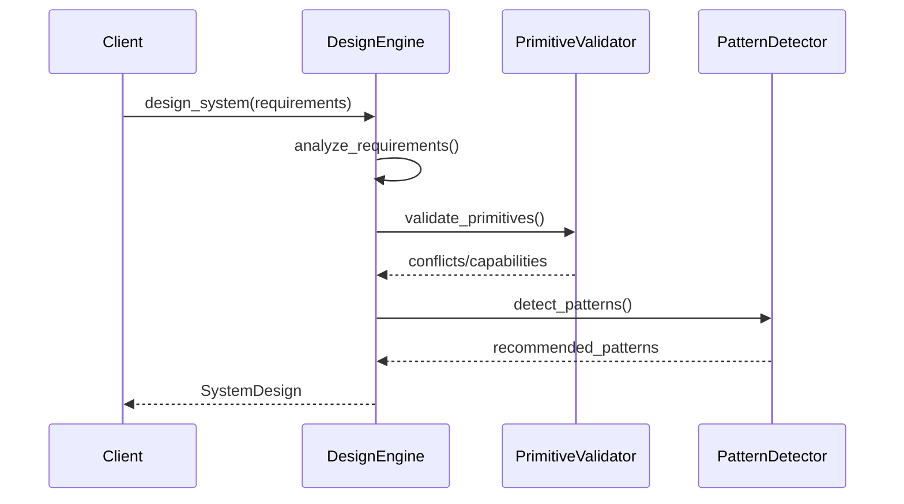
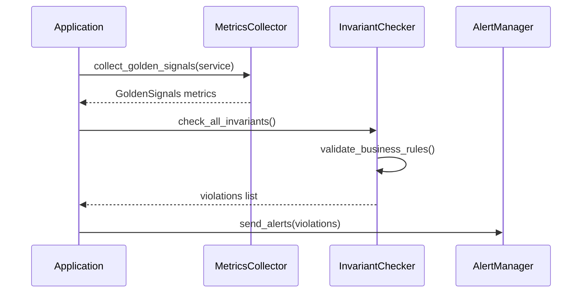
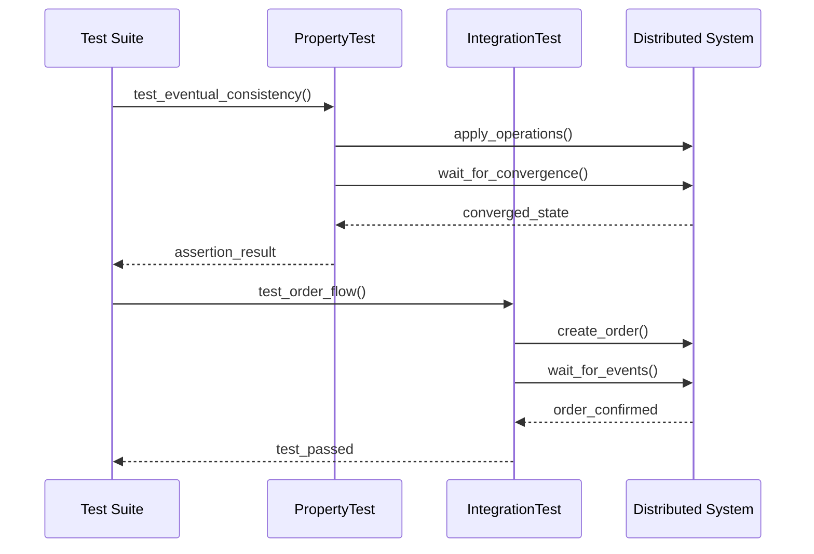
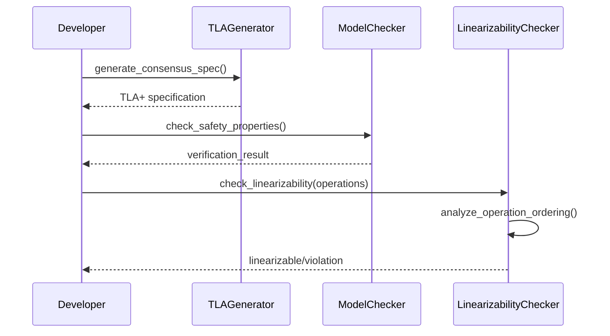
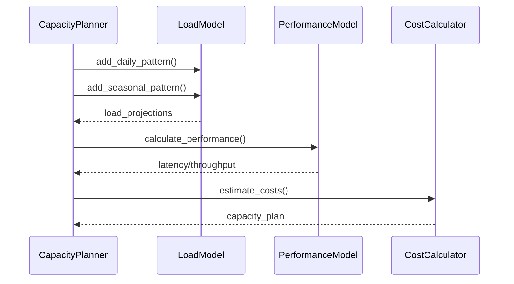

# API Reference

Programmatic interface for the Distributed Systems Framework enabling automated design and validation.

## Design Engine API

### System Design Flow

### Core Methods

| Method | Endpoint/Class | Parameters | Response |
|--------|----------------|------------|----------|
| **Design System** | `DesignEngine.design_system()` | Requirements object | SystemDesign with patterns, primitives, cost |
| **Validate Primitives** | `PrimitiveValidator.check_conflicts()` | List of primitive IDs | List of conflicts or empty |
| **Detect Patterns** | `PatternDetector.detect_patterns()` | List of primitives | Matching pattern names |
| **Generate Config** | `SystemDesign.generate_deployment_yaml()` | None | Kubernetes YAML configuration |
| **Generate Terraform** | `SystemDesign.generate_terraform()` | None | Infrastructure as code |

### Requirements Parameters

| Parameter | Type | Example | Description |
|-----------|------|---------|-------------|
| `domain` | string | 'e-commerce' | Application domain |
| `throughput_rps` | int | 10000 | Requests per second |
| `latency_p99_ms` | int | 100 | Latency budget in ms |
| `availability_target` | float | 0.999 | Target availability |
| `consistency_model` | string | 'eventual' | Consistency requirement |
| `cost_budget_monthly` | int | 50000 | Monthly budget in USD |

## Monitoring API

### Metrics Collection Flow

### Monitoring Methods

| Method | Endpoint/Class | Parameters | Response |
|--------|----------------|------------|----------|
| **Collect Metrics** | `MetricsCollector.collect_golden_signals()` | service_name | GoldenSignals object |
| **Check Invariants** | `InvariantChecker.check_all_invariants()` | None | List of violations |
| **Kill Instances** | `ChaosExperiment.kill_random_instances()` | service, percentage, duration | Experiment results |
| **Inject Latency** | `ChaosExperiment.inject_network_latency()` | service, latency_ms, duration | Network chaos results |

### Golden Signals Response

| Metric | Type | Unit | Description |
|--------|------|------|-------------|
| `latency_p99` | float | milliseconds | 99th percentile latency |
| `error_rate` | float | percentage | Error rate percentage |
| `requests_per_second` | int | RPS | Current throughput |
| `cpu_utilization` | float | percentage | CPU saturation level |

## Testing API

### Testing Flow

### Testing Methods

| Method | Endpoint/Class | Parameters | Response |
|--------|----------------|------------|----------|
| **Property Test** | `DistributedProperty.test_*()` | Generated operations | Test assertion result |
| **Integration Test** | `IntegrationTest.test_*()` | Service interactions | Test pass/fail status |
| **Setup Services** | `IntegrationTest.setup_services()` | Service configurations | Running service instances |
| **Wait for Events** | `IntegrationTest.wait_for_event()` | event_type, timeout | Event confirmation |

## Verification API

### Verification Flow

### Verification Methods

| Method | Endpoint/Class | Parameters | Response |
|--------|----------------|------------|----------|
| **Generate TLA+** | `TLAGenerator.generate_consensus_spec()` | nodes, algorithm | TLA+ specification |
| **Check Safety** | `ModelChecker.check_safety_properties()` | specification | Verification result |
| **Check Linearizability** | `LinearizabilityChecker.check_linearizability()` | operations list | Boolean + violation details |
| **Start Recording** | `LinearizabilityChecker.start_recording()` | None | Recording session ID |

## Capacity Planning API

### Planning Flow

### Planning Methods

| Method | Endpoint/Class | Parameters | Response |
|--------|----------------|------------|----------|
| **Plan Capacity** | `CapacityPlanner.plan_capacity()` | load_model, utilization, availability | CapacityPlan object |
| **Add Daily Pattern** | `LoadModel.add_daily_pattern()` | peak_hour, multiplier, base_rps | Updated load model |
| **Add Seasonal Pattern** | `LoadModel.add_seasonal_pattern()` | peak_month, multiplier | Seasonal load projection |
| **Calculate Performance** | `PerformanceModel.calculate_performance()` | None | Performance metrics |

### Capacity Plan Response

| Field | Type | Description |
|-------|------|-------------|
| `instances` | int | Required instance count |
| `monthly_cost` | int | Estimated monthly cost |
| `throughput_capacity` | int | Maximum RPS supported |
| `latency_p99` | int | Expected 99th percentile latency |

## Error Handling

| Exception | Trigger | Response |
|-----------|---------|----------|
| `DesignValidationError` | Invalid requirements | List of validation violations |
| `IncompatiblePrimitivesError` | Conflicting primitives | Conflicting primitive pairs |
| `CapacityExceededError` | Insufficient resources | Required vs available capacity |
| `VerificationFailedError` | Formal verification fails | Safety property violations |

## Configuration

| Parameter | Type | Default | Description |
|-----------|------|---------|-------------|
| `log_level` | string | 'INFO' | Logging verbosity |
| `monitoring_endpoint` | string | None | Prometheus endpoint URL |
| `chaos_enabled` | boolean | false | Enable chaos experiments |
| `verification_level` | string | 'basic' | Formal verification depth |