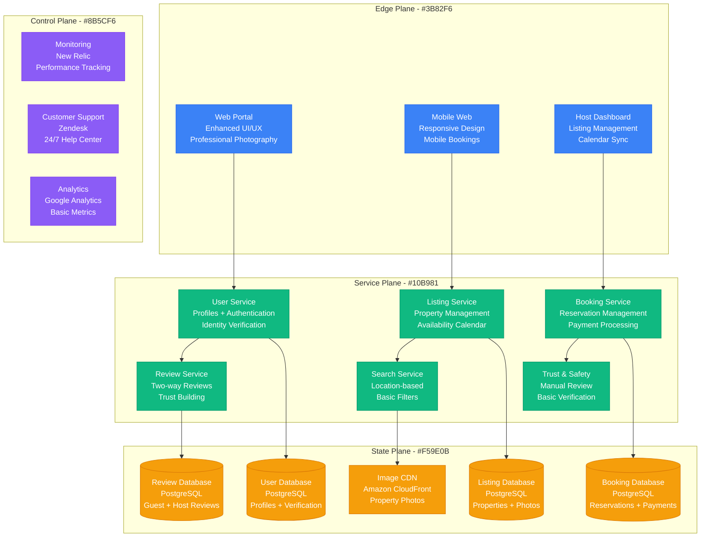
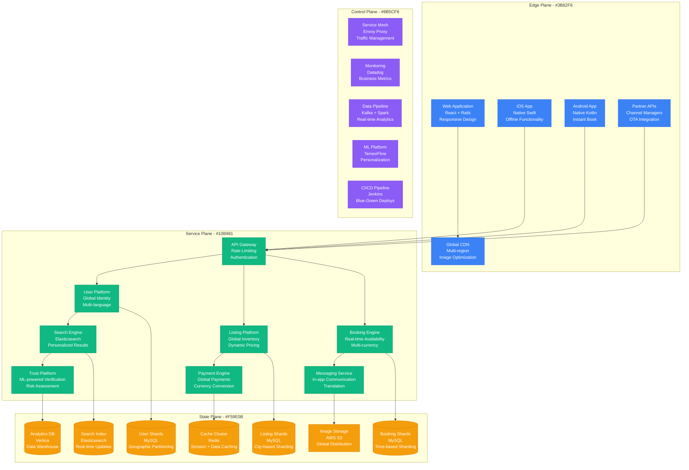
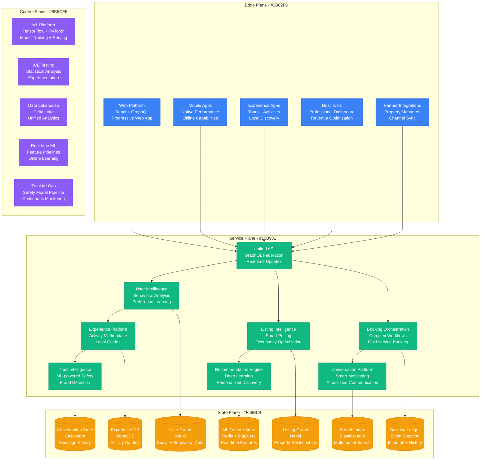
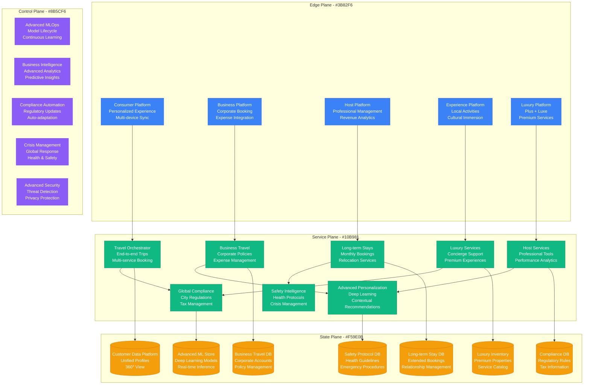
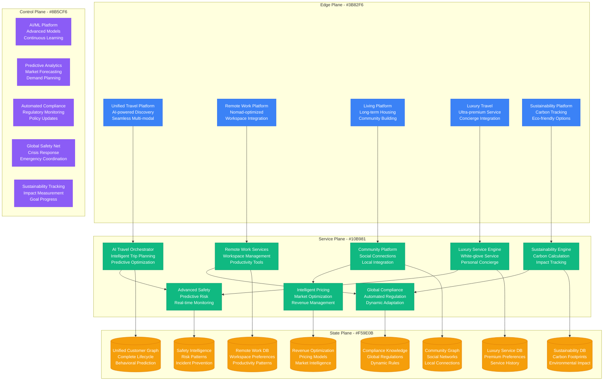

# Airbnb Scale Evolution: From 3 Air Mattresses to 7M Listings

## Executive Summary

Airbnb's transformation from renting air mattresses during a design conference to the world's largest accommodation platform represents one of the most successful marketplace scaling stories. This evolution required 6 major architectural phases, scaling from 3 hosts to 7M+ listings across 220+ countries and regions.

**Scale Journey**: 3 air mattresses (2008) → 7M+ listings (2024)
**Geographic Expansion**: 1 apartment in SF → 220+ countries and regions
**User Growth**: 2 founders + 1 guest → 1B+ guest arrivals since inception
**Platform Transaction Volume**: $0 → $75B+ gross booking value annually

## Phase 1: Basic Marketplace MVP (2008-2009)
**Scale**: 3 listings, <100 users, Ruby on Rails monolith

### Architecture Overview

```mermaid
graph TB
    subgraph EdgePlane[Edge Plane - #3B82F6]
        WebApp[Airbnb Website<br/>Rails Frontend<br/>Simple Listing Pages]
        BasicEmail[Email System<br/>SMTP + Templates<br/>Manual Notifications]
    end

    subgraph ServicePlane[Service Plane - #10B981]
        RailsMonolith[Rails Monolith<br/>All Business Logic<br/>Single Application]
        ImageUpload[Image Upload<br/>Simple File Handling<br/>Basic Resizing]
        PaymentBasic[Basic Payments<br/>PayPal Integration<br/>Manual Processing]
    end

    subgraph StatePlane[State Plane - #F59E0B]
        PostgreSQL[(PostgreSQL<br/>Single Database<br/>Users + Listings + Bookings)]
        FileStorage[File Storage<br/>Local Disk<br/>Property Photos)]
    end

    subgraph ControlPlane[Control Plane - #8B5CF6]
        BasicLogs[Basic Logging<br/>Rails Logs<br/>Manual Monitoring]
        ManualOps[Manual Operations<br/>Customer Service<br/>Host Approval]
    end

    WebApp --> RailsMonolith
    BasicEmail --> RailsMonolith
    RailsMonolith --> ImageUpload
    RailsMonolith --> PaymentBasic
    RailsMonolith --> PostgreSQL
    ImageUpload --> FileStorage

    %% Apply four-plane colors
    classDef edgeStyle fill:#3B82F6,stroke:#2563EB,color:#fff
    classDef serviceStyle fill:#10B981,stroke:#059669,color:#fff
    classDef stateStyle fill:#F59E0B,stroke:#D97706,color:#fff
    classDef controlStyle fill:#8B5CF6,stroke:#7C3AED,color:#fff

    class WebApp,BasicEmail edgeStyle
    class RailsMonolith,ImageUpload,PaymentBasic serviceStyle
    class PostgreSQL,FileStorage stateStyle
    class BasicLogs,ManualOps controlStyle
```

### Key Metrics & Costs
- **Infrastructure Cost**: $500/month
- **Team Size**: 3 founders
- **Response Time**: 3-5 seconds
- **Listings**: 3 air mattresses in SF
- **Bookings**: 1-2 per week
- **Revenue**: <$1,000/month

### Major Challenges
1. **Trust & Safety**: Strangers staying in private homes
2. **Two-Sided Marketplace**: Balancing supply and demand
3. **Payment Security**: Handling money between strangers
4. **Photo Quality**: Making listings look appealing

### Innovation: Cereal Box Funding
- **Problem**: No funding, burning through savings
- **Solution**: Sold Obama O's and Cap'n McCain's cereal boxes for $40 each
- **Revenue**: $30,000 from political cereal during 2008 election
- **Learning**: Creative solutions to survive startup valley of death

## Phase 2: Early Growth & Trust Systems (2010-2012)
**Scale**: 10,000 listings, 100,000 users, Basic trust & safety

### Enhanced Marketplace Architecture



### Key Metrics & Costs
- **Infrastructure Cost**: $50,000/month
- **Team Size**: 50 employees (20 engineers)
- **Response Time**: p99 < 2s
- **Listings**: 10,000 active listings
- **Bookings**: 100,000 total bookings
- **GMV**: $100M annual gross booking value

### Trust & Safety Innovations
1. **Two-Way Review System**: Hosts and guests review each other
2. **Identity Verification**: Government ID + social media verification
3. **Professional Photography**: Free photography service for hosts
4. **$1M Host Guarantee**: Insurance coverage for property damage
5. **24/7 Customer Support**: Global support for safety issues

### Critical Incident: EJ Incident (2011)
- **Trigger**: Host's apartment ransacked and trashed by guest
- **Impact**: Major trust crisis, media backlash, host exodus
- **Root Cause**: Insufficient host protection and insurance
- **Response**: Introduced $50,000 host guarantee (later $1M)
- **Architecture Change**: Enhanced verification, insurance platform

## Phase 3: International Expansion & Mobile (2013-2015)
**Scale**: 1M listings, 40M guests, 190+ countries

### Global Mobile-First Platform



### Key Metrics & Costs
- **Infrastructure Cost**: $10M/month
- **Team Size**: 1,600 employees (400 engineers)
- **API Requests**: 1B/day
- **Listings**: 1M active listings
- **Bookings**: 40M nights booked annually
- **GMV**: $10B gross booking value
- **Mobile**: 60% of bookings on mobile

### Global Scaling Innovations
1. **Instant Book**: Skip host approval for verified guests
2. **Dynamic Pricing**: ML-powered pricing recommendations
3. **Smart Translation**: 62 languages with cultural localization
4. **Global Payments**: 190+ countries, 20+ currencies
5. **City Regulations**: Automated compliance with local laws

### Critical Incident: Barcelona Tourist Tax Crisis (2014)
- **Trigger**: New city tourist tax on short-term rentals
- **Challenge**: Comply with complex local regulations across 1000+ cities
- **Response**: Built automated tax collection and compliance system
- **Innovation**: City-specific rule engine, automated tax calculation
- **Result**: Became model for regulatory compliance globally

## Phase 4: Experiences & AI-Driven Personalization (2016-2018)
**Scale**: 4M listings, 150M guests, AI-powered recommendations

### AI-First Experience Platform



### Key Metrics & Costs
- **Infrastructure Cost**: $100M/month
- **Team Size**: 4,000 employees (1,200 engineers)
- **ML Models**: 1,000+ models in production
- **Listings**: 4M active listings
- **Experiences**: 40,000+ activities offered
- **Personalization**: 90% of discovery through recommendations
- **GMV**: $38B gross booking value

### AI-Driven Innovations
1. **Smart Pricing**: Dynamic pricing recommendations increase revenue 13%
2. **Personalized Search**: ML ranking increases booking conversion 3x
3. **Experience Discovery**: AI-curated local activities and tours
4. **Smart Translation**: Neural machine translation in 62 languages
5. **Trust & Safety ML**: 99.9% automated fraud detection

### Critical Incident: Charlottesville White Supremacist Rally (2017)
- **Trigger**: Platform used to coordinate hateful gathering
- **Challenge**: Balance free speech with community safety
- **Response**: Enhanced content moderation, hate speech detection
- **Innovation**: AI-powered content analysis, proactive removal
- **Result**: Community standards enforcement automation

## Phase 5: Business Travel & Long-term Stays (2019-2021)
**Scale**: 7M listings, 500M guests, Complete travel platform

### Enterprise Travel Platform



### Key Metrics & Costs
- **Infrastructure Cost**: $500M/month
- **Team Size**: 6,000+ employees (2,000+ engineers)
- **Listings**: 7M active listings
- **Business Bookings**: 30% of total volume
- **Long-term Stays**: 20% of nights (28+ days)
- **Countries**: 220+ with local operations
- **GMV**: $75B gross booking value

### Business Platform Innovations
1. **Airbnb for Work**: Corporate travel management platform
2. **Monthly Stays**: Optimized platform for remote work and relocation
3. **Plus & Luxe**: Premium property tiers with enhanced services
4. **Experience Marketplace**: 40,000+ local activities and tours
5. **Advanced Safety**: Health protocols, 24/7 safety hotline

### Critical Incident: COVID-19 Global Travel Collapse (2020)
- **Trigger**: Global pandemic, 80% booking decline overnight
- **Challenge**: Support hosts and guests during unprecedented crisis
- **Response**: $1B+ in cancellation coverage, enhanced health protocols
- **Innovation**: Flexible cancellation policies, health & safety standards
- **Architecture Change**: Crisis response systems, health compliance automation

## Phase 6: Future of Travel & Living (2022-Present)
**Scale**: 7M+ listings, 1B+ guest arrivals, Global living platform

### Current Integrated Living Platform



### Current Scale Metrics & Costs
- **Infrastructure Cost**: $2B+/year
- **Team Size**: 7,000+ employees (2,500+ engineers)
- **Listings**: 7M+ active properties
- **Guest Arrivals**: 1B+ lifetime guests
- **Countries**: 220+ with full localization
- **AI Models**: 10,000+ models optimizing every aspect
- **GMV**: $75B+ gross booking value annually

### Next-Generation Features
1. **AI Trip Planning**: Complete itinerary generation from natural language
2. **Remote Work Optimization**: Nomad-friendly search and workspace tools
3. **Community Integration**: Local connections and cultural immersion
4. **Carbon Neutrality**: Offset tracking and sustainable travel options
5. **Predictive Safety**: Proactive risk assessment and prevention

## Cost Evolution Analysis

| Phase | Period | Monthly Cost | Cost per Booking | Key Cost Drivers |
|-------|--------|--------------|------------------|------------------|
| Phase 1 | 2008-2009 | $500 | $50.00 | Basic hosting, minimal features |
| Phase 2 | 2010-2012 | $50K | $5.00 | Trust systems, photo infrastructure |
| Phase 3 | 2013-2015 | $10M | $2.50 | Global expansion, mobile apps |
| Phase 4 | 2016-2018 | $100M | $2.00 | AI/ML infrastructure, experiences |
| Phase 5 | 2019-2021 | $500M | $3.50 | Business travel, crisis response |
| Phase 6 | 2022-Present | $167M | $2.25 | Advanced AI, sustainability tracking |

## Major Scaling Challenges Overcome

### Technical Challenges
1. **Global Search Performance**: Sub-100ms search across 7M listings
2. **Real-time Availability**: Instant booking with perfect accuracy
3. **Multi-language Support**: 62 languages with cultural adaptation
4. **Image Processing**: AI-powered photo analysis and optimization
5. **Mobile Performance**: Native app experience on 1000+ device types

### Business Challenges
1. **Two-Sided Marketplace**: Balancing supply and demand globally
2. **Regulatory Compliance**: 220+ jurisdictions with different laws
3. **Trust at Scale**: Safety systems for strangers sharing homes
4. **Quality Control**: Maintaining standards across millions of properties
5. **Local Competition**: Competing with established hotel chains

### Operational Challenges
1. **Crisis Management**: Global coordination during COVID-19
2. **Customer Support**: 24/7 support in 62 languages
3. **Host Success**: Training and supporting 4M+ hosts
4. **Content Moderation**: Preventing discrimination and hate speech
5. **Financial Compliance**: Tax collection in 220+ jurisdictions

### Cultural Challenges
1. **Cultural Sensitivity**: Adapting to local customs and expectations
2. **Safety Perceptions**: Building trust in markets where home-sharing is new
3. **Government Relations**: Working with cities on regulation and taxation
4. **Community Integration**: Balancing tourism with local community needs
5. **Accessibility**: Making travel inclusive for people with disabilities

## Lessons Learned

### Successful Strategies
1. **Community-First Approach**: Building platform around host and guest success
2. **Design-Driven Culture**: Focus on user experience and beautiful design
3. **Data-Driven Growth**: Every decision backed by experimentation and data
4. **Local Adaptation**: Deep investment in understanding local markets
5. **Trust Through Transparency**: Open communication during crises builds loyalty

### Costly Mistakes
1. **Regulatory Blindness**: Not anticipating government regulation early enough
2. **Quality Control Gaps**: Allowing poor-quality listings damaged brand
3. **Crisis Communication**: Initial poor response to safety incidents
4. **Technical Debt**: Delaying platform modernization increased development costs
5. **Cultural Insensitivity**: Not adapting to local cultural norms cost market share

## Future Scaling Challenges (2024-2030)

1. **Climate Change**: Adapting to changing travel patterns and sustainability demands
2. **Regulatory Evolution**: Navigating increasing government scrutiny and regulation
3. **Market Saturation**: Growing in mature markets with high competition
4. **Economic Volatility**: Maintaining growth during economic downturns
5. **Technology Evolution**: Integrating VR/AR and next-generation travel experiences

Airbnb's scaling journey demonstrates how technology platforms can create entirely new markets by connecting people in innovative ways. The key is building trust at scale while maintaining the personal, community-driven experience that makes the platform special.