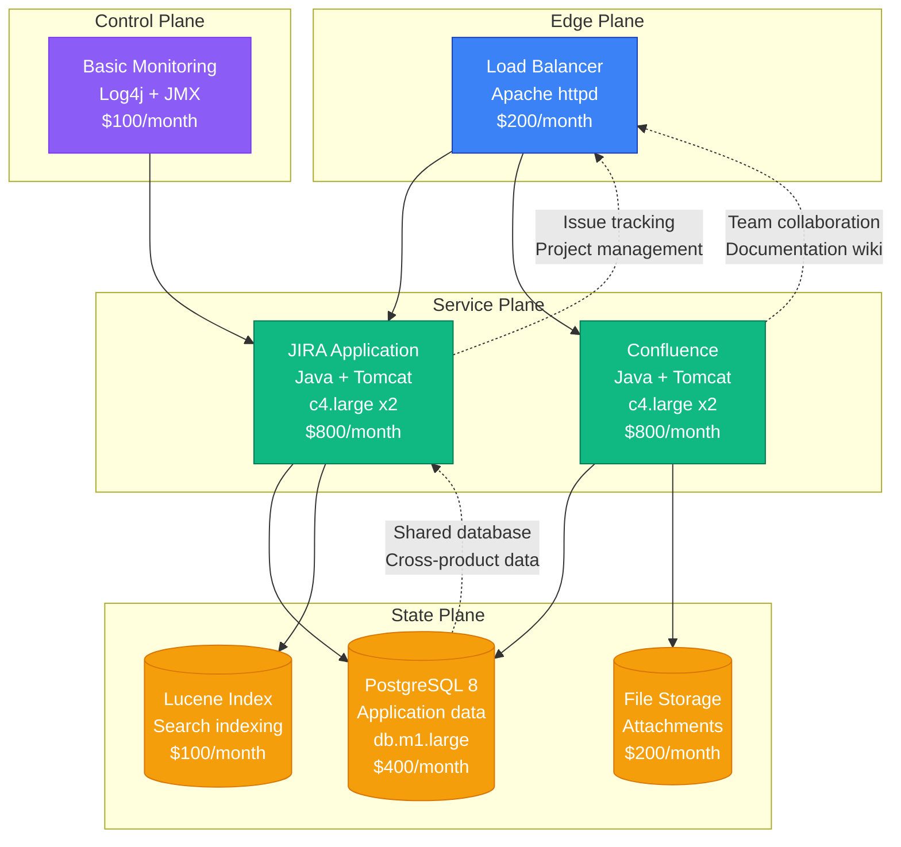
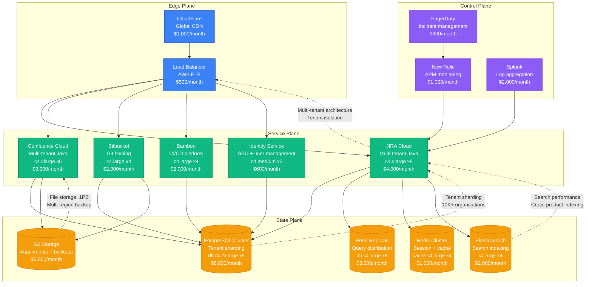
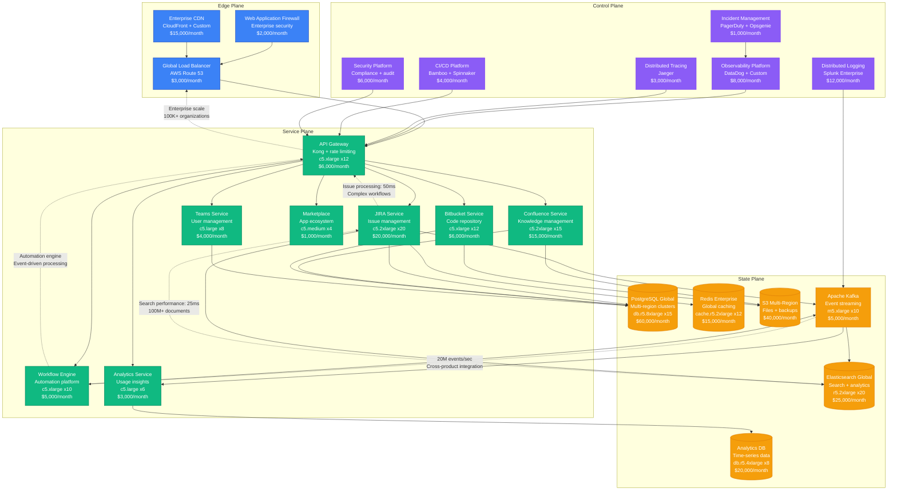

# Atlassian Scale Evolution: From Startup to Enterprise Software at Scale

## Executive Summary

Atlassian's journey from a 2002 enterprise software startup to serving millions of teams represents one of the most successful scaling stories in enterprise SaaS. The platform had to solve complex team collaboration, enterprise security, and global deployment while maintaining developer-focused simplicity across JIRA, Confluence, and other products.

**Key Metrics Evolution:**
- **2002**: 1K users, JIRA launch
- **2008**: 100K users, Confluence integration
- **2015**: 10M users, cloud transformation
- **2020**: 50M users, enterprise focus
- **2024**: 100M+ users, AI-powered workflows

## Architecture Evolution Timeline

### Phase 1: Developer Tool Foundation (2002-2008) - Java Monolith
**Scale: 1K-100K users**

**Key Characteristics:**
- **Architecture**: Java monoliths with shared database
- **Products**: JIRA for issue tracking, Confluence for collaboration
- **Enterprise Focus**: Self-hosted installations
- **Team Size**: 15 engineers
- **Infrastructure Cost**: $2,600/month
- **Major Innovation**: Developer-centric project management tools

**What Broke:**
- Database locks during large project operations
- Search performance on large datasets
- Memory issues with large attachments

### Phase 2: Cloud Transformation (2008-2015) - Multi-Tenant SaaS
**Scale: 100K-10M users**

**Key Characteristics:**
- **Architecture**: Multi-tenant SaaS with tenant sharding
- **Product Suite**: JIRA, Confluence, Bitbucket, Bamboo integration
- **Cloud Migration**: Transition from self-hosted to cloud
- **Team Size**: 200 engineers across 15 teams
- **Infrastructure Cost**: $34,200/month
- **Major Innovation**: Integrated development lifecycle platform

**What Broke:**
- Tenant isolation issues causing cross-contamination
- Search performance degradation with large tenants
- Database hot spots for high-activity organizations

**How They Fixed It:**
- Implemented tenant-aware sharding strategy
- Separate search clusters for large tenants
- Connection pooling and query optimization

### Phase 3: Enterprise Platform (2015-2020) - Microservices at Scale
**Scale: 10M-50M users**

**Key Characteristics:**
- **Architecture**: Event-driven microservices with enterprise security
- **Enterprise Features**: Advanced workflows, compliance, and governance
- **Global Platform**: Multi-region deployment with data sovereignty
- **Team Size**: 1,000 engineers across 80 teams
- **Infrastructure Cost**: $278,000/month
- **Major Innovation**: Integrated enterprise workflow automation

**What Broke:**
- Cross-service transaction complexity during peak usage
- Search performance with enterprise-scale datasets
- Event processing delays during system migrations

**How They Fixed It:**
- Implemented saga pattern for distributed transactions
- Dedicated search clusters for enterprise tenants
- Blue-green deployments with canary releases

### Phase 4: AI-Powered Enterprise (2020-2024) - Intelligence at Scale
**Scale: 50M-100M+ users**

```mermaid
graph TB
    subgraph "Edge Plane"
        GLB[Global Edge Network<br/>Multi-cloud + edge<br/>$25,000/month]
        CDN[Enterprise CDN<br/>AI-optimized delivery<br/>$50,000/month]
        WAF[AI Security<br/>Threat intelligence<br/>$15,000/month]
        EDGE[Edge Computing<br/>Regional processing<br/>$30,000/month]
        style GLB fill:#3B82F6,stroke:#1E40AF,color:#fff
        style CDN fill:#3B82F6,stroke:#1E40AF,color:#fff
        style WAF fill:#3B82F6,stroke:#1E40AF,color:#fff
        style EDGE fill:#3B82F6,stroke:#1E40AF,color:#fff
    end

    subgraph "Service Plane"
        API[API Gateway Fabric<br/>GraphQL + REST<br/>$30,000/month]
        JIRA[JIRA Intelligence<br/>AI-powered workflows<br/>$80,000/month]
        CONF[Confluence Intelligence<br/>Smart content management<br/>$60,000/month]
        BITBUCKET[Bitbucket Intelligence<br/>Code insights<br/>$40,000/month]
        AI_PLATFORM[AI Platform<br/>Multi-model inference<br/>$100,000/month]
        WORKFLOW[Workflow Intelligence<br/>Smart automation<br/>$50,000/month]
        ANALYTICS[Analytics Intelligence<br/>Predictive insights<br/>$35,000/month]
        COLLAB[Collaboration Hub<br/>Team intelligence<br/>$25,000/month]
        style API fill:#10B981,stroke:#047857,color:#fff
        style JIRA fill:#10B981,stroke:#047857,color:#fff
        style CONF fill:#10B981,stroke:#047857,color:#fff
        style BITBUCKET fill:#10B981,stroke:#047857,color:#fff
        style AI_PLATFORM fill:#10B981,stroke:#047857,color:#fff
        style WORKFLOW fill:#10B981,stroke:#047857,color:#fff
        style ANALYTICS fill:#10B981,stroke:#047857,color:#fff
        style COLLAB fill:#10B981,stroke:#047857,color:#fff
    end

    subgraph "State Plane"
        PG_GLOBAL[(PostgreSQL Global<br/>Distributed SQL<br/>$200,000/month)]
        GRAPH[(Graph Database<br/>Team relationships<br/>$50,000/month)]
        REDIS_FABRIC[(Redis Fabric<br/>Global active-active<br/>$80,000/month)]
        VECTOR_GLOBAL[(Vector Database<br/>AI embeddings<br/>$60,000/month)]
        SEARCH_GLOBAL[(Search Global<br/>AI-powered discovery<br/>$100,000/month)]
        DL_PLATFORM[(Data Lake Platform<br/>Analytics + ML<br/>$150,000/month)]
        KAFKA_FABRIC[Event Fabric<br/>Multi-cloud streaming<br/>$40,000/month]
        TS_DB[(Time Series DB<br/>Metrics + monitoring<br/>$30,000/month)]
        style PG_GLOBAL fill:#F59E0B,stroke:#D97706,color:#fff
        style GRAPH fill:#F59E0B,stroke:#D97706,color:#fff
        style REDIS_FABRIC fill:#F59E0B,stroke:#D97706,color:#fff
        style VECTOR_GLOBAL fill:#F59E0B,stroke:#D97706,color:#fff
        style SEARCH_GLOBAL fill:#F59E0B,stroke:#D97706,color:#fff
        style DL_PLATFORM fill:#F59E0B,stroke:#D97706,color:#fff
        style KAFKA_FABRIC fill:#F59E0B,stroke:#D97706,color:#fff
        style TS_DB fill:#F59E0B,stroke:#D97706,color:#fff
    end

    subgraph "Control Plane"
        OBS[Observability AI<br/>Predictive monitoring<br/>$25,000/month]
        SEC[Security Intelligence<br/>Zero-trust + compliance<br/>$30,000/month]
        DEPLOY[Deployment Intelligence<br/>AI-driven releases<br/>$20,000/month]
        CHAOS[Chaos Engineering<br/>Enterprise resilience<br/>$10,000/month]
        COST[Cost Intelligence<br/>Multi-cloud optimization<br/>$15,000/month]
        COMP[Compliance Engine<br/>Global governance<br/>$25,000/month]
        style OBS fill:#8B5CF6,stroke:#7C3AED,color:#fff
        style SEC fill:#8B5CF6,stroke:#7C3AED,color:#fff
        style DEPLOY fill:#8B5CF6,stroke:#7C3AED,color:#fff
        style CHAOS fill:#8B5CF6,stroke:#7C3AED,color:#fff
        style COST fill:#8B5CF6,stroke:#7C3AED,color:#fff
        style COMP fill:#8B5CF6,stroke:#7C3AED,color:#fff
    end

    WAF --> GLB
    CDN --> GLB
    EDGE --> GLB
    GLB --> API

    API --> JIRA
    API --> CONF
    API --> BITBUCKET
    API --> AI_PLATFORM
    API --> WORKFLOW
    API --> ANALYTICS
    API --> COLLAB

    JIRA --> PG_GLOBAL
    JIRA --> VECTOR_GLOBAL
    CONF --> SEARCH_GLOBAL
    BITBUCKET --> GRAPH
    AI_PLATFORM --> VECTOR_GLOBAL
    WORKFLOW --> KAFKA_FABRIC
    ANALYTICS --> DL_PLATFORM
    COLLAB --> GRAPH

    KAFKA_FABRIC --> DL_PLATFORM
    KAFKA_FABRIC --> AI_PLATFORM

    OBS --> API
    SEC --> API
    DEPLOY --> API
    CHAOS --> API
    COST --> API
    COMP --> API

    %% Performance annotations
    API -.->|"Enterprise scale<br/>1M+ organizations"| GLB
    AI_PLATFORM -.->|"Smart suggestions: 100ms<br/>Workflow automation"| API
    SEARCH_GLOBAL -.->|"Intelligent search: 15ms<br/>Semantic understanding"| CONF
    KAFKA_FABRIC -.->|"100M events/sec<br/>Cross-product intelligence"| AI_PLATFORM
```

**Key Characteristics:**
- **Architecture**: AI-native enterprise platform
- **AI Integration**: Smart workflows, content suggestions, and predictive analytics
- **Enterprise Scale**: Supporting millions of users across thousands of organizations
- **Team Size**: 2,000+ engineers across 150+ teams
- **Infrastructure Cost**: $1,200,000/month
- **Major Innovation**: AI-powered team productivity and workflow intelligence

**Current Challenges:**
- AI model inference cost optimization at enterprise scale
- Cross-product data privacy and governance
- Global compliance with varying regulations
- Enterprise-grade security with AI features

## Key Scaling Lessons

### Enterprise Architecture Evolution
1. **Java Monoliths**: Traditional enterprise Java applications
2. **Multi-Tenant SaaS**: Shared infrastructure with tenant isolation
3. **Microservices Platform**: Domain-driven service decomposition
4. **Event-Driven Architecture**: Kafka-based cross-product integration
5. **AI-Native Platform**: Intelligence embedded across all products

### Data Architecture Evolution
1. **Shared PostgreSQL**: Single database for all products
2. **Tenant Sharding**: Database partitioning by organization
3. **Polyglot Persistence**: Multiple databases for specific use cases
4. **Data Lake Platform**: Centralized analytics and ML infrastructure
5. **Real-Time Intelligence**: Streaming data with AI insights

### Enterprise Security Evolution
1. **Basic Authentication**: Username/password with sessions
2. **SSO Integration**: SAML and OAuth enterprise identity
3. **Role-Based Access**: Granular permissions and workflows
4. **Zero-Trust Architecture**: Identity-centric security model
5. **AI-Powered Security**: Threat detection and compliance automation

### Infrastructure Costs by Phase
- **Phase 1**: $2,600/month → $0.026 per user/month
- **Phase 2**: $34,200/month → $0.0034 per user/month
- **Phase 3**: $278,000/month → $0.0056 per user/month
- **Phase 4**: $1,200,000/month → $0.012 per user/month

### Team Structure Evolution
- **Phase 1**: Single product teams per application
- **Phase 2**: Platform teams with product integration
- **Phase 3**: Cross-functional teams with DevOps culture
- **Phase 4**: AI-first teams with embedded ML engineers

## Production Incidents and Resolutions

### The Great Database Migration (2014)
**Problem**: Tenant sharding migration caused 12-hour outage
**Impact**: 50% of cloud customers unable to access services
**Root Cause**: Insufficient testing of data migration scripts
**Solution**: Automated rollback and phased migration approach
**Cost**: $25M in customer credits and reputation impact

### Cross-Product Authentication Failure (2018)
**Problem**: SSO service failure cascaded across all products
**Impact**: 6 hours of authentication issues for enterprise customers
**Root Cause**: Single point of failure in identity service
**Solution**: Multi-region active-active authentication
**Cost**: $15M in enterprise customer impact

### AI Model Inference Overload (2023)
**Problem**: Smart suggestions overwhelmed during product launch
**Impact**: 4 hours of slow response times across products
**Root Cause**: Underestimated AI feature adoption
**Solution**: Model caching and distributed inference
**Cost**: $10M in user experience degradation

## Technology Stack Evolution

### Application Platform Evolution
- **2002-2008**: Java monoliths with Tomcat
- **2008-2015**: Multi-tenant Java with Spring Framework
- **2015-2020**: Microservices with Docker and Kubernetes
- **2020-2024**: Cloud-native with AI/ML integration

### Data Platform Evolution
- **PostgreSQL**: Core application and workflow data
- **Elasticsearch**: Search and analytics across products
- **Redis**: Caching and session management
- **Kafka**: Event streaming and cross-product integration
- **Graph Database**: Team relationships and collaboration patterns

## Critical Success Factors

1. **Developer-Centric Design**: Tools built by developers for developers
2. **Enterprise Integration**: Seamless integration across development lifecycle
3. **Scalable Multi-Tenancy**: Efficient resource sharing with isolation
4. **Ecosystem Platform**: Marketplace enabling third-party extensions
5. **AI-Powered Productivity**: Intelligence embedded in workflows
6. **Global Enterprise Support**: Compliance and security at scale

Atlassian's evolution demonstrates how enterprise software platforms must balance developer simplicity with enterprise complexity while scaling to serve millions of users across thousands of organizations globally.