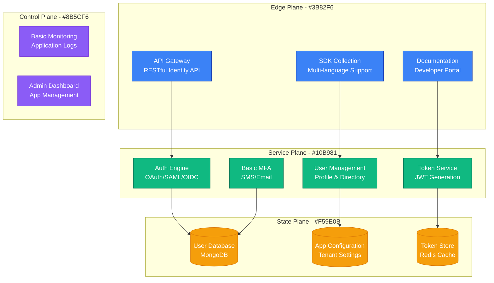
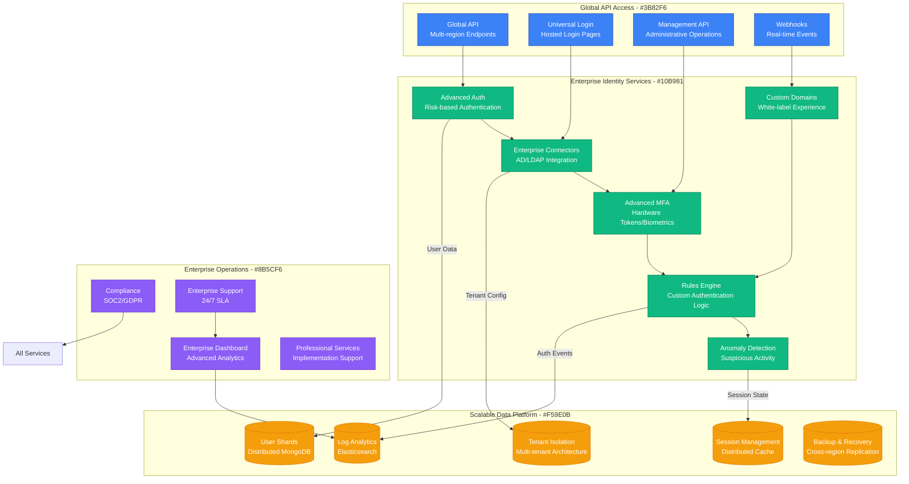
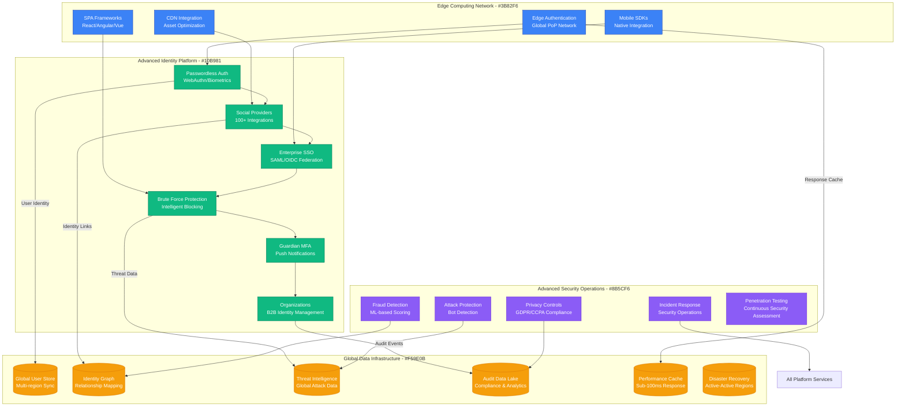
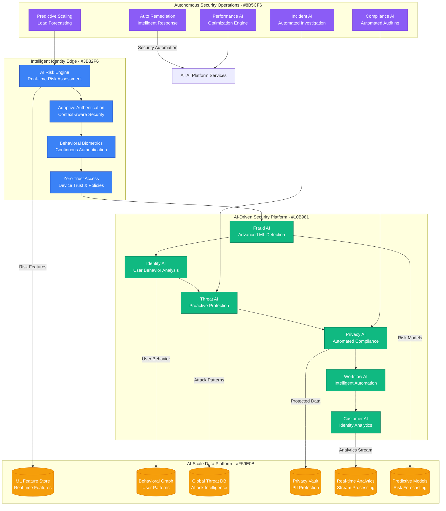
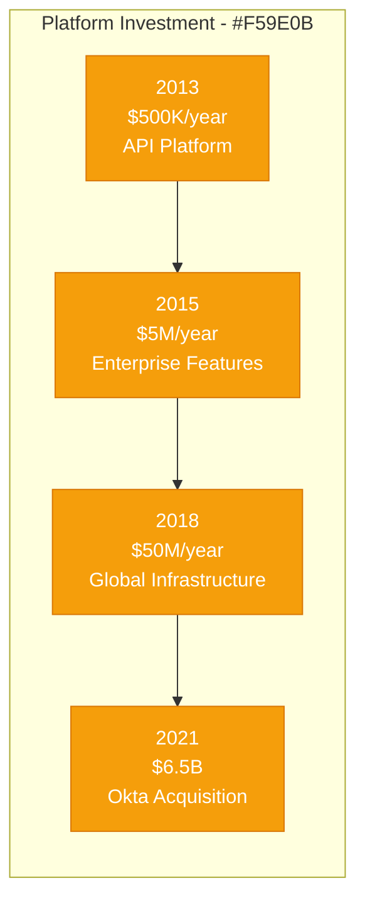

# Auth0: Identity Platform Rapid Growth

## Executive Summary

Auth0's scaling journey from a developer-focused identity API to a comprehensive identity platform serving 100+ billion logins annually represents one of the fastest-growing B2B SaaS success stories. This case study examines their evolution from 2013 to 2024, focusing on the unique challenges of scaling an identity platform that handles authentication for millions of applications while maintaining sub-100ms response times globally and supporting every conceivable authentication method.

## Scale Milestones

| Milestone | Year | Applications | Key Challenge | Solution | Logins/Month |
|-----------|------|--------------|---------------|----------|--------------|
| Developer API | 2013 | 100 | Developer adoption | Simple SDKs | 1M |
| SaaS Platform | 2015 | 10K | Multi-tenancy | Elastic infrastructure | 100M |
| Enterprise | 2018 | 100K | Enterprise features | Advanced security | 10B |
| Global Scale | 2021 | 1M+ | Global performance | Edge architecture | 50B |
| AI-Enhanced | 2024 | 2M+ | Intelligent security | AI-driven protection | 100B+ |

## Architecture Evolution

### Phase 1: Developer-First Identity API (2013-2015)
*Scale: 100 → 10K applications*

**Key Metrics (2015)**:
- Applications: 10,000
- Monthly Logins: 100M
- Response Time: <200ms
- Supported Protocols: 5

### Phase 2: Enterprise Identity Platform (2015-2018)
*Scale: 10K → 100K applications*

**Breakthrough Moment**: Universal Login launch in 2016 simplified implementation and improved security.

**Key Metrics (2018)**:
- Applications: 100,000
- Monthly Logins: 10B
- Global Regions: 10+
- Enterprise Customers: 2,000+

### Phase 3: Global Identity Infrastructure (2018-2021)
*Scale: 100K → 1M+ applications*

**Key Innovation**: Edge authentication network reduced global latency to sub-100ms.

**Key Metrics (2021)**:
- Applications: 1M+
- Monthly Logins: 50B
- Global PoPs: 35+
- Response Time: <100ms globally

### Phase 4: AI-Enhanced Identity Security (2021-2024)
*Scale: 1M+ → 2M+ applications*

**Current Metrics (2024)**:
- Applications: 2M+
- Monthly Logins: 100B+
- AI Decisions: 10B+ daily
- Blocked Attacks: 1B+ monthly

## Critical Scale Events

### The Universal Login Revolution (2016)
**Challenge**: Each application had to implement its own login UI, creating security and UX inconsistencies.

**Solution**: Hosted Universal Login with customizable branding and advanced security features.

**Impact**: Accelerated adoption and improved security posture across all customers.

### Multi-Factor Authentication Scaling (2017)
**Challenge**: SMS-based MFA was expensive and unreliable at scale.

**Innovation**: Guardian mobile app with push notifications and TOTP support.

**Result**: Reduced MFA costs by 90% while improving user experience.

### Global Edge Network Deployment (2019)
**Challenge**: Authentication latency affected user experience globally.

**Breakthrough**: 35+ global points of presence with edge authentication.

### AI-Powered Security Launch (2021)
**Challenge**: Traditional rule-based security couldn't keep up with sophisticated attacks.

**Solution**: Machine learning models analyzing billions of login patterns for real-time risk assessment.

### Okta Acquisition (2021)
**Challenge**: Competing with larger identity providers with more resources.

**Solution**: $6.5B acquisition by Okta provided scale and enterprise reach.

## Technology Evolution

### Authentication Methods
- **2013-2015**: OAuth, SAML, username/password
- **2015-2018**: Social login, enterprise connectors
- **2018-2021**: Passwordless, WebAuthn, biometrics
- **2021-2024**: Adaptive authentication, behavioral biometrics

### Security Architecture
- **Phase 1**: Basic authentication
- **Phase 2**: Multi-factor authentication
- **Phase 3**: Risk-based authentication
- **Phase 4**: AI-driven adaptive security

### Data Strategy Evolution
- **2013-2016**: MongoDB for user data
- **2016-2019**: Sharded multi-tenant architecture
- **2019-2022**: Global data synchronization
- **2022-2024**: AI/ML feature stores and real-time analytics

## Financial Impact

### Infrastructure Investment by Phase

### Revenue Milestones
- **2014**: $1M ARR (developer adoption)
- **2017**: $50M ARR (enterprise breakthrough)
- **2020**: $200M ARR (pre-acquisition peak)
- **2024**: Part of $2B+ Okta revenue

### Unit Economics (Pre-acquisition)
- **Gross Margin**: 85%+ (API platform)
- **Customer LTV**: $500K+ (enterprise)
- **CAC Payback**: 24 months
- **Net Revenue Retention**: 150%+

## Lessons Learned

### What Worked
1. **Developer Experience**: Obsessive focus on SDK quality and documentation
2. **Universal Login**: Solved complex security problem with simple solution
3. **Ecosystem Strategy**: Extensive integrations created network effects
4. **Security Innovation**: AI-driven security created competitive differentiation

### What Didn't Work
1. **Pricing Complexity**: Feature-based pricing confused customers
2. **Enterprise Sales**: Initially underinvested in enterprise sales organization
3. **Competitive Response**: Slow response to larger competitors' platform strategies
4. **International Expansion**: Limited success outside English-speaking markets

### Key Technical Decisions
1. **API-First Architecture**: Enabled ecosystem growth and flexibility
2. **Multi-Protocol Support**: Supporting all identity standards expanded market
3. **Edge Computing**: Global performance became competitive advantage
4. **AI Integration**: Early AI adoption improved security and user experience

## Current Architecture (2024, Post-Okta)

**Global Infrastructure**:
- 35+ global points of presence
- Sub-100ms authentication globally
- 100B+ monthly authentications
- 99.99% uptime SLA

**Key Technologies**:
- Node.js (API layer)
- MongoDB (user data)
- Redis (caching and sessions)
- TensorFlow (AI/ML models)
- Kubernetes (container orchestration)

**Operating Metrics**:
- 2M+ applications protected
- 100B+ monthly logins
- 1B+ attacks blocked monthly
- $2B+ combined platform revenue (with Okta)

## Looking Forward: Next 5 Years (As Part of Okta)

### Predicted Challenges
1. **Post-Quantum Security**: Preparing for quantum computing threats
2. **Decentralized Identity**: Blockchain and self-sovereign identity adoption
3. **Privacy Regulations**: Increasing global privacy requirements
4. **AI Ethics**: Responsible AI in identity and security decisions

### Technical Roadmap
1. **Passwordless Everything**: Eliminating passwords entirely
2. **Continuous Authentication**: Invisible, continuous identity verification
3. **Quantum-Safe Cryptography**: Post-quantum cryptographic algorithms
4. **Decentralized Identity Integration**: Supporting self-sovereign identity standards

**Summary**: Auth0's evolution from a developer API to an AI-enhanced identity platform demonstrates the power of solving a fundamental problem (authentication) with elegant developer experience. Their success came from making complex identity protocols simple to implement while continuously innovating in security and performance. The Okta acquisition provided the scale and enterprise reach needed to compete in the evolving identity market, creating one of the most comprehensive identity platforms in the industry.