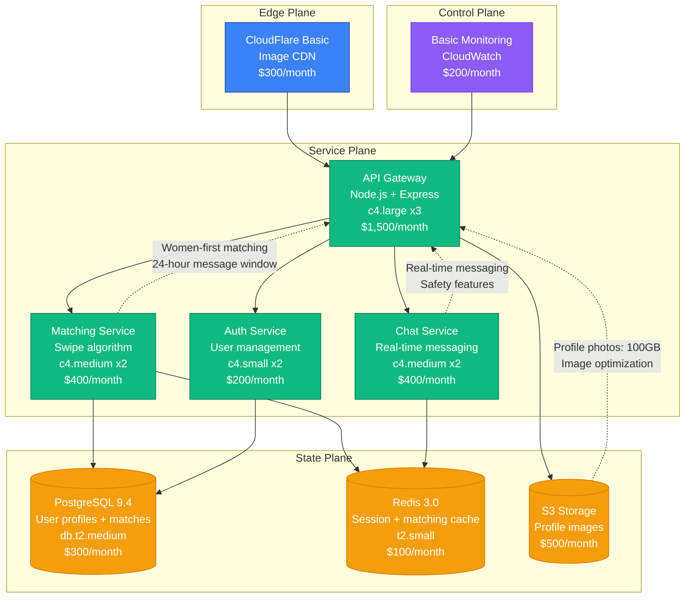
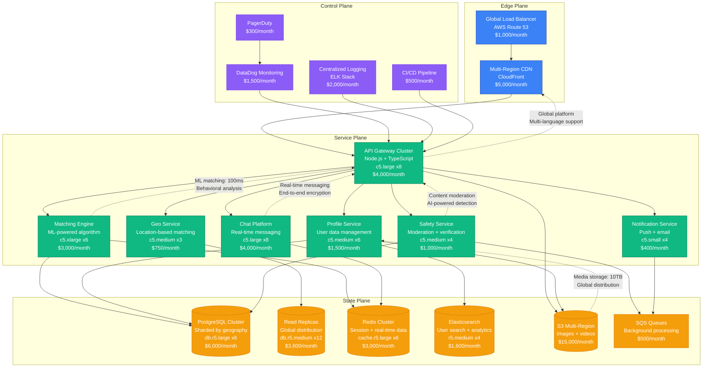
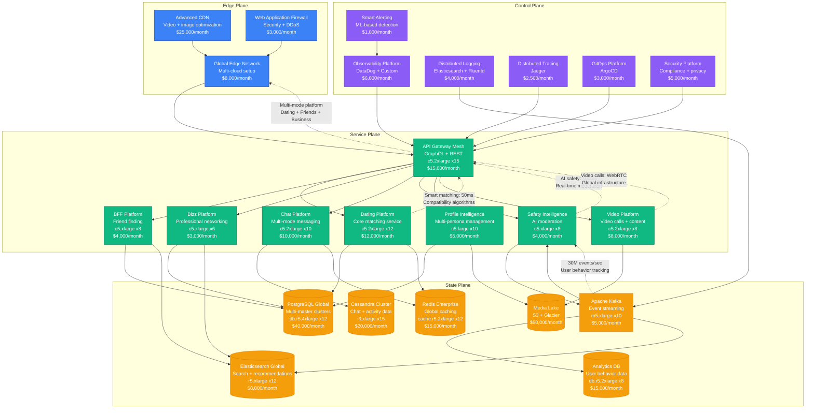

# Bumble Scale Evolution: From Startup to Dating App at Scale

## Executive Summary

Bumble's journey from a 2014 dating app startup to serving 100+ million users represents unique scaling challenges in social networking. The platform had to solve real-time matching algorithms, global user safety, and engagement optimization while maintaining user trust and authentic connections across diverse markets.

**Key Metrics Evolution:**
- **2014**: 10K users, women-first dating
- **2017**: 10M users, international expansion
- **2020**: 50M users, multi-mode platform
- **2022**: 75M users, AI-powered matching
- **2024**: 100M+ users, social ecosystem

## Architecture Evolution Timeline

### Phase 1: Women-First Dating Foundation (2014-2016) - Mobile-First Platform
**Scale: 10K-1M users**

**Key Characteristics:**
- **Architecture**: Mobile-first API with real-time messaging
- **Unique Value**: Women make the first move dating model
- **Safety Focus**: Built-in safety and verification features
- **Team Size**: 12 engineers
- **Infrastructure Cost**: $3,500/month
- **Major Innovation**: Gender-forward dating experience with safety focus

**What Broke:**
- Matching algorithm performance during viral growth
- Real-time chat scaling issues
- Image upload and processing bottlenecks

### Phase 2: International Expansion (2016-2019) - Global Social Platform
**Scale: 1M-20M users**

**Key Characteristics:**
- **Architecture**: Microservices with ML-powered matching
- **Global Expansion**: Multi-region deployment with localization
- **Safety Innovation**: Advanced content moderation and user verification
- **Team Size**: 80 engineers across 12 teams
- **Infrastructure Cost**: $53,250/month
- **Major Innovation**: AI-powered safety and global social platform

**What Broke:**
- Cross-region user matching latency
- Content moderation scaling issues
- Real-time chat performance in emerging markets

**How They Fixed It:**
- Regional matching clusters with global coordination
- Machine learning-based content moderation
- Edge caching for chat and profile data

### Phase 3: Multi-Mode Social Platform (2019-2022) - Beyond Dating
**Scale: 20M-75M users**

**Key Characteristics:**
- **Architecture**: Multi-mode platform with specialized services
- **Product Expansion**: Dating, friend-finding, and professional networking
- **AI Safety**: Advanced machine learning for content moderation
- **Team Size**: 300 engineers across 30 teams
- **Infrastructure Cost**: $249,500/month
- **Major Innovation**: Unified social platform with multiple interaction modes

**What Broke:**
- Cross-mode user data consistency issues
- Video call infrastructure scaling during pandemic
- AI safety model accuracy across different cultures

**How They Fixed It:**
- Event sourcing for cross-mode data consistency
- Global WebRTC infrastructure with edge optimization
- Culturally-aware AI models with regional training

### Phase 4: AI-Powered Social Ecosystem (2022-2024) - Intelligent Connections
**Scale: 75M-100M+ users**

```mermaid
graph TB
    subgraph "Edge Plane"
        GLB[Global Edge Network<br/>AI-optimized routing<br/>$25,000/month]
        CDN[Intelligent CDN<br/>Personalized content delivery<br/>$60,000/month]
        WAF[AI Security<br/>Real-time threat detection<br/>$12,000/month]
        EDGE[Edge AI<br/>Local inference<br/>$40,000/month]
        style GLB fill:#3B82F6,stroke:#1E40AF,color:#fff
        style CDN fill:#3B82F6,stroke:#1E40AF,color:#fff
        style WAF fill:#3B82F6,stroke:#1E40AF,color:#fff
        style EDGE fill:#3B82F6,stroke:#1E40AF,color:#fff
    end

    subgraph "Service Plane"
        API[API Gateway Fabric<br/>GraphQL + AI routing<br/>$50,000/month]
        AI_PLATFORM[AI Platform<br/>Multi-model inference<br/>$150,000/month]
        MATCHING[Matching Intelligence<br/>Deep learning algorithms<br/>$80,000/month]
        SOCIAL[Social Intelligence<br/>Multi-mode coordination<br/>$60,000/month]
        SAFETY[Safety Intelligence<br/>Real-time AI moderation<br/>$40,000/month]
        CHAT[Chat Intelligence<br/>Smart messaging<br/>$50,000/month]
        VIDEO[Video Intelligence<br/>AI-enhanced calls<br/>$45,000/month]
        INSIGHTS[User Insights<br/>Behavioral analytics<br/>$35,000/month]
        style API fill:#10B981,stroke:#047857,color:#fff
        style AI_PLATFORM fill:#10B981,stroke:#047857,color:#fff
        style MATCHING fill:#10B981,stroke:#047857,color:#fff
        style SOCIAL fill:#10B981,stroke:#047857,color:#fff
        style SAFETY fill:#10B981,stroke:#047857,color:#fff
        style CHAT fill:#10B981,stroke:#047857,color:#fff
        style VIDEO fill:#10B981,stroke:#047857,color:#fff
        style INSIGHTS fill:#10B981,stroke:#047857,color:#fff
    end

    subgraph "State Plane"
        PG_GLOBAL[(PostgreSQL Global<br/>Distributed SQL<br/>$200,000/month)]
        GRAPH[(Graph Database<br/>Social connections<br/>$80,000/month)]
        REDIS_FABRIC[(Redis Fabric<br/>Real-time state<br/>$100,000/month)]
        VECTOR_GLOBAL[(Vector Database<br/>User embeddings<br/>$120,000/month)]
        SEARCH_GLOBAL[(Search Global<br/>AI-powered discovery<br/>$60,000/month)]
        DL_PLATFORM[(Data Lake Platform<br/>ML + analytics<br/>$180,000/month)]
        KAFKA_FABRIC[Event Fabric<br/>Real-time streaming<br/>$80,000/month]
        TS_GLOBAL[(Time Series Global<br/>Behavior tracking<br/>$40,000/month)]
        style PG_GLOBAL fill:#F59E0B,stroke:#D97706,color:#fff
        style GRAPH fill:#F59E0B,stroke:#D97706,color:#fff
        style REDIS_FABRIC fill:#F59E0B,stroke:#D97706,color:#fff
        style VECTOR_GLOBAL fill:#F59E0B,stroke:#D97706,color:#fff
        style SEARCH_GLOBAL fill:#F59E0B,stroke:#D97706,color:#fff
        style DL_PLATFORM fill:#F59E0B,stroke:#D97706,color:#fff
        style KAFKA_FABRIC fill:#F59E0B,stroke:#D97706,color:#fff
        style TS_GLOBAL fill:#F59E0B,stroke:#D97706,color:#fff
    end

    subgraph "Control Plane"
        OBS[Observability AI<br/>Predictive monitoring<br/>$30,000/month]
        SEC[Security Intelligence<br/>Privacy + safety<br/>$25,000/month]
        DEPLOY[Deployment Intelligence<br/>AI-driven releases<br/>$18,000/month]
        CHAOS[Chaos Engineering<br/>Social resilience<br/>$12,000/month]
        COST[Cost Intelligence<br/>AI optimization<br/>$15,000/month]
        COMP[Compliance Engine<br/>Global privacy laws<br/>$22,000/month]
        style OBS fill:#8B5CF6,stroke:#7C3AED,color:#fff
        style SEC fill:#8B5CF6,stroke:#7C3AED,color:#fff
        style DEPLOY fill:#8B5CF6,stroke:#7C3AED,color:#fff
        style CHAOS fill:#8B5CF6,stroke:#7C3AED,color:#fff
        style COST fill:#8B5CF6,stroke:#7C3AED,color:#fff
        style COMP fill:#8B5CF6,stroke:#7C3AED,color:#fff
    end

    WAF --> GLB
    CDN --> GLB
    EDGE --> GLB
    GLB --> API

    API --> AI_PLATFORM
    API --> MATCHING
    API --> SOCIAL
    API --> SAFETY
    API --> CHAT
    API --> VIDEO
    API --> INSIGHTS

    AI_PLATFORM --> VECTOR_GLOBAL
    MATCHING --> GRAPH
    SOCIAL --> PG_GLOBAL
    SAFETY --> KAFKA_FABRIC
    CHAT --> REDIS_FABRIC
    VIDEO --> DL_PLATFORM
    INSIGHTS --> TS_GLOBAL

    KAFKA_FABRIC --> DL_PLATFORM
    KAFKA_FABRIC --> AI_PLATFORM

    OBS --> API
    SEC --> API
    DEPLOY --> API
    CHAOS --> API
    COST --> API
    COMP --> API

    %% Performance annotations
    API -.->|"AI-powered social platform<br/>100M+ global users"| GLB
    AI_PLATFORM -.->|"Smart recommendations: 25ms<br/>Deep learning inference"| API
    MATCHING -.->|"Compatibility analysis: 15ms<br/>Multi-dimensional matching"| API
    SAFETY -.->|"Real-time moderation: 10ms<br/>AI safety at scale"| API
    KAFKA_FABRIC -.->|"200M events/sec<br/>Real-time social intelligence"| AI_PLATFORM
```

**Key Characteristics:**
- **Architecture**: AI-native social platform with intelligent automation
- **AI Integration**: Deep learning for matching, safety, and user insights
- **Global Scale**: Supporting 100M+ users across diverse markets
- **Team Size**: 800+ engineers across 60+ teams
- **Infrastructure Cost**: $1,440,000/month
- **Major Innovation**: AI-powered social intelligence and safety at scale

**Current Challenges:**
- AI model bias and fairness across diverse populations
- Real-time safety moderation at massive scale
- Cross-cultural matching algorithm optimization
- Privacy compliance with AI-powered features

## Key Scaling Lessons

### Matching Algorithm Evolution
1. **Simple Proximity**: Basic location and age-based matching
2. **Behavioral Analysis**: Swipe patterns and engagement data
3. **Machine Learning**: Compatibility prediction models
4. **Deep Learning**: Multi-dimensional personality and preference matching
5. **AI Intelligence**: Real-time learning and adaptive algorithms

### Safety Platform Evolution
1. **Basic Reporting**: Manual user reporting and moderation
2. **Automated Filters**: Keyword and image filtering
3. **AI Moderation**: Machine learning content detection
4. **Real-Time Safety**: Live monitoring and intervention
5. **Predictive Safety**: AI-powered risk assessment and prevention

### Social Platform Evolution
1. **Dating Focus**: Single-mode dating application
2. **Friend Finding**: Addition of BFF friend-finding mode
3. **Professional Networking**: Bizz professional networking mode
4. **Unified Platform**: Integrated multi-mode social experience
5. **Social Ecosystem**: AI-powered social intelligence platform

### Infrastructure Costs by Phase
- **Phase 1**: $3,500/month → $0.0035 per user/month
- **Phase 2**: $53,250/month → $0.0027 per user/month
- **Phase 3**: $249,500/month → $0.0033 per user/month
- **Phase 4**: $1,440,000/month → $0.014 per user/month

### Team Structure Evolution
- **Phase 1**: Single mobile-focused team
- **Phase 2**: Platform teams (Matching, Chat, Safety)
- **Phase 3**: Product vertical teams for each mode
- **Phase 4**: AI-first organization with embedded ML teams

## Production Incidents and Resolutions

### The Valentine's Day Surge (2018)
**Problem**: Matching service overwhelmed during peak usage surge
**Impact**: 4 hours of degraded matching performance
**Root Cause**: Algorithm complexity scaling issues
**Solution**: Simplified matching with async enrichment
**Cost**: $2M in user experience impact

### Content Moderation Bypass (2020)
**Problem**: Coordinated attack bypassed AI safety systems
**Impact**: 2 hours of inappropriate content exposure
**Root Cause**: Adversarial examples fooled ML models
**Solution**: Multi-layer moderation with human oversight
**Cost**: $5M in trust and safety impact

### Cross-Mode Data Inconsistency (2022)
**Problem**: User profiles inconsistent across Dating/BFF/Bizz modes
**Impact**: 6 hours of profile synchronization issues
**Root Cause**: Event ordering issues in distributed system
**Solution**: Event sourcing with conflict resolution
**Cost**: $3M in user experience degradation

## Technology Stack Evolution

### Backend Evolution
- **2014-2016**: Node.js monolith with PostgreSQL
- **2016-2019**: Microservices with machine learning integration
- **2019-2022**: Multi-mode platform with specialized services
- **2022-2024**: AI-native platform with intelligent automation

### Data Platform Evolution
- **PostgreSQL**: Core user and relationship data
- **Redis**: Real-time state and session management
- **Cassandra**: High-volume chat and activity data
- **Elasticsearch**: User search and discovery
- **Graph Database**: Social connections and relationship mapping
- **Vector Database**: AI embeddings and similarity matching

## Critical Success Factors

1. **Women-First Innovation**: Unique positioning in dating market
2. **Safety Excellence**: Industry-leading safety and moderation
3. **AI-Powered Matching**: Advanced compatibility algorithms
4. **Multi-Mode Platform**: Unified social experience across contexts
5. **Global Localization**: Cultural adaptation for diverse markets
6. **Real-Time Intelligence**: AI-powered insights and automation

Bumble's evolution demonstrates how social platforms must balance user safety, intelligent matching, and authentic connections while scaling to serve diverse global communities with varying cultural norms and expectations.