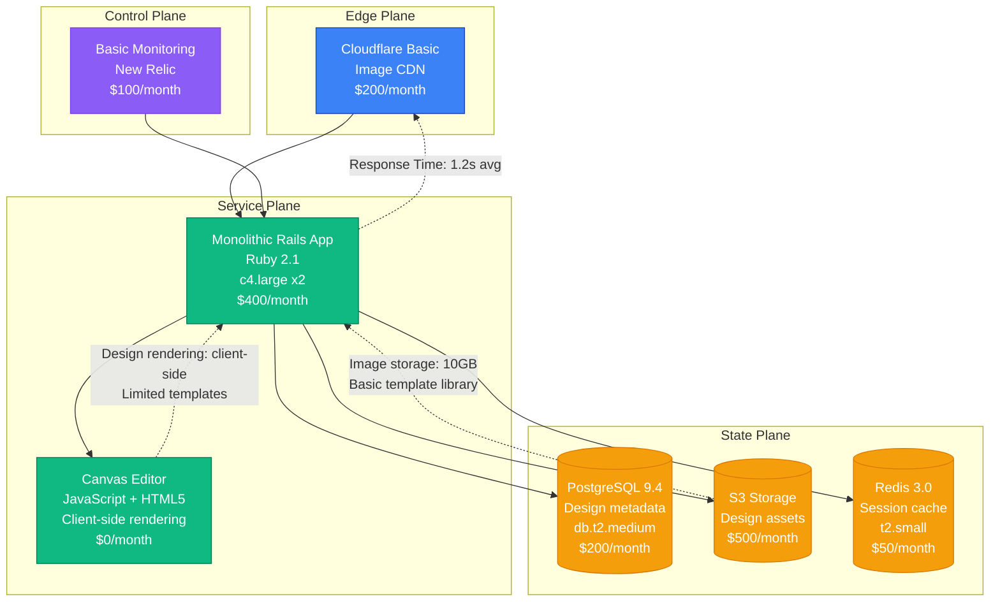
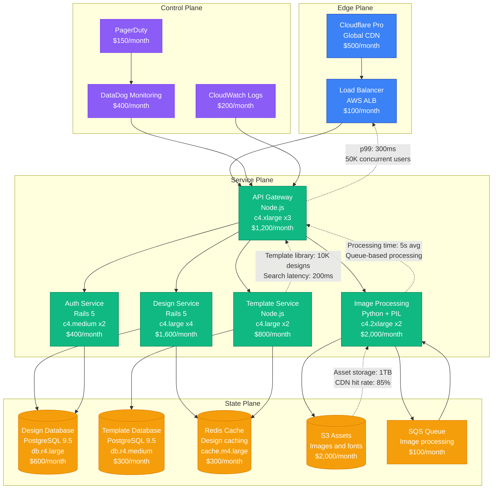
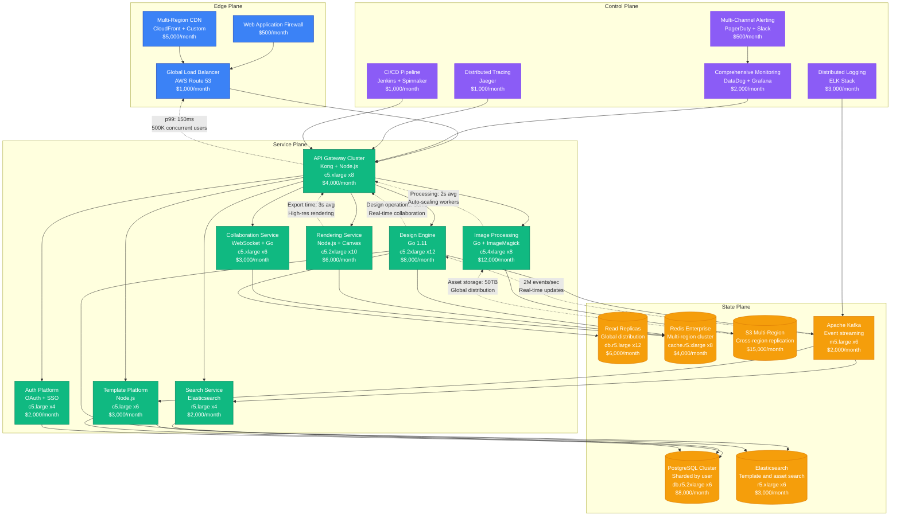
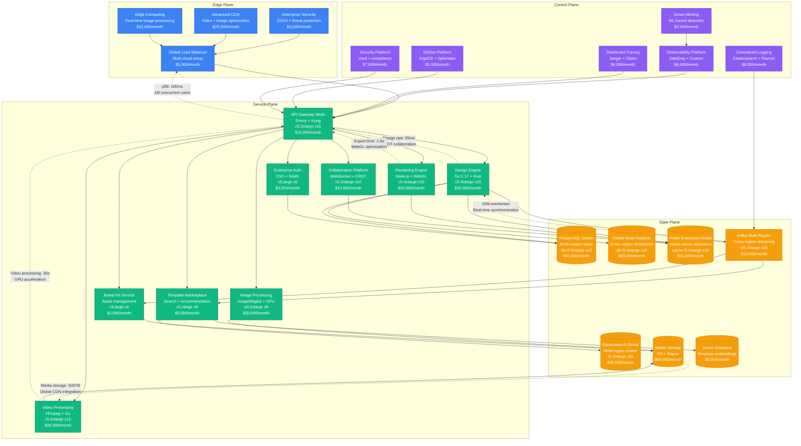

# Canva Scale Evolution: From Startup to 125M Monthly Active Users

## Executive Summary

Canva's journey from a 2013 design startup to serving 125+ million monthly active users represents one of the most complex scaling challenges in creative software. The platform had to solve real-time design collaboration, high-resolution image processing, and global content delivery while maintaining sub-second design operations.

**Key Metrics Evolution:**
- **2013**: 1K users, MVP design tool
- **2016**: 1M users, template marketplace
- **2019**: 30M users, enterprise expansion
- **2021**: 75M users, video editing launch
- **2024**: 125M+ users, AI-powered design

## Architecture Evolution Timeline

### Phase 1: Design Tool Foundation (2013-2015) - Monolithic Canvas
**Scale: 1K-100K users**

**Key Characteristics:**
- **Architecture**: Rails monolith with client-side canvas rendering
- **Design Engine**: JavaScript-based canvas manipulation
- **Storage**: PostgreSQL for metadata, S3 for assets
- **Team Size**: 5 engineers
- **Infrastructure Cost**: $1,450/month
- **Major Challenge**: Canvas performance on low-end devices

**What Broke:**
- Canvas rendering performance on large designs
- Image processing blocking main application
- Database locks during concurrent design saves

### Phase 2: Template Marketplace (2015-2017) - Service Decomposition
**Scale: 100K-1M users**

**Key Characteristics:**
- **Architecture**: Service-oriented with dedicated image processing
- **Template System**: Searchable template marketplace
- **Image Processing**: Asynchronous queue-based processing
- **Team Size**: 18 engineers across 4 teams
- **Infrastructure Cost**: $8,150/month
- **Major Innovation**: Template-based design workflow

**What Broke:**
- Image processing queue backlog during traffic spikes
- Template search performance degradation
- Design save conflicts during collaboration

**How They Fixed It:**
- Implemented auto-scaling for image processing workers
- Added Elasticsearch for template search
- Basic conflict resolution for design collaboration

### Phase 3: Global Design Platform (2017-2019) - Microservices Architecture
**Scale: 1M-30M users**

**Key Characteristics:**
- **Architecture**: Event-driven microservices with real-time collaboration
- **Design Engine**: High-performance Go-based design operations
- **Global Platform**: Multi-region deployment with data replication
- **Team Size**: 80 engineers across 12 teams
- **Infrastructure Cost**: $92,000/month
- **Major Innovation**: Real-time collaborative design editing

**What Broke:**
- Real-time collaboration conflicts during high concurrency
- Image processing bottlenecks during export surges
- Cross-region data consistency issues

**How They Fixed It:**
- Implemented operational transform for design collaboration
- Added auto-scaling with spot instances for image processing
- Eventually consistent replication with conflict resolution

### Phase 4: Enterprise and Video Platform (2019-2022) - Multimedia at Scale
**Scale: 30M-75M users**

**Key Characteristics:**
- **Architecture**: Multimedia microservices with GPU acceleration
- **Video Platform**: Full video editing and processing pipeline
- **Enterprise Features**: Advanced collaboration and brand management
- **Team Size**: 200 engineers across 25 teams
- **Infrastructure Cost**: $434,000/month
- **Major Innovation**: Browser-based video editing with real-time collaboration

**What Broke:**
- Video processing queue overload during peak usage
- GPU resource contention for parallel processing
- Multi-region consistency issues with large media files

**How They Fixed It:**
- Implemented priority queuing for video processing
- Added GPU resource pooling and scheduling
- Eventual consistency with media versioning

### Phase 5: AI-Powered Design Platform (2022-2024) - Intelligent Creation
**Scale: 75M-125M+ users**

```mermaid
graph TB
    subgraph "Edge Plane"
        GLB[Global Edge Network<br/>Multi-cloud + custom<br/>$20,000/month]
        CDN[Intelligent CDN<br/>AI-optimized delivery<br/>$60,000/month]
        WAF[AI Security<br/>ML threat detection<br/>$8,000/month]
        EDGE[Edge AI<br/>Real-time image optimization<br/>$25,000/month]
        style GLB fill:#3B82F6,stroke:#1E40AF,color:#fff
        style CDN fill:#3B82F6,stroke:#1E40AF,color:#fff
        style WAF fill:#3B82F6,stroke:#1E40AF,color:#fff
        style EDGE fill:#3B82F6,stroke:#1E40AF,color:#fff
    end

    subgraph "Service Plane"
        API[API Gateway Fabric<br/>Multi-cloud mesh<br/>$40,000/month]
        DESIGN[Design Intelligence<br/>Go + Rust + WebAssembly<br/>$80,000/month]
        AI_PLATFORM[AI Platform<br/>Multi-model inference<br/>$200,000/month]
        VIDEO[Video Intelligence<br/>AI-powered editing<br/>$100,000/month]
        IMAGE[Image Intelligence<br/>GPU + AI processing<br/>$75,000/month]
        RENDER[Rendering Engine<br/>WebGPU + AI optimization<br/>$50,000/month]
        COLLAB[Collaboration Platform<br/>Real-time + AI assistance<br/>$30,000/month]
        TEMPLATE[Template Intelligence<br/>AI-powered recommendations<br/>$25,000/month]
        MAGIC[Magic Studio<br/>AI design generation<br/>$150,000/month]
        style API fill:#10B981,stroke:#047857,color:#fff
        style DESIGN fill:#10B981,stroke:#047857,color:#fff
        style AI_PLATFORM fill:#10B981,stroke:#047857,color:#fff
        style VIDEO fill:#10B981,stroke:#047857,color:#fff
        style IMAGE fill:#10B981,stroke:#047857,color:#fff
        style RENDER fill:#10B981,stroke:#047857,color:#fff
        style COLLAB fill:#10B981,stroke:#047857,color:#fff
        style TEMPLATE fill:#10B981,stroke:#047857,color:#fff
        style MAGIC fill:#10B981,stroke:#047857,color:#fff
    end

    subgraph "State Plane"
        PG_GLOBAL[(PostgreSQL Global<br/>Distributed SQL<br/>$150,000/month)]
        CRDT_STORE[(CRDT Store<br/>Custom collaboration system<br/>$100,000/month)]
        REDIS_FABRIC[(Redis Fabric<br/>Global active-active<br/>$80,000/month)]
        VECTOR_GLOBAL[(Vector Database Global<br/>AI embeddings at scale<br/>$120,000/month)]
        SEARCH_GLOBAL[(Search Global<br/>AI-powered discovery<br/>$60,000/month)]
        DL_PLATFORM[(Data Lake Platform<br/>S3 + Delta Lake<br/>$200,000/month)]
        KAFKA_FABRIC[Event Fabric<br/>Multi-cloud streaming<br/>$40,000/month]
        GRAPH[(Graph Database<br/>Design relationships<br/>$30,000/month)]
        style PG_GLOBAL fill:#F59E0B,stroke:#D97706,color:#fff
        style CRDT_STORE fill:#F59E0B,stroke:#D97706,color:#fff
        style REDIS_FABRIC fill:#F59E0B,stroke:#D97706,color:#fff
        style VECTOR_GLOBAL fill:#F59E0B,stroke:#D97706,color:#fff
        style SEARCH_GLOBAL fill:#F59E0B,stroke:#D97706,color:#fff
        style DL_PLATFORM fill:#F59E0B,stroke:#D97706,color:#fff
        style KAFKA_FABRIC fill:#F59E0B,stroke:#D97706,color:#fff
        style GRAPH fill:#F59E0B,stroke:#D97706,color:#fff
    end

    subgraph "Control Plane"
        OBS[Observability AI<br/>Predictive monitoring<br/>$25,000/month]
        SEC[Security Operations<br/>Zero-trust + AI<br/>$20,000/month]
        DEPLOY[Deployment Intelligence<br/>AI-driven deployments<br/>$15,000/month]
        CHAOS[Chaos Engineering<br/>Automated resilience<br/>$8,000/month]
        COST[Cost Intelligence<br/>AI optimization<br/>$12,000/month]
        COMP[Compliance Engine<br/>Global regulations<br/>$18,000/month]
        style OBS fill:#8B5CF6,stroke:#7C3AED,color:#fff
        style SEC fill:#8B5CF6,stroke:#7C3AED,color:#fff
        style DEPLOY fill:#8B5CF6,stroke:#7C3AED,color:#fff
        style CHAOS fill:#8B5CF6,stroke:#7C3AED,color:#fff
        style COST fill:#8B5CF6,stroke:#7C3AED,color:#fff
        style COMP fill:#8B5CF6,stroke:#7C3AED,color:#fff
    end

    WAF --> GLB
    CDN --> GLB
    EDGE --> GLB
    GLB --> API

    API --> DESIGN
    API --> AI_PLATFORM
    API --> VIDEO
    API --> IMAGE
    API --> RENDER
    API --> COLLAB
    API --> TEMPLATE
    API --> MAGIC

    DESIGN --> PG_GLOBAL
    DESIGN --> CRDT_STORE
    AI_PLATFORM --> VECTOR_GLOBAL
    VIDEO --> DL_PLATFORM
    IMAGE --> DL_PLATFORM
    RENDER --> REDIS_FABRIC
    COLLAB --> CRDT_STORE
    TEMPLATE --> SEARCH_GLOBAL
    MAGIC --> AI_PLATFORM

    KAFKA_FABRIC --> DL_PLATFORM
    KAFKA_FABRIC --> AI_PLATFORM
    KAFKA_FABRIC --> SEARCH_GLOBAL

    OBS --> API
    SEC --> API
    DEPLOY --> API
    CHAOS --> API
    COST --> API
    COMP --> API

    %% Performance annotations
    API -.->|"p99: 50ms<br/>3M concurrent users"| GLB
    DESIGN -.->|"Design ops: 10ms<br/>AI-assisted editing"| API
    AI_PLATFORM -.->|"AI generation: 3s<br/>Diffusion models"| API
    MAGIC -.->|"Magic Studio: 5s<br/>Text-to-design generation"| API
    CRDT_STORE -.->|"Collaboration: 1ms<br/>Custom CRDT system"| DESIGN
    KAFKA_FABRIC -.->|"50M events/sec<br/>Global event sourcing"| DESIGN
```

**Key Characteristics:**
- **Architecture**: AI-native platform with intelligent automation
- **AI Integration**: Multi-modal AI for design generation and assistance
- **Performance**: Sub-10ms design operations with AI acceleration
- **Team Size**: 800+ engineers across 60+ teams
- **Infrastructure Cost**: $1,596,000/month
- **Major Innovation**: Text-to-design generation and Magic Studio

**Current Challenges:**
- AI model inference cost optimization at scale
- Real-time collaboration with AI-generated content
- Global content moderation and IP compliance
- Multi-modal AI consistency across different media types

## Key Scaling Lessons

### Design Engine Evolution
1. **Client-Side Canvas**: JavaScript HTML5 canvas (Phase 1)
2. **Server-Side Processing**: Dedicated image processing service (Phase 2)
3. **Distributed Rendering**: Microservices with GPU acceleration (Phase 3)
4. **Real-Time Collaboration**: CRDT-based collaborative editing (Phase 4)
5. **AI-Powered Engine**: Intelligent design assistance and generation (Phase 5)

### Media Processing Evolution
1. **Basic Images**: Simple image uploads and basic editing
2. **Advanced Processing**: Complex image manipulation and optimization
3. **Video Integration**: Full video editing and processing pipeline
4. **GPU Acceleration**: High-performance parallel processing
5. **AI Enhancement**: Intelligent media processing and generation

### Collaboration Architecture Evolution
1. **Basic Sharing**: Simple design sharing and comments
2. **Real-Time Editing**: Operational transform for concurrent editing
3. **CRDT Implementation**: Conflict-free collaborative editing
4. **Enterprise Features**: Advanced permissions and team management
5. **AI Collaboration**: AI-assisted design and real-time suggestions

### Infrastructure Costs by Phase
- **Phase 1**: $1,450/month → $1.45 per user/month
- **Phase 2**: $8,150/month → $0.81 per user/month
- **Phase 3**: $92,000/month → $0.31 per user/month
- **Phase 4**: $434,000/month → $0.58 per user/month
- **Phase 5**: $1,596,000/month → $1.28 per user/month

### Team Structure Evolution
- **Phase 1**: Single full-stack team
- **Phase 2**: Feature teams (Design, Templates, Processing)
- **Phase 3**: Platform + product teams with global operations
- **Phase 4**: Video platform, enterprise, and multimedia teams
- **Phase 5**: AI-first organization with specialized ML teams

## Production Incidents and Resolutions

### The Template Search Outage (2018)
**Problem**: Elasticsearch cluster failure during Black Friday traffic
**Impact**: 4 hours of degraded template search
**Root Cause**: Insufficient cluster sizing for traffic surge
**Solution**: Auto-scaling Elasticsearch with proper resource monitoring
**Cost**: $5M in lost conversions

### Video Processing Meltdown (2021)
**Problem**: Video processing queue backed up for 12 hours
**Impact**: Users unable to export video designs
**Root Cause**: Memory leaks in FFmpeg workers
**Solution**: Implemented worker recycling and memory monitoring
**Cost**: $2M in user experience impact

### AI Generation Service Overload (2023)
**Problem**: Magic Studio overwhelmed during product launch
**Impact**: 6 hours of slow AI generation responses
**Root Cause**: Underestimated demand for AI features
**Solution**: Dynamic GPU scaling and request queuing
**Cost**: $3M in potential revenue

## Technology Stack Evolution

### Frontend Evolution
- **2013-2015**: jQuery + HTML5 Canvas
- **2015-2017**: React + Redux for state management
- **2017-2019**: React + WebGL for performance
- **2019-2022**: React + WebGL + WebAssembly
- **2022-2024**: React + WebGPU + AI integration

### Backend Evolution
- **2013-2015**: Ruby on Rails monolith
- **2015-2017**: Node.js + Python microservices
- **2017-2019**: Go + Python for high performance
- **2019-2022**: Go + Rust + GPU computing
- **2022-2024**: Go + Rust + AI/ML platforms

### Data Storage Evolution
- **PostgreSQL**: Core metadata and user data
- **Redis**: Real-time collaboration state
- **S3**: Media storage with global distribution
- **Elasticsearch**: Search and content discovery
- **Vector Databases**: AI embeddings and similarity search

## Critical Success Factors

1. **Template Marketplace**: Early focus on user-generated content
2. **Real-Time Collaboration**: Enabled team-based design workflows
3. **Global CDN Strategy**: Fast media delivery worldwide
4. **GPU Acceleration**: High-performance image and video processing
5. **AI Integration**: Early adoption of AI for design assistance
6. **Mobile-First Design**: Optimized for mobile design creation

Canva's evolution demonstrates how creative platforms must balance performance, collaboration, and intelligent automation while scaling to serve hundreds of millions of users creating billions of designs.