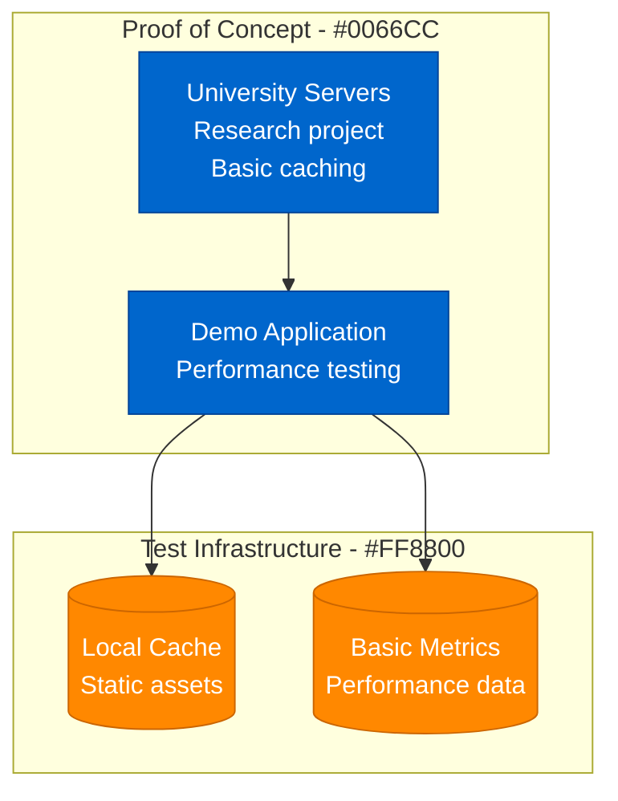
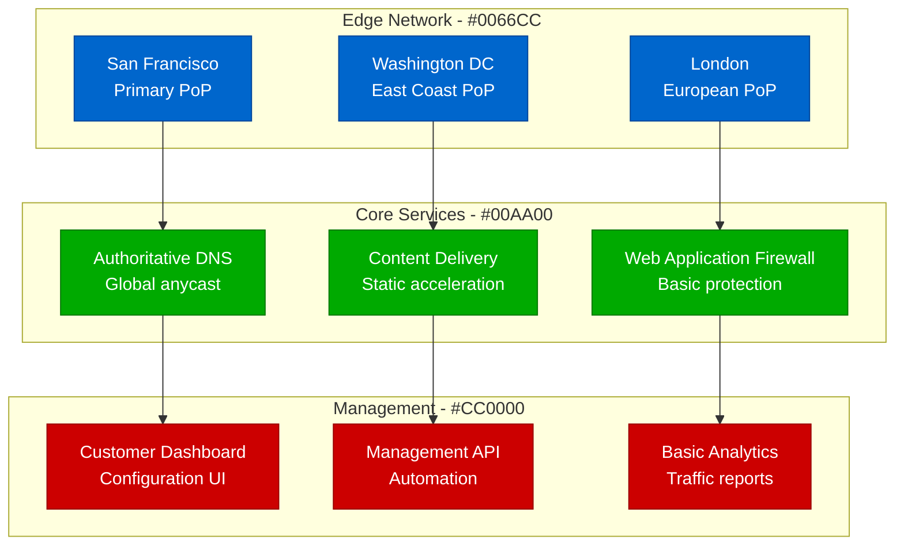
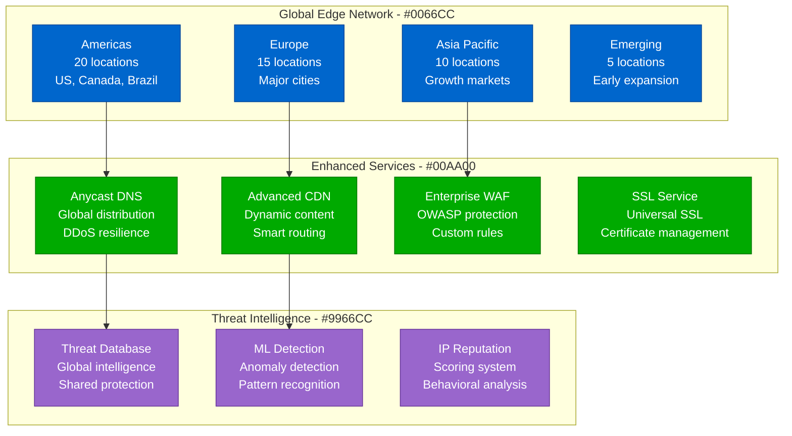
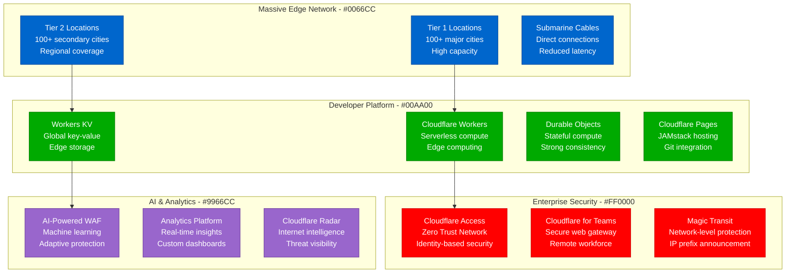

# Cloudflare Scale Evolution: Startup to 20% of Internet

## Executive Summary

Cloudflare's scaling journey from a startup idea to serving 20% of all internet traffic represents one of the most impressive infrastructure scaling achievements. The platform evolved from a simple CDN to a comprehensive edge computing platform protecting and accelerating millions of websites globally.

**Key Scaling Metrics:**
- **Websites Served**: 100 → 30,000,000+ (300,000x growth)
- **Internet Traffic**: 0.1% → 20%+ of global traffic
- **Data Centers**: 1 → 320+ locations in 120+ countries
- **Daily Requests**: 1M → 57,000,000,000+ (57,000x growth)
- **Attack Requests Blocked**: 0 → 140,000,000,000+/day
- **Engineering Team**: 3 → 4,000+ engineers
- **Infrastructure**: $10K/month → $2B+/year

## Phase 1: University Project (2009-2010)
**Scale: Local CDN proof-of-concept**

### Key Innovation
- **Project Honey Pot** integration for threat intelligence
- **Performance optimization** through intelligent caching
- **Security filtering** at the edge

## Phase 2: Startup Launch (2010-2012)
**Scale: 1K-10K websites, 3 data centers**

### Key Metrics
| Metric | Value | Source |
|--------|-------|--------|
| Websites | 1K-10K | Platform metrics |
| Data Centers | 3 | Infrastructure |
| Daily Requests | 1M-100M | Traffic logs |
| Geographic Reach | 3 regions | Network presence |
| Monthly Cost | $10K-100K | Infrastructure spend |

## Phase 3: Global Expansion (2012-2016)
**Scale: 10K-1M websites, 50+ data centers**

### Major Milestones
1. **Universal SSL** launch - Free SSL for all
2. **DDoS protection** included by default
3. **IPv6 support** across network
4. **Performance insights** for customers

## Phase 4: Platform Evolution (2016-2020)
**Scale: 1M-10M websites, 200+ data centers**

### Platform Transformation
1. **Edge computing** with Cloudflare Workers
2. **Zero Trust security** for enterprises
3. **Developer tools** and APIs
4. **AI-powered protection** systems

## Phase 5: Internet Infrastructure (2020-Present)
**Scale: 10M+ websites, 320+ data centers, 20% of internet**

### Current Global Infrastructure
- **320+ data centers** in 120+ countries
- **57 billion requests** per day
- **140+ billion threats** blocked daily
- **Sub-10ms latency** to 95% of internet users
- **100+ Tbps** network capacity

## Cost Evolution

| Phase | Period | Monthly Cost | Cost per Website | Primary Drivers |
|-------|--------|--------------|-----------------|----------------|
| PoC | 2009-2010 | $1K | N/A | University resources |
| Startup | 2010-2012 | $10K-100K | $10 | Basic infrastructure |
| Global | 2012-2016 | $100K-10M | $5 | Network expansion |
| Platform | 2016-2020 | $10M-100M | $20 | Edge computing |
| Infrastructure | 2020-Present | $100M-200M+ | $15 | AI and security |

## Technology Evolution

| Component | 2010 | 2012 | 2016 | 2020 | 2024 |
|-----------|------|------|------|------|------|
| Edge Locations | 1 | 3 | 50+ | 200+ | 320+ |
| Compute Model | Static cache | CDN | Smart cache | Serverless | AI-powered |
| Security | Basic WAF | Enhanced WAF | ML detection | Zero Trust | AI security |
| Developer Tools | None | API | Workers | Full platform | AI-assisted |
| Network | Single region | Multi-region | Global anycast | Submarine cables | Quantum-ready |

## Key Lessons Learned

### Technical Lessons
1. **Edge computing changes everything** - Moving compute to users transforms performance
2. **Global anycast simplifies complexity** - Single IP for global service
3. **Security must be built-in** - Retrofitting security doesn't work at scale
4. **Developer experience drives adoption** - Easy onboarding creates network effects
5. **AI enables new capabilities** - Machine learning transforms threat detection

### Business Lessons
1. **Free tier builds network effects** - Free customers become powerful distribution
2. **Platform strategy creates moats** - Developers build on top of infrastructure
3. **Global reach requires local presence** - Physical proximity matters for performance
4. **Enterprise features fund innovation** - Premium customers subsidize R&D
5. **Threat intelligence has network effects** - More customers improve protection

### Operational Lessons
1. **Automation is essential at scale** - Manual operations don't scale globally
2. **Observability drives optimization** - You can't improve what you can't measure
3. **Incident response needs global coordination** - Sun never sets on operations
4. **Security threats constantly evolve** - Static defenses become obsolete
5. **Performance expectations keep rising** - Users expect instant responses

## Current Scale Metrics (2024)

| Metric | Value | Source |
|--------|-------|--------|
| Websites Served | 30M+ | Platform metrics |
| Internet Traffic | 20%+ | Network analysis |
| Daily Requests | 57B+ | Traffic logs |
| Data Centers | 320+ | Infrastructure |
| Countries | 120+ | Global presence |
| Threat Requests Blocked | 140B+/day | Security metrics |
| Network Capacity | 100+ Tbps | Infrastructure capacity |
| Employees | 4,000+ | Company reports |
| Revenue | $1.3B+/year | Financial reports |

---

*Cloudflare's evolution from university project to critical internet infrastructure demonstrates how edge computing and global network effects can create platforms that fundamentally change how the internet works, providing security, performance, and reliability at unprecedented scale.*