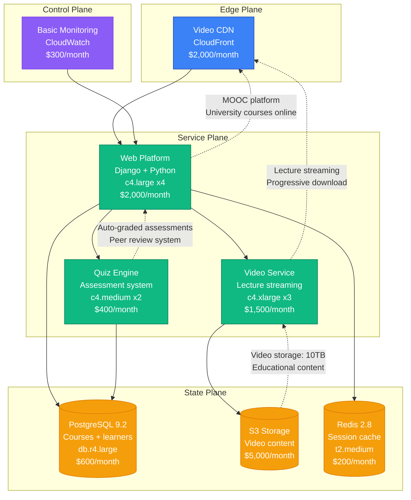
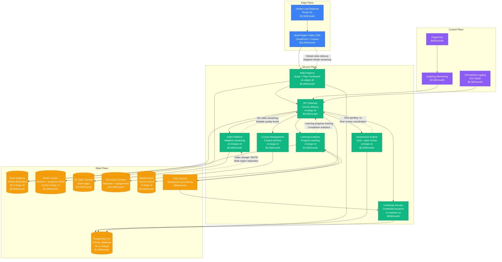

# Coursera Scale Evolution: From Startup to Global Education Platform

## Executive Summary

Coursera's journey from a 2012 online education startup to serving 100+ million learners represents unique scaling challenges in educational technology. The platform had to solve video streaming at scale, course delivery, and learner assessment while maintaining educational quality across diverse global audiences.

**Key Metrics Evolution:**
- **2012**: 100K learners, Stanford/Princeton courses
- **2015**: 15M learners, university partnerships
- **2018**: 45M learners, degree programs
- **2021**: 75M learners, pandemic surge
- **2024**: 100M+ learners, AI-powered education

## Architecture Evolution Timeline

### Phase 1: MOOC Platform Foundation (2012-2014) - Educational Video Streaming
**Scale: 100K-5M learners**



**Key Characteristics:**
- **Architecture**: Django monolith with video streaming
- **Educational Focus**: University-quality courses with certificates
- **Assessment Innovation**: Auto-graded quizzes and peer review
- **Team Size**: 20 engineers
- **Infrastructure Cost**: $11,000/month
- **Major Innovation**: Free university-level education at scale

**What Broke:**
- Video streaming performance during course launches
- Database locks during peak enrollment periods
- Quiz system failures during assessment deadlines

### Phase 2: Global University Platform (2014-2017) - Institutional Partnerships
**Scale: 5M-25M learners**



**Key Characteristics:**
- **Architecture**: Microservices with global video delivery
- **University Partnerships**: Courses from top universities worldwide
- **Certificate System**: Verified certificates and specializations
- **Team Size**: 80 engineers across 12 teams
- **Infrastructure Cost**: $96,300/month
- **Major Innovation**: University partnership model with verified credentials

**What Broke:**
- Video streaming performance in emerging markets
- Assessment system overload during course deadlines
- Search performance with expanding course catalog

**How They Fixed It:**
- Regional CDN optimization with local caching
- Queue-based assessment processing
- Elasticsearch scaling and optimization

### Phase 3: Degree Program Platform (2017-2020) - Higher Education Integration
**Scale: 25M-60M learners**

```mermaid
graph TB
    subgraph "Edge Plane"
        GLB[Global Load Balancer<br/>Multi-cloud setup<br/>$8,000/month]
        CDN[Advanced Video CDN<br/>Custom + CloudFront<br/>$80,000/month]
        WAF[Web Application Firewall<br/>$3,000/month]
        style GLB fill:#3B82F6,stroke:#1E40AF,color:#fff
        style CDN fill:#3B82F6,stroke:#1E40AF,color:#fff
        style WAF fill:#3B82F6,stroke:#1E40AF,color:#fff
    end

    subgraph "Service Plane"
        WEB[Web Platform<br/>React + Scala backend<br/>c5.xlarge x15<br/>$7,500/month]
        API[API Gateway Cluster<br/>GraphQL + REST<br/>c5.large x12<br/>$6,000/month]
        VIDEO[Video Intelligence<br/>Interactive content<br/>c5.2xlarge x12<br/>$12,000/month]
        DEGREE[Degree Platform<br/>Academic programs<br/>c5.xlarge x8<br/>$4,000/month]
        ASSESSMENT[Assessment Platform<br/>Proctored exams<br/>c5.large x10<br/>$5,000/month]
        LEARNING[Learning Engine<br/>Adaptive learning<br/>c5.xlarge x6<br/>$3,000/month]
        ANALYTICS[Analytics Platform<br/>Learning insights<br/>c5.large x8<br/>$4,000/month]
        COLLAB[Collaboration Tools<br/>Discussion forums<br/>c5.medium x6<br/>$1,500/month]
        style WEB fill:#10B981,stroke:#047857,color:#fff
        style API fill:#10B981,stroke:#047857,color:#fff
        style VIDEO fill:#10B981,stroke:#047857,color:#fff
        style DEGREE fill:#10B981,stroke:#047857,color:#fff
        style ASSESSMENT fill:#10B981,stroke:#047857,color:#fff
        style LEARNING fill:#10B981,stroke:#047857,color:#fff
        style ANALYTICS fill:#10B981,stroke:#047857,color:#fff
        style COLLAB fill:#10B981,stroke:#047857,color:#fff
    end

    subgraph "State Plane"
        PG_CLUSTER[(PostgreSQL Cluster<br/>Sharded by institution<br/>db.r5.4xlarge x10<br/>$40,000/month)]
        PG_ANALYTICS[(Analytics DB<br/>Learning data<br/>db.r5.2xlarge x8<br/>$20,000/month)]
        REDIS_GLOBAL[(Redis Enterprise<br/>Global caching<br/>cache.r5.2xlarge x12<br/>$15,000/month)]
        CASSANDRA[(Cassandra Cluster<br/>Video progress tracking<br/>i3.xlarge x15<br/>$20,000/month)]
        ES_GLOBAL[(Elasticsearch Global<br/>Content search<br/>r5.xlarge x12<br/>$10,000/month)]
        S3_GLOBAL[(S3 Multi-Region<br/>Video + course content<br/>$150,000/month)]
        KAFKA[Apache Kafka<br/>Learning event streaming<br/>m5.xlarge x10<br/>$5,000/month]
        DW[(Data Warehouse<br/>Snowflake<br/>$15,000/month)]
        style PG_CLUSTER fill:#F59E0B,stroke:#D97706,color:#fff
        style PG_ANALYTICS fill:#F59E0B,stroke:#D97706,color:#fff
        style REDIS_GLOBAL fill:#F59E0B,stroke:#D97706,color:#fff
        style CASSANDRA fill:#F59E0B,stroke:#D97706,color:#fff
        style ES_GLOBAL fill:#F59E0B,stroke:#D97706,color:#fff
        style S3_GLOBAL fill:#F59E0B,stroke:#D97706,color:#fff
        style KAFKA fill:#F59E0B,stroke:#D97706,color:#fff
        style DW fill:#F59E0B,stroke:#D97706,color:#fff
    end

    subgraph "Control Plane"
        MON[Observability Platform<br/>DataDog + Custom<br/>$8,000/month]
        LOG[Distributed Logging<br/>Elasticsearch + Fluentd<br/>$6,000/month]
        TRACE[Distributed Tracing<br/>Jaeger<br/>$3,000/month]
        ALERT[Smart Alerting<br/>ML-based detection<br/>$1,500/month]
        DEPLOY[CI/CD Platform<br/>Spinnaker<br/>$4,000/month]
        SEC[Security Platform<br/>Academic integrity<br/>$5,000/month]
        style MON fill:#8B5CF6,stroke:#7C3AED,color:#fff
        style LOG fill:#8B5CF6,stroke:#7C3AED,color:#fff
        style TRACE fill:#8B5CF6,stroke:#7C3AED,color:#fff
        style ALERT fill:#8B5CF6,stroke:#7C3AED,color:#fff
        style DEPLOY fill:#8B5CF6,stroke:#7C3AED,color:#fff
        style SEC fill:#8B5CF6,stroke:#7C3AED,color:#fff
    end

    WAF --> GLB
    CDN --> GLB
    GLB --> WEB
    GLB --> API

    WEB --> VIDEO
    API --> DEGREE
    API --> ASSESSMENT
    API --> LEARNING
    API --> ANALYTICS
    API --> COLLAB

    VIDEO --> CASSANDRA
    VIDEO --> S3_GLOBAL
    DEGREE --> PG_CLUSTER
    ASSESSMENT --> PG_CLUSTER
    LEARNING --> PG_CLUSTER
    ANALYTICS --> PG_ANALYTICS
    COLLAB --> PG_CLUSTER

    WEB --> REDIS_GLOBAL
    API --> ES_GLOBAL

    ANALYTICS --> KAFKA
    LEARNING --> KAFKA

    KAFKA --> DW
    KAFKA --> ES_GLOBAL

    MON --> API
    LOG --> KAFKA
    TRACE --> API
    ALERT --> MON
    DEPLOY --> API
    SEC --> API

    %% Performance annotations\n    API -.->|\"Degree platform<br/>Academic rigor at scale\"| GLB\n    VIDEO -.->|\"Interactive video: 100ms<br/>Quiz integration\"| API\n    ASSESSMENT -.->|\"Proctored exams<br/>Academic integrity\"| API\n    LEARNING -.->|\"Adaptive learning: 50ms<br/>Personalized paths\"| API\n    KAFKA -.->|\"30M events/sec<br/>Learning behavior tracking\"| ANALYTICS\n```\n\n**Key Characteristics:**\n- **Architecture**: Event-driven platform with degree programs\n- **Academic Integration**: Full degree programs with university partnerships\n- **Proctored Assessments**: Secure online exam platform\n- **Team Size**: 300 engineers across 30 teams\n- **Infrastructure Cost**: $436,000/month\n- **Major Innovation**: Accredited online degree programs at scale\n\n**What Broke:**\n- Proctored exam system failures during finals week\n- Video streaming performance during pandemic surge\n- Learning analytics processing delays\n\n**How They Fixed It:**\n- Distributed proctoring with redundancy\n- CDN capacity scaling and optimization\n- Real-time analytics pipeline\n\n### Phase 4: AI-Powered Learning Platform (2020-2024) - Intelligent Education\n**Scale: 60M-100M+ learners**\n\n```mermaid\ngraph TB\n    subgraph \"Edge Plane\"\n        GLB[Global Edge Network<br/>Multi-cloud optimization<br/>$25,000/month]\n        CDN[Intelligent Video CDN<br/>AI-optimized delivery<br/>$200,000/month]\n        WAF[AI Security<br/>Academic integrity<br/>$12,000/month]\n        EDGE[Edge Computing<br/>Local content processing<br/>$40,000/month]\n        style GLB fill:#3B82F6,stroke:#1E40AF,color:#fff\n        style CDN fill:#3B82F6,stroke:#1E40AF,color:#fff\n        style WAF fill:#3B82F6,stroke:#1E40AF,color:#fff\n        style EDGE fill:#3B82F6,stroke:#1E40AF,color:#fff\n    end\n\n    subgraph \"Service Plane\"\n        WEB[Omnichannel Platform<br/>Web + Mobile + API<br/>$60,000/month]\n        AI_PLATFORM[AI Platform<br/>Educational intelligence<br/>$200,000/month]\n        LEARNING[Learning Intelligence<br/>Adaptive personalization<br/>$120,000/month]\n        VIDEO[Video Intelligence<br/>Interactive content<br/>$100,000/month]\n        ASSESSMENT[Assessment Intelligence<br/>AI-powered evaluation<br/>$80,000/month]\n        DEGREE[Degree Platform<br/>Academic program management<br/>$70,000/month]\n        CAREER[Career Services<br/>Job placement platform<br/>$50,000/month]\n        CONTENT[Content Intelligence<br/>AI course creation<br/>$90,000/month]\n        style WEB fill:#10B981,stroke:#047857,color:#fff\n        style AI_PLATFORM fill:#10B981,stroke:#047857,color:#fff\n        style LEARNING fill:#10B981,stroke:#047857,color:#fff\n        style VIDEO fill:#10B981,stroke:#047857,color:#fff\n        style ASSESSMENT fill:#10B981,stroke:#047857,color:#fff\n        style DEGREE fill:#10B981,stroke:#047857,color:#fff\n        style CAREER fill:#10B981,stroke:#047857,color:#fff\n        style CONTENT fill:#10B981,stroke:#047857,color:#fff\n    end\n\n    subgraph \"State Plane\"\n        PG_GLOBAL[(PostgreSQL Global<br/>Distributed academic data<br/>$250,000/month)]\n        LEARNING_DB[(Learning Database<br/>Specialized storage<br/>$180,000/month)]\n        REDIS_FABRIC[(Redis Fabric<br/>Real-time learning state<br/>$120,000/month)]\n        VECTOR_GLOBAL[(Vector Database<br/>Content embeddings<br/>$150,000/month)]\n        SEARCH_GLOBAL[(Search Global<br/>AI-powered course discovery<br/>$80,000/month)]\n        DL_PLATFORM[(Data Lake Platform<br/>Learning analytics + ML<br/>$300,000/month)]\n        KAFKA_FABRIC[Event Fabric<br/>Learning event streaming<br/>$100,000/month]\n        GRAPH[(Graph Database<br/>Learning pathways<br/>$60,000/month)]\n        style PG_GLOBAL fill:#F59E0B,stroke:#D97706,color:#fff\n        style LEARNING_DB fill:#F59E0B,stroke:#D97706,color:#fff\n        style REDIS_FABRIC fill:#F59E0B,stroke:#D97706,color:#fff\n        style VECTOR_GLOBAL fill:#F59E0B,stroke:#D97706,color:#fff\n        style SEARCH_GLOBAL fill:#F59E0B,stroke:#D97706,color:#fff\n        style DL_PLATFORM fill:#F59E0B,stroke:#D97706,color:#fff\n        style KAFKA_FABRIC fill:#F59E0B,stroke:#D97706,color:#fff\n        style GRAPH fill:#F59E0B,stroke:#D97706,color:#fff\n    end\n\n    subgraph \"Control Plane\"\n        OBS[Observability AI<br/>Predictive monitoring<br/>$30,000/month]\n        SEC[Security Intelligence<br/>Academic integrity<br/>$25,000/month]\n        DEPLOY[Deployment Intelligence<br/>AI-driven releases<br/>$18,000/month]\n        CHAOS[Chaos Engineering<br/>Educational resilience<br/>$12,000/month]\n        COST[Cost Intelligence<br/>Learning optimization<br/>$15,000/month]\n        COMP[Compliance Engine<br/>Academic standards<br/>$25,000/month]\n        style OBS fill:#8B5CF6,stroke:#7C3AED,color:#fff\n        style SEC fill:#8B5CF6,stroke:#7C3AED,color:#fff\n        style DEPLOY fill:#8B5CF6,stroke:#7C3AED,color:#fff\n        style CHAOS fill:#8B5CF6,stroke:#7C3AED,color:#fff\n        style COST fill:#8B5CF6,stroke:#7C3AED,color:#fff\n        style COMP fill:#8B5CF6,stroke:#7C3AED,color:#fff\n    end\n\n    WAF --> GLB\n    CDN --> GLB\n    EDGE --> GLB\n    GLB --> WEB\n\n    WEB --> AI_PLATFORM\n    WEB --> LEARNING\n    WEB --> VIDEO\n    WEB --> ASSESSMENT\n    WEB --> DEGREE\n    WEB --> CAREER\n    WEB --> CONTENT\n\n    AI_PLATFORM --> VECTOR_GLOBAL\n    LEARNING --> LEARNING_DB\n    VIDEO --> DL_PLATFORM\n    ASSESSMENT --> PG_GLOBAL\n    DEGREE --> PG_GLOBAL\n    CAREER --> GRAPH\n    CONTENT --> VECTOR_GLOBAL\n\n    KAFKA_FABRIC --> DL_PLATFORM\n    KAFKA_FABRIC --> AI_PLATFORM\n\n    OBS --> WEB\n    SEC --> WEB\n    DEPLOY --> WEB\n    CHAOS --> WEB\n    COST --> WEB\n    COMP --> WEB\n\n    %% Performance annotations\n    WEB -.->|\"AI-powered education platform<br/>100M+ global learners\"| GLB\n    AI_PLATFORM -.->|\"Learning intelligence: 50ms<br/>Personalized recommendations\"| WEB\n    LEARNING -.->|\"Adaptive learning: 25ms<br/>Real-time path adjustment\"| WEB\n    ASSESSMENT -.->|\"AI assessment: 100ms<br/>Intelligent evaluation\"| WEB\n    KAFKA_FABRIC -.->|\"200M events/sec<br/>Learning behavior analytics\"| AI_PLATFORM\n```\n\n**Key Characteristics:**\n- **Architecture**: AI-native educational platform with intelligent personalization\n- **AI Integration**: Adaptive learning, intelligent assessment, and content generation\n- **Career Integration**: Job placement and skill development pathways\n- **Team Size**: 1,000+ engineers across 80+ teams\n- **Infrastructure Cost**: $2,102,000/month\n- **Major Innovation**: AI-powered personalized education at global scale\n\n**Current Challenges:**\n- AI model inference cost optimization for educational content\n- Maintaining academic integrity with AI-assisted learning\n- Global accessibility and digital divide considerations\n- Balancing automation with human educational expertise\n\n## Key Scaling Lessons\n\n### Educational Platform Evolution\n1. **MOOC Foundation**: Massive open online courses with video lectures\n2. **University Partnerships**: Accredited courses from top institutions\n3. **Degree Programs**: Full academic programs with university credentials\n4. **Career Integration**: Job placement and professional skill development\n5. **AI-Powered Learning**: Personalized adaptive education with intelligence\n\n### Video Delivery Evolution\n1. **Basic Streaming**: Progressive download video delivery\n2. **Adaptive Streaming**: Multiple quality levels and bitrate adaptation\n3. **Interactive Video**: Quiz integration and engagement features\n4. **Global Optimization**: Regional CDN with edge caching\n5. **AI Enhancement**: Intelligent video processing and optimization\n\n### Assessment System Evolution\n1. **Auto-Graded Quizzes**: Basic multiple choice and programming assignments\n2. **Peer Review**: Community-based assignment evaluation\n3. **Proctored Exams**: Secure online examination with monitoring\n4. **Adaptive Assessment**: Dynamic difficulty adjustment\n5. **AI Evaluation**: Intelligent assessment and feedback generation\n\n### Infrastructure Costs by Phase\n- **Phase 1**: $11,000/month → $0.002 per learner/month\n- **Phase 2**: $96,300/month → $0.004 per learner/month\n- **Phase 3**: $436,000/month → $0.007 per learner/month\n- **Phase 4**: $2,102,000/month → $0.021 per learner/month\n\n### Team Structure Evolution\n- **Phase 1**: Single product team\n- **Phase 2**: Platform teams (Video, Assessment, Analytics)\n- **Phase 3**: Academic program teams with platform support\n- **Phase 4**: AI-first organization with educational technology specialists\n\n## Production Incidents and Resolutions\n\n### The Finals Week Crash (2016)\n**Problem**: Assessment system overwhelmed during university finals\n**Impact**: 8 hours of exam submission failures\n**Root Cause**: Database connection pool exhaustion\n**Solution**: Auto-scaling assessment infrastructure\n**Cost**: $5M in academic reputation impact\n\n### COVID-19 Traffic Surge (2020)\n**Problem**: 10x traffic spike overwhelmed video delivery\n**Impact**: 12 hours of degraded video quality\n**Root Cause**: CDN capacity limits\n**Solution**: Emergency CDN scaling and regional optimization\n**Cost**: $10M in learning experience impact\n\n### AI Recommendation Bias (2022)\n**Problem**: ML model showed bias in course recommendations\n**Impact**: 24 hours of skewed learning pathway suggestions\n**Root Cause**: Training data bias and algorithmic fairness issues\n**Solution**: Bias detection framework and diverse training data\n**Cost**: $3M in learner experience and trust impact\n\n## Technology Stack Evolution\n\n### Platform Evolution\n- **2012-2014**: Django monolith with PostgreSQL\n- **2014-2017**: Scala microservices with video optimization\n- **2017-2020**: Event-driven platform with degree integration\n- **2020-2024**: AI-native with personalized learning\n\n### Educational Technology Evolution\n- **Video**: From basic streaming to interactive AI-enhanced content\n- **Assessment**: From simple quizzes to AI-powered evaluation\n- **Analytics**: From basic tracking to predictive learning insights\n- **Personalization**: From static courses to adaptive learning paths\n\n### Data Platform Evolution\n- **PostgreSQL**: Core academic and user data\n- **Cassandra**: High-volume learning progress and video analytics\n- **Redis**: Real-time learning state and session management\n- **Kafka**: Learning event streaming and real-time analytics\n- **Vector Database**: Educational content embeddings and similarity matching\n\n## Critical Success Factors\n\n1. **University Partnerships**: Credible academic content from top institutions\n2. **Video Excellence**: High-quality educational video delivery at scale\n3. **Academic Integrity**: Secure assessment and credential verification\n4. **Global Accessibility**: Optimized delivery for diverse international markets\n5. **AI-Powered Personalization**: Adaptive learning paths for individual needs\n6. **Career Integration**: Direct connection between learning and employment outcomes\n\nCoursera's evolution demonstrates how educational platforms must balance academic rigor, technological innovation, and global accessibility while scaling to serve diverse learners worldwide and maintaining the quality standards expected in higher education.