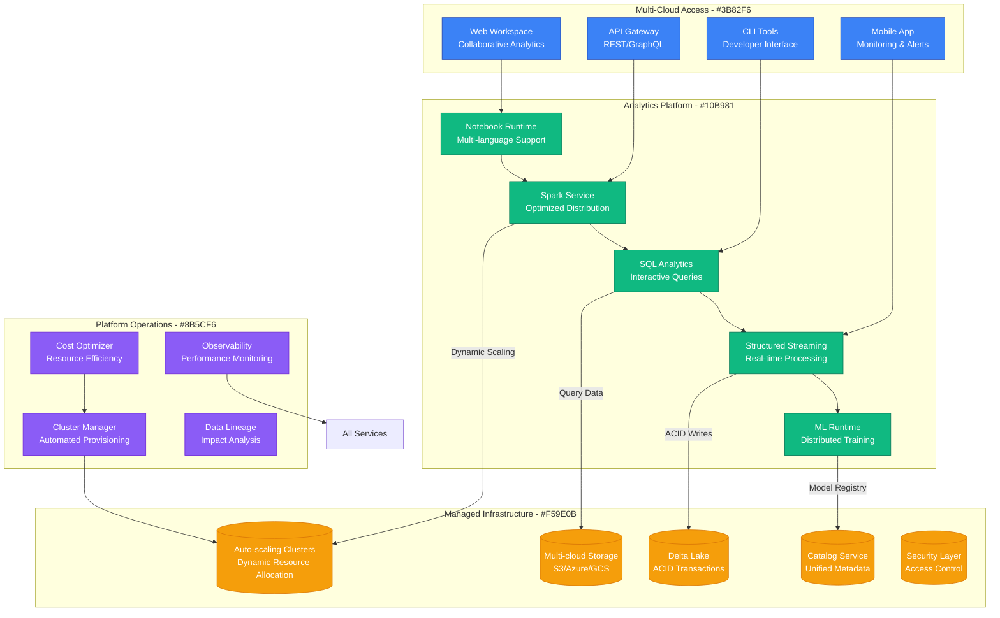
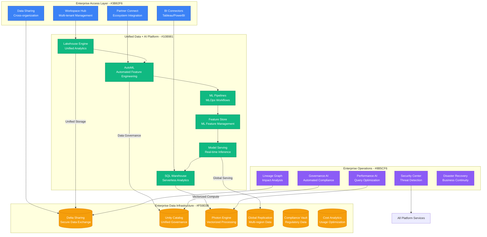
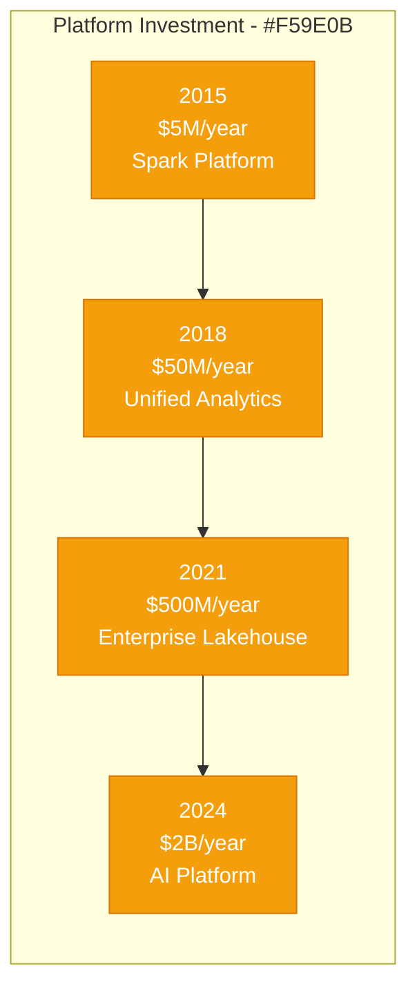

# Databricks: Data Platform Explosive Growth

## Executive Summary

Databricks' scaling journey from a UC Berkeley research project to a $43B data and AI platform serving 10,000+ organizations represents one of the most successful academic-to-enterprise transformations in data infrastructure. This case study examines their evolution from 2013 to 2024, focusing on the unique challenges of scaling a unified analytics platform that processes exabytes of data daily while making advanced analytics accessible to both data scientists and business analysts.

## Scale Milestones

| Milestone | Year | Customers | Key Challenge | Solution | Data Processed |
|-----------|------|-----------|---------------|----------|----------------|
| Academic | 2013 | 0 | Research to product | Apache Spark commercialization | 0 |
| Startup | 2015 | 100 | Multi-cloud platform | Unified analytics workspace | 1PB/month |
| Enterprise | 2018 | 2,000 | Enterprise features | Delta Lake + MLflow | 100PB/month |
| AI Platform | 2021 | 7,000 | ML productionization | Unified data + AI platform | 1EB/month |
| LLM Era | 2024 | 10,000+ | Generative AI workloads | Native LLM training/serving | 10EB/month |

## Architecture Evolution

### Phase 1: Apache Spark Commercialization (2013-2015)
*Scale: 0 → 100 customers*

```mermaid
graph TB
    subgraph "Edge Plane - #3B82F6"
        NOTEBOOK[Collaborative Notebooks<br/>Jupyter-like Interface]
        WEB_UI[Web UI<br/>Cluster Management]
    end

    subgraph "Service Plane - #10B981"
        SPARK_MASTER[Spark Master<br/>Cluster Coordination]
        RESOURCE_MGR[Resource Manager<br/>YARN/Mesos]
        JOB_SCHEDULER[Job Scheduler<br/>Task Distribution]
    end

    subgraph "State Plane - #F59E0B"
        SPARK_WORKERS[(Spark Workers<br/>Distributed Computing)]
        STORAGE[(Cloud Storage<br/>S3/HDFS)]
        METADATA[(Metadata Store<br/>Hive Metastore)]
    end

    subgraph "Control Plane - #8B5CF6"
        MONITORING[Spark Monitoring<br/>Web UI + Logs]
        DEPLOYMENT[Manual Deployment<br/>AMI/Docker)]
    end

    %% Connections
    NOTEBOOK --> SPARK_MASTER
    WEB_UI --> RESOURCE_MGR
    SPARK_MASTER --> JOB_SCHEDULER
    JOB_SCHEDULER --> SPARK_WORKERS
    SPARK_WORKERS --> STORAGE
    SPARK_MASTER --> METADATA

    %% Styling
    classDef edgeStyle fill:#3B82F6,stroke:#1E40AF,color:#fff
    classDef serviceStyle fill:#10B981,stroke:#047857,color:#fff
    classDef stateStyle fill:#F59E0B,stroke:#D97706,color:#fff
    classDef controlStyle fill:#8B5CF6,stroke:#6D28D9,color:#fff

    class NOTEBOOK,WEB_UI edgeStyle
    class SPARK_MASTER,RESOURCE_MGR,JOB_SCHEDULER serviceStyle
    class SPARK_WORKERS,STORAGE,METADATA stateStyle
    class MONITORING,DEPLOYMENT controlStyle
```

**Key Innovation**: Making Apache Spark accessible through collaborative notebooks and managed infrastructure.

**Key Metrics (2015)**:
- Clusters Launched: 1,000/month
- Data Processed: 1PB/month
- Active Users: 5,000
- Customers: 100

### Phase 2: Unified Analytics Workspace (2015-2018)
*Scale: 100 → 2,000 customers*



**Breakthrough Moment**: Delta Lake launch in 2017 enabled reliable data lakes with ACID transactions.

**Key Metrics (2018)**:
- Data Processed: 100PB/month
- Active Notebooks: 1M+
- Customers: 2,000
- MLflow Downloads: 1M+

### Phase 3: Enterprise Data + AI Platform (2018-2021)
*Scale: 2,000 → 7,000 customers*



**Key Innovation**: Lakehouse architecture combining data warehouse performance with data lake flexibility.

**Key Metrics (2021)**:
- Data Processed: 1EB/month
- ML Models Trained: 10M+/month
- SQL Queries: 1B+/month
- Enterprise Customers: 5,000+

### Phase 4: Generative AI Platform (2021-2024)
*Scale: 7,000 → 10,000+ customers*

```mermaid
graph TB
    subgraph "AI-Native Interface - #3B82F6"
        AI_ASSISTANT[AI Assistant<br/>Natural Language Analytics]
        CODE_COMPLETION[Code Completion<br/>AI-powered Development]
        CHAT_INTERFACE[Chat Interface<br/>Conversational Analytics]
        LLM_PLAYGROUND[LLM Playground<br/>Model Experimentation]
    end

    subgraph "Generative AI Platform - #10B981"
        FOUNDATION_MODELS[Foundation Models<br/>Pre-trained LLMs]
        CUSTOM_LLM_TRAINING[Custom LLM Training<br/>Domain-specific Models]
        LLM_SERVING[LLM Serving<br/>Real-time Inference]
        VECTOR_SEARCH[Vector Search<br/>Semantic Similarity]
        RAG_PIPELINE[RAG Pipeline<br/>Retrieval Augmented Generation]
        MULTIMODAL_AI[Multimodal AI<br/>Text/Image/Audio Processing]
    end

    subgraph "AI-Scale Infrastructure - #F59E0B"
        GPU_CLUSTERS[(GPU Clusters<br/>Distributed Training)]
        VECTOR_DATABASE[(Vector Database<br/>Embedding Storage)]
        MODEL_REGISTRY[(Model Registry<br/>Version Management)]
        TRAINING_DATASETS[(Training Datasets<br/>Curated Data)]
        INFERENCE_CACHE[(Inference Cache<br/>Response Optimization)]
        KNOWLEDGE_GRAPH[(Knowledge Graph<br/>Enterprise Context)]
    end

    subgraph "AI Ops & Governance - #8B5CF6"
        AI_OBSERVABILITY[AI Observability<br/>Model Performance]
        RESPONSIBLE_AI[Responsible AI<br/>Ethics & Bias Detection]
        LLM_SECURITY[LLM Security<br/>Prompt Injection Protection]
        AI_COST_MGMT[AI Cost Management<br/>GPU Optimization]
        MODEL_GOVERNANCE[Model Governance<br/>Approval Workflows]
    end

    %% AI-native interactions
    AI_ASSISTANT --> FOUNDATION_MODELS
    CODE_COMPLETION --> CUSTOM_LLM_TRAINING
    CHAT_INTERFACE --> LLM_SERVING
    LLM_PLAYGROUND --> VECTOR_SEARCH

    %% Generative AI platform
    FOUNDATION_MODELS --> CUSTOM_LLM_TRAINING
    CUSTOM_LLM_TRAINING --> LLM_SERVING
    LLM_SERVING --> VECTOR_SEARCH
    VECTOR_SEARCH --> RAG_PIPELINE
    RAG_PIPELINE --> MULTIMODAL_AI

    %% AI infrastructure
    CUSTOM_LLM_TRAINING --> |"Distributed Training"| GPU_CLUSTERS
    VECTOR_SEARCH --> |"Embeddings"| VECTOR_DATABASE
    LLM_SERVING --> |"Model Versions"| MODEL_REGISTRY
    FOUNDATION_MODELS --> |"Training Data"| TRAINING_DATASETS
    LLM_SERVING --> |"Response Cache"| INFERENCE_CACHE
    RAG_PIPELINE --> |"Context Data"| KNOWLEDGE_GRAPH

    %% AI governance
    AI_OBSERVABILITY --> ALL_AI[All AI Services]
    RESPONSIBLE_AI --> FOUNDATION_MODELS
    LLM_SECURITY --> LLM_SERVING
    AI_COST_MGMT --> GPU_CLUSTERS
    MODEL_GOVERNANCE --> MODEL_REGISTRY

    %% Styling
    classDef edgeStyle fill:#3B82F6,stroke:#1E40AF,color:#fff
    classDef serviceStyle fill:#10B981,stroke:#047857,color:#fff
    classDef stateStyle fill:#F59E0B,stroke:#D97706,color:#fff
    classDef controlStyle fill:#8B5CF6,stroke:#6D28D9,color:#fff

    class AI_ASSISTANT,CODE_COMPLETION,CHAT_INTERFACE,LLM_PLAYGROUND edgeStyle
    class FOUNDATION_MODELS,CUSTOM_LLM_TRAINING,LLM_SERVING,VECTOR_SEARCH,RAG_PIPELINE,MULTIMODAL_AI serviceStyle
    class GPU_CLUSTERS,VECTOR_DATABASE,MODEL_REGISTRY,TRAINING_DATASETS,INFERENCE_CACHE,KNOWLEDGE_GRAPH stateStyle
    class AI_OBSERVABILITY,RESPONSIBLE_AI,LLM_SECURITY,AI_COST_MGMT,MODEL_GOVERNANCE controlStyle
```



**Current Metrics (2024)**:
- Data Processed: 10EB+/month
- LLM Training Jobs: 100K+/month
- Vector Searches: 1B+/day
- Custom Models: 1M+ in production

## Critical Scale Events

### The Delta Lake Revolution (2017)
**Challenge**: Data lakes were unreliable due to lack of ACID transactions and schema enforcement.

**Solution**: Delta Lake - combining data lake flexibility with data warehouse reliability.

**Impact**: Created new "lakehouse" category and became foundation for entire platform.

### The Photon Engine Launch (2020)
**Challenge**: SQL queries on big data were 10x slower than specialized data warehouses.

**Breakthrough**: Vectorized C++ engine achieving data warehouse performance on data lake storage.

**Result**: 10x faster SQL performance enabled BI tool adoption.

### Unity Catalog Global Rollout (2021)
**Challenge**: Enterprise customers needed unified data governance across all clouds and workspaces.

**Innovation**: Cross-cloud metadata layer with fine-grained access controls.

### Generative AI Integration (2023)
**Challenge**: LLM training and serving required specialized infrastructure and expertise.

**Solution**: Native LLM training, serving, and RAG capabilities built into the platform.

### Multi-Modal AI Platform (2024)
**Challenge**: Enterprises needed to process text, images, audio, and video data together.

**Breakthrough**: Unified multimodal AI platform supporting all data types.

## Technology Evolution

### Compute Engine Evolution
- **2013-2015**: Apache Spark (Scala/Java)
- **2015-2018**: Optimized Spark with custom extensions
- **2018-2021**: Photon vectorized engine (C++)
- **2021-2024**: GPU-optimized AI workloads

### Storage Architecture
- **2013-2016**: HDFS and cloud object storage
- **2016-2019**: Delta Lake with ACID transactions
- **2019-2022**: Multi-cloud lakehouse
- **2022-2024**: AI-optimized storage with vector indexes

### Platform Philosophy
- **Phase 1**: "Make Spark accessible"
- **Phase 2**: "Unified analytics workspace"
- **Phase 3**: "Lakehouse architecture"
- **Phase 4**: "AI-native data platform"

## Financial Impact

### Infrastructure Investment by Phase


### Revenue Milestones
- **2015**: $10M ARR (early adopters)
- **2018**: $200M ARR (enterprise breakthrough)
- **2021**: $1B ARR (IPO year)
- **2024**: $2.4B ARR (AI transformation)

### Unit Economics
- **Gross Margin**: 80%+ (software platform)
- **Customer LTV**: $5M+ (enterprise accounts)
- **Magic Number**: 1.5+ (efficient growth)
- **Net Revenue Retention**: 140%+

## Lessons Learned

### What Worked
1. **Open Source Foundation**: Apache Spark ecosystem created massive community
2. **Lakehouse Vision**: Unified architecture solved real customer problems
3. **Performance Focus**: Photon engine delivered warehouse-class performance
4. **AI-First Transformation**: Early LLM integration captured AI wave

### What Didn't Work
1. **Consumer Analytics**: Failed to penetrate consumer/SMB market effectively
2. **Real-Time Streaming**: Late to real-time analytics compared to competitors
3. **Data Integration**: Underinvested in ETL/ELT tooling initially
4. **Pricing Complexity**: Complex pricing model confused customers

### Key Technical Decisions
1. **Multi-Cloud Strategy**: Avoided vendor lock-in and expanded addressable market
2. **Delta Lake Open Source**: Created industry standard and ecosystem
3. **Vectorized Engine**: Custom C++ engine achieved breakthrough performance
4. **Unified Catalog**: Cross-cloud governance enabled enterprise adoption

## Current Architecture (2024)

**Global Infrastructure**:
- 25+ cloud regions across AWS, Azure, GCP
- 1M+ compute nodes managed
- 10EB+ data processed monthly
- 100K+ ML models in production

**Key Technologies**:
- Apache Spark (distributed computing)
- Delta Lake (storage layer)
- Photon (vectorized query engine)
- Unity Catalog (metadata and governance)
- Custom LLM training/serving stack

**Operating Metrics**:
- 10,000+ enterprise customers
- 1M+ active users
- 10EB+ data processed monthly
- 140%+ net revenue retention

## Looking Forward: Next 5 Years

### Predicted Challenges
1. **AI Compute Costs**: GPU infrastructure costs scaling faster than revenue
2. **Model Governance**: Managing thousands of custom models across organizations
3. **Data Privacy**: Balancing AI capabilities with privacy regulations
4. **Competition**: Cloud providers building competing native services

### Technical Roadmap
1. **Autonomous Analytics**: Self-managing and self-optimizing data platform
2. **Agentic AI**: AI agents that can autonomously analyze and act on data
3. **Real-Time Everything**: Sub-second analytics across all data types
4. **Sustainable AI**: Carbon-neutral AI training and inference

**Summary**: Databricks' evolution from Apache Spark commercialization to a comprehensive AI platform demonstrates the power of building on strong open-source foundations while continuously innovating. Their lakehouse architecture solved fundamental data problems, and their AI-first transformation positioned them perfectly for the generative AI era. Success came from making complex technologies accessible while maintaining enterprise-grade performance and governance.