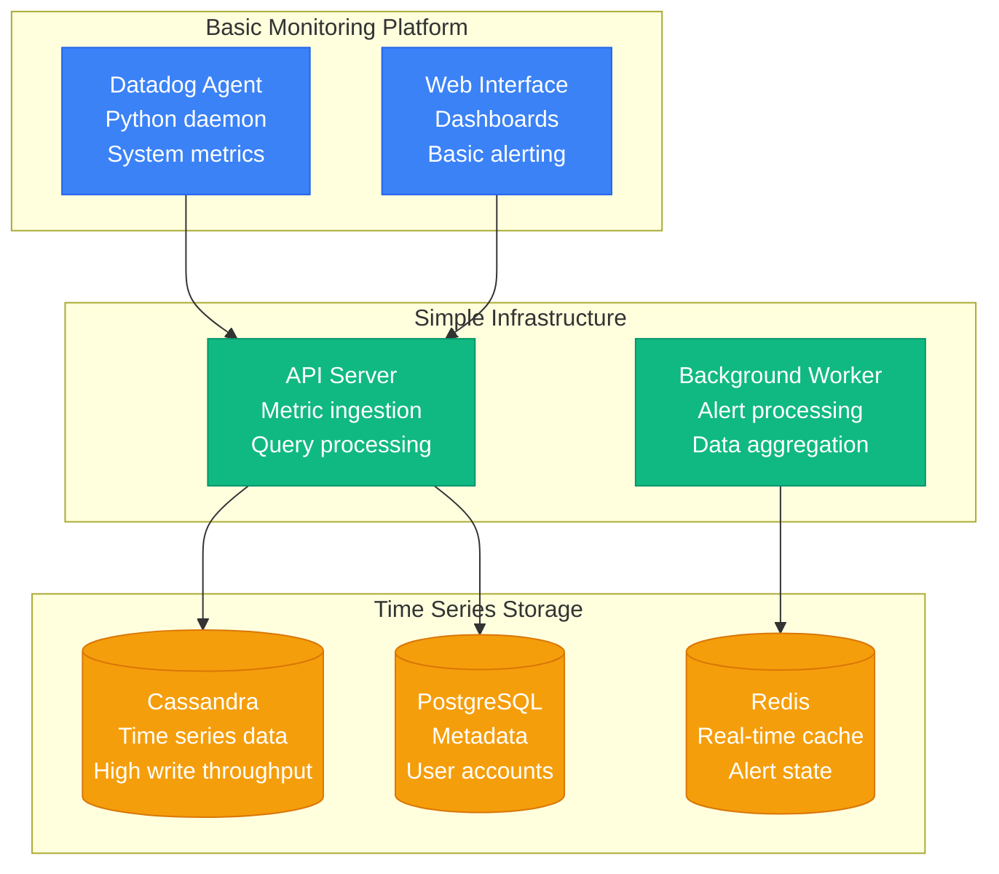
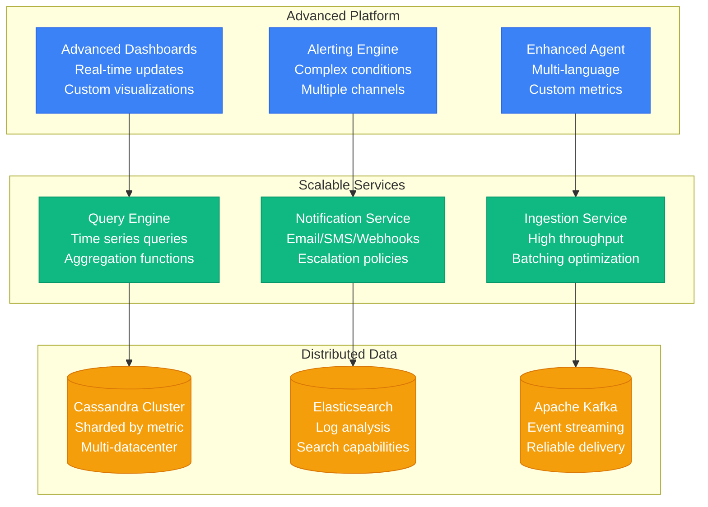
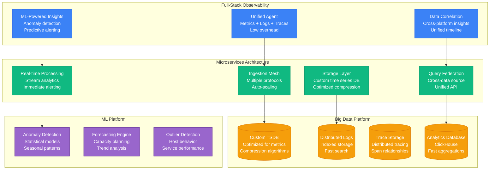

# Datadog Scale Evolution: Startup to 18T Data Points/Day

## Executive Summary

Datadog's scaling journey from a monitoring startup to processing 18 trillion data points daily represents one of the most impressive observability scaling achievements. The platform evolved from basic server monitoring to comprehensive full-stack observability across cloud-native infrastructure.

**Key Scaling Metrics:**
- **Data Points**: 1M/day → 18,000,000,000,000/day (18M x growth)
- **Customers**: 10 → 27,000+ organizations
- **Monitored Hosts**: 100 → 35,000,000+ hosts
- **Custom Metrics**: 1K → 2,500,000,000+ active metrics
- **Log Events**: 0 → 1,500,000,000+/day
- **Infrastructure cost**: $10K/month → $1B+/year
- **Engineering team**: 3 → 4,500+ engineers

## Phase 1: Simple Monitoring (2010-2012)
**Scale: 100-1K hosts, 1M-100M data points/day**

### Technology Stack
- **Agent**: Python, system metrics collection
- **Backend**: Python/Django, Cassandra
- **Frontend**: JavaScript, D3.js visualizations
- **Infrastructure**: AWS EC2, basic auto-scaling

### Key Metrics
| Metric | Value | Source |
|--------|-------|--------|
| Monitored Hosts | 100-1K | Platform metrics |
| Data Points/day | 1M-100M | Ingestion logs |
| Customers | 10-100 | Early adopters |
| Metrics Retention | 1 day | Storage optimization |
| Query Latency | 1-5 seconds | Performance monitoring |

## Phase 2: Enterprise Growth (2012-2016)
**Scale: 1K-100K hosts, 100M-10B data points/day**

### Platform Evolution
1. **Custom metrics** support for applications
2. **Log management** with Elasticsearch
3. **APM capabilities** for distributed tracing
4. **Integrations** with 200+ technologies

### Scaling Challenges
- **Write amplification** in Cassandra
- **Query performance** with large datasets
- **Agent overhead** on monitored systems

## Phase 3: Full-Stack Observability (2016-2020)
**Scale: 100K-10M hosts, 10B-1T data points/day**

### Advanced Features
1. **APM (Application Performance Monitoring)**
2. **Log Management** with ML-powered insights
3. **Distributed Tracing** for microservices
4. **Security Monitoring** with threat detection
5. **Synthetic Monitoring** for user experience

## Phase 4: AI-Powered Observability (2020-Present)
**Scale: 10M+ hosts, 1T-18T data points/day**

### Current Architecture Highlights
- **18 trillion data points** processed daily
- **Custom time-series database** with extreme compression
- **Real-time ML** for anomaly detection
- **Global edge infrastructure** for low-latency collection
- **Multi-cloud deployment** across AWS, Azure, GCP

## Data Processing Evolution

### Scale Progression by Year

| Year | Data Points/Day | Hosts Monitored | Storage (Raw) | Processing Cost |
|------|----------------|-----------------|---------------|-----------------|
| 2012 | 100M | 1K | 100GB | $1K/month |
| 2014 | 10B | 10K | 10TB | $50K/month |
| 2016 | 100B | 100K | 100TB | $500K/month |
| 2018 | 1T | 1M | 1PB | $5M/month |
| 2020 | 5T | 5M | 5PB | $25M/month |
| 2024 | 18T | 35M | 18PB | $100M+/month |

## Cost Evolution

| Phase | Period | Monthly Cost | Cost per Host | Primary Drivers |
|-------|--------|--------------|---------------|----------------|
| Simple | 2010-2012 | $10K-100K | $50 | Basic infrastructure |
| Enterprise | 2012-2016 | $100K-5M | $25 | Distributed systems |
| Full-Stack | 2016-2020 | $5M-50M | $15 | Custom databases |
| AI-Powered | 2020-Present | $50M-100M+ | $3 | Optimized architecture |

### Storage Optimization Strategies
1. **Data compression** - 100:1 compression ratios
2. **Intelligent retention** - Automatic data lifecycle management
3. **Tiered storage** - Hot/warm/cold data classification
4. **Edge processing** - Reduce data transfer costs

## Technology Stack Evolution

| Component | 2010 | 2014 | 2018 | 2022 | 2024 |
|-----------|------|------|------|------|------|
| Database | Cassandra | Cassandra Cluster | Custom TSDB | Optimized TSDB | AI-Enhanced TSDB |
| Agent | Python | Multi-language | Unified Agent | Smart Agent | AI Agent |
| Processing | Batch | Streaming | Real-time | ML-Enhanced | AI-Native |
| Storage | Single-tier | Multi-tier | Intelligent | Adaptive | Predictive |
| Query | Simple | Complex | Federated | AI-Assisted | Natural Language |

## Key Lessons Learned

### Technical Lessons
1. **Time-series data requires specialized storage** - General databases don't scale
2. **Compression is critical at scale** - 100:1 ratios are achievable
3. **Real-time processing enables better insights** - Batch processing is insufficient
4. **Agent efficiency affects customer adoption** - Monitoring overhead must be minimal
5. **ML transforms observability** - Pattern recognition exceeds human capability

### Business Lessons
1. **Observability is mission-critical** - Customers pay premium for reliability
2. **Data retention drives value** - Historical analysis creates insights
3. **Platform approach wins** - Unified observability beats point solutions
4. **Developer experience matters** - Easy integration drives adoption
5. **Enterprise features fund platform** - Advanced capabilities subsidize core

### Operational Lessons
1. **Monitoring the monitoring system** - Meta-observability is essential
2. **Data quality affects ML accuracy** - Garbage in, garbage out
3. **Alert fatigue is real** - Intelligent alerting prevents noise
4. **Global deployment improves reliability** - Regional failures don't affect global service
5. **Cost optimization never ends** - Storage costs grow exponentially

## Current Scale Metrics (2024)

| Metric | Value | Source |
|--------|-------|--------|
| Data Points/Day | 18T+ | Platform metrics |
| Customers | 27,000+ | Company reports |
| Monitored Hosts | 35M+ | Platform analytics |
| Custom Metrics | 2.5B+ | Usage statistics |
| Log Events/Day | 1.5B+ | Ingestion metrics |
| Integrations | 600+ | Ecosystem metrics |
| Countries | 100+ | Global presence |
| Engineering Team | 4,500+ | Company reports |
| Revenue | $1.7B+ annually | Financial reports |

---

*Datadog's evolution from simple server monitoring to AI-powered full-stack observability demonstrates how specialized databases, intelligent compression, and machine learning can create platforms that process unprecedented amounts of time-series data while maintaining real-time performance and actionable insights.*