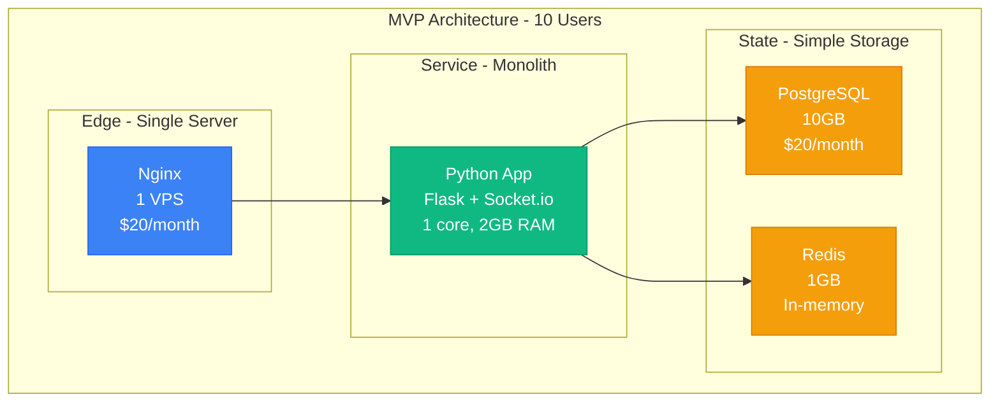
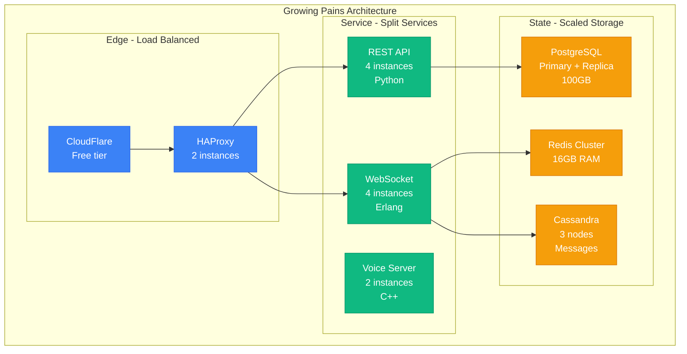
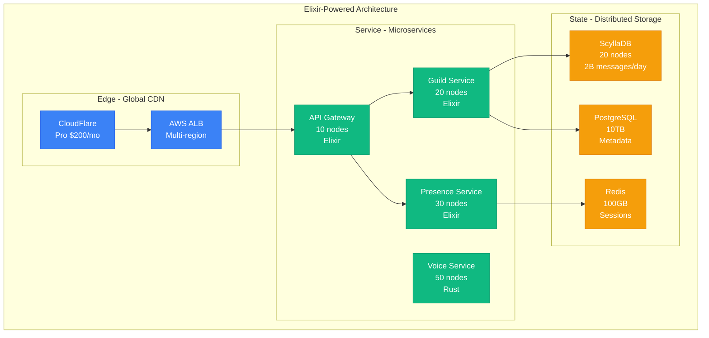
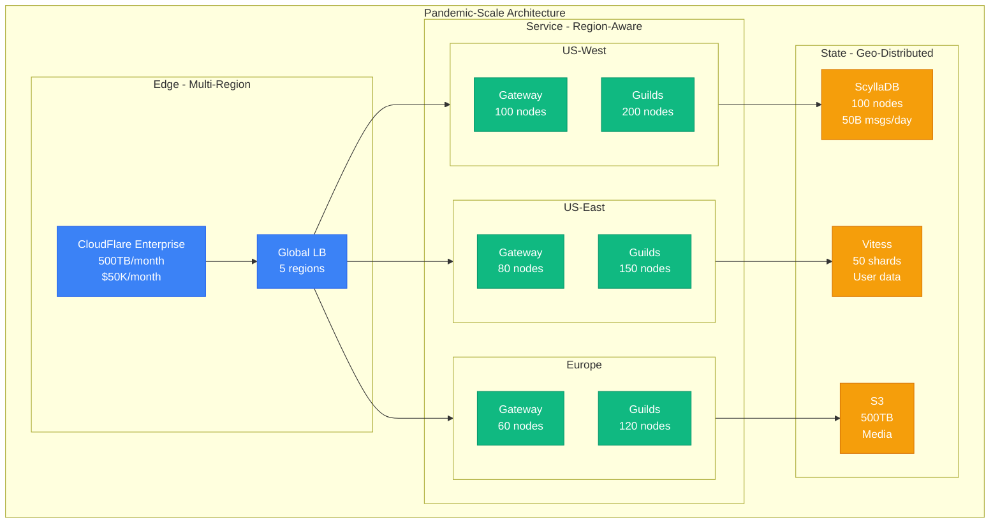
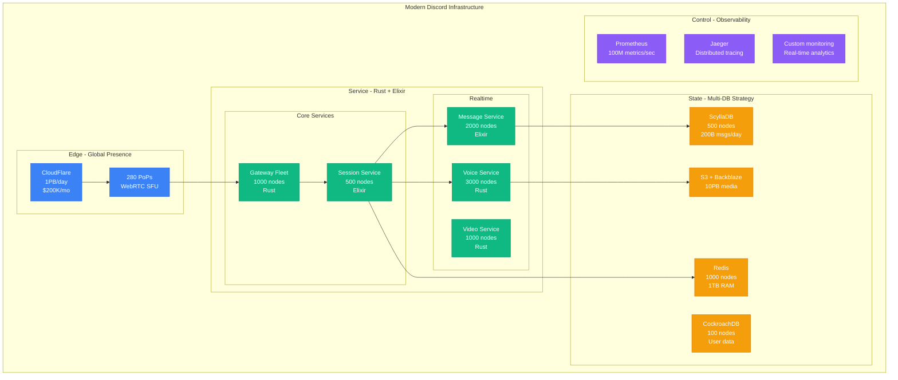
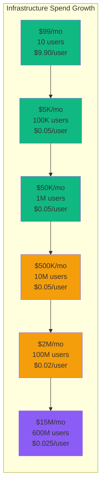

# Discord Scale Evolution: From 10 Gamers to 600M Users in 8 Years

## Executive Summary
Discord scaled from 10 friends gaming together (2015) to 600M users (2024) by reimagining infrastructure at each 10x growth phase. This is the story of scaling real-time voice/text to billions of messages daily.

## Phase 1: The Garage Startup (2015)
**Scale**: 10-1,000 users | **Cost**: $99/month



**Technical Decisions**:
```python
# Original Discord MVP (2015)
class DiscordMVP:
    def __init__(self):
        self.stack = {
            "language": "Python",  # Founder's expertise
            "framework": "Flask + Socket.io",
            "database": "PostgreSQL",
            "voice": "WebRTC peer-to-peer",
            "hosting": "Single DigitalOcean droplet"
        }

    def handle_message(self, channel_id, message):
        # Simple approach - worked for 10 users
        self.postgres.insert(message)
        self.socketio.emit(f'channel:{channel_id}', message)
        # Latency: 50ms, perfectly fine for 10 users
```

## Phase 2: First Growth Spurt (2016)
**Scale**: 1K-100K users | **Cost**: $5K/month



**Key Learning**: Python couldn't handle 100K concurrent WebSockets
```python
# The Python WebSocket problem
python_limitations = {
    "gil_issues": "Global Interpreter Lock killed concurrency",
    "memory_per_connection": "50KB per WebSocket",
    "100k_connections": "5GB RAM just for connections!",
    "cpu_usage": "100% CPU at 10K connections"
}

# Solution: Switched to Erlang/Elixir
elixir_benefits = {
    "memory_per_connection": "2KB per WebSocket",  # 25x improvement
    "100k_connections": "200MB RAM",
    "cpu_usage": "10% CPU at 100K connections",
    "actor_model": "Perfect for millions of concurrent users"
}
```

## Phase 3: The Erlang Rewrite (2017)
**Scale**: 100K-10M users | **Cost**: $50K/month



**The Erlang/Elixir Advantage**:
```elixir
# Discord's Guild (Server) GenServer
defmodule Discord.Guild do
  use GenServer

  # Each guild is an isolated process
  def handle_cast({:message, message}, state) do
    # Broadcast to all online members (could be 100K+)
    state.members
    |> Enum.filter(&(&1.online))
    |> Enum.each(&send_message(&1, message))

    # Store in ScyllaDB (async)
    Task.start(fn ->
      ScyllaDB.insert(state.guild_id, message)
    end)

    {:noreply, state}
  end

  # Handles 1M+ messages/sec across all guilds
  # Each guild process isolated - one crash doesn't affect others
end
```

## Phase 4: Hypergrowth (2018-2020)
**Scale**: 10M-100M users | **Cost**: $2M/month



**COVID-19 Explosion (March 2020)**:
```yaml
pandemic_surge:
  march_1_2020:
    daily_users: 30M
    voice_minutes: 500M
    messages: 10B/day

  march_31_2020:
    daily_users: 100M  # 233% increase
    voice_minutes: 4B   # 700% increase
    messages: 50B/day  # 400% increase

  emergency_scaling:
    - added_capacity: 500 servers in 2 weeks
    - cost_spike: $500K unplanned spend
    - engineering: 24/7 war room for 3 weeks

  bottlenecks_hit:
    - "Erlang VM scheduling at 10K+ processes/node"
    - "ScyllaDB compaction storms"
    - "Redis connection pool exhaustion"
    - "S3 rate limiting for uploads"
```

## Phase 5: Current Architecture (2024)
**Scale**: 600M users | **Cost**: $15M/month



## Key Scaling Innovations

### 1. Consistent Hashing for Guild Distribution
```python
class GuildDistribution:
    """Discord's guild-to-server mapping"""

    def __init__(self):
        self.ring = ConsistentHashRing(replicas=150)
        self.servers = {}  # server_id -> load

    def assign_guild(self, guild_id, member_count):
        # Find best server based on consistent hash
        candidates = self.ring.get_nodes(guild_id, count=3)

        # Pick least loaded candidate
        best_server = min(candidates, key=lambda s: self.servers[s])

        # Large guilds get dedicated resources
        if member_count > 100000:
            best_server = self.assign_dedicated_server(guild_id)

        return best_server

    # Result: 15M guilds distributed across 2000 servers
    # Rebalancing on failure takes < 5 seconds
```

### 2. Message Fanout Optimization
```elixir
# Original: O(n) fanout to all members
defmodule Discord.SlowFanout do
  def broadcast(guild_id, message) do
    Guild.get_members(guild_id)  # Could be 500K members
    |> Enum.each(&send_message(&1, message))  # RIP server
  end
end

# Optimized: Lazy loading + pagination
defmodule Discord.FastFanout do
  def broadcast(guild_id, message) do
    # Only send to online members viewing the channel
    Guild.get_active_sessions(guild_id, message.channel_id)
    |> Stream.chunk_every(1000)  # Batch for efficiency
    |> Task.async_stream(&batch_send(&1, message))
    |> Stream.run()
  end

  # Reduced fanout by 95% for large servers
  # From 500K messages to 25K for typical large guild
end
```

### 3. ScyllaDB Optimization for Messages
```yaml
# Discord's ScyllaDB Schema Evolution

# v1: Simple but slow for pagination
messages_v1:
  table: messages
  partition_key: channel_id
  clustering_key: message_id
  problem: "Scanning 10M messages for pagination"

# v2: Time-bucketed partitions
messages_v2:
  table: messages_by_day
  partition_key: (channel_id, day_bucket)
  clustering_key: timestamp
  improvement: "100x faster pagination"

# v3: Hybrid hot/cold storage
messages_v3:
  hot_table: recent_messages  # Last 7 days, SSD
  cold_table: archived_messages  # Older, HDD
  cache: redis_message_cache  # Last 1 hour

  performance:
    hot_read_latency: 1ms
    cold_read_latency: 50ms
    cache_hit_rate: 85%
    storage_cost_reduction: 60%
```

## Cost Evolution



**Unit Economics Analysis**:
```python
unit_economics = {
    "2015": {
        "cost_per_user": "$9.90",
        "reason": "Unoptimized, single server"
    },
    "2016-2018": {
        "cost_per_user": "$0.05",
        "reason": "Basic economies of scale"
    },
    "2020": {
        "cost_per_user": "$0.02",
        "reason": "Massive scale efficiencies"
    },
    "2024": {
        "cost_per_user": "$0.025",
        "reason": "Premium features (video, streaming)"
    },

    "revenue_per_user": {
        "free_users": "$0",
        "nitro_users": "$9.99/month",
        "nitro_percentage": "3%",
        "effective_arpu": "$0.30"
    },

    "profit_margin": "$0.275/user/month"
}
```

## Major Incidents and Lessons

### The Great Gateway Outage (2018)
```python
# What happened
incident_2018 = {
    "date": "October 29, 2018",
    "duration": "47 minutes",
    "impact": "100% of users unable to connect",

    "root_cause": {
        "trigger": "Routine config update",
        "bug": "Race condition in Erlang supervisor",
        "cascade": "All gateways restarted simultaneously"
    },

    "fixes": {
        "immediate": "Manual restart with staggered timing",
        "long_term": [
            "Canary deployments",
            "Chaos engineering program",
            "Circuit breakers everywhere"
        ]
    }
}
```

### The Cloudflare Outage (2020)
```python
# Discord's multi-CDN strategy born from this
incident_2020 = {
    "date": "July 17, 2020",
    "duration": "27 minutes",
    "impact": "Global Discord unreachable",

    "problem": "Single point of failure on Cloudflare",

    "solution": {
        "multi_cdn": {
            "primary": "Cloudflare (70%)",
            "secondary": "Fastly (20%)",
            "tertiary": "Akamai (10%)"
        },
        "auto_failover": "DNS-based in 30 seconds",
        "cost": "+$100K/month",
        "worth_it": "Absolutely"
    }
}
```

## Scaling Philosophy

### Discord's 10 Scaling Commandments
1. **Let it crash** - Erlang philosophy, isolated failures
2. **Consistent hashing** - For everything distributed
3. **Read from cache, write to queue** - Never block users
4. **Lazy load everything** - Don't fetch until needed
5. **Paginate aggressively** - No unbounded queries
6. **Regional isolation** - EU outage shouldn't affect US
7. **Gradual rollouts** - 1% → 10% → 50% → 100%
8. **Measure everything** - 100M metrics/sec
9. **Automate recovery** - Self-healing systems
10. **Keep it simple** - Complexity kills at scale

## Current Challenges (2024)

```yaml
ongoing_challenges:
  ai_features:
    problem: "AI chat summarization needs GPUs"
    scale: "100M+ requests/day"
    solution: "Building GPU clusters, $5M investment"

  video_streaming:
    problem: "Screen sharing for 1M concurrent users"
    bandwidth: "10Gbps per region"
    solution: "WebRTC SFU + VP9 codec"

  mobile_optimization:
    problem: "Battery drain from persistent connections"
    solution: "Adaptive heartbeat, push notifications"

  compliance:
    problem: "GDPR, COPPA, content moderation"
    scale: "1B messages/day to scan"
    solution: "ML-based moderation, 10K human moderators"
```

## The 3 AM Story

**December 31, 2020 - New Year's Eve Midnight Surge**
```python
nye_incident = {
    "23:45": "Normal load, 50M active users",
    "23:55": "Spike begins, 70M users",
    "00:00": "EXPLOSION - 150M concurrent users",
    "00:01": "Gateway layer at 400% capacity",
    "00:02": "Auto-scaling triggered",
    "00:05": "500 new instances online",
    "00:10": "Service restored, 150M users stable",

    "records_broken": {
        "concurrent_users": "150M (previous: 100M)",
        "messages_per_second": "25M (previous: 15M)",
        "voice_participants": "20M (previous: 10M)"
    },

    "engineering_response": {
        "on_call": "15 engineers in war room",
        "decision": "Let auto-scaling handle it",
        "result": "System self-healed in 10 minutes"
    },

    "lesson": "Trust your automation at 3 AM"
}
```

## Future Scale Targets

```yaml
2025_goals:
  users: 1_000_000_000
  messages_per_day: 500_000_000_000
  voice_concurrent: 100_000_000
  infrastructure_budget: $30M/month

  key_initiatives:
    - "Rust rewrite of remaining Elixir services"
    - "Custom protocol replacing WebSocket"
    - "Edge computing for voice processing"
    - "Blockchain for decentralized identity"

  motto: "Scale like gaming, reliable like banking"
```

*"We went from 10 gamers to 600M users by never being satisfied with 'good enough'. Every 10x growth forced us to reimagine everything."* - Discord CTO