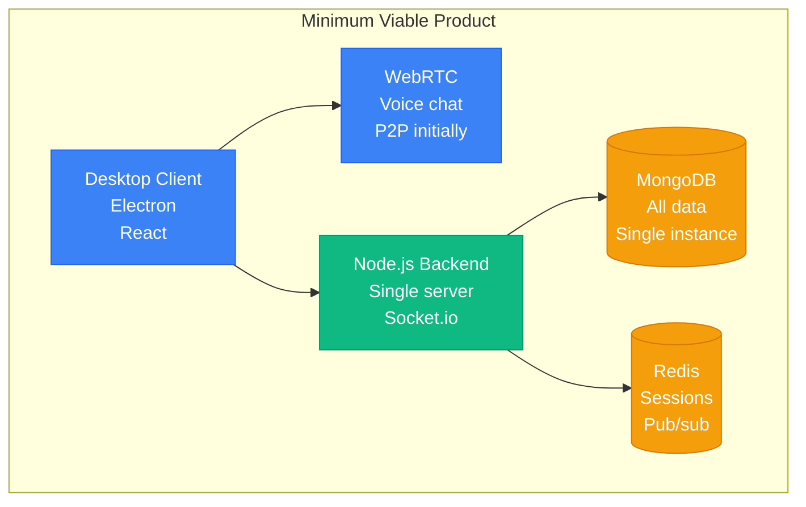
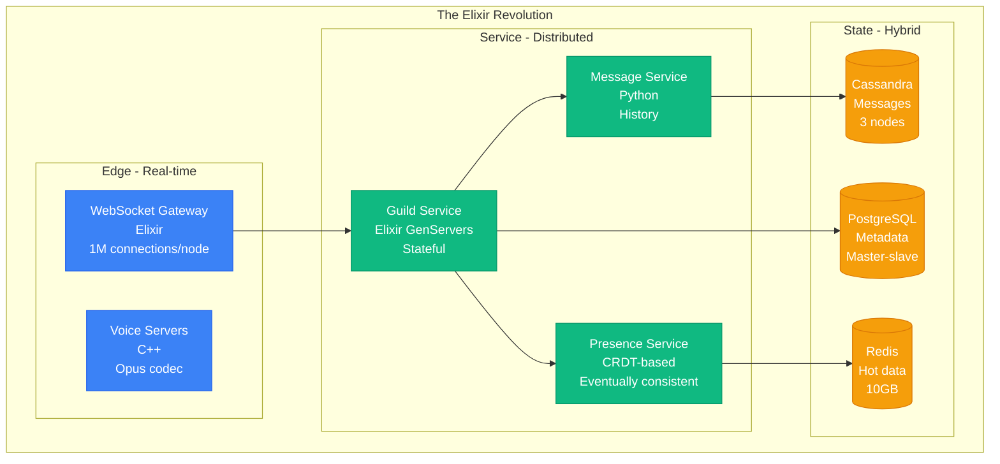
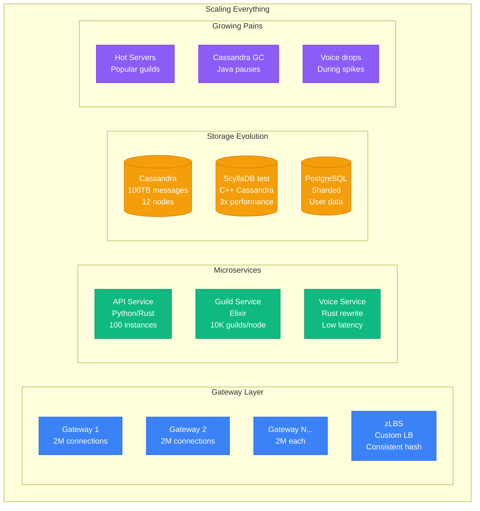
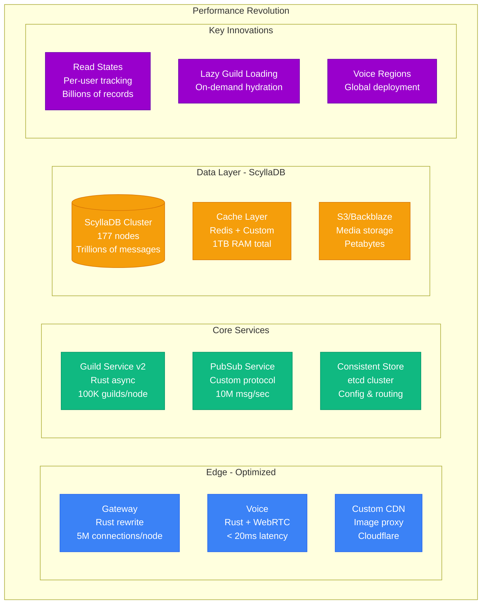
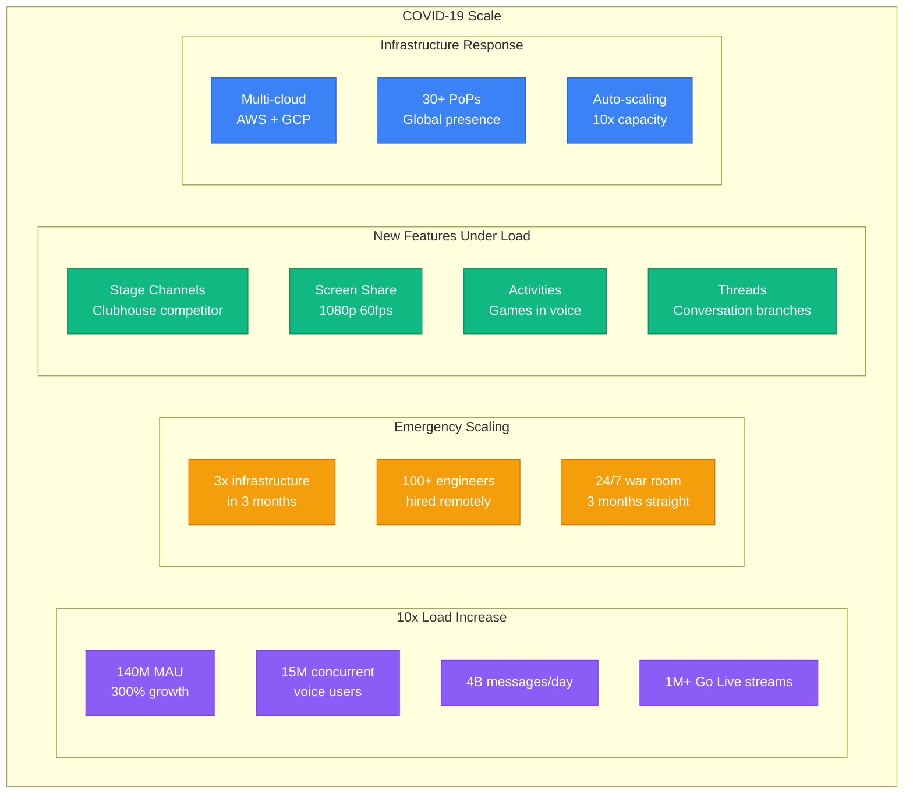
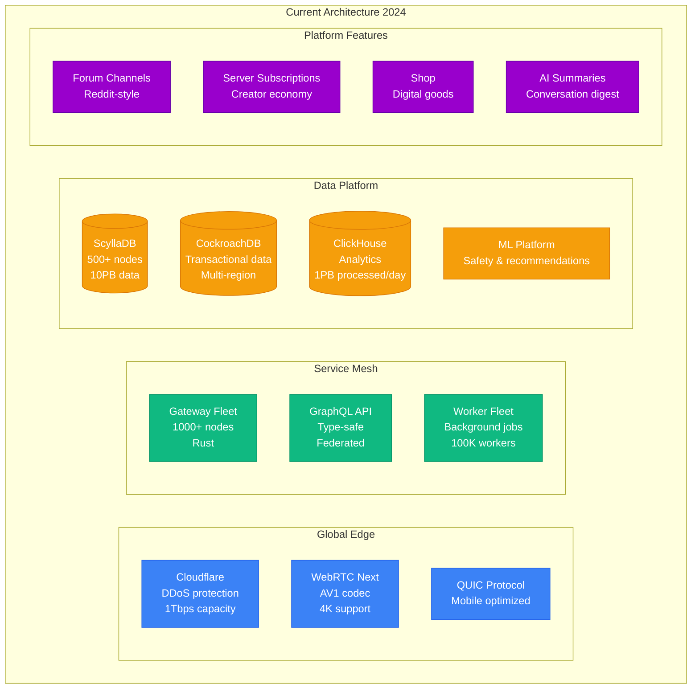
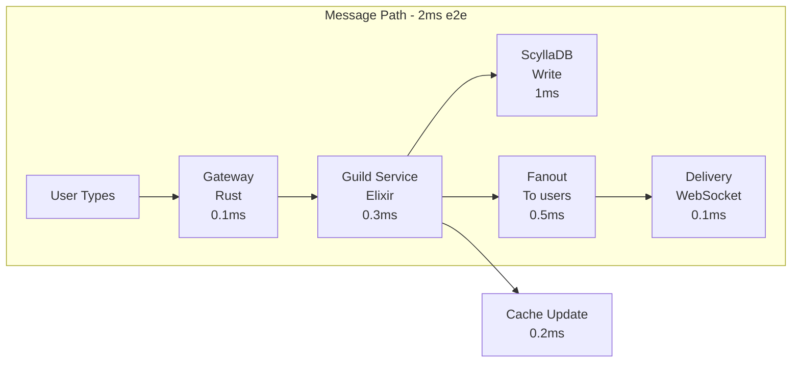
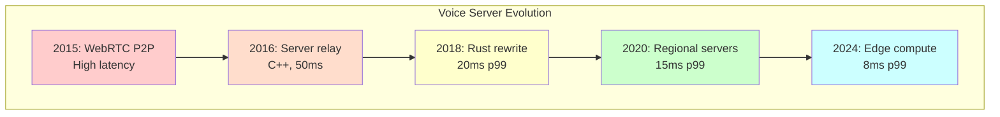
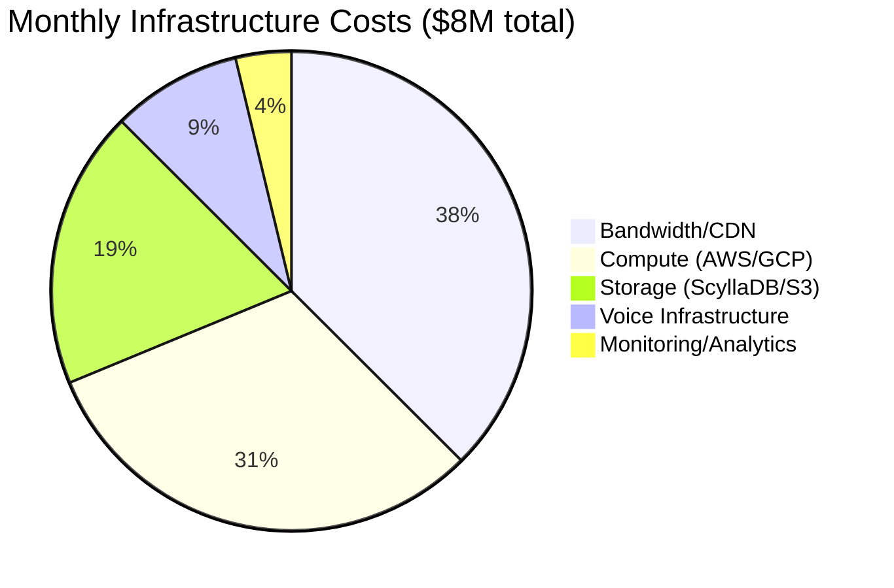

# Discord Scale Journey: 10 → 150 Million Users

## From Gaming Chat to Internet Infrastructure (2015-2024)

Discord's evolution from a gaming voice chat to serving 150M+ monthly active users showcases modern scaling with Elixir, Rust, and ScyllaDB.

## Phase 1: The Gaming Pivot (2015) - 0 to 10,000 Users



**Origin Story**:
- Founded by Jason Citron (previously Hammer & Chisel)
- Pivot from game "Fates Forever" to chat platform
- Focus: Low-latency voice for gamers
- Initial funding: $20M Series A

**Technical Choices**:
- Electron for cross-platform desktop
- WebRTC for voice (later replaced)
- MongoDB for flexibility (later regretted)
- Real-time via WebSockets

## Phase 2: The Elixir Rewrite (2016) - 100,000 Users



**The Big Decision: Elixir/Erlang**
```elixir
# Why Elixir worked for Discord
defmodule Discord.Guild do
  use GenServer

  # Each guild (server) is an Erlang process
  def handle_cast({:message, msg}, state) do
    # Broadcast to all connected users
    Phoenix.PubSub.broadcast(
      Discord.PubSub,
      "guild:#{state.guild_id}",
      {:new_message, msg}
    )
    {:noreply, state}
  end
end
# Result: 5M concurrent users on single server
```

**Key Achievements**:
- 1M WebSocket connections per server
- 2ms message delivery latency
- Fault tolerance via OTP
- Hot code reloading

## Phase 3: Hypergrowth (2017-2018) - 10 Million Users



**Scaling Challenges**:
1. **Hot Servers**: Ninja's Fortnite streams (100K+ concurrent)
2. **Message History**: Billions of messages, slow queries
3. **Voice Quality**: Jitter during peak gaming hours
4. **Presence Updates**: O(n²) problem for large servers

## Phase 4: The Rust Revolution (2019-2020) - 50 Million Users



**The Rust Rewrite Success**:
```rust
// Before: Go implementation
// 13ms p99 latency, 30% CPU

// After: Rust implementation
pub async fn handle_message(msg: Message) -> Result<()> {
    // Zero-copy deserialization
    let parsed = bincode::deserialize(&msg.data)?;

    // Lock-free concurrent processing
    tokio::spawn(async move {
        process_message(parsed).await
    });

    Ok(())
}
// Result: 1ms p99 latency, 5% CPU
```

**ScyllaDB Migration**:
- From Cassandra (Java) to ScyllaDB (C++)
- Same API, 10x performance
- Reduced nodes: 372 → 177
- Latency: p99 40ms → 15ms
- Cost savings: $1.5M/year

## Phase 5: Pandemic Explosion (2020-2021) - 140 Million Users



**Pandemic Challenges**:
1. **Education**: Entire schools on Discord
2. **Work**: Companies using for remote work
3. **Social**: Friend groups migrating
4. **Load**: 10x growth in 3 months

**Emergency Response**:
- Disabled non-essential features temporarily
- Rate limiting on API endpoints
- Aggressive caching everywhere
- Read replica multiplication

## Phase 6: Modern Platform (2022-2024) - 150M+ Users



## The Architecture That Scales

### Message Flow Architecture


### Voice Architecture Evolution


## Scale Numbers (2024)

| Metric | Value | Notes |
|--------|-------|-------|
| **Monthly Active Users** | 150M+ | 200M registered |
| **Daily Active Users** | 19M | High engagement |
| **Messages/Day** | 4 billion | 50K/second peak |
| **Voice Minutes/Day** | 2.5 billion | 30K concurrent channels |
| **Servers (Guilds)** | 19 million | Some with 500K+ members |
| **API Requests/Day** | 50 billion | 600K/second peak |
| **Data Stored** | 10+ PB | Growing 1PB/quarter |
| **Infrastructure Nodes** | 5000+ | Across 13 regions |

## Technical Innovations

### 1. Lazy Guild Loading
```elixir
# Problem: Loading 500K member servers = OOM
# Solution: Load on demand

defmodule Discord.LazyGuild do
  def get_member(guild_id, user_id) do
    case Cache.get({guild_id, user_id}) do
      nil ->
        # Load single member from database
        member = Database.get_member(guild_id, user_id)
        Cache.put({guild_id, user_id}, member, ttl: 300)
        member
      cached ->
        cached
    end
  end
end
# Result: 100x memory reduction
```

### 2. Read States at Scale
```rust
// Tracking what each user has read in each channel
// Challenge: 150M users × 1000 channels = 150B records

struct ReadState {
    user_id: u64,
    channel_id: u64,
    last_message_id: u64,
    mention_count: u32,
}

// Solution: Compact binary format + aggressive compression
// 150B records in just 2TB (13 bytes per record)
```

### 3. Consistent Hashing for Guilds
```python
# Guild to server mapping
def get_guild_node(guild_id):
    # Consistent hash ring with virtual nodes
    hash = mmh3.hash(str(guild_id))
    node = hash_ring.get_node(hash)

    # Handle hot guilds (>10K active)
    if is_hot_guild(guild_id):
        # Spread across multiple nodes
        return get_dedicated_nodes(guild_id)

    return node
```

## Production War Stories

### The Fortnite Launch (2018)
- **Event**: Ninja streams with Drake
- **Load**: 600K concurrent viewers in Discord
- **Problem**: Single guild overwhelming node
- **Solution**: Emergency guild sharding
- **Result**: Invented "Stage Channels" concept

### The Area 51 Raid (2019)
- **Event**: Meme event planning
- **Load**: 500K member server created
- **Problem**: Guild size limits hit
- **Solution**: Lazy loading implementation
- **Long-term**: Rearchitected guild storage

### GameStop/WallStreetBets (2021)
- **Event**: WSB Discord explosion
- **Growth**: 50K → 500K members in 24 hours
- **Problem**: Moderation tools overwhelmed
- **Response**: Emergency moderation features
- **Banned**: Then unbanned after backlash

### COVID School Migration (2020)
- **Event**: Schools adopting Discord
- **Challenge**: Different privacy requirements
- **Solution**: Created education features
- **Scale**: 1M+ students in first month

## Cost Structure

### Infrastructure Costs (Estimated)


### Cost Optimizations
1. **ScyllaDB**: Saved $1.5M/year vs Cassandra
2. **Rust Rewrites**: 80% reduction in compute
3. **Backblaze B2**: 80% cheaper than S3
4. **Custom CDN**: 50% cost reduction
5. **Spot Instances**: 40% of batch workloads

## Lessons Learned

### What Worked
1. **Elixir/Erlang**: Perfect for real-time chat
2. **Rust**: Massive performance gains
3. **ScyllaDB**: Cassandra compatible, 10x performance
4. **Microservices**: Allowed parallel scaling
5. **WebRTC**: Good enough for voice

### What Didn't Work
1. **MongoDB**: Terrible at scale
2. **Go**: GC pauses unacceptable
3. **Cassandra**: Java GC nightmares
4. **GraphQL initially**: Too complex
5. **P2P voice**: Quality issues

### Key Decisions
1. **2015**: Electron for desktop (enabled rapid development)
2. **2016**: Elixir rewrite (enabled massive concurrency)
3. **2017**: Consistent hashing (solved hot guild problem)
4. **2019**: Rust adoption (performance breakthrough)
5. **2020**: ScyllaDB migration (cost and performance win)

## Future Architecture (2025+)

### Planned Improvements
- **Edge Computing**: Voice servers at ISP edge
- **WASM Plugins**: User customization
- **Federation**: Interop with Matrix
- **E2E Encryption**: Optional for DMs
- **AI Integration**: Smart moderation, summaries

### Scale Targets
- 500M MAU by 2025
- 10B messages/day
- 50M concurrent voice
- Sub-5ms global latency
- 99.99% availability

## Key Takeaways

1. **Choose the right language**: Elixir for concurrency, Rust for performance
2. **Migrate databases carefully**: MongoDB → Cassandra → ScyllaDB
3. **Cache aggressively**: 99% cache hit rate target
4. **Shard by design**: Plan for horizontal scaling
5. **Optimize hot paths**: Rewrite in Rust when needed
6. **Monitor everything**: Can't fix what you can't see
7. **Prepare for viral growth**: 10x capacity minimum
8. **Listen to users**: Features drive adoption

## References

- "How Discord Stores Billions of Messages" - Discord Engineering 2017
- "Why Discord is Switching from Go to Rust" - Discord Blog 2020
- "How Discord Handles Two and Half Million Concurrent Voice Users" - 2020
- "ScyllaDB at Discord: 177 Nodes and Counting" - ScyllaDB Summit 2023
- "Scaling Discord's Real-time Communications" - InfoQ 2024

---

*Last Updated: September 2024*
*Data Sources: Discord Engineering Blog, Conference Talks, Public Metrics*