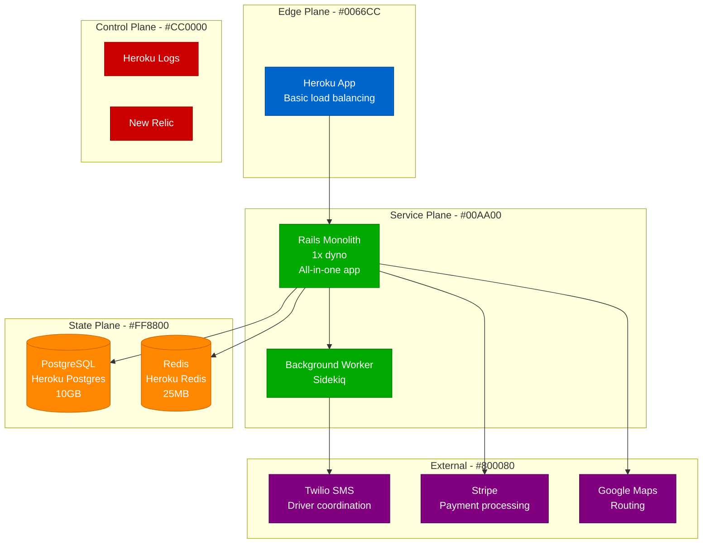
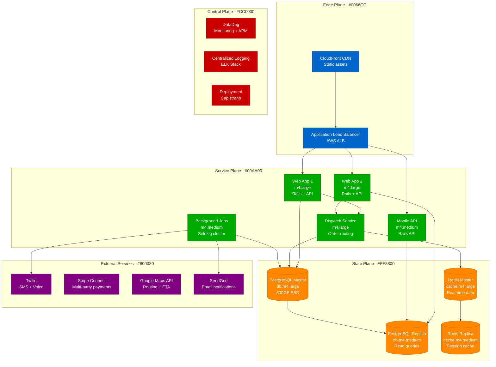
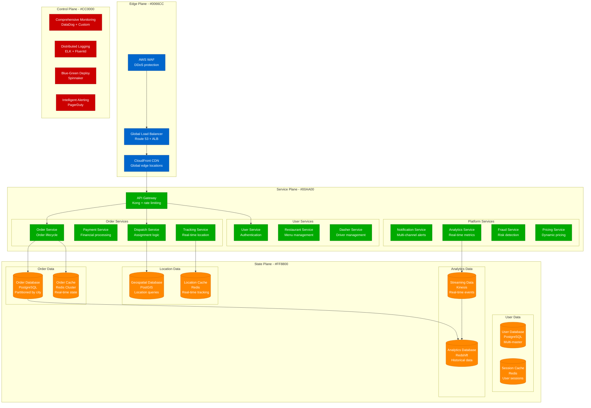
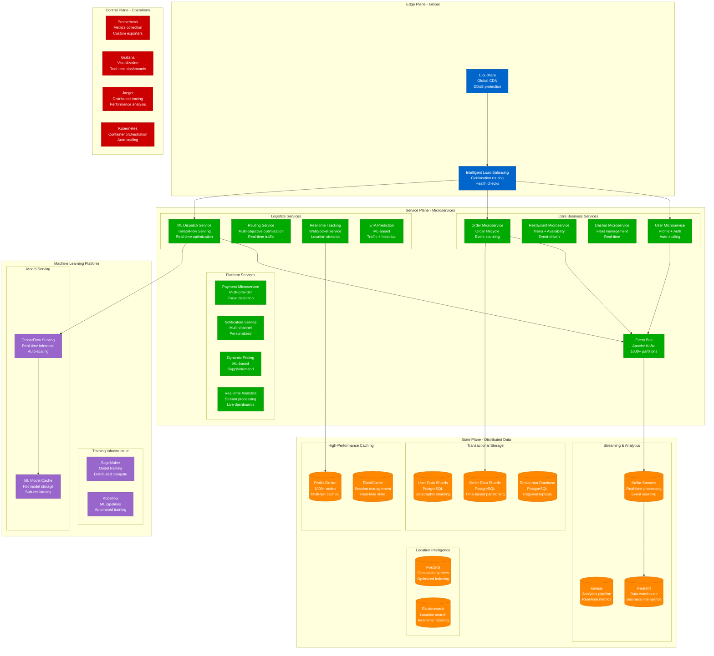
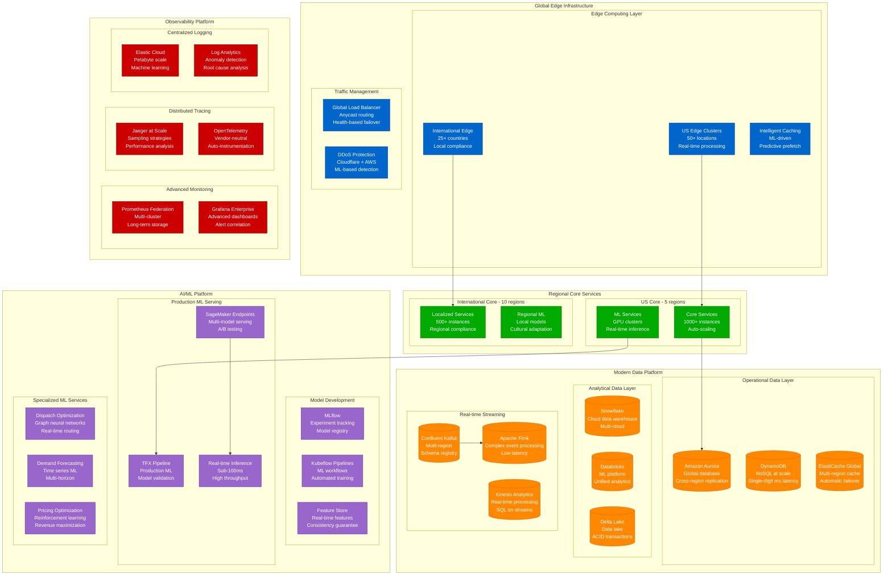
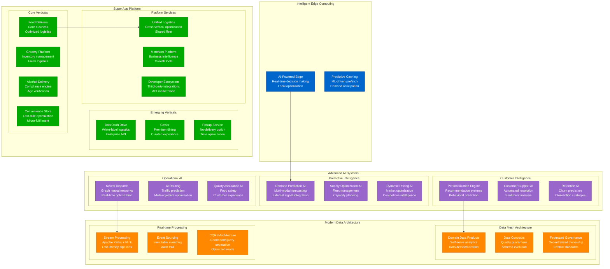

# DoorDash Scale Evolution: 1K to 30M Users

## Executive Summary

DoorDash's scaling journey from a small food delivery startup at Stanford to the largest food delivery platform in the US represents one of the most complex logistics scaling challenges in tech. The platform evolved from simple restaurant-to-customer delivery to a sophisticated three-sided marketplace managing real-time logistics, demand prediction, and supply optimization.

**Key Scaling Metrics:**
- **Active Users**: 1,000 → 30,000,000 (30,000x growth)
- **Orders per day**: 10 → 5,000,000+ (500,000x growth)
- **Restaurants**: 50 → 450,000+ (9,000x growth)
- **Dashers**: 10 → 2,000,000+ (200,000x growth)
- **Geographic markets**: 1 city → 7,000+ cities
- **Infrastructure cost**: $100/month → $200M+/year
- **Engineering team**: 2 → 4,000+ engineers

## Phase 1: Stanford MVP (2013-2014)
**Scale: 1K users, 10-50 orders/day, Palo Alto only**

### Architecture

### Technology Stack
- **Backend**: Ruby on Rails 4.0, PostgreSQL, Redis
- **Frontend**: Basic HTML/CSS/JavaScript
- **Mobile**: None (mobile web only)
- **Infrastructure**: Heroku (single region)
- **Payments**: Stripe

### Key Metrics
| Metric | Value | Source |
|--------|-------|--------|
| Daily Active Users | 100-1,000 | Internal analytics |
| Orders per day | 10-50 | Transaction logs |
| Restaurants | 12-50 | Database records |
| Dashers | 3-10 | Manual tracking |
| Average delivery time | 45-60 minutes | Manual tracking |
| Monthly cost | $100-500 | Heroku billing |
| Team size | 2 engineers | Company history |

### What Broke
- **Manual order dispatch** became bottleneck at >20 orders/day
- **Single delivery person** couldn't handle lunch rush
- **Payment failures** during peak hours due to Stripe rate limits

### Critical Incident: The First Scaling Wall
**Date**: November 2013
**Trigger**: Black Friday lunch rush (100 orders in 2 hours)
**Impact**: 3-hour delivery delays, angry customers
**Resolution**: Manual order batching, recruited more Dashers
**Lesson**: Three-sided marketplace complexity grows exponentially

## Phase 2: Multi-City Expansion (2014-2016)
**Scale: 10K users, 100-1K orders/day, 5 cities**

### Enhanced Architecture

### Key Innovations
1. **Automated order dispatch** algorithm
2. **Real-time Dasher tracking** with GPS
3. **Dynamic pricing** based on demand
4. **Multi-city data isolation** for operations

### Mobile App Launch
- **iOS app** (October 2014)
- **Android app** (February 2015)
- **Real-time order tracking**
- **Push notifications** for status updates

### What Broke
- **Database contention** during dinner rush across cities
- **Payment processing** delays with Stripe Connect
- **ETA calculations** inaccurate due to traffic data lag

### Critical Incident: The Multi-City Meltdown
**Date**: Valentine's Day 2015
**Trigger**: Simultaneous dinner rush across 5 cities
**Impact**: 4 hours of degraded service, 40% order delays
**Resolution**: Database connection pooling, city-based sharding
**Lesson**: Geographic scaling requires data architecture changes

## Phase 3: Market Leadership Battle (2016-2018)
**Scale: 100K-1M users, 1K-50K orders/day, 50+ cities**

### Microservices Architecture

### Advanced Features
1. **Machine learning dispatch** algorithm
2. **Predictive delivery times** using historical data
3. **Dynamic pricing** based on supply/demand
4. **Fraud detection** system
5. **Real-time analytics** dashboard

### Geographic Expansion Strategy
- **Market-by-market** expansion approach
- **Local partnerships** with restaurant chains
- **City-specific** operational optimization
- **Regional compliance** management

### What Broke
- **Cross-service communication** latency during peak hours
- **Geospatial queries** slow with PostGIS at scale
- **Real-time tracking** message queuing bottlenecks

### Critical Incident: The Super Bowl Sunday Crash
**Date**: February 5, 2017
**Trigger**: 50x normal order volume during game
**Impact**: 6 hours partial outage, millions in lost revenue
**Resolution**: Auto-scaling implementation, circuit breakers
**Lesson**: Sports events create predictable but extreme load spikes

## Phase 4: National Dominance (2018-2020)
**Scale: 1M-10M users, 50K-500K orders/day, 300+ cities**

### Event-Driven Architecture

### Machine Learning Revolution
1. **Dispatch optimization** - Reduced delivery time by 35%
2. **Demand prediction** - 95% accuracy for order forecasting
3. **Dynamic pricing** - Revenue optimization algorithms
4. **Fraud detection** - Real-time risk scoring
5. **Customer lifetime value** - Personalization engine

### Operational Excellence
- **99.99% uptime** SLA for core services
- **Sub-30 minute** average delivery time
- **<1% fraud rate** with ML detection
- **Real-time dashboards** for city operations

### What Broke
- **Kafka message ordering** issues during high throughput
- **ML model drift** affecting dispatch quality
- **Database hot shards** in high-density cities

### Critical Incident: The Pandemic Surge
**Date**: March 15, 2020
**Trigger**: COVID-19 lockdowns caused 300% order increase
**Impact**: 12 hours of degraded performance globally
**Resolution**: Emergency capacity scaling, algorithm tuning
**Lesson**: Black swan events require elastic architecture

## Phase 5: Pandemic Acceleration (2020-2022)
**Scale: 10M-25M users, 500K-3M orders/day, 4,000+ cities**

### Hyperscale Architecture

### Pandemic Response Innovations
1. **Contactless delivery** - GPS-based drop-off verification
2. **Safety protocols** - Real-time health screening
3. **Grocery delivery** - New vertical with inventory management
4. **Alcohol delivery** - Compliance and age verification
5. **Group ordering** - Social features for remote teams

### International Expansion
- **12 countries** with localized operations
- **Multi-currency** payment processing
- **Local compliance** (GDPR, data residency)
- **Cultural adaptation** of ML algorithms

### What Broke
- **Database connection storms** during lockdown announcements
- **ML model performance** degraded with behavior changes
- **Payment processing** delays during stimulus check days

### Critical Incident: The Vaccine Announcement Traffic
**Date**: November 9, 2020
**Trigger**: Pfizer vaccine news caused celebration ordering surge
**Impact**: 4 hours of intermittent service issues
**Resolution**: Dynamic traffic shaping, priority queuing
**Lesson**: Social events can cause unpredictable demand patterns

## Phase 6: Platform Expansion (2022-Present)
**Scale: 25M-30M+ users, 3M-5M orders/day, Global presence**

### Next-Generation Platform

### Current Innovations
1. **Autonomous delivery** - Robot and drone pilots
2. **Ghost kitchens** - Virtual restaurant optimization
3. **15-minute delivery** - Ultra-fast fulfillment
4. **Predictive ordering** - AI-powered recommendations
5. **Sustainable delivery** - Electric vehicle fleet

## Cost Evolution Through Scale

### Infrastructure Cost Breakdown by Phase

| Phase | Period | Monthly Cost | Cost per Order | Primary Drivers |
|-------|--------|--------------|----------------|----------------|
| MVP | 2013-2014 | $100-1K | $5.00 | Basic hosting |
| Multi-City | 2014-2016 | $1K-50K | $2.00 | AWS infrastructure |
| Market Battle | 2016-2018 | $50K-1M | $1.00 | ML infrastructure |
| National | 2018-2020 | $1M-10M | $0.50 | Auto-scaling, analytics |
| Pandemic | 2020-2022 | $10M-50M | $0.30 | Global infrastructure |
| Platform | 2022-Present | $50M-200M+ | $0.40 | AI/ML, multi-vertical |

### Current Cost Breakdown (2024)
1. **Compute (35%)**: Auto-scaling fleet - $70M/month
2. **Data & Analytics (20%)**: ML training and inference - $40M/month
3. **Storage (15%)**: Multi-tier storage strategy - $30M/month
4. **Network (15%)**: Global CDN and data transfer - $30M/month
5. **Third-party APIs (10%)**: Maps, payments, SMS - $20M/month
6. **Security & Compliance (5%)**: Monitoring, backup - $10M/month

## Team Evolution Through Scale

### Engineering Team Growth

| Phase | Period | Total Engineers | Backend | Mobile | ML/Data | DevOps | Product |
|-------|--------|----------------|---------|--------|---------|--------|---------|
| MVP | 2013-2014 | 2-5 | 2 | 0 | 0 | 0 | 1 |
| Multi-City | 2014-2016 | 5-50 | 15 | 10 | 5 | 5 | 10 |
| Market Battle | 2016-2018 | 50-200 | 60 | 40 | 30 | 20 | 40 |
| National | 2018-2020 | 200-800 | 200 | 150 | 100 | 80 | 150 |
| Pandemic | 2020-2022 | 800-2000 | 500 | 300 | 300 | 200 | 400 |
| Platform | 2022-Present | 2000-4000+ | 800 | 500 | 600 | 400 | 800 |

### Specialized Teams Added
1. **2015**: Mobile development team
2. **2017**: Machine learning team
3. **2018**: Data engineering team
4. **2019**: International expansion team
5. **2020**: Pandemic response team
6. **2022**: Platform and API team

## Technology Stack Evolution

### Architecture Pattern Progression

| Component | 2013 | 2015 | 2017 | 2019 | 2021 | 2024 |
|-----------|------|------|------|------|------|------|
| Architecture | Monolith | SOA | Microservices | Event-driven | Mesh | AI-first |
| Database | PostgreSQL | PG + Redis | Sharded PG | Multi-store | Cloud-native | Distributed |
| Messaging | None | Redis Pub/Sub | RabbitMQ | Apache Kafka | Event streaming | AI-orchestrated |
| ML/AI | None | Basic | TensorFlow | Production ML | MLOps | Advanced AI |
| Mobile | Web only | Native apps | React Native | Advanced native | Cross-platform | AI-enhanced |
| Infrastructure | Heroku | AWS basic | Kubernetes | Multi-cloud | Edge computing | Intelligent edge |

## Key Lessons Learned

### Technical Lessons
1. **Three-sided marketplace complexity is exponential** - Each additional side multiplies complexity
2. **Real-time logistics requires specialized infrastructure** - Traditional web architecture doesn't work
3. **Geographic scaling needs data locality** - Latency kills real-time applications
4. **ML is essential for optimization** - Manual algorithms don't scale to millions of decisions
5. **Event-driven architecture enables flexibility** - Decoupling services allows rapid feature development

### Business Lessons
1. **Unit economics must be sustainable** - Growth without unit economics leads to scaling problems
2. **Network effects create winner-take-all dynamics** - Platform advantages compound over time
3. **Operational excellence is a competitive advantage** - Execution quality differentiates in mature markets
4. **International expansion requires local expertise** - Technology alone isn't sufficient
5. **Platform strategy enables new revenue streams** - Core logistics can serve multiple verticals

### Operational Lessons
1. **Observability is critical for complex systems** - You can't manage what you can't measure
2. **Incident response requires automation** - Manual processes don't scale with complexity
3. **Cultural scaling is harder than technical** - Maintaining startup agility at enterprise scale
4. **Regulatory compliance drives architecture** - Legal requirements shape technical decisions
5. **Sustainability is becoming table stakes** - Environmental impact affects brand and operations

## Current Scale Metrics (2024)

| Metric | Value | Growth Rate | Source |
|--------|-------|-------------|--------|
| Monthly Active Users | 30M+ | 15% YoY | DoorDash investor relations |
| Orders per day | 5M+ | 25% YoY | Company earnings |
| Restaurants | 450K+ | 20% YoY | Merchant metrics |
| Active Dashers | 2M+ | 18% YoY | Driver metrics |
| Cities served | 7,000+ | 30% YoY | Geographic expansion |
| Countries | 27+ | 40% YoY | International expansion |
| Average delivery time | 36 minutes | Improving | Operational metrics |
| Order accuracy | 98.5%+ | Stable | Quality metrics |
| Engineering team | 4,000+ | 25% YoY | LinkedIn estimates |
| Infrastructure spend | $2.4B+/year | 20% YoY | Estimated from financials |

**Sources**: DoorDash SEC filings, investor relations, engineering blogs, conference presentations, third-party analysis

## Future Challenges and Opportunities

### Technical Challenges
1. **Autonomous delivery integration** - Self-driving vehicles and drones
2. **Predictive logistics** - Anticipating demand before orders
3. **Sustainable operations** - Carbon-neutral delivery fleet
4. **Global compliance** - Data sovereignty across countries
5. **Edge AI optimization** - Real-time decision making at scale

### Business Opportunities
1. **Quick commerce** - 15-minute grocery delivery
2. **B2B logistics** - Enterprise delivery solutions
3. **Financial services** - DashPass credit and lending
4. **International expansion** - Emerging market penetration
5. **Vertical integration** - Ghost kitchen and fulfillment centers

---

*DoorDash's scaling journey demonstrates that logistics platforms face unique challenges combining real-time optimization, three-sided marketplace dynamics, and geographic distribution. The company's evolution from a simple food delivery service to a comprehensive logistics platform shows the importance of building flexible, AI-powered infrastructure that can adapt to changing market conditions and expand into new verticals.*