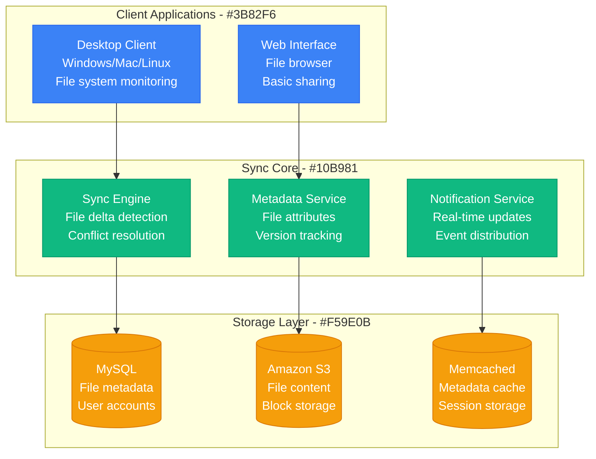
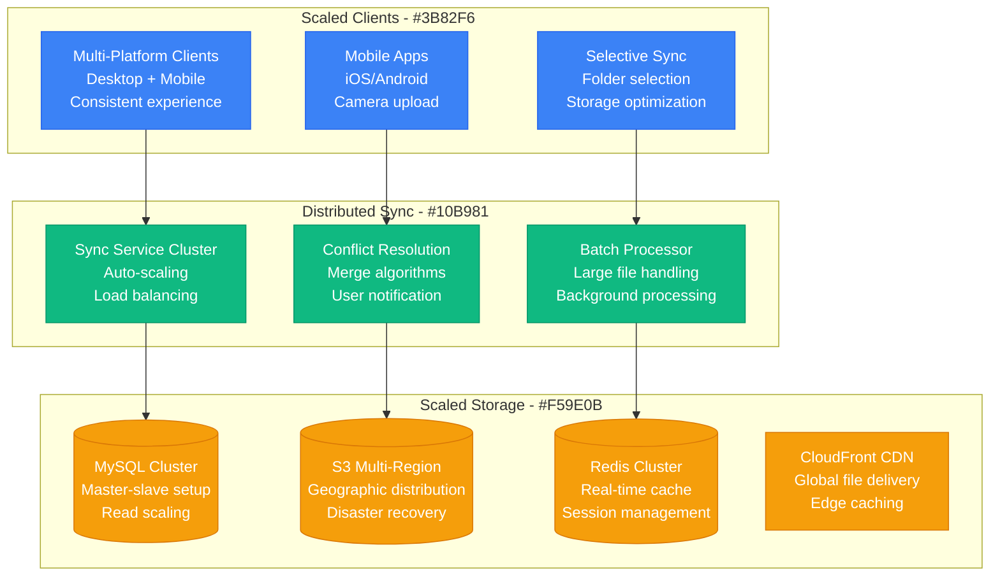
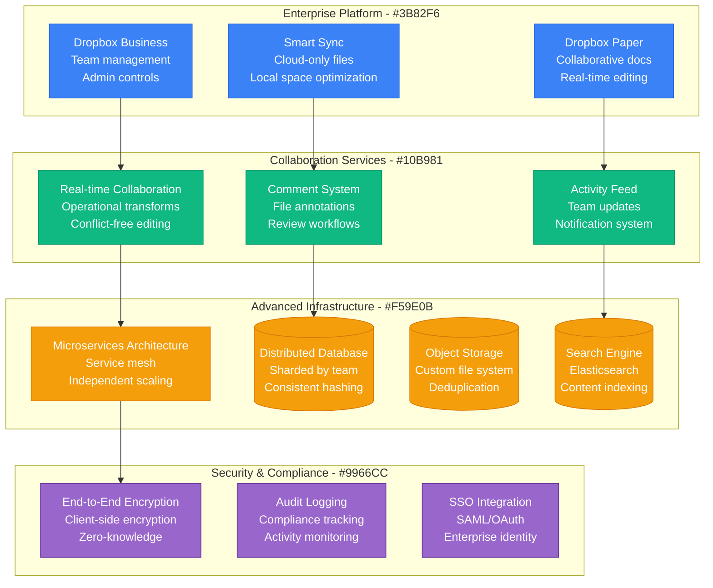

# Dropbox Scale Evolution: 100K to 700M Users

## Executive Summary

Dropbox's scaling journey from 100K beta users to 700M+ registered users represents one of the most successful file storage and synchronization scaling stories. The platform evolved from a simple folder sync tool to a comprehensive content collaboration platform handling exabytes of data globally.

**Key Scaling Metrics:**
- **Users**: 100,000 → 700,000,000+ (7,000x growth)
- **Files stored**: 1M → 600,000,000,000+ (600M x growth)
- **Data stored**: 1TB → 1+ Exabyte (1M x growth)
- **Daily file uploads**: 10K → 1,200,000,000+ (120K x growth)
- **Infrastructure cost**: $10K/month → $2B+/year

## Phase 1: MVP Launch (2008-2010)
**Scale: 100K-1M users, simple file sync**

### Key Innovation
- **Block-level synchronization** - Only upload changed portions
- **Delta sync algorithm** - Minimize bandwidth usage
- **Cross-platform compatibility** - Works everywhere
- **Offline file access** - Local file system integration

### Technology Stack
- **Backend**: Python, MySQL, Memcached
- **Storage**: Amazon S3 for content, MySQL for metadata
- **Client**: C++ for desktop, JavaScript for web
- **Sync Protocol**: Custom binary protocol over HTTPS

## Phase 2: Viral Growth (2010-2013)
**Scale: 1M-100M users, referral program success**

### Growth Features
1. **Referral program** - Free space for invites
2. **Mobile apps** with camera upload
3. **Shared folders** for collaboration
4. **Public links** for file sharing
5. **Version history** for file recovery

### Scaling Challenges
- **Database performance** with growing metadata
- **Sync conflicts** with multiple devices
- **Storage costs** with free tier usage

## Phase 3: Enterprise Platform (2013-2018)
**Scale: 100M-500M users, business transformation**

### Enterprise Features
1. **Team management** and admin controls
2. **Advanced sharing** with permissions
3. **Compliance features** (HIPAA, SOC2)
4. **Integration ecosystem** with 300+ apps
5. **Advanced security** with device management

### Technical Evolution
- **Microservices architecture** for independent scaling
- **Custom file system** for deduplication
- **Machine learning** for smart features
- **Global infrastructure** with edge locations

## Phase 4: Content Collaboration (2018-Present)
**Scale: 500M-700M+ users, comprehensive platform**

### Current Platform Features
- **Dropbox Spaces** - Team collaboration hubs
- **Dropbox Transfer** - Large file sending
- **HelloSign integration** - Digital signatures
- **Dropbox Capture** - Screen recording
- **AI-powered search** - Intelligent content discovery

## Storage Evolution

### Data Growth by Year

| Year | Total Storage | Active Users | Avg per User | Storage Cost |
|------|---------------|--------------|--------------|--------------|
| 2010 | 1TB | 1M | 1MB | $100/month |
| 2013 | 1PB | 100M | 10MB | $100K/month |
| 2016 | 100PB | 300M | 333MB | $10M/month |
| 2019 | 500PB | 500M | 1GB | $50M/month |
| 2024 | 1EB+ | 700M+ | 1.4GB | $100M+/month |

## Cost Evolution

| Phase | Period | Monthly Cost | Cost per User | Primary Drivers |
|-------|--------|--------------|---------------|----------------|
| MVP | 2008-2010 | $10K-100K | $0.10 | Basic S3 storage |
| Growth | 2010-2013 | $100K-5M | $0.05 | Referral program costs |
| Enterprise | 2013-2018 | $5M-50M | $0.15 | Compliance infrastructure |
| Platform | 2018-Present | $50M-200M+ | $0.25 | AI and collaboration |

## Technology Stack Evolution

| Component | 2008 | 2012 | 2016 | 2020 | 2024 |
|-----------|------|------|------|------|------|
| Client | Python | Multi-platform | Native apps | Smart sync | AI-enhanced |
| Backend | Python/MySQL | Scaled MySQL | Microservices | Service mesh | Cloud-native |
| Storage | S3 | S3 + CDN | Custom storage | Distributed | AI-optimized |
| Sync | Delta sync | Block sync | Smart sync | Selective | Predictive |
| Collaboration | None | Basic sharing | Real-time | Advanced | AI-assisted |

## Key Lessons Learned

### Technical Lessons
1. **Block-level sync is essential** - Bandwidth efficiency drives adoption
2. **Conflict resolution is complex** - Multi-device sync requires sophisticated algorithms
3. **Storage deduplication saves costs** - Identical files shared across users
4. **Global distribution improves performance** - Edge locations reduce latency
5. **Metadata scaling is harder than content** - File systems don't scale linearly

### Business Lessons
1. **Freemium model works for storage** - Free tier drives viral adoption
2. **Enterprise features fund consumer product** - Business customers subsidize free users
3. **Platform approach creates moats** - Ecosystem integrations increase stickiness
4. **Mobile-first transforms usage** - Camera upload changed user behavior
5. **Collaboration features differentiate** - Storage becomes commodity, collaboration adds value

### Operational Lessons
1. **Data durability is paramount** - Lost files destroy trust permanently
2. **Performance expectations vary by region** - Global infrastructure requires local optimization
3. **Privacy concerns affect adoption** - Transparency about data handling essential
4. **Compliance drives architecture** - Regulatory requirements shape technical decisions
5. **Customer support scales differently** - File storage support is unique

## Current Scale Metrics (2024)

| Metric | Value | Source |
|--------|-------|--------|
| Registered Users | 700M+ | Company reports |
| Paying Users | 18M+ | Financial reports |
| Files Stored | 600B+ | Platform metrics |
| Data Stored | 1+ Exabyte | Infrastructure metrics |
| Daily Uploads | 1.2B+ | Usage analytics |
| Countries | 180+ | Global presence |
| Revenue | $2.5B+ annually | SEC filings |
| Employees | 3,000+ | Company reports |

---

*Dropbox's evolution from simple file sync to comprehensive content collaboration platform demonstrates how focusing on user experience, building viral growth mechanisms, and gradually expanding into enterprise features can create a platform that fundamentally changes how people work with files and content.*