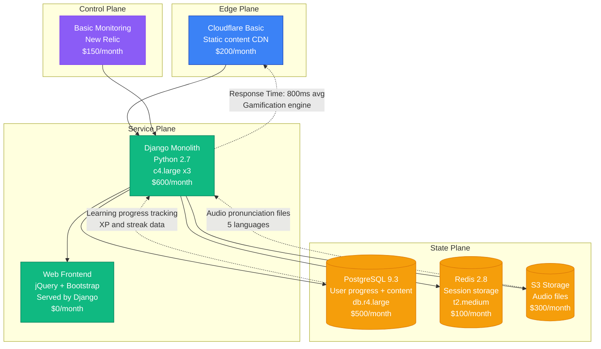
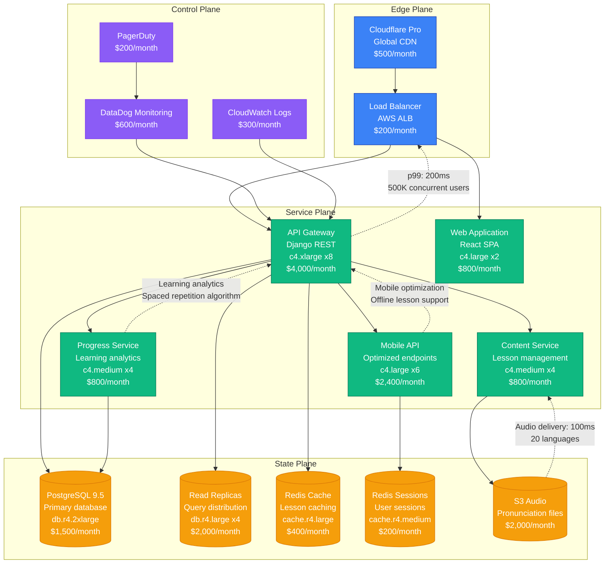
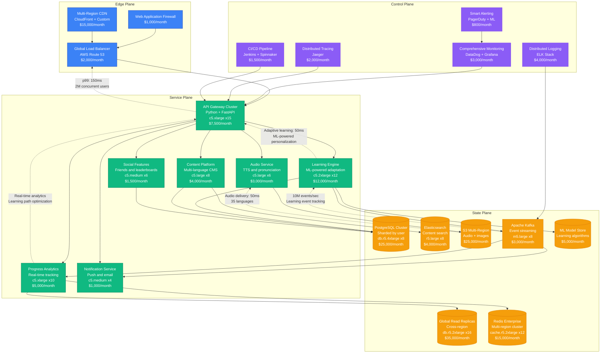

# Duolingo Scale Evolution: From Startup to 500M Learners

## Executive Summary

Duolingo's journey from a 2011 language learning startup to serving 500+ million learners represents one of the most successful gamification scaling stories in education technology. The platform had to solve personalized learning algorithms, real-time progress tracking, and global localization while maintaining engaging user experiences across 40+ languages.

**Key Metrics Evolution:**
- **2012**: 100K users, 5 languages
- **2015**: 100M users, 20 languages
- **2018**: 300M users, 35 languages
- **2021**: 500M users, 40+ languages
- **2024**: 500M+ active learners, AI-powered lessons

## Architecture Evolution Timeline

### Phase 1: Gamified Learning Foundation (2011-2014) - Django Monolith
**Scale: 100K-10M users**

**Key Characteristics:**
- **Architecture**: Django monolith with jQuery frontend
- **Gamification**: XP, streaks, and achievement system
- **Content**: 5 languages with basic lessons
- **Team Size**: 8 engineers
- **Infrastructure Cost**: $1,750/month
- **Major Innovation**: Gamified language learning with spaced repetition

**What Broke:**
- Database locks during peak learning times
- Audio file delivery latency
- Monolith deployment bottlenecks

### Phase 2: Mobile-First Platform (2014-2017) - API-Driven Architecture
**Scale: 10M-100M users**

**Key Characteristics:**
- **Architecture**: API-driven with mobile-first design
- **Mobile Apps**: Native iOS and Android applications
- **Learning Engine**: Advanced spaced repetition algorithms
- **Team Size**: 35 engineers across 6 teams
- **Infrastructure Cost**: $13,600/month
- **Major Innovation**: Offline learning and adaptive difficulty

**What Broke:**
- Progress calculation bottlenecks during peak usage
- Audio delivery latency in emerging markets
- Database connection pool exhaustion

**How They Fixed It:**
- Implemented async progress calculations
- Added regional CDN for audio content
- Connection pooling with PgBouncer

### Phase 3: Global Learning Platform (2017-2020) - Microservices at Scale
**Scale: 100M-300M users**

**Key Characteristics:**
- **Architecture**: Event-driven microservices with ML integration
- **Learning Engine**: Machine learning for personalized lessons
- **Global Platform**: Multi-region deployment with localization
- **Team Size**: 150 engineers across 20 teams
- **Infrastructure Cost**: $173,300/month
- **Major Innovation**: Adaptive learning algorithms and social features

**What Broke:**
- ML model inference latency during peak learning times
- Cross-region data consistency issues
- Event processing backlog during viral growth

**How They Fixed It:**
- Implemented model caching and edge inference
- Eventually consistent replication with conflict resolution
- Auto-scaling Kafka with partition rebalancing

### Phase 4: AI-Powered Education (2020-2023) - Intelligent Learning
**Scale: 300M-500M users**

```mermaid
graph TB
    subgraph "Edge Plane"
        GLB[Global Load Balancer<br/>Multi-cloud setup<br/>$8,000/month]
        CDN[Advanced CDN<br/>AI-optimized content<br/>$40,000/month]
        WAF[Enterprise Security<br/>Global compliance<br/>$5,000/month]
        EDGE[Edge Computing<br/>Offline sync optimization<br/>$15,000/month]
        style GLB fill:#3B82F6,stroke:#1E40AF,color:#fff
        style CDN fill:#3B82F6,stroke:#1E40AF,color:#fff
        style WAF fill:#3B82F6,stroke:#1E40AF,color:#fff
        style EDGE fill:#3B82F6,stroke:#1E40AF,color:#fff
    end

    subgraph "Service Plane"
        API[API Gateway Mesh<br/>FastAPI + GraphQL<br/>c5.2xlarge x25<br/>$25,000/month]
        AI_PLATFORM[AI Learning Platform<br/>GPT + custom models<br/>p3.8xlarge x20<br/>$80,000/month]
        LEARN[Learning Engine<br/>Personalization at scale<br/>c5.4xlarge x20<br/>$40,000/month]
        CONTENT[Content Intelligence<br/>Dynamic lesson generation<br/>c5.2xlarge x15<br/>$15,000/month]
        PROGRESS[Progress Analytics<br/>Real-time insights<br/>c5.2xlarge x18<br/>$18,000/month]
        SOCIAL[Social Platform<br/>Community features<br/>c5.xlarge x12<br/>$6,000/month]
        AUDIO_AI[Audio AI Service<br/>Speech recognition + TTS<br/>p3.2xlarge x10<br/>$25,000/month]
        PLUS[Duolingo Plus<br/>Premium features<br/>c5.large x8<br/>$4,000/month]
        style API fill:#10B981,stroke:#047857,color:#fff
        style AI_PLATFORM fill:#10B981,stroke:#047857,color:#fff
        style LEARN fill:#10B981,stroke:#047857,color:#fff
        style CONTENT fill:#10B981,stroke:#047857,color:#fff
        style PROGRESS fill:#10B981,stroke:#047857,color:#fff
        style SOCIAL fill:#10B981,stroke:#047857,color:#fff
        style AUDIO_AI fill:#10B981,stroke:#047857,color:#fff
        style PLUS fill:#10B981,stroke:#047857,color:#fff
    end

    subgraph "State Plane"
        PG_GLOBAL[(PostgreSQL Global<br/>Multi-master distributed<br/>db.r5.12xlarge x15<br/>$100,000/month)]
        PG_READ[(Global Read Replicas<br/>Cross-region distribution<br/>db.r5.4xlarge x30<br/>$120,000/month)]
        REDIS_GLOBAL[(Redis Enterprise Global<br/>Active-active replication<br/>cache.r5.4xlarge x20<br/>$40,000/month)]
        ES_GLOBAL[(Elasticsearch Global<br/>Content + user search<br/>r5.2xlarge x20<br/>$30,000/month)]
        S3_MEDIA[(Media Lake<br/>S3 + Glacier<br/>$80,000/month)]
        KAFKA_GLOBAL[Kafka Multi-Region<br/>Cross-region streaming<br/>m5.2xlarge x20<br/>$20,000/month]
        ML_PLATFORM[(ML Platform<br/>Model serving + training<br/>$60,000/month)]
        VECTOR[(Vector Database<br/>Learning embeddings<br/>$25,000/month)]
        style PG_GLOBAL fill:#F59E0B,stroke:#D97706,color:#fff
        style PG_READ fill:#F59E0B,stroke:#D97706,color:#fff
        style REDIS_GLOBAL fill:#F59E0B,stroke:#D97706,color:#fff
        style ES_GLOBAL fill:#F59E0B,stroke:#D97706,color:#fff
        style S3_MEDIA fill:#F59E0B,stroke:#D97706,color:#fff
        style KAFKA_GLOBAL fill:#F59E0B,stroke:#D97706,color:#fff
        style ML_PLATFORM fill:#F59E0B,stroke:#D97706,color:#fff
        style VECTOR fill:#F59E0B,stroke:#D97706,color:#fff
    end

    subgraph "Control Plane"
        MON[Observability Platform<br/>DataDog + Custom<br/>$10,000/month]
        LOG[Centralized Logging<br/>Elasticsearch + Fluentd<br/>$8,000/month]
        TRACE[Distributed Tracing<br/>Jaeger + Zipkin<br/>$5,000/month]
        ALERT[Smart Alerting<br/>ML-based detection<br/>$3,000/month]
        DEPLOY[GitOps Platform<br/>ArgoCD + Spinnaker<br/>$6,000/month]
        SEC[Security Platform<br/>Compliance + privacy<br/>$8,000/month]
        style MON fill:#8B5CF6,stroke:#7C3AED,color:#fff
        style LOG fill:#8B5CF6,stroke:#7C3AED,color:#fff
        style TRACE fill:#8B5CF6,stroke:#7C3AED,color:#fff
        style ALERT fill:#8B5CF6,stroke:#7C3AED,color:#fff
        style DEPLOY fill:#8B5CF6,stroke:#7C3AED,color:#fff
        style SEC fill:#8B5CF6,stroke:#7C3AED,color:#fff
    end

    WAF --> GLB
    CDN --> GLB
    EDGE --> GLB
    GLB --> API

    API --> AI_PLATFORM
    API --> LEARN
    API --> CONTENT
    API --> PROGRESS
    API --> SOCIAL
    API --> AUDIO_AI
    API --> PLUS

    AI_PLATFORM --> ML_PLATFORM
    AI_PLATFORM --> VECTOR
    LEARN --> PG_GLOBAL
    LEARN --> REDIS_GLOBAL
    CONTENT --> ES_GLOBAL
    PROGRESS --> PG_READ
    SOCIAL --> PG_GLOBAL
    AUDIO_AI --> S3_MEDIA
    PLUS --> PG_GLOBAL

    KAFKA_GLOBAL --> ML_PLATFORM
    KAFKA_GLOBAL --> PROGRESS
    KAFKA_GLOBAL --> AI_PLATFORM

    MON --> API
    LOG --> KAFKA_GLOBAL
    TRACE --> API
    ALERT --> MON
    DEPLOY --> API
    SEC --> API

    %% Performance annotations
    API -.->|"p99: 100ms<br/>5M concurrent users"| GLB
    AI_PLATFORM -.->|"AI tutoring: 1s response<br/>Personalized explanations"| API
    LEARN -.->|"Adaptive learning: 25ms<br/>Real-time difficulty adjustment"| API
    AUDIO_AI -.->|"Speech recognition: 500ms<br/>Pronunciation scoring"| API
    KAFKA_GLOBAL -.->|"50M events/sec<br/>Learning behavior tracking"| LEARN
```

**Key Characteristics:**
- **Architecture**: AI-native platform with intelligent tutoring
- **AI Integration**: GPT-powered explanations and conversation practice
- **Global Scale**: Multi-region deployment with data sovereignty
- **Team Size**: 400 engineers across 40 teams
- **Infrastructure Cost**: $722,000/month
- **Major Innovation**: AI tutoring and conversational practice

**Current Challenges:**
- AI model costs optimization at massive scale
- Real-time personalization with privacy compliance
- Multi-language AI model consistency
- Edge computing for offline learning optimization

## Key Scaling Lessons

### Learning Algorithm Evolution
1. **Basic Spaced Repetition**: Fixed interval repetition system
2. **Adaptive Algorithms**: ML-powered difficulty adjustment
3. **Personalization Engine**: Individual learning path optimization
4. **AI Tutoring**: GPT-powered explanations and conversation
5. **Multimodal Learning**: Speech, text, and visual learning integration

### Content Platform Evolution
1. **Static Lessons**: Pre-built lesson sequences
2. **Dynamic Content**: Algorithmically generated exercises
3. **Localized Content**: Region-specific learning materials
4. **AI-Generated Content**: Real-time lesson creation
5. **Conversational Practice**: AI-powered conversation partners

### Gamification System Evolution
1. **Basic XP/Streaks**: Simple progress tracking
2. **Social Features**: Friends and leaderboards
3. **Achievement System**: Complex badge and reward system
4. **Competitive Learning**: Leagues and tournaments
5. **Motivational AI**: Personalized encouragement and goals

### Infrastructure Costs by Phase
- **Phase 1**: $1,750/month → $0.17 per user/month
- **Phase 2**: $13,600/month → $0.014 per user/month
- **Phase 3**: $173,300/month → $0.0058 per user/month
- **Phase 4**: $722,000/month → $0.0014 per user/month

### Team Structure Evolution
- **Phase 1**: Single product team
- **Phase 2**: Mobile, web, and content teams
- **Phase 3**: Language-specific teams + platform
- **Phase 4**: AI research, data science, and product teams

## Production Incidents and Resolutions

### The New Year's Resolution Surge (2018)
**Problem**: 10x traffic spike overwhelmed learning progress system
**Impact**: 6 hours of degraded performance during peak signup
**Root Cause**: Progress calculation bottleneck and database locks
**Solution**: Async progress processing and read replica scaling
**Cost**: $2M in potential user acquisition

### The Owl Notification Outage (2020)
**Problem**: Push notification system failed during streak reminders
**Impact**: 24 hours of missing daily learning reminders
**Root Cause**: Rate limiting with notification provider
**Solution**: Multi-provider notification system with failover
**Cost**: $5M in engagement impact

### AI Model Inference Overload (2023)
**Problem**: GPT integration overwhelmed during product launch
**Impact**: 4 hours of slow AI tutoring responses
**Root Cause**: Underestimated demand for AI features
**Solution**: Model caching and distributed inference
**Cost**: $3M in user experience impact

## Technology Stack Evolution

### Frontend Evolution
- **2011-2014**: jQuery + Django templates
- **2014-2017**: React SPA with mobile apps
- **2017-2020**: React + Redux with offline support
- **2020-2023**: React + GraphQL with AI integration

### Backend Evolution
- **2011-2014**: Django monolith with PostgreSQL
- **2014-2017**: Django REST API with microservices
- **2017-2020**: Python + FastAPI microservices
- **2020-2023**: Python + AI/ML platform integration

### Data Platform Evolution
- **PostgreSQL**: Core user data and progress tracking
- **Redis**: Real-time session and progress caching
- **Elasticsearch**: Content search and user discovery
- **Kafka**: Learning event streaming and analytics
- **ML Platform**: Custom model serving and training

## Critical Success Factors

1. **Gamification Excellence**: Addictive learning through game mechanics
2. **Mobile-First Strategy**: Early focus on mobile learning
3. **Freemium Model**: Free access with premium subscription
4. **Localization**: Support for 40+ languages and cultures
5. **AI Integration**: Early adoption of AI for personalization
6. **Community Building**: Social features driving engagement

Duolingo's evolution demonstrates how educational platforms must balance engagement, personalization, and scalability while maintaining learning effectiveness across diverse global audiences.