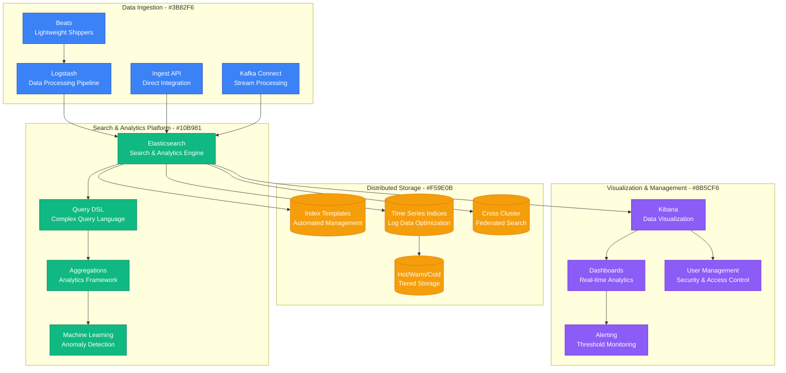
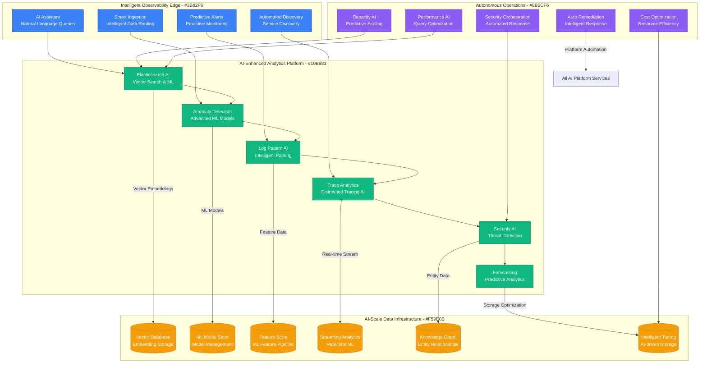
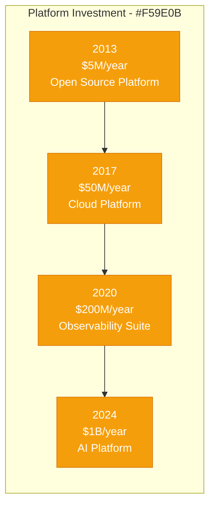

# Elastic: Search to Observability Platform

## Executive Summary

Elastic's scaling journey from an open-source search engine to a comprehensive observability platform serving 18,000+ organizations represents one of the most successful open-source to enterprise transformations in infrastructure software. This case study examines their evolution from 2010 to 2024, focusing on the unique challenges of scaling a search and analytics platform that indexes petabytes of data daily while maintaining sub-second query response times and expanding from search into logs, metrics, APM, and security analytics.

## Scale Milestones

| Milestone | Year | Nodes | Key Challenge | Solution | Data Indexed |
|-----------|------|-------|---------------|----------|--------------|
| Elasticsearch | 2010 | 1K | Distributed search | Lucene-based clustering | 1TB/day |
| ELK Stack | 2013 | 100K | Log analytics | Logstash + Kibana integration | 100TB/day |
| Elastic Cloud | 2017 | 1M+ | Managed service | SaaS platform | 10PB/day |
| Observability | 2020 | 10M+ | Full-stack monitoring | APM + Infrastructure | 100PB/day |
| AI-Enhanced | 2024 | 50M+ | Intelligent analytics | ML/AI integration | 1EB/day |

## Architecture Evolution

### Phase 1: Distributed Search Engine (2010-2013)
*Scale: 1K → 100K nodes*

```mermaid
graph TB
    subgraph "Edge Plane - #3B82F6"
        REST_API[REST API<br/>JSON over HTTP]
        JAVA_CLIENT[Java Client<br/>Native Integration]
    end

    subgraph "Service Plane - #10B981"
        CLUSTER_MGMT[Cluster Management<br/>Node Discovery]
        SEARCH_ENGINE[Search Engine<br/>Lucene-based Queries]
        INDEX_ENGINE[Index Engine<br/>Document Processing]
    end

    subgraph "State Plane - #F59E0B"
        SHARDS[(Shards<br/>Distributed Indices)]
        REPLICAS[(Replicas<br/>Data Redundancy)]
        METADATA[(Cluster Metadata<br/>State Management)]
    end

    subgraph "Control Plane - #8B5CF6"
        MONITORING[Basic Monitoring<br/>Cluster Stats API]
        SNAPSHOTS[Snapshots<br/>Backup & Restore)]
    end

    %% Connections
    REST_API --> SEARCH_ENGINE
    JAVA_CLIENT --> INDEX_ENGINE
    CLUSTER_MGMT --> SEARCH_ENGINE
    SEARCH_ENGINE --> SHARDS
    INDEX_ENGINE --> REPLICAS
    CLUSTER_MGMT --> METADATA

    %% Styling
    classDef edgeStyle fill:#3B82F6,stroke:#1E40AF,color:#fff
    classDef serviceStyle fill:#10B981,stroke:#047857,color:#fff
    classDef stateStyle fill:#F59E0B,stroke:#D97706,color:#fff
    classDef controlStyle fill:#8B5CF6,stroke:#6D28D9,color:#fff

    class REST_API,JAVA_CLIENT edgeStyle
    class CLUSTER_MGMT,SEARCH_ENGINE,INDEX_ENGINE serviceStyle
    class SHARDS,REPLICAS,METADATA stateStyle
    class MONITORING,SNAPSHOTS controlStyle
```

**Key Metrics (2013)**:
- Elasticsearch Nodes: 100K
- Daily Indexing: 100TB
- Query Response: <1 second
- GitHub Stars: 10K+

### Phase 2: ELK Stack for Log Analytics (2013-2017)
*Scale: 100K → 1M+ nodes*



**Breakthrough Moment**: ELK stack became standard for log analytics, creating massive ecosystem adoption.

**Key Metrics (2017)**:
- Elasticsearch Clusters: 1M+
- Daily Log Volume: 10PB
- Kibana Downloads: 100M+
- Enterprise Customers: 5,000+

### Phase 3: Elastic Cloud & Enterprise Platform (2017-2020)
*Scale: 1M+ → 10M+ nodes*

```mermaid
graph TB
    subgraph "Multi-Cloud Platform - #3B82F6"
        ELASTIC_CLOUD[Elastic Cloud<br/>Managed SaaS Platform]
        ECK[ECK Operator<br/>Kubernetes Integration]
        ENTERPRISE_SEARCH[Enterprise Search<br/>Workplace Search]
        SITE_SEARCH[Site Search<br/>Application Search]
    end

    subgraph "Observability Suite - #10B981"
        LOGS[Logs<br/>Centralized Log Management]
        METRICS[Metrics<br/>Infrastructure Monitoring]
        APM[APM<br/>Application Performance Monitoring]
        UPTIME[Uptime<br/>Synthetic Monitoring]
        SECURITY[Security<br/>SIEM & Threat Hunting]
    end

    subgraph "Enterprise Data Platform - #F59E0B"
        SEARCHABLE_SNAPSHOTS[(Searchable Snapshots<br/>Cost-optimized Storage)]
        DATA_TIERS[(Data Tiers<br/>Automated Lifecycle)]
        FROZEN_TIER[(Frozen Tier<br/>Long-term Retention)]
        CCPS[(Cross Cluster Search<br/>Global Federation)]
        ILM[(Index Lifecycle<br/>Automated Management)]
    end

    subgraph "Enterprise Operations - #8B5CF6"
        SECURITY_FEATURES[Security Features<br/>RBAC/SAML/OAuth]
        MONITORING[Stack Monitoring<br/>Self-monitoring)]
        CANVAS[Canvas<br/>Custom Visualizations]
        REPORTING[Reporting<br/>Scheduled Reports]
        ENTERPRISE_SUPPORT[Enterprise Support<br/>24/7 SLA]
    end

    %% Multi-cloud access
    ELASTIC_CLOUD --> LOGS
    ECK --> METRICS
    ENTERPRISE_SEARCH --> APM
    SITE_SEARCH --> UPTIME

    %% Observability platform
    LOGS --> METRICS
    METRICS --> APM
    APM --> UPTIME
    UPTIME --> SECURITY

    %% Enterprise data platform
    LOGS --> |"Log Data"| SEARCHABLE_SNAPSHOTS
    METRICS --> |"Time Series"| DATA_TIERS
    APM --> |"Trace Data"| FROZEN_TIER
    SECURITY --> |"Security Events"| CCPS

    %% Enterprise operations
    SECURITY_FEATURES --> ALL_SERVICES[All Services]
    MONITORING --> ELASTIC_CLOUD
    CANVAS --> LOGS
    REPORTING --> METRICS

    %% Styling
    classDef edgeStyle fill:#3B82F6,stroke:#1E40AF,color:#fff
    classDef serviceStyle fill:#10B981,stroke:#047857,color:#fff
    classDef stateStyle fill:#F59E0B,stroke:#D97706,color:#fff
    classDef controlStyle fill:#8B5CF6,stroke:#6D28D9,color:#fff

    class ELASTIC_CLOUD,ECK,ENTERPRISE_SEARCH,SITE_SEARCH edgeStyle
    class LOGS,METRICS,APM,UPTIME,SECURITY serviceStyle
    class SEARCHABLE_SNAPSHOTS,DATA_TIERS,FROZEN_TIER,CCPS,ILM stateStyle
    class SECURITY_FEATURES,MONITORING,CANVAS,REPORTING,ENTERPRISE_SUPPORT controlStyle
```

**Key Innovation**: Observability suite unified logs, metrics, and APM in single platform.

**Key Metrics (2020)**:
- Elastic Cloud Deployments: 100K+
- Data Indexed: 100PB/day
- Observability Customers: 10,000+
- Annual Recurring Revenue: $500M

### Phase 4: AI-Enhanced Observability Platform (2020-2024)
*Scale: 10M+ → 50M+ nodes*



**Current Metrics (2024)**:
- Elasticsearch Nodes: 50M+
- Data Indexed: 1EB/day
- AI-powered Queries: 10B+/day
- Enterprise Customers: 18,000+

## Critical Scale Events

### The ELK Stack Formation (2013)
**Challenge**: Elasticsearch was powerful but hard to use for log analysis workflows.

**Solution**: Integration with Logstash for data processing and Kibana for visualization.

**Impact**: Created complete solution stack that became industry standard.

### Docker and Container Monitoring Boom (2015)
**Challenge**: Container adoption required new monitoring approaches for ephemeral infrastructure.

**Innovation**: Beats lightweight shippers designed for containerized environments.

**Result**: Captured container monitoring market and expanded beyond traditional logs.

### Elastic Cloud Launch (2017)
**Challenge**: Self-managed Elasticsearch was complex for many organizations.

**Solution**: Fully managed cloud service across AWS, Azure, and GCP.

### Open Source License Change (2021)
**Challenge**: Cloud providers offering competitive Elasticsearch services without contributing back.

**Solution**: Changed from Apache 2.0 to Elastic License, creating Amazon OpenSearch fork.

### AI/ML Integration (2022)
**Challenge**: Organizations needed AI-powered insights from their observability data.

**Breakthrough**: Native vector search and machine learning capabilities.

## Technology Evolution

### Search Technology
- **2010-2013**: Lucene-based distributed search
- **2013-2017**: Real-time analytics and aggregations
- **2017-2020**: Multi-tenant cloud architecture
- **2020-2024**: AI-enhanced search and analytics

### Data Processing Architecture
- **Phase 1**: Simple document indexing
- **Phase 2**: Complex data pipelines with Logstash
- **Phase 3**: Real-time streaming with Beats
- **Phase 4**: AI-driven intelligent data processing

### Platform Strategy
- **Phase 1**: "Distributed search engine"
- **Phase 2**: "Complete analytics stack"
- **Phase 3**: "Observability platform"
- **Phase 4**: "AI-enhanced analytics platform"

## Financial Impact

### Infrastructure Investment by Phase


### Revenue Milestones
- **2014**: $10M ARR (early enterprise)
- **2017**: $200M ARR (cloud launch)
- **2020**: $500M ARR (observability platform)
- **2024**: $1B+ ARR (AI-enhanced platform)

### Business Model Evolution
- **2010-2014**: Open source + support
- **2014-2017**: Commercial features + cloud
- **2017-2021**: SaaS-first strategy
- **2021-2024**: Platform and consumption pricing

## Lessons Learned

### What Worked
1. **Open Source Strategy**: Built massive community and ecosystem adoption
2. **Complete Stack**: ELK stack solved entire workflow, not just search
3. **Cloud Strategy**: Managed service captured market expansion
4. **Observability Vision**: Unified platform approach created competitive moat

### What Didn't Work
1. **License Confusion**: License change created uncertainty and competition
2. **UI/UX Complexity**: Kibana complexity hindered business user adoption
3. **Performance Optimization**: Query performance issues at very large scale
4. **Competitive Response**: Slow response to cloud provider competition

### Key Technical Decisions
1. **Lucene Foundation**: Built on proven search technology
2. **JSON-first API**: Simple integration accelerated adoption
3. **Horizontal Scaling**: Designed for distributed architecture from start
4. **Time-series Optimization**: Specialized for log and metric data

## Current Architecture (2024)

**Global Infrastructure**:
- 50M+ Elasticsearch nodes under management
- 1EB+ data indexed daily
- Sub-second query response globally
- 99.9% uptime SLA for Elastic Cloud

**Key Technologies**:
- Java (Elasticsearch core)
- Node.js (Kibana frontend)
- Go (Beats agents)
- Python (ML components)
- Kubernetes (orchestration)

**Operating Metrics**:
- 18,000+ enterprise customers
- 1EB+ data processed daily
- 100M+ downloads annually
- $1B+ annual revenue run rate

## Looking Forward: Next 5 Years

### Predicted Challenges
1. **AI Compute Costs**: GPU infrastructure for AI features scaling costs
2. **Real-time Analytics**: Sub-second analytics across petabyte datasets
3. **Privacy Compliance**: Data governance across global regulations
4. **Competition**: Cloud providers and observability specialists

### Technical Roadmap
1. **Generative AI Integration**: AI-generated queries and insights
2. **Real-time Everything**: Stream processing for all analytics
3. **Autonomous Operations**: Self-managing and self-healing clusters
4. **Sustainable Computing**: Carbon-neutral data processing

**Summary**: Elastic's evolution from a distributed search engine to an AI-enhanced observability platform demonstrates the power of building on strong technical foundations while expanding into adjacent markets. Their success came from creating complete solutions (ELK stack) rather than point tools, and their observability platform strategy positioned them well for the modern infrastructure monitoring market. The addition of AI capabilities and the challenges around open source licensing show both the opportunities and complexities of evolving successful open source platforms.