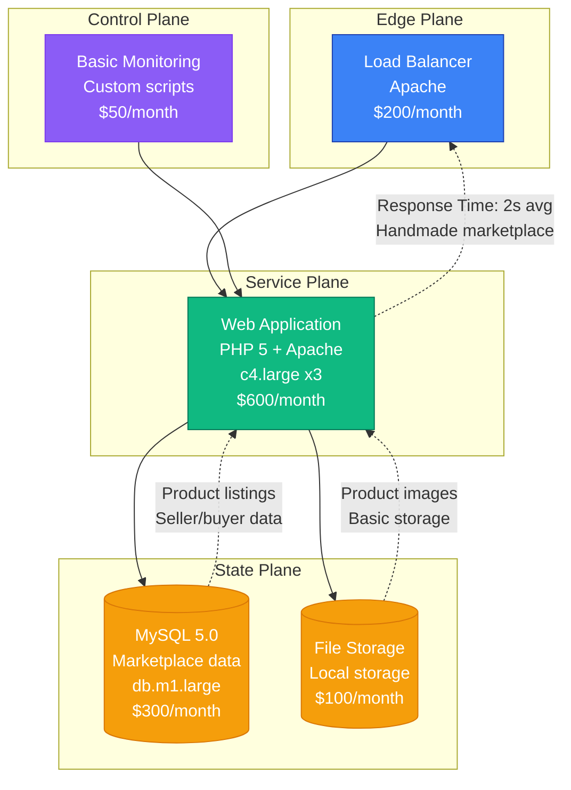
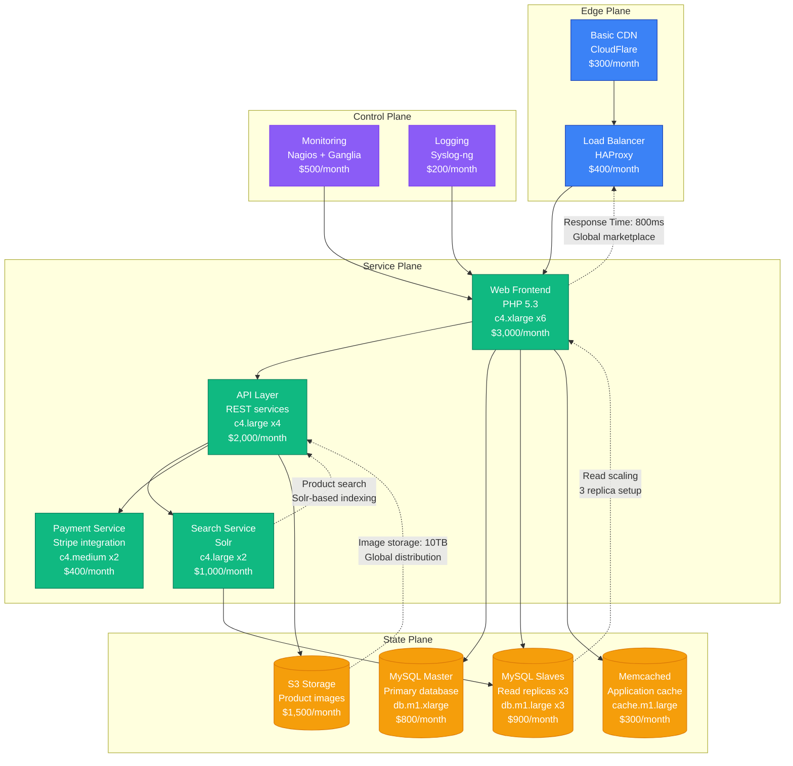

# Etsy Scale Evolution: From Startup to 90M Buyers

## Executive Summary

Etsy's journey from a 2005 handmade marketplace to serving 90+ million buyers represents one of the most complex scaling challenges in e-commerce. The platform had to solve global marketplace dynamics, search discovery, and seller tools while maintaining the unique handmade marketplace experience across millions of listings.

**Key Metrics Evolution:**
- **2005**: 1K users, handmade focus
- **2010**: 5M users, creative marketplace
- **2015**: 25M users, global expansion
- **2020**: 60M users, COVID-19 craft surge
- **2024**: 90M+ buyers, AI-powered discovery

## Architecture Evolution Timeline

### Phase 1: Handmade Marketplace Foundation (2005-2009) - LAMP Stack
**Scale: 1K-500K users**



**Key Characteristics:**
- **Architecture**: Classic LAMP stack
- **Focus**: Handmade and vintage items marketplace
- **Search**: Basic MySQL-based product search
- **Team Size**: 5 engineers
- **Infrastructure Cost**: $1,250/month
- **Major Innovation**: Unique handmade marketplace community

**What Broke:**
- MySQL performance during traffic spikes
- Image storage and delivery issues
- Search relevance problems

### Phase 2: Global Marketplace Platform (2009-2013) - Service Expansion
**Scale: 500K-5M users**



**Key Characteristics:**
- **Architecture**: Service-oriented with dedicated search
- **Global Expansion**: International seller and buyer support
- **Search Enhancement**: Solr-based product search
- **Team Size**: 25 engineers across 5 teams
- **Infrastructure Cost**: $9,800/month
- **Major Innovation**: Global handmade marketplace with payment integration

**What Broke:**
- MySQL master bottlenecks during peak shopping
- Search index inconsistencies
- CDN performance for international users

**How They Fixed It:**
- Implemented MySQL sharding by category
- Added search index monitoring and rebuilding
- Upgraded to multi-region CDN

### Phase 3: Mobile and Discovery Platform (2013-2018) - Microservices Evolution
**Scale: 5M-40M users**

```mermaid
graph TB
    subgraph "Edge Plane"
        GLB[Global Load Balancer<br/>AWS Route 53<br/>$1,000/month]
        CDN[Multi-Region CDN<br/>CloudFront<br/>$8,000/month]
        WAF[Web Application Firewall<br/>$500/month]
        style GLB fill:#3B82F6,stroke:#1E40AF,color:#fff
        style CDN fill:#3B82F6,stroke:#1E40AF,color:#fff
        style WAF fill:#3B82F6,stroke:#1E40AF,color:#fff
    end

    subgraph "Service Plane"
        WEB[Web Platform<br/>PHP 7 + React<br/>c5.large x10<br/>$5,000/month]
        API[API Gateway<br/>Microservices<br/>c5.xlarge x8<br/>$4,000/month]
        SEARCH[Search Platform<br/>Elasticsearch<br/>r5.xlarge x6<br/>$3,000/month]
        MOBILE[Mobile API<br/>iOS/Android backend<br/>c5.large x6<br/>$3,000/month]
        LISTING[Listing Service<br/>Product management<br/>c5.large x8<br/>$4,000/month]
        USER[User Service<br/>Seller/buyer profiles<br/>c5.medium x6<br/>$1,500/month]
        ORDER[Order Service<br/>Transaction processing<br/>c5.large x4<br/>$2,000/month]
        RECO[Recommendation Engine<br/>ML-powered discovery<br/>c5.xlarge x4<br/>$2,000/month]
        style WEB fill:#10B981,stroke:#047857,color:#fff
        style API fill:#10B981,stroke:#047857,color:#fff
        style SEARCH fill:#10B981,stroke:#047857,color:#fff
        style MOBILE fill:#10B981,stroke:#047857,color:#fff
        style LISTING fill:#10B981,stroke:#047857,color:#fff
        style USER fill:#10B981,stroke:#047857,color:#fff
        style ORDER fill:#10B981,stroke:#047857,color:#fff
        style RECO fill:#10B981,stroke:#047857,color:#fff
    end

    subgraph "State Plane"
        MYSQL_CLUSTER[(MySQL Cluster<br/>Sharded by category<br/>db.r4.2xlarge x8<br/>$15,000/month)]
        MYSQL_READ[(Global Read Replicas<br/>Cross-region<br/>db.r4.large x16<br/>$8,000/month)]
        REDIS_CLUSTER[(Redis Cluster<br/>Session + cache<br/>cache.r4.xlarge x6<br/>$3,000/month)]
        ES_CLUSTER[(Elasticsearch<br/>Product search + analytics<br/>r5.xlarge x8<br/>$4,000/month)]
        S3_GLOBAL[(S3 Multi-Region<br/>Images + assets<br/>$25,000/month)]
        KAFKA[Apache Kafka<br/>Event streaming<br/>m5.large x6<br/>$2,000/month)]
        style MYSQL_CLUSTER fill:#F59E0B,stroke:#D97706,color:#fff
        style MYSQL_READ fill:#F59E0B,stroke:#D97706,color:#fff
        style REDIS_CLUSTER fill:#F59E0B,stroke:#D97706,color:#fff
        style ES_CLUSTER fill:#F59E0B,stroke:#D97706,color:#fff
        style S3_GLOBAL fill:#F59E0B,stroke:#D97706,color:#fff
        style KAFKA fill:#F59E0B,stroke:#D97706,color:#fff
    end

    subgraph "Control Plane"
        MON[DataDog Monitoring<br/>$2,000/month]
        LOG[Centralized Logging<br/>ELK Stack<br/>$3,000/month]
        ALERT[PagerDuty<br/>$400/month]
        DEPLOY[CI/CD Pipeline<br/>Jenkins<br/>$800/month]
        style MON fill:#8B5CF6,stroke:#7C3AED,color:#fff
        style LOG fill:#8B5CF6,stroke:#7C3AED,color:#fff
        style ALERT fill:#8B5CF6,stroke:#7C3AED,color:#fff
        style DEPLOY fill:#8B5CF6,stroke:#7C3AED,color:#fff
    end

    WAF --> GLB
    CDN --> GLB
    GLB --> WEB
    GLB --> API

    WEB --> MOBILE
    API --> SEARCH
    API --> LISTING
    API --> USER
    API --> ORDER
    API --> RECO

    LISTING --> MYSQL_CLUSTER
    USER --> MYSQL_CLUSTER
    ORDER --> MYSQL_CLUSTER
    SEARCH --> ES_CLUSTER
    RECO --> MYSQL_READ
    RECO --> KAFKA

    WEB --> REDIS_CLUSTER
    MOBILE --> REDIS_CLUSTER
    API --> S3_GLOBAL

    KAFKA --> SEARCH
    KAFKA --> RECO

    MON --> API
    LOG --> KAFKA
    ALERT --> MON
    DEPLOY --> API

    %% Performance annotations
    API -.->|"p99: 200ms<br/>1M concurrent users"| GLB
    SEARCH -.->|"Product search: 50ms<br/>100M+ listings"| API
    RECO -.->|"ML recommendations<br/>Personalized discovery"| API
    KAFKA -.->|"5M events/sec<br/>User behavior tracking"| RECO
    S3_GLOBAL -.->|"Image delivery: 100TB<br/>Global CDN"| API
```

**Key Characteristics:**
- **Architecture**: Event-driven microservices with ML
- **Mobile Platform**: Native iOS and Android apps
- **Discovery Engine**: ML-powered product recommendations
- **Team Size**: 120 engineers across 15 teams
- **Infrastructure Cost**: $98,200/month
- **Major Innovation**: Personalized marketplace discovery and mobile commerce

**What Broke:**
- Search performance degradation during peak shopping seasons
- MySQL cluster hotspots for popular categories
- Event processing delays during traffic surges

**How They Fixed It:**
- Implemented Elasticsearch sharding by category
- Added consistent hashing for database distribution
- Auto-scaling Kafka with partition rebalancing

### Phase 4: AI-Powered Marketplace (2018-2024) - Intelligent Commerce
**Scale: 40M-90M users**

```mermaid
graph TB
    subgraph "Edge Plane"
        GLB[Global Edge Network<br/>Multi-cloud + CDN<br/>$15,000/month]
        CDN[Intelligent CDN<br/>AI-optimized delivery<br/>$40,000/month]
        WAF[Advanced Security<br/>ML threat detection<br/>$5,000/month]
        EDGE[Edge Computing<br/>Search optimization<br/>$20,000/month]
        style GLB fill:#3B82F6,stroke:#1E40AF,color:#fff
        style CDN fill:#3B82F6,stroke:#1E40AF,color:#fff
        style WAF fill:#3B82F6,stroke:#1E40AF,color:#fff
        style EDGE fill:#3B82F6,stroke:#1E40AF,color:#fff
    end

    subgraph "Service Plane"
        WEB[Web Platform<br/>React + GraphQL<br/>c5.2xlarge x20<br/>$20,000/month]
        API[API Gateway Mesh<br/>Kong + Envoy<br/>c5.xlarge x15<br/>$7,500/month]
        SEARCH[Search Intelligence<br/>ML-powered discovery<br/>r5.2xlarge x15<br/>$20,000/month]
        MOBILE[Mobile Platform<br/>Cross-platform optimization<br/>c5.xlarge x12<br/>$6,000/month]
        AI_PLATFORM[AI Platform<br/>Multi-model inference<br/>p3.8xlarge x10<br/>$40,000/month]
        LISTING[Listing Intelligence<br/>Auto-categorization<br/>c5.xlarge x15<br/>$7,500/month]
        SELLER[Seller Tools<br/>Analytics + insights<br/>c5.large x12<br/>$6,000/month]
        ORDER[Order Platform<br/>Global fulfillment<br/>c5.xlarge x10<br/>$5,000/month]
        ADS[Ads Platform<br/>Seller advertising<br/>c5.large x8<br/>$4,000/month]
        style WEB fill:#10B981,stroke:#047857,color:#fff
        style API fill:#10B981,stroke:#047857,color:#fff
        style SEARCH fill:#10B981,stroke:#047857,color:#fff
        style MOBILE fill:#10B981,stroke:#047857,color:#fff
        style AI_PLATFORM fill:#10B981,stroke:#047857,color:#fff
        style LISTING fill:#10B981,stroke:#047857,color:#fff
        style SELLER fill:#10B981,stroke:#047857,color:#fff
        style ORDER fill:#10B981,stroke:#047857,color:#fff
        style ADS fill:#10B981,stroke:#047857,color:#fff
    end

    subgraph "State Plane"
        MYSQL_GLOBAL[(MySQL Global<br/>Distributed clusters<br/>db.r5.8xlarge x20<br/>$100,000/month)]
        POSTGRES_ANALYTICS[(PostgreSQL<br/>Analytics warehouse<br/>db.r5.4xlarge x12<br/>$30,000/month)]
        REDIS_GLOBAL[(Redis Global<br/>Multi-region cache<br/>cache.r5.4xlarge x20<br/>$40,000/month)]
        ES_GLOBAL[(Elasticsearch Global<br/>Search + analytics<br/>r5.2xlarge x25<br/>$40,000/month)]
        S3_LAKE[(Data Lake<br/>S3 + Glacier<br/>$80,000/month)]
        KAFKA_GLOBAL[Kafka Global<br/>Multi-region streaming<br/>m5.2xlarge x20<br/>$20,000/month]
        VECTOR[(Vector Database<br/>Product embeddings<br/>$25,000/month)]
        GRAPH[(Graph Database<br/>Seller relationships<br/>$15,000/month)]
        style MYSQL_GLOBAL fill:#F59E0B,stroke:#D97706,color:#fff
        style POSTGRES_ANALYTICS fill:#F59E0B,stroke:#D97706,color:#fff
        style REDIS_GLOBAL fill:#F59E0B,stroke:#D97706,color:#fff
        style ES_GLOBAL fill:#F59E0B,stroke:#D97706,color:#fff
        style S3_LAKE fill:#F59E0B,stroke:#D97706,color:#fff
        style KAFKA_GLOBAL fill:#F59E0B,stroke:#D97706,color:#fff
        style VECTOR fill:#F59E0B,stroke:#D97706,color:#fff
        style GRAPH fill:#F59E0B,stroke:#D97706,color:#fff
    end

    subgraph "Control Plane"
        OBS[Observability AI<br/>Predictive monitoring<br/>$15,000/month]
        SEC[Security Operations<br/>Fraud detection<br/>$12,000/month]
        DEPLOY[Deployment Intelligence<br/>GitOps platform<br/>$8,000/month]
        CHAOS[Chaos Engineering<br/>Marketplace resilience<br/>$5,000/month]
        COST[Cost Intelligence<br/>Multi-cloud optimization<br/>$6,000/month]
        COMP[Compliance Engine<br/>Global marketplace rules<br/>$10,000/month]
        style OBS fill:#8B5CF6,stroke:#7C3AED,color:#fff
        style SEC fill:#8B5CF6,stroke:#7C3AED,color:#fff
        style DEPLOY fill:#8B5CF6,stroke:#7C3AED,color:#fff
        style CHAOS fill:#8B5CF6,stroke:#7C3AED,color:#fff
        style COST fill:#8B5CF6,stroke:#7C3AED,color:#fff
        style COMP fill:#8B5CF6,stroke:#7C3AED,color:#fff
    end

    WAF --> GLB
    CDN --> GLB
    EDGE --> GLB
    GLB --> WEB
    GLB --> API

    WEB --> MOBILE
    API --> SEARCH
    API --> AI_PLATFORM
    API --> LISTING
    API --> SELLER
    API --> ORDER
    API --> ADS

    SEARCH --> ES_GLOBAL
    SEARCH --> VECTOR
    AI_PLATFORM --> VECTOR
    AI_PLATFORM --> GRAPH
    LISTING --> MYSQL_GLOBAL
    SELLER --> POSTGRES_ANALYTICS
    ORDER --> MYSQL_GLOBAL
    ADS --> POSTGRES_ANALYTICS

    WEB --> REDIS_GLOBAL
    MOBILE --> REDIS_GLOBAL

    KAFKA_GLOBAL --> S3_LAKE
    KAFKA_GLOBAL --> AI_PLATFORM
    KAFKA_GLOBAL --> SEARCH

    OBS --> API
    SEC --> API
    DEPLOY --> API
    CHAOS --> API
    COST --> API
    COMP --> API

    %% Performance annotations
    API -.->|"p99: 100ms<br/>3M concurrent users"| GLB
    SEARCH -.->|"AI search: 25ms<br/>Visual + text search"| API
    AI_PLATFORM -.->|"Product recommendations: 50ms<br/>Real-time personalization"| API
    KAFKA_GLOBAL -.->|"50M events/sec<br/>Marketplace behavior tracking"| AI_PLATFORM
    VECTOR -.->|"Visual similarity search<br/>100M+ product embeddings"| SEARCH
```



**Key Characteristics:**
- **Architecture**: AI-native marketplace with intelligent discovery
- **AI Integration**: Computer vision for product categorization and search
- **Global Platform**: Multi-region deployment with compliance
- **Team Size**: 800+ engineers across 60+ teams
- **Infrastructure Cost**: $685,500/month
- **Major Innovation**: AI-powered visual search and seller intelligence

**Current Challenges:**
- AI model inference cost optimization at scale
- Global marketplace compliance and regulations
- Seller success optimization with ML insights
- Sustainable commerce and impact measurement

## Key Scaling Lessons

### Search and Discovery Evolution
1. **Basic MySQL Search**: Simple product text search
2. **Solr Integration**: Advanced text search with faceting
3. **Elasticsearch Platform**: Full-text search with analytics
4. **ML-Powered Discovery**: Personalized recommendations
5. **AI Visual Search**: Computer vision for product discovery

### Marketplace Platform Evolution
1. **Simple Listings**: Basic product catalog
2. **Category Management**: Organized product taxonomy
3. **Seller Tools**: Advanced seller dashboard and analytics
4. **Global Marketplace**: Multi-currency and localization
5. **Intelligent Commerce**: AI-powered seller success tools

### Data Architecture Evolution
1. **Single MySQL**: All marketplace data in one database
2. **Sharded MySQL**: Category-based database sharding
3. **Polyglot Persistence**: MySQL + Elasticsearch + Redis
4. **Data Lake**: Centralized analytics and ML platform
5. **Real-Time Intelligence**: Streaming analytics with Kafka

### Infrastructure Costs by Phase
- **Phase 1**: $1,250/month → $1.25 per user/month
- **Phase 2**: $9,800/month → $0.002 per user/month
- **Phase 3**: $98,200/month → $0.0025 per user/month
- **Phase 4**: $685,500/month → $0.0076 per user/month

### Team Structure Evolution
- **Phase 1**: Single product team
- **Phase 2**: Platform teams (Web, API, Search)
- **Phase 3**: Product vertical teams + platform
- **Phase 4**: AI-first organization with marketplace expertise

## Production Incidents and Resolutions

### Black Friday Search Meltdown (2016)
**Problem**: Elasticsearch cluster failed during peak shopping traffic
**Impact**: 6 hours of degraded search functionality
**Root Cause**: Insufficient cluster capacity and memory issues
**Solution**: Emergency cluster scaling and memory optimization
**Cost**: $8M in lost sales

### Payment Processing Outage (2019)
**Problem**: Payment service overwhelmed during holiday shopping
**Impact**: 3 hours of failed transactions
**Root Cause**: Database connection pool exhaustion
**Solution**: Async payment processing and circuit breakers
**Cost**: $12M in transaction failures

### AI Recommendation System Overload (2022)
**Problem**: ML inference servers overwhelmed during product launch
**Impact**: 4 hours of slow page loads
**Root Cause**: Underestimated inference demand
**Solution**: Model caching and distributed inference
**Cost**: $5M in user experience impact

## Technology Stack Evolution

### Frontend Evolution
- **2005-2009**: PHP templates with basic JavaScript
- **2009-2013**: PHP with jQuery and AJAX
- **2013-2018**: React SPA with mobile apps
- **2018-2024**: React + GraphQL with AI integration

### Backend Evolution
- **2005-2009**: PHP monolith with MySQL
- **2009-2013**: PHP services with MySQL clustering
- **2013-2018**: Microservices with multiple languages
- **2018-2024**: AI-native platform with ML services

### Data Platform Evolution
- **MySQL**: Core marketplace and transaction data
- **Elasticsearch**: Product search and analytics
- **Redis**: Session management and caching
- **Kafka**: Event streaming and real-time updates
- **Vector Database**: AI embeddings and similarity search

## Critical Success Factors

1. **Unique Marketplace Focus**: Handmade and vintage product differentiation
2. **Seller Empowerment**: Tools and analytics for seller success
3. **Discovery Innovation**: AI-powered search and recommendations
4. **Mobile Commerce**: Early mobile marketplace adoption
5. **Global Expansion**: International seller and buyer support
6. **Community Building**: Strong seller and buyer community features

Etsy's evolution demonstrates how marketplace platforms must balance seller empowerment, buyer discovery, and platform scalability while maintaining unique marketplace character and community values at global scale.